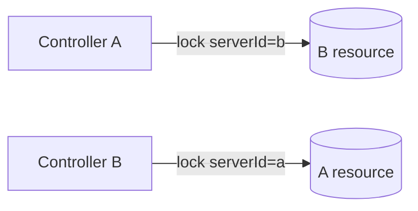
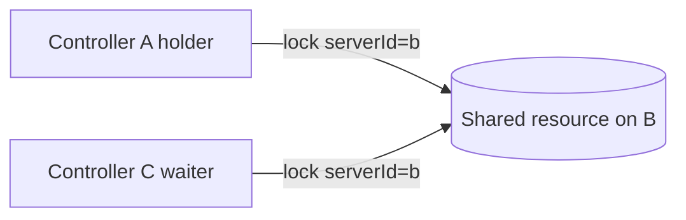
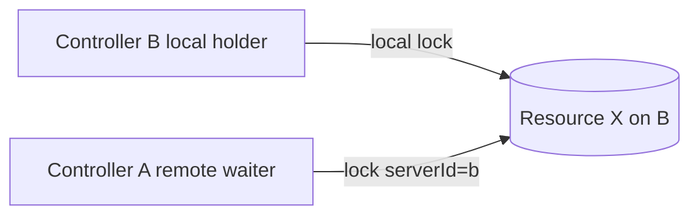
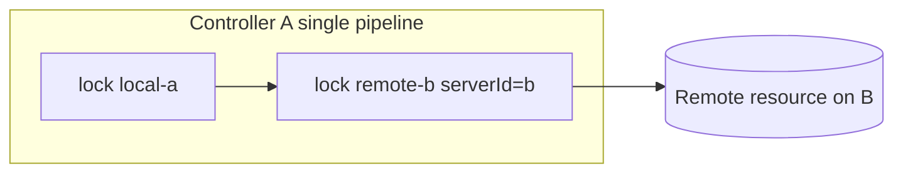
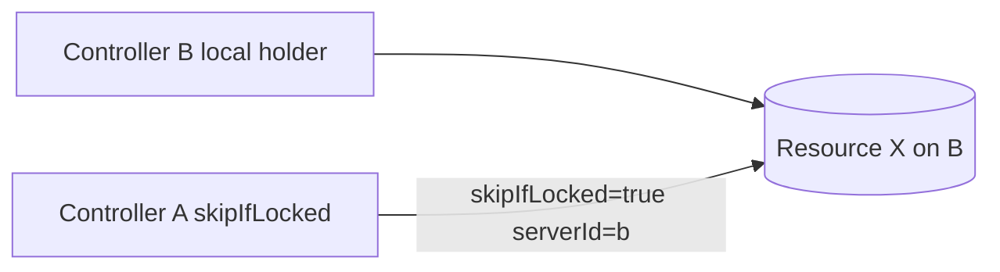
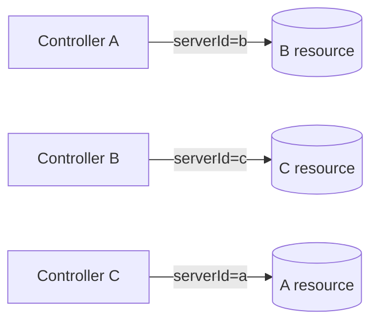
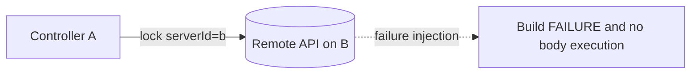
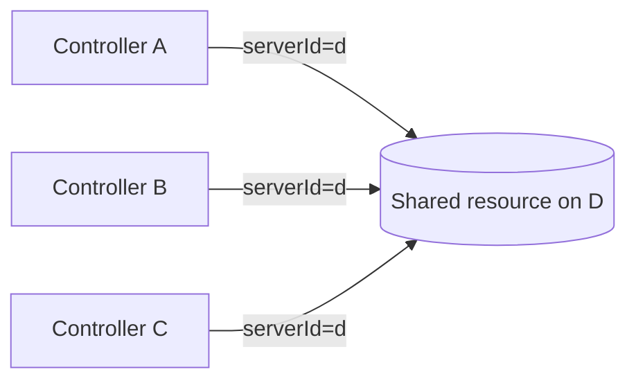
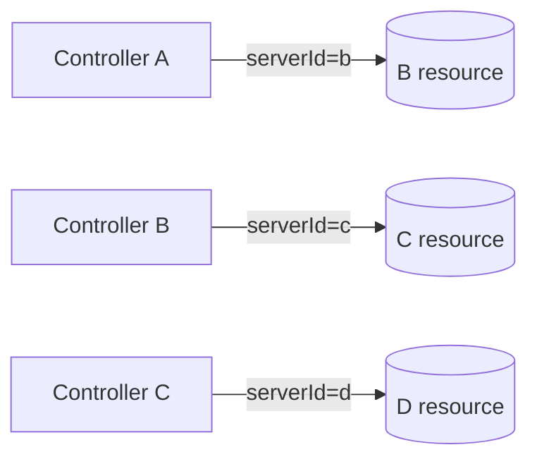
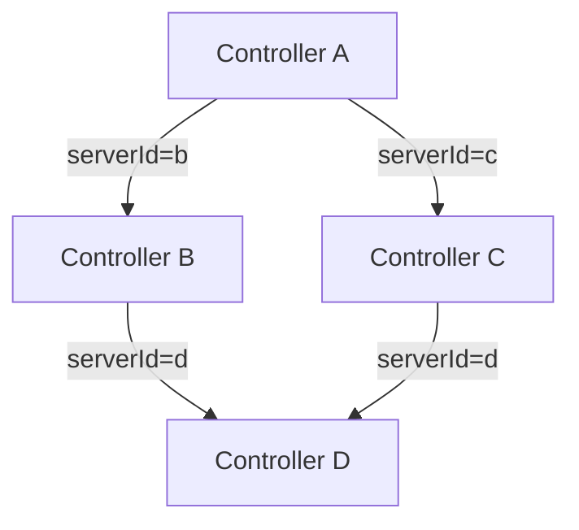

# E2E Test Specification

This document defines the E2E design and execution contract for `dev/jenkins-env/run-e2e.sh`.

---

## Purpose

The E2E suite validates the remote lock feature of lockable-resources-plugin across both 3-controller and 4-controller topologies.

It verifies:

1. The basic remote lock lifecycle: acquire, wait, release.
2. The one-way relay composition model described in issue #1025.
3. Mutual exclusion between local locks and remote locks on the same resource.
4. Fail-closed behavior for remote API failures and configuration errors.
5. Extended topologies with a 4th controller (`jenkins-d`).
6. Reproducible result capture with reports and console logs.

---

## Scenario Matrix

| ID | Script | Topology | Main validation |
|---|---|---|---|
| S01 | `mutual-peer` | A→B and B→A | Independent bidirectional sharing via one-way relays |
| S02 | `fan-in-contention` | A→B, C→B | Queueing and sequential acquisition on a shared remote resource |
| S03 | `server-self-use` | B local hold, A remote wait | Local-vs-remote exclusion on the same resource |
| S04 | `mixed-local-remote` | A local + A→B remote | Nested local and remote lock acquisition in one pipeline |
| S05 | `skip-if-locked` | B local hold, A skipIfLocked remote | Remote `skipIfLocked` behavior |
| S06 | `three-way-mesh` | A→B, B→C, C→A | 3 independent relays running in parallel |
| S07 | `fail-closed` | A→B with fault injection | No body execution on communication/auth/config failures |
| D01 | `fan-in-4` | A/B/C→D | 4-controller queue stability |
| D02 | `chain-4` | A→B, B→C, C→D | Independent relay chain at larger scale |
| D03 | `diamond` | A→(B+C), B→D, C→D | No deadlock in a diamond topology |

---

## Visual Topology Guide

### S01 mutual-peer



### S02 fan-in-contention



### S03 server-self-use



### S04 mixed-local-remote



### S05 skip-if-locked



### S06 three-way-mesh



### S07 fail-closed



### D01 fan-in-4



### D02 chain-4



### D03 diamond



---

## Environment

### Controllers

| Controller | Host URL | Internal URL | Jenkins home |
|---|---|---|---|
| A | `http://127.0.0.1:8081/jenkins` | `http://jenkins-a:8080/jenkins` | `jha/` |
| B | `http://127.0.0.1:8082/jenkins` | `http://jenkins-b:8080/jenkins` | `jhb/` |
| C | `http://127.0.0.1:8083/jenkins` | `http://jenkins-c:8080/jenkins` | `jhc/` |
| D | `http://127.0.0.1:8084/jenkins` | `http://jenkins-d:8080/jenkins` | `jhd/` |

### Required commands

- `curl`
- `docker`
- `python3`
- `base64`

### `run-e2e.sh` options

```text
--skip-start
--clean-start
--only mutual-peer | fan-in-contention | server-self-use |
       mixed-local-remote | skip-if-locked | three-way-mesh |
       fail-closed | fan-in-4 | chain-4 | diamond |
       s-series | d-series | all
```

---

## Naming Rules

### Resource naming

Resources use a scenario prefix plus a timestamp.

```text
<prefix>-<timestamp>
```

Examples:

- `s01-a-resource-<ts>`
- `s02-shared-<ts>`
- `d01-shared-d-<ts>`

### Credential naming

Representative examples:

| Scenario | Credential ID |
|---|---|
| S01 A→B | `s01-a-for-b` |
| S01 B→A | `s01-b-for-a` |
| S02 A/C→B | `s02-for-b` |
| S03 A→B | `s03-a-for-b` |
| S04 A→B | `s04-a-for-b` |
| S05 A→B | `s05-a-for-b` |
| S06 A→B | `s06-a-for-b` |
| S06 B→C | `s06-b-for-c` |
| S06 C→A | `s06-c-for-a` |
| S07 valid | `s07-valid-creds` |
| D01 A/B/C→D | `d01-for-d` |
| D02 A→B | `d02-a-for-b` |
| D02 B→C | `d02-b-for-c` |
| D02 C→D | `d02-c-for-d` |
| D03 A→B | `d03-a-for-b` |
| D03 A→C | `d03-a-for-c` |
| D03 B→D | `d03-b-for-d` |
| D03 C→D | `d03-c-for-d` |

---

## Reporting Contract

Each run generates:

- `dev/reports/<runId>-e2e-test.md`
- `dev/reports/<runId>-e2e-test/`

The report records:

- `runId`
- executed timestamp
- command line
- selected mode
- pass / fail / skip counts
- scenario status table with `Sxx` / `Dxx` IDs
- links to artifact directories and `scenario-details.md`

The final verified full-run report is:

- `dev/reports/20260523133947-e2e-test.md` (`pass=10 fail=0 skip=0`)

---

## Current Verified Status

As of 2026-05-23:

- S-series verified: `pass=7 fail=0 skip=0`
- D-series verified: `pass=3 fail=0 skip=0`
- Full run verified: `pass=10 fail=0 skip=0`
- Latest full E2E report: `dev/reports/20260523133947-e2e-test.md`
- Latest full plugin `mvn test` log: `dev/reports/20260523135413-mvn-test.log`
