# E2E Test Specification (Unified)

This document defines the design and specification of the E2E tests executed by
`dev/jenkins-env/run-e2e.sh`.

> **About this unification:** This document consolidates the former
> `E2E_TEST_SPECIFICATION_P1_M1.md` / `_P1_M1A.md` / `_P1_M1B.md` (2026-06-12).
> Every test item is annotated with the milestone that introduced it
> (**P1M1** / **P1M1A** / **P1M1B** / **P1M1C** / **P1M1D**).

---

## Purpose

The suite automatically verifies the following about the remote lock feature of
lockable-resources-plugin:

| # | Verification | Since |
|---|---|---|
| 1 | The basic remote lock lifecycle: acquire, wait, release | P1M1 |
| 2 | Each connection pattern of the "composition of independent one-way relays" model from issue #1025 holds in a production-like environment | P1M1 |
| 3 | Local locks and remote locks are mutually exclusive on the same resource | P1M1 |
| 4 | Remote API failures fail closed without auto-releasing locks | P1M1 |
| 5 | Extended topologies with a 4th controller (`jenkins-d`) | P1M1 |
| 6 | Reproducible result capture with reports and console logs | P1M1 |
| 7 | Transparent lockRequest payload (server-side interpretation of `label` / `quantity` / `variable` / `skipIfLocked`) | P1M1A |
| 8 | lockEnvVars expansion equivalent to local `lock()` (`$V`, `${V}0`, `${V}1`) | P1M1A |
| 9 | forcedServerId delegated mode (transparent delegation of serverId-less DSL) | P1M1A |
| 10 | Atomic extra acquisition (main + extra under a single lease) | P1M1B |
| 11 | Heartbeat resilience (job continues through failures; normal release afterwards) | P1M1B |
| 12 | Unified queue priority (remote waiters' priority applies across local waiters) | P1M1B |
| 13 | STALE admin release (STALE transition → fail-close hold → Force Release → waiter wakes) | P1M1B |
| 14 | Atomic acquisition of label-based extra (main + label-extra under a single lease) | P1M1C |
| 15 | Label with unspecified quantity locks ALL matching (equivalent to local "0 = all") | P1M1C |
| 16 | Resource-property env var propagation over the bridge (`VAR0_<PROP>` reaches the body) | P1M1D |

---

## Test Structure

### Scenario matrix

| ID | Script | Connection model / feature | Main validation | Controllers | Milestone |
|---|---|---|---|---|---|
| S01 | `mutual-peer` | A→B and B→A (mutual sharing) | Independent one-way relays run in parallel without interference | a, b | P1M1 |
| S02 | `fan-in-contention` | A→B, C→B (same-resource contention) | Queueing and QUEUED state transition | a, b, c | P1M1 |
| S03 | `server-self-use` | B holds locally while A acquires remotely | Local-vs-remote exclusion on the same resource | a, b | P1M1 |
| S04 | `mixed-local-remote` | A holds local + B remote in one pipeline | Nested simultaneous local+remote holds | a, b | P1M1 |
| S05 | `skip-if-locked` | A tries skipIfLocked remotely while B holds locally | Remote skipIfLocked path | a, b | P1M1 |
| S06 | `three-way-mesh` | A→B, B→C, C→A (full 3-way relays) | 3 parallel relays, no phantom locks | a, b, c | P1M1 |
| S07 | `fail-closed` | A→B (fault injection) | No body execution on communication/auth failures | a, b | P1M1 |
| S08 | `label-env-vars` | Label-based acquisition + variable expansion | label acquisition + equivalent lockEnvVars expansion | a, b | P1M1A |
| S09 | `delegated-mode` | Delegation via forcedServerId | Transparent delegation of serverId-less DSL and fallback | a, b | P1M1A |
| S10 | `extra-resources` | Atomic extra acquisition | Multiple resources under one lockId, comma-joined variable | a, b | P1M1B |
| S11 | `heartbeat-resilience` | Heartbeat fault injection | Job continuation through heartbeat failures | a, b | P1M1B |
| S12 | `priority-ordering` | local/remote priority contention | Unified queue priority dispatch | a, b | P1M1B |
| S13 | `stale-admin-release` | Ghost lease → STALE → admin release | STALE transition, fail-close hold, Force Release | b | P1M1B |
| S14 | `extra-label-resources` | resource + label-based extra atomic acquire | label-extra acquired under one lease (C-1 regression) | a, b | P1M1C |
| S15 | `label-quantity-all` | label acquire with no quantity | all matching locked under one lease ("0 = all" equivalence) | a, b | P1M1C |
| S16 | `remote-resource-properties` | resource-property env var propagation | `VAR0_<PROP>` reaches the remote body (M1D shared env-var generation) | a, b | P1M1D |
| S17 | `remote-unknown-rejected` | acquire for an unknown/unexposed resource | uniform 404 fast rejection + no ephemeral created on the server (H-1 regression) | a, b | P1M1E |
| D01 | `fan-in-4` | A, B, C contend for D's resource | 4-client → 1-server queue stability | a, b, c, d | P1M1 |
| D02 | `chain-4` | A→B, B→C, C→D (independent chain) | n parallel one-way relays | a, b, c, d | P1M1 |
| D03 | `diamond` | A→(B+C), B→D, C→D (diamond dependency) | No deadlock under indirect shared dependency | a, b, c, d | P1M1 |

**History**: the early `peer-basic` scenario was absorbed into S01/S02 and retired; the old `fail-closed` carried over as S07.

### Topology diagrams (Mermaid)

#### S01 mutual-peer [P1M1]

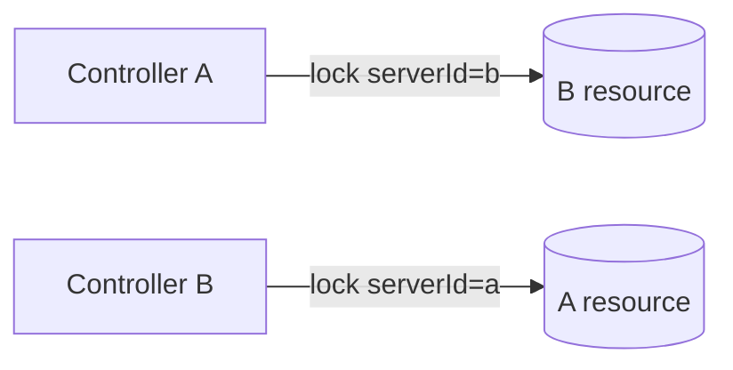

#### S02 fan-in-contention [P1M1]

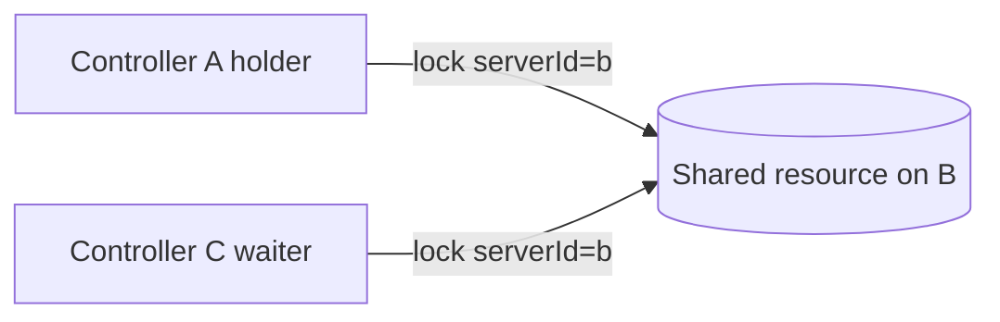

#### S03 server-self-use [P1M1]

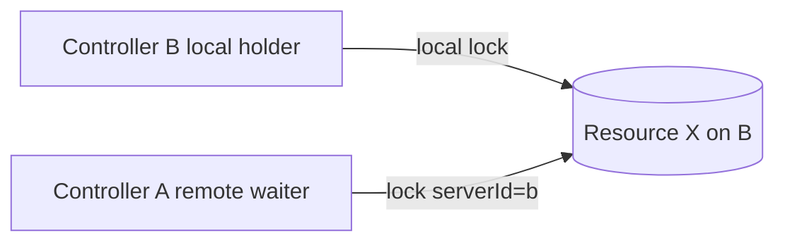

#### S04 mixed-local-remote [P1M1]

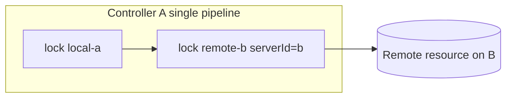

#### S05 skip-if-locked [P1M1]

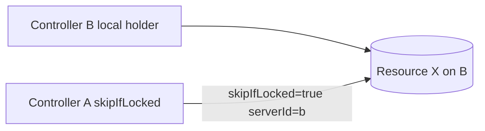

#### S06 three-way-mesh [P1M1]

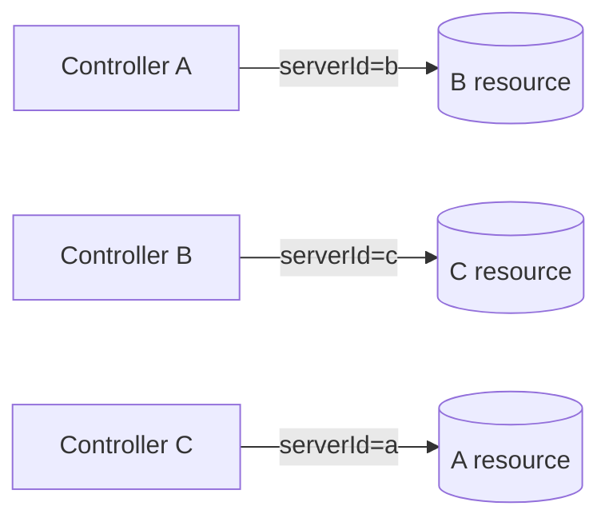

#### S07 fail-closed [P1M1]

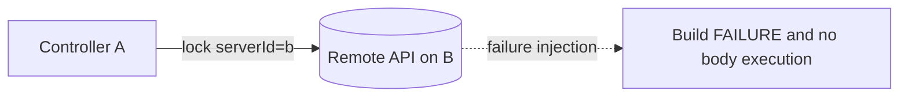

#### S08 label-env-vars [P1M1A]

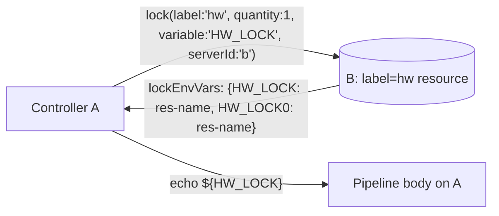

#### S09 delegated-mode [P1M1A]

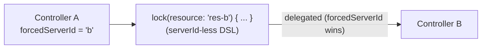

#### S10 extra-resources [P1M1B]

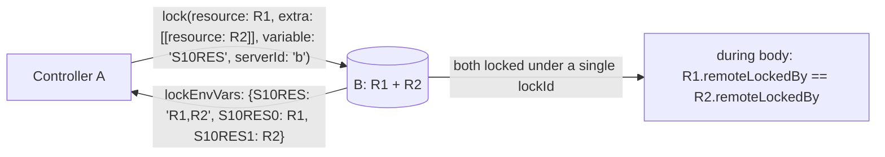

#### S11 heartbeat-resilience [P1M1B]

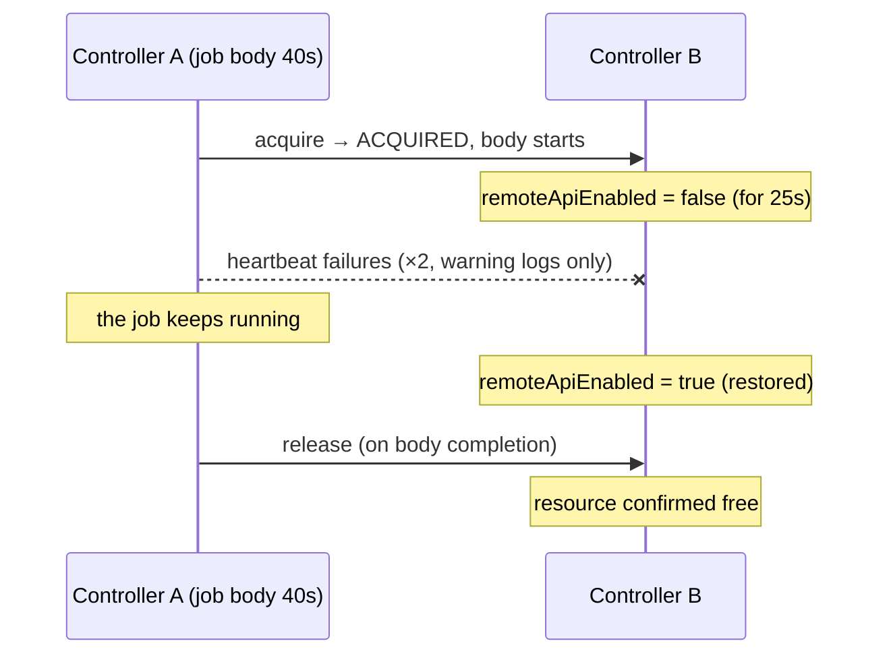

#### S12 priority-ordering [P1M1B]

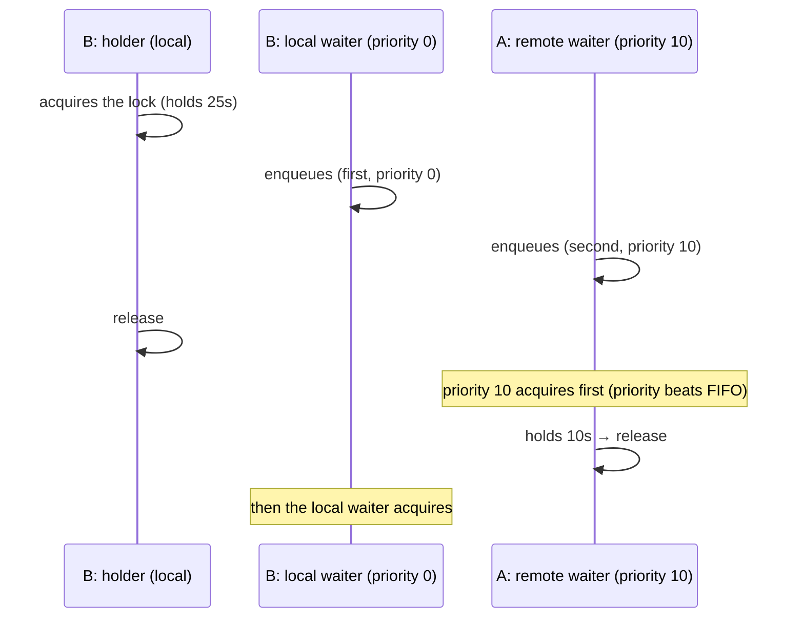

#### S13 stale-admin-release [P1M1B]

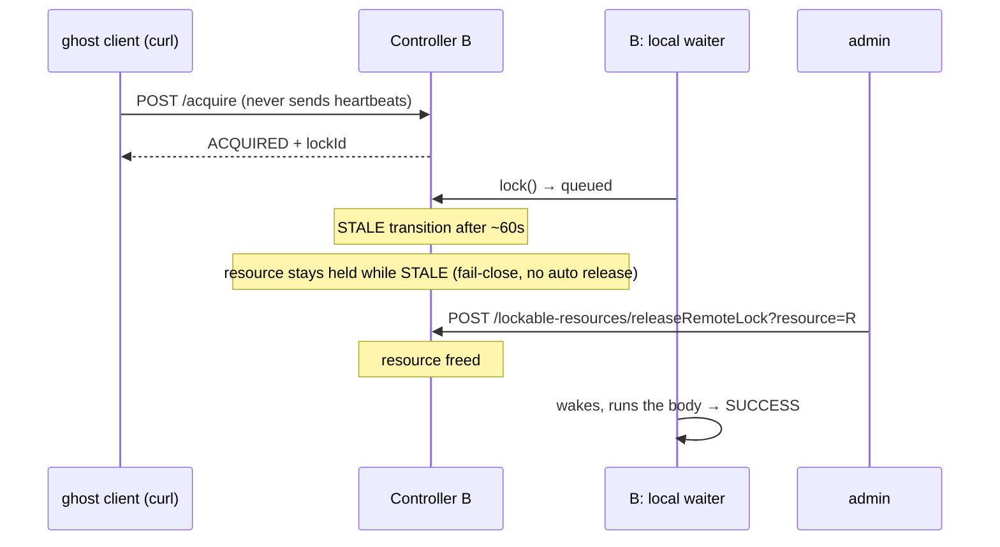

#### S14 extra-label-resources [P1M1C]

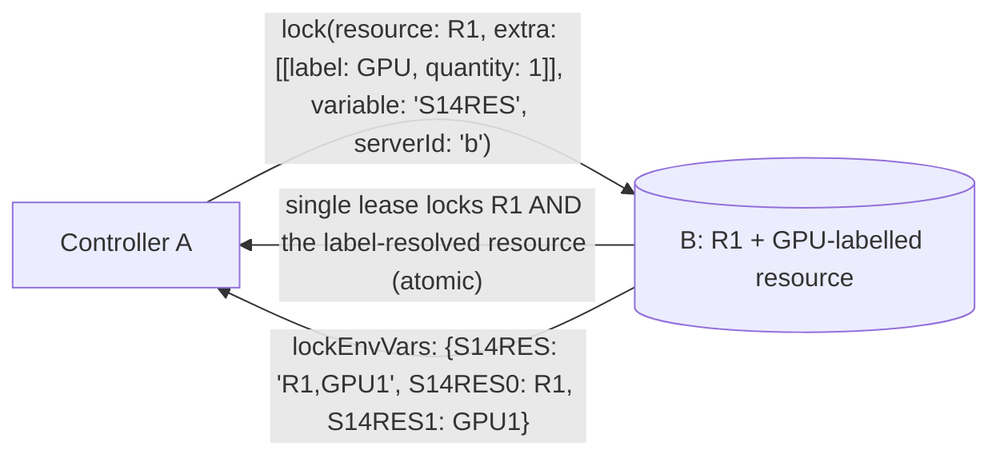

#### S15 label-quantity-all [P1M1C]

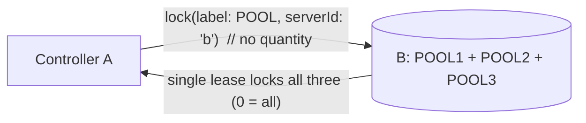

#### S16 remote-resource-properties [P1M1D]

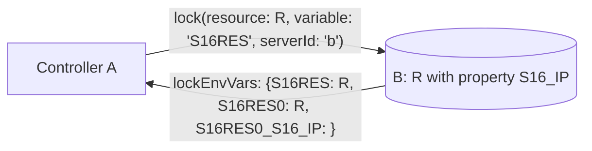

#### D01 fan-in-4 [P1M1]

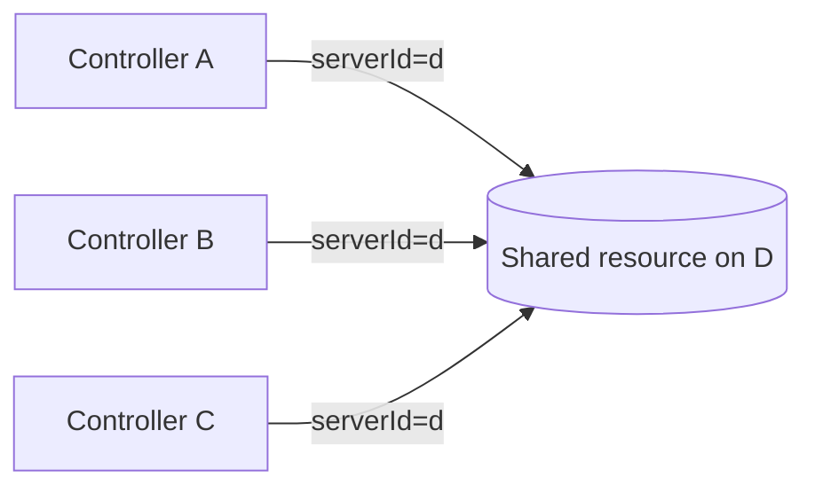

#### D02 chain-4 [P1M1]

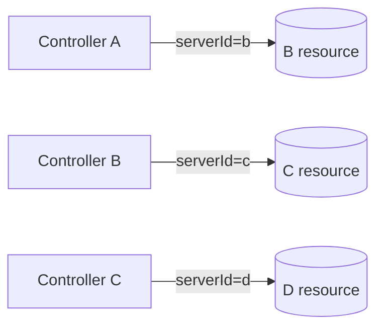

#### D03 diamond [P1M1]

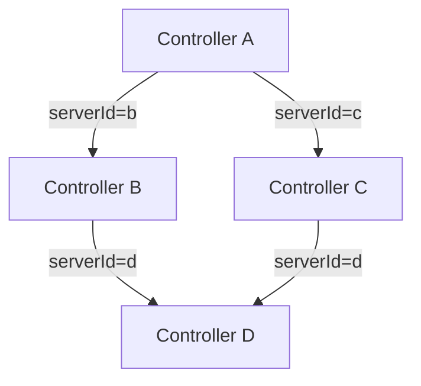

---

## Environment

### 4-controller layout

| Service | Container | Host port | Internal URL | Jenkins home |
|---|---|---|---|---|
| `jenkins-a` | `lrr-jenkins-a` | 8081 | `http://jenkins-a:8080/jenkins` | `jha/` |
| `jenkins-b` | `lrr-jenkins-b` | 8082 | `http://jenkins-b:8080/jenkins` | `jhb/` |
| `jenkins-c` | `lrr-jenkins-c` | 8083 | `http://jenkins-c:8080/jenkins` | `jhc/` |
| `jenkins-d` | `lrr-jenkins-d` | 8084 | `http://jenkins-d:8080/jenkins` | `jhd/` |

The S-series uses controllers a/b/c; the D-series adds d.
The D-series checks jenkins-d readiness before each scenario and SKIPs (exit 10)
when it is not running.

### Key common.sh helpers

```
configure_remote_server(base_url, resource_name, label, auth_mode)
  → configure remoteApiEnabled/exposeLabel/resource on any controller

configure_local_resource(base_url, resource_name)
  → create a local-only resource (no remote exposure, no serverId)

wait_for_controllers_with_d(timeout_seconds)
  → health-check all four controllers a/b/c/d (D-series only)

configure_forced_server_id(base_url, forced_server_id)          # added in P1M1A
  → set the controller's forcedServerId

configure_forced_server_id_empty(base_url)                       # added in P1M1A
  → reset forcedServerId to empty (disabled)

configure_label_resource(base_url, resource_name, label_name)    # added in P1M1A
  → create a resource carrying the exposeLabel plus an arbitrary label
```

### Required commands

- `curl`
- `docker`
- `python3`
- `base64`

### run-e2e.sh options

```
--skip-start          Run against the existing environment without calling start.sh
--clean-start         Initialize Jenkins homes via start.sh --clean first
--only <name>         Run a single scenario or group. Accepted values:
                        mutual-peer | fan-in-contention | server-self-use |
                        mixed-local-remote | skip-if-locked | three-way-mesh |
                        fail-closed | label-env-vars | delegated-mode |
                        extra-resources | heartbeat-resilience |
                        priority-ordering | stale-admin-release |
                        extra-label-resources | label-quantity-all |
                        remote-resource-properties |
                        fan-in-4 | chain-4 | diamond |
                        s-series | m1a-series | m1b-series | m1c-series | m1d-series | d-series | all
-h, --help            Show help
```

| Group | Content |
|---|---|
| `s-series` | S01–S07 (P1M1) |
| `m1a-series` | S08–S09 (P1M1A) |
| `m1b-series` | S10–S13 (P1M1B) |
| `m1c-series` | S14–S15 (P1M1C) |
| `m1d-series` | S16 (P1M1D) |
| `m1e-series` | S17 (P1M1E) |
| `d-series` | D01–D03 (P1M1; jenkins-d must be running) |
| `all` | S01–S17 + D01–D03 |

### Execution order (all)

```
S01 → S02 → S03 → S04 → S05 → S06 → S07 → S08 → S09 → S10 → S11 → S12 → S13 → S14 → S15 → S16 → S17 → D01 → D02 → D03
```

---

## Common Conventions

### Resource naming

Because E2E runs reuse the same Jenkins homes, resource names carry a scenario
prefix plus a `$(date +%s)` timestamp (no interference with previous runs even
under `--skip-start` container reuse).

```
<prefix>-<timestamp>

Examples:
  s01-board-a-1748000000   ← resource exposed by A in S01
  s10-res1-1781234567      ← main resource in S10
```

### exposeLabel

Resources exposed over the remote API carry the `remote-enabled` label.
Local-only resources carry `local-only` to distinguish them.
Label-based scenarios (S08 onward) attach both the exposure label
(`remote-enabled` etc.) and the search label (`hw` etc.).

### Pipeline notation (lesson from P1M1B)

**Write label-only or extra-carrying lock() calls in scripted pipelines
(`node { }`).** Declarative `steps` blocks validate the `@DataBoundConstructor`
parameter `resource` as required at compile time (known upstream issue
JENKINS-50260), so `lock(label:...)` alone fails with
`Missing required parameter: "resource"`. When using Declarative, spell out
`resource: null` (actually hit in S08).

### Credential naming

| Scenario | Credentials ID | Location | Content | Milestone |
|---|---|---|---|---|
| S01 A→B | `s01-a-for-b` | A | B admin API token | P1M1 |
| S01 B→A | `s01-b-for-a` | B | A admin API token | P1M1 |
| S02 A/C→B | `s02-for-b` | A, C | B admin API token (same ID and value) | P1M1 |
| S03 A→B | `s03-a-for-b` | A | B admin API token | P1M1 |
| S04 A→B | `s04-a-for-b` | A | B admin API token | P1M1 |
| S05 A→B | `s05-a-for-b` | A | B admin API token | P1M1 |
| S06 A→B | `s06-a-for-b` | A | B admin API token | P1M1 |
| S06 B→C | `s06-b-for-c` | B | C admin API token | P1M1 |
| S06 C→A | `s06-c-for-a` | C | A admin API token | P1M1 |
| S07 valid | `s07-valid-creds` | A | B admin API token | P1M1 |
| S07 auth error | `s07-invalid-auth-creds` | A | `admin/not-a-valid-api-token` | P1M1 |
| S07 missing ID | `s07-missing-creds` | (not created) | references a nonexistent ID | P1M1 |
| S07 type mismatch | `s07-type-mismatch-creds` | A | StringCredentialsImpl | P1M1 |
| S08 A→B | `s08-a-for-b` | A | B admin API token | P1M1A |
| S09 A→B | `s09-a-for-b` | A | B admin API token | P1M1A |
| S10 A→B | `s10-a-for-b` | A | B admin API token | P1M1B |
| S11 A→B | `s11-a-for-b` | A | B admin API token | P1M1B |
| S12 A→B | `s12-a-for-b` | A | B admin API token | P1M1B |
| S13 (direct curl) | none (uses the API token directly) | - | B admin API token | P1M1B |
| S14 A→B | `s14-a-for-b` | A | B admin API token | P1M1C |
| S15 A→B | `s15-a-for-b` | A | B admin API token | P1M1C |
| S16 A→B | `s16-a-for-b` | A | B admin API token | P1M1D |
| S17 A→B | `s17-a-for-b` | A | B admin API token | P1M1E |
| D01 A,B,C→D | `d01-for-d` | A, B, C | D admin API token | P1M1 |
| D02 A→B | `d02-a-for-b` | A | B admin API token | P1M1 |
| D02 B→C | `d02-b-for-c` | B | C admin API token | P1M1 |
| D02 C→D | `d02-c-for-d` | C | D admin API token | P1M1 |
| D03 A→B | `d03-a-for-b` | A | B admin API token | P1M1 |
| D03 A→C | `d03-a-for-c` | A | C admin API token | P1M1 |
| D03 B→D | `d03-b-for-d` | B | D admin API token | P1M1 |
| D03 C→D | `d03-c-for-d` | C | D admin API token | P1M1 |

---

## S01: mutual-peer — Mutual Peer Sharing [P1M1]

### Test intent

Confirm that the A→B relay (A as client, B as server) and the B→A relay (B as
client, A as server) hold simultaneously and independently — the most basic case
of issue #1025's "mutual sharing via composed independent one-way relays".

```
A pipeline:  lock(resource: '<A_RES>', serverId: 'b') { sleep 20s }   # A→B relay
B pipeline:  lock(resource: '<B_RES>', serverId: 'a') { sleep 20s }   # B→A relay
(started simultaneously)
```

### Preconditions

- **Controller A**: `remoteApiEnabled=true`, `exposeLabel=remote-enabled`, exposes the A resource
- **Controller B**: `remoteApiEnabled=true`, `exposeLabel=remote-enabled`, exposes the B resource
- **Credentials on A** (`s01-a-for-b`): B admin API token
- **Credentials on B** (`s01-b-for-a`): A admin API token
- **Remotes on A**: `remotes[a→b]` = B internal URL + `s01-a-for-b`
- **Remotes on B**: `remotes[b→a]` = A internal URL + `s01-b-for-a`

### Checkpoints

| ID | Check | Expected |
|---|---|---|
| CP01 | `s01-a-holder` build result | `SUCCESS` |
| CP02 | `s01-b-holder` build result | `SUCCESS` |
| CP03 | `A_ACQUIRED` in A's console | `true` |
| CP04 | `B_ACQUIRED` in B's console | `true` |
| CP05 | `Remote lock acquired on` in A's console | `true` (WARN level) |
| CP06 | `Remote lock acquired on` in B's console | `true` (WARN level) |
| CP07 | Both builds ran in parallel without waiting on each other (total < 40s) | `true` |

CP07 is circumstantial evidence that the A and B relays are independent.

---

## S02: fan-in-contention — Same-Resource Contention [P1M1]

### Test intent

When A and C try to acquire the same resource on B simultaneously, the queue
works correctly (one passes through QUEUED and acquires in turn).

```
A pipeline:  lock(resource: '<SHARED>', serverId: 'b') { sleep 25s }   # acquires first
C pipeline:  lock(resource: '<SHARED>', serverId: 'b') { sleep 5s  }   # waits → acquires later
(C started right after A)
```

### Checkpoints

| ID | Check | Expected |
|---|---|---|
| CP01 | `s02-holder` build result | `SUCCESS` |
| CP02 | `s02-waiter` build result | `SUCCESS` |
| CP03 | `HOLDER_ACQUIRED` in A's console | `true` |
| CP04 | `WAITER_ACQUIRED` in C's console | `true` |
| CP05 | Waiter duration ≥ 15s | `true` (proves it waited during the hold) |

---

## S03: server-self-use — Remote Client Contends with the Server's Local Hold [P1M1]

### Test intent

While B's own pipeline holds resource X via a local lock (`lock(resource: X)`,
no `serverId`), A attempts to acquire the same X remotely
(`lock(resource: X, serverId: 'b')`). Verifies `remoteLockedBy` and `isLocked()`
exclude each other correctly.

The most critical scenario: "can a server-side local lock and a remote lock
exclude each other on the same resource". Plugin defects surface here.

```
B pipeline (local):   lock(resource: X) { sleep 30s }          # local hold
A pipeline (remote):  lock(resource: X, serverId: 'b') { ... }  # remote attempt
(A started right after B)
```

### Checkpoints

| ID | Check | Expected |
|---|---|---|
| CP01 | `s03-local-holder` build result | `SUCCESS` |
| CP02 | `s03-remote-waiter` build result | `SUCCESS` |
| CP03 | `LOCAL_HOLDER_ACQUIRED` in B's console | `true` |
| CP04 | `REMOTE_WAITER_ACQUIRED` in A's console | `true` |
| CP05 | Remote waiter duration ≥ 20s | `true` (proves A waited during B's local hold) |

---

## S04: mixed-local-remote — Simultaneous Local and Remote Holds [P1M1]

### Test intent

A single pipeline on A holds its own local resource and B's remote resource via
nested `lock()` calls simultaneously, and both are released afterwards.

```
A pipeline:
  lock(resource: 'local-a-<ts>') {                       # A's local resource
    lock(resource: 'remote-b-<ts>', serverId: 'b') {     # B's remote resource
      echo "BOTH_ACQUIRED"
    }
  }
```

### Checkpoints

| ID | Check | Expected |
|---|---|---|
| CP01 | `s04-mixed-lock` build result | `SUCCESS` |
| CP02 | `BOTH_ACQUIRED` in A's console | `true` |
| CP03 | B's resource `s04-remote-b-*` released afterwards | `true` (via Groovy scriptText) |
| CP04 | A's resource `s04-local-a-*` released afterwards | `true` (via Groovy scriptText) |

---

## S05: skip-if-locked — Remote skipIfLocked Path [P1M1]

### Test intent

While B holds resource X locally, A attempts a remote acquisition with
`skipIfLocked: true`; the pipeline must finish `SUCCESS` without running the body.

```
B pipeline (local):   lock(resource: X) { sleep 30s }
A pipeline (remote):  lock(resource: X, skipIfLocked: true, serverId: 'b') {
                        echo "SKIP_BODY_EXECUTED"   ← must NOT appear
                      }
```

### Checkpoints

| ID | Check | Expected |
|---|---|---|
| CP01 | `s05-local-holder` build result | `SUCCESS` |
| CP02 | `s05-skip-test` build result | `SUCCESS` |
| CP03 | `SKIP_BODY_EXECUTED` does **NOT** appear in A's console | `true` |
| CP04 | A skip message appears in A's console | `true` (WARN level) |

---

## S06: three-way-mesh — Three Parallel Relays [P1M1]

### Test intent

The three one-way relays A→B, B→C, C→A hold simultaneously. Each relay is fully
independent and must not affect the others' state.

```
A pipeline:  lock(resource: B's resource, serverId: 'b') { sleep 15s }   # A→B
B pipeline:  lock(resource: C's resource, serverId: 'c') { sleep 15s }   # B→C
C pipeline:  lock(resource: A's resource, serverId: 'a') { sleep 15s }   # C→A
(all three started simultaneously)
```

### Checkpoints

| ID | Check | Expected |
|---|---|---|
| CP01–CP03 | All three build results | `SUCCESS` |
| CP04–CP06 | `*_ACQUIRED` markers in each console | `true` |
| CP07 | All builds ran in parallel (total < 30s) | `true` |
| CP08 | All resources released (LRM state check) | `true` |

---

## S07: fail-closed — Fail-Closed on API Failures and Misconfiguration [P1M1]

### Test intent

When remote API communication failures, authentication failures, or
misconfiguration occur, the build becomes `FAILURE` without executing the lock
body.

### Lock body (all failure cases)

```groovy
lock(resource: X, serverId: 'b') {
  echo "UNEXPECTED_BODY_EXECUTION"
}
```

### Case list

| ID | Case | Fault injection | Expected build result |
|---|---|---|---|
| S07-C01 | `remote-down` | Stop B via `docker compose stop jenkins-b` | `FAILURE` |
| S07-C02 | `timeout` | Point the remote URL at unreachable `http://10.255.255.1:18082/jenkins` | `FAILURE` |
| S07-C03 | `auth-error` | Credentials set to `admin/not-a-valid-api-token` | `FAILURE` |
| S07-C04 | `missing-credentials-id` | Remote connection references a nonexistent credentials ID | `FAILURE` |
| S07-C05 | `credentials-type-mismatch` | Remote connection references a `StringCredentialsImpl` ID | `FAILURE` |

### Checkpoints (all cases)

| ID | Check | Expected |
|---|---|---|
| CP01 | Build result | `FAILURE` |
| CP02 | A failure message appears in the console | `true` (WARN level) |
| CP03 | `UNEXPECTED_BODY_EXECUTION` does **NOT** appear | `true` |

S07-C04/C05 additionally: `Remote credentials not found for serverId=b, credentialsId=` appears.

---

## S08: label-env-vars — Label Acquisition and lockEnvVars Expansion [P1M1A]

### Test intent

When A acquires B's resource remotely with `label` and `variable`:

1. A resource matching `label` is acquired on B
2. The `lockEnvVars` generated by B expand as environment variables inside A's pipeline body
3. `echo ${HW_LOCK}` prints the acquired resource name

```
A pipeline:
  lock(label: 'hw', resource: null, quantity: 1, variable: 'HW_LOCK', serverId: 'b') {
    echo "HW_LOCK=${env.HW_LOCK}"          // e.g. "HW_LOCK=s08-hw-board-1748..."
    echo "HW_LOCK0=${env.HW_LOCK0}"        // same resource name
  }
```

This evidences equivalence with local `lock(label: 'hw', quantity: 1, variable: 'HW_LOCK')`.

> **Note**: Declarative pipelines must spell out `resource: null`
> (JENKINS-50260; see [Pipeline notation](#pipeline-notation-lesson-from-p1m1b)).

### Checkpoints

| ID | Check | Expected |
|---|---|---|
| CP01 | `s08-label-env` build result | `SUCCESS` |
| CP02 | A line starting `HW_LOCK=s08-hw-board-` in A's console | `true` |
| CP03 | A line starting `HW_LOCK0=s08-hw-board-` in A's console | `true` |
| CP04 | CP02 and CP03 values match (single resource → variable equals variable0) | `true` |
| CP05 | B's resource `s08-hw-board-*` released after completion | `true` |
| CP06 | `Remote lock acquired on` in A's console | `true` |

---

## S09: delegated-mode — Transparent Delegation via forcedServerId [P1M1A]

### Test intent

With `forcedServerId = 'b'` configured on A, running a `lock()` DSL without
`serverId`:

1. The lock is delegated to B's remote API (delegation evidence in A's build log)
2. The pipeline body executes normally
3. After clearing `forcedServerId`, no delegation occurs and local behavior returns (cleanup check)

```
A pipeline (forcedServerId='b'):
  lock(resource: '<B_RES>') {        // no serverId
    echo "DELEGATED_ACQUIRED"
  }
```

### Checkpoints

| ID | Check | Expected |
|---|---|---|
| CP01 | `s09-delegated` build result | `SUCCESS` |
| CP02 | `DELEGATED_ACQUIRED` in A's console | `true` |
| CP03 | `Remote lock acquired on` in A's console (delegation evidence) | `true` |
| CP04 | `serverId=b` in A's console (delegation target via forcedServerId) | `true` |
| CP05 | `s09-local-fallback` build result | `SUCCESS` |
| CP06 | `LOCAL_ACQUIRED` in the fallback console | `true` |
| CP07 | `Remote lock acquired on` does **NOT** appear in the fallback console (local behavior restored) | `true` |
| CP08 | B's resource `s09-res-b-*` released | `true` |

---

## S10: extra-resources — Atomic extra Acquisition [P1M1B]

### Test intent

Remote locks with `extra` **never produce partial locks** (confirms the
resolution of M1A review finding 3-1).

1. Both the main and extra resources are acquired
2. Both resources' `remoteLockedBy` hold the **same lockId** (single lease = atomic)
3. The combined `variable` value is **comma-separated** (confirms finding 3-2)
4. Release frees both resources together

### Pipeline structure

Uses a scripted pipeline (see [Pipeline notation](#pipeline-notation-lesson-from-p1m1b)).

| Job | Controller | Content |
|---|---|---|
| `s10-extra` | A | `lock(resource: R1, extra: [[resource: R2]], variable: 'S10RES', serverId: 'b') { echo + sleep 8 }` |

### Checkpoints

| ID | Check | Expected |
|---|---|---|
| CP01 | Build result | `SUCCESS` |
| CP02 | During the body, R1 and R2 on B share the same non-null `remoteLockedBy` | `true` (direct atomicity proof) |
| CP03 | `S10RES` contains both R1 and R2, comma-separated | `true` |
| CP04 | Indexed variables `S10RES0` / `S10RES1` exist | `true` |
| CP05 | Both R1 and R2 free after completion | `true` |
| CP06 | `Remote lock acquired on` in the console | `true` |

---

## S11: heartbeat-resilience — Job Continuation Through Heartbeat Failures [P1M1B]

### Test intent

Heartbeat failures must not kill the job (proof of M1B decision B).
**To prevent a vacuous pass, the test proves via logs that heartbeat failures
actually happened.**

### Fault injection

During body execution (40s), set B's `remoteApiEnabled` to `false` for 25
seconds. Roughly 2 heartbeats (10s interval) fail. Restore before the body ends
so the final release succeeds.

### Checkpoints

| ID | Check | Expected |
|---|---|---|
| CP01 | Build result (despite heartbeat failures) | `SUCCESS` |
| CP02 | The body ran to completion (`S11_BODY_END` marker) | `true` |
| CP03 | The warning `Remote heartbeat failed (continuing job; server retains lock)` **actually appears** in container A's logs (`docker logs --since`) | ≥ 1 |
| CP04 | B's resource free after completion | `true` |

Without CP03 we could not detect "the fault injection didn't take effect".
Warnings are saved to `heartbeat-warnings.txt` in the scenario artifact directory.

---

## S12: priority-ordering — Unified Queue Priority Dispatch [P1M1B]

### Test intent

Remote waiters participate in the unified LRM queue, and **priority applies
across local and remote** (core verification of M1B decision E / the unified
queue bridge).

### Contention design

1. A holder (local job) on B holds the resource for 25 seconds
2. A local waiter (priority 0) on B enqueues **first**
3. A remote waiter (priority 10, serverId: 'b') from A enqueues **second**
4. After the holder releases, **the remote waiter acquires first** (holds 10s)
5. Then the local waiter acquires

### Discriminating power

Polling after the holder releases:

- Priority works → the resource is observed **remote-locked** (`remoteLockedBy != null`)
- Priority broken (FIFO) → the first-enqueued local waiter acquires, observed
  as a **build lock** (`isLocked()`)

The observations are mutually exclusive, so the test cannot pass by accident.

### Checkpoints

| ID | Check | Expected |
|---|---|---|
| CP01 | All three builds (holder / local waiter / remote waiter) | `SUCCESS` |
| CP02 | After the holder releases, the resource is observed remote-locked first (FAIL if the local build lock comes first) | `true` |
| CP03 | Both waiters' body markers appear | `true` |
| CP04 | The resource is free at the end | `true` |

---

## S13: stale-admin-release — STALE Transition and Admin Release [P1M1B]

### Test intent

End-to-end proof of the completed fail-close design (M1B design spec §8):

1. A lease that never sends heartbeats transitions to STALE (~60s threshold)
2. While STALE it is **not auto-released** (fail-close)
3. The admin Force Release endpoint frees it
4. The release wakes the queued local waiter (unified-queue wake-up path)

### Ghost client approach

The plugin's own client always sends heartbeats, so the test creates a "client
that never heartbeats" by calling
`POST /lockable-resources/remote/v1/acquire/` directly with curl. The lockId
comes from the response JSON.

### Checkpoints

| ID | Check | Expected |
|---|---|---|
| CP01 | Ghost acquire response | `state=ACQUIRED` + lockId |
| CP02 | The record becomes `STALE` after ~60s without heartbeats (polled via Groovy: `RemoteLockManager.find(lockId).getState()`) | `true` |
| CP03 | The resource stays held while STALE (`remoteLockedBy != null`) | `true` (fail-close) |
| CP04 | `POST /lockable-resources/releaseRemoteLock?resource=R` (requires UNLOCK permission + crumb) | success |
| CP05 | The queued local job wakes and finishes `SUCCESS` | `true` |
| CP06 | The resource is free at the end | `true` |

### Duration

Includes the STALE threshold wait (`max(heartbeatInterval × 6, 60)` = 60s);
S13 alone takes roughly 70–90 seconds.

---

## S14: extra-label-resources — Atomic Acquisition of label-based extra [P1M1C]

### Test intent

A remote lock whose `extra` list contains a **label-based entry** must actually
lock the label-resolved resource (verification of M1B review finding **C-1**).

Under M1B, label-based extra entries were **silently dropped** server-side: only
the main resource was locked while the body ran (a fail-open partial lock). This
scenario proves directly that a label-extra is acquired **atomically with the
main resource under a single lease**.

1. Both the main resource (R1) and the label-resolved resource (GPU) are acquired
2. Both resources' `remoteLockedBy` carry the **same lockId** (single lease = atomic)
3. The `variable` joined value contains both resources, comma-separated
4. Release frees both resources together

### B-side setup

- R1: a public resource via `configure_remote_server` (label `remote-enabled`).
- GPU: via `configure_label_resource`, carrying `[remote-enabled, <GPU_LABEL>]`
  (both exposed and label-matchable). `GPU_LABEL` is timestamp-uniqued.

### Pipeline

Scripted pipeline (see [pipeline notation](#pipeline-notation-lesson-from-p1m1b)).

| Job | controller | Body |
|---|---|---|
| `s14-extra-label` | A | `lock(resource: R1, extra: [[label: GPU_LABEL, quantity: 1]], variable: 'S14RES', serverId: 'b') { echo + sleep 8 }` |

### Checkpoints

| ID | Check | Expected |
|---|---|---|
| CP01 | Build result | `SUCCESS` |
| CP02 | During the body, R1 and GPU have the same non-null `remoteLockedBy` on B (**core of C-1**: the label-extra is not dropped and is acquired under one lease) | `true` |
| CP03 | `S14RES` contains both R1 and GPU, comma-separated | `true` |
| CP04 | `S14RES0` / `S14RES1` individual variables present | `true` |
| CP05 | Both R1 and GPU released after completion | `true` |
| CP06 | `Remote lock acquired on` appears in the console | `true` |

### Output files

```
reports/<runId>-e2e-test/extra-label-resources/console.txt
reports/<runId>-e2e-test/extra-label-resources/summary.txt
reports/<runId>-e2e-test/extra-label-resources/scenario-details.md
```

---

## S15: label-quantity-all — Unspecified-quantity label locks ALL [P1M1C]

### Test intent

`lock(label: X)` with **no quantity** must lock **every** matching resource
(verification of the M1C follow-up fix).

local `lock()` interprets `requiredNumber == null` (quantity 0/unspecified) as
"0 = all" and acquires every resource carrying the label
(`LockableResourcesManager.getRequiredAmount`). Since M1A the remote path instead
defaulted to 1 (`claimSelector "?: 1"`, POST `optInt("quantity", 1)`), so
`lock(label: X)` locked all locally but only one remotely. It **survived three
cycles because every test pinned an explicit quantity**.

### B-side setup

Three exposed resources carrying `$POOL_LABEL` (timestamp-uniqued): POOL1 via
`configure_remote_server` (auth + exposed), then POOL1–3 via
`configure_label_resource` adding `[remote-enabled, $POOL_LABEL]`.

### Pipeline

Scripted pipeline; the point is to omit `quantity`.

| Job | controller | Body |
|---|---|---|
| `s15-label-all` | A | `lock(label: POOL_LABEL, variable: 'S15RES', serverId: 'b') { echo + sleep 8 }` (no quantity) |

### Checkpoints

| ID | Check | Expected |
|---|---|---|
| CP01 | Build result | `SUCCESS` |
| CP02 | During the body, POOL1/2/3 have the **same non-null** `remoteLockedBy` on B (all three = "0 = all" under one lease) | `true` |
| CP03 | `S15RES` contains all three pool resources, comma-separated | `true` |
| CP05 | All three released after completion | `true` |
| CP06 | `Remote lock acquired on` appears in the console | `true` |

### Output files

```
reports/<runId>-e2e-test/label-quantity-all/console.txt
reports/<runId>-e2e-test/label-quantity-all/summary.txt
reports/<runId>-e2e-test/label-quantity-all/scenario-details.md
```

---

## S16: remote-resource-properties — Resource-property env var propagation [P1M1D]

### Test intent

local `lock()` injects a locked resource's properties as `VAR0_<propName>` env vars into the body.
After M1D shared the env-var generator between local and remote
(`LockStepExecution.buildLockEnvVars`), a **remote lock exposes the same `VAR0_<PROP>`** to the body.
This proves the canonical-delegation win end-to-end (remote previously dropped property env vars — one
of the "true non-equivalences").

### B-side setup

`configure_remote_server` creates the exposed resource `RES`; a Groovy snippet then adds a property
`S16_IP=<value>` to `RES` (a `LockableResourceProperty` via `setProperties`).

### Pipeline

Scripted pipeline with `variable: 'S16RES'`; the body echoes `env.S16RES0_S16_IP`.

| Job | controller | Body |
|---|---|---|
| `s16-props` | A | `lock(resource: RES, variable: 'S16RES', serverId: 'b') { echo S16RES0_S16_IP }` |

### Checkpoints

| ID | Check | Expected |
|---|---|---|
| CP01 | Build result | `SUCCESS` |
| CP02 | `S16RES` / `S16RES0` equal `RES` | `true` |
| CP03 | **`S16RES0_S16_IP` equals the property value (property env var bridged = M1D)** | `true` |
| CP04 | `Remote lock acquired on` appears in the console | `true` |
| CP05 | `RES` released after completion | `true` |

### Output files

```
reports/<runId>-e2e-test/remote-resource-properties/console.txt
reports/<runId>-e2e-test/remote-resource-properties/summary.txt
reports/<runId>-e2e-test/remote-resource-properties/scenario-details.md
```

---

## S17: remote-unknown-rejected — 404 rejection of unknown/unexposed + no ephemeral creation [P1M1E]

### Test intent

M1E rejects "a resource this client cannot lock (unknown / unexposed)" up front with a **uniform 404**
(intentionally replacing M1D's "unknown → QUEUED"). It also proves end-to-end that the **server does not
create an ephemeral resource for an unknown name** (the H-1 regression guard: M1D ran `createResource`
before the exposure filter, leaving never-exposed, never-locked ephemerals created and persisted). The
client also **fails immediately** on the 404 (M1D hung to the timeout).

### B-side setup

`configure_remote_server` provides one exposed resource `EXPOSED` (exposeLabel=`remote-enabled`). A
non-existent name `UNKNOWN` (never created) is the acquire target.

### Pipeline

Scripted pipeline that tries to lock the unknown resource via serverId=b (the body must not run).

| Job | controller | Body |
|---|---|---|
| `s17-unknown` | A | `lock(resource: UNKNOWN, serverId: 'b') { echo "should not run" }` |

### Checkpoints

| ID | Check | Expected |
|---|---|---|
| CP01 | Build result (fast 404 failure = no hang) | `FAILURE` |
| CP02 | Console shows `HTTP 404` / `UNKNOWN_RESOURCE` (ties failure to the 404 rejection) | `true` |
| CP03 | The lock body did not run | `true` |
| CP04 | **No ephemeral resource for `UNKNOWN` was created on server B (H-1)** | `true` |

### Output files

```
reports/<runId>-e2e-test/remote-unknown-rejected/console.txt
reports/<runId>-e2e-test/remote-unknown-rejected/summary.txt
reports/<runId>-e2e-test/remote-unknown-rejected/scenario-details.md
```

---

## D01: fan-in-4 — Four-Controller Contention [P1M1]

### Test intent

When A, B, and C try to acquire D's same resource, the queue stably returns
ACQUIRED to all three in turn.

```
A pipeline:  lock(resource: D's resource, serverId: 'd') { sleep 20s }
B pipeline:  lock(resource: D's resource, serverId: 'd') { sleep 5s  }
C pipeline:  lock(resource: D's resource, serverId: 'd') { sleep 5s  }
(all three started nearly simultaneously)
```

### Checkpoints

| ID | Check | Expected |
|---|---|---|
| CP01–CP03 | All three build results | `SUCCESS` |
| CP04 | `ACQUIRED` markers in all three consoles | `true` |
| CP05 | No two clients ACQUIRED at the same moment (timestamp check) | `true` (WARN level) |

---

## D02: chain-4 — Independent Four-Controller Chain [P1M1]

### Test intent

The three independent one-way relays A→B, B→C, C→D run in parallel. Each relay
is fully independent (A→B does not depend on B→C), confirming issue #1025's
design principle "n one-way relays coexist without affecting each other" at scale.

### Checkpoints

| ID | Check | Expected |
|---|---|---|
| CP01–CP03 | All build results | `SUCCESS` |
| CP04–CP06 | `ACQUIRED` in each console | `true` |
| CP07 | All builds in parallel (total < 30s) | `true` |

---

## D03: diamond — Diamond Dependency Topology [P1M1]

### Test intent

A requests B's and C's resources; B and C independently request D's resource —
a diamond dependency. No deadlock must occur.

```
           A
          / \
         B   C
          \ /
           D
```

```
A pipeline:  lock(B's resource, serverId:'b') {
               lock(C's resource, serverId:'c') {
                 echo "DIAMOND_ACQUIRED"
               }
             }

B pipeline:  lock(D's resource, serverId:'d') { sleep 10s }
C pipeline:  lock(D's resource, serverId:'d') { sleep 10s }
```

**Note**: B and C contend for D's same resource, so one waits in QUEUED. A
blocks until both B and C complete (sequential acquisition due to nested
`lock()`). No deadlock is expected; the overall timeout is set to 180 seconds.

### Checkpoints

| ID | Check | Expected |
|---|---|---|
| CP01–CP03 | All three build results | `SUCCESS` |
| CP04 | `DIAMOND_ACQUIRED` in A's console | `true` |
| CP05 | No deadlock (all three in infinite wait) | `true` |

---

## Reporting Contract

Each run generates:

```
reports/<runId>-e2e-test.md
reports/<runId>-e2e-test/          ← per-scenario artifacts
```

The report records:

- runId, executedAt, mode, commandLine, skipStart, cleanStart
- pass / fail / skip counts
- a 16-row scenario status table
- the content of each `scenario-details.md`

---

## Exit Codes

- All scenarios pass: 0
- Any scenario fails: 1
- Scenario skipped (e.g. jenkins-d not running for the D-series): exit 10 (handled in `run_scenario`)

---

## Verified Results

| Date | Range | Result | Report |
|---|---|---|---|
| 2026-05-23 | S01–S07 + D01–D03 (10, P1M1) | 10/10 PASS | `dev/reports/20260523133947-e2e-test.md` |
| 2026-06-11 | All 12 (P1M1 + P1M1A) | 11/12 (S08 was a scenario-script issue) | `dev/reports/20260611162303-e2e-test.md` |
| 2026-06-12 | All 16 (incl. P1M1B, `--clean-start`) | **16/16 PASS** | `dev/reports/20260612011822-e2e-test.md` |
| 2026-06-12 | All 16 (incl. M1B follow-ups F-1–F-3, `--clean-start`) | **16/16 PASS** | `dev/reports/20260612110631-e2e-test.md` |
| 2026-06-12 | All 17 (incl. M1C / S14, `--clean-start`) | **17/17 PASS** | `dev/reports/20260612201703-e2e-test.md` |
| 2026-06-12 | All 18 (incl. M1C follow-up / S15, `--clean-start`) | **18/18 PASS** | `dev/reports/20260612233944-e2e-test.md` |
| 2026-06-13 | All 19 (incl. M1D / S16, `--clean-start`) | **19/19 PASS** | `dev/reports/20260613132702-e2e-test.md` |
| 2026-06-14 | All 20 (incl. M1E / S17, `--clean-start`) | **20/20 PASS** | `dev/reports/20260614004015-e2e-test.md` |

---

## Revision History

- 2026-05-23: Integrated the Step 6d verification into the E2E suite; switched
  `peer-basic` to authenticated mode; added `missing-credentials-id` /
  `credentials-type-mismatch` to `fail-closed`.
- 2026-05-23: Added the S/D series; full test-structure revision. Absorbed
  `peer-basic` into S01/S02 and retired it; carried `fail-closed` over as S07.
- 2026-06-11: Defined the M1A scenarios S08 (label-env-vars), S09 (delegated-mode)
  (former `_P1_M1A.md`).
- 2026-06-12: Defined the M1B scenarios S10–S13 (former `_P1_M1B.md`). Following
  the S08 lesson (Declarative required-parameter validation), M1B scenarios use
  scripted pipelines.
- 2026-06-12: **Consolidated the three documents (P1_M1 / P1_M1A / P1_M1B) into
  this one.** Annotated every test item with its milestone (P1M1 / P1M1A /
  P1M1B). Updated the environment, run-e2e.sh contract, and naming conventions
  to the current state. The English edition now mirrors the Japanese original
  in full (per-scenario details for the P1M1 scenarios added).
- 2026-06-12: Defined the M1C scenario S14 (extra-label-resources), a regression
  for M1B review finding C-1. Added the `m1c-series` group; runnable in isolation
  via `--only extra-label-resources`.
- 2026-06-12: Added the M1C follow-up scenario S15 (label-quantity-all), proving a
  label acquire with no quantity locks ALL matching resources ("0 = all",
  local-equivalent). Added to `m1c-series`.
- 2026-06-13: Added the M1D scenario S16 (remote-resource-properties), proving
  resource-property env vars (`VAR0_<PROP>`) propagate to the remote body (canonical
  delegation + shared env-var generation). Added the `m1d-series` group.
- 2026-06-14: Added the M1E scenario S17 (remote-unknown-rejected), proving an acquire for
  an unknown/unexposed resource fails fast with a uniform 404 and creates no ephemeral on
  the server (H-1 fix). Added the `m1e-series` group; all 20 scenarios 20/20 PASS.
