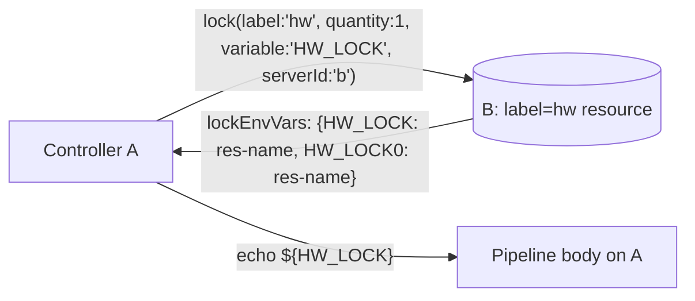
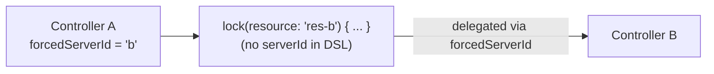

# E2E Test Specification (Phase 1 / M1A)

This document defines E2E tests for the features added in M1A.  
For M1 scenarios (S01–S07, D01–D03), see `E2E_TEST_SPECIFICATION_P1_M1.md`.

---

## Purpose

Verify the following M1A features in a real (containerized) Jenkins environment:

1. **Transparent lockRequest payload**: `POST /acquire` sends a nested `lockRequest` object;
   the server correctly interprets `label` / `quantity` / `variable` / `skipIfLocked`.
2. **lockEnvVars equivalent expansion**: inside `lock(variable:'V', ...)` body,
   `$V`, `${V}0`, `${V}1`, ... expand identically to local `lock()`.
3. **forcedServerId delegated mode**: when Controller A sets `forcedServerId = 'b'`,
   `lock()` DSL without `serverId` is transparently delegated to B.

---

## Impact on M1 Scenarios (backward compatibility)

M1A changed the POST /acquire wire format (`lockRequest` nesting).
Existing scenario scripts use the plugin code path and therefore pick up the new format
**without any script changes**.  
After applying M1A, confirm all M1 scenarios (S01–S07) still pass as a regression check.

---

## Test Coverage (M1A additions)

### Scenario categories

| Category | ID | Feature under test |
|---|---|---|
| M1A happy path | `S08` | Label-based acquisition + lockEnvVars expansion |
| M1A happy path | `S09` | forcedServerId delegated mode |

### Scenario list

| ID | Script name | Feature | Controllers needed |
|---|---|---|---|
| S08 | `label-env-vars` | label-based acquire + variable env expansion | a, b |
| S09 | `delegated-mode` | forcedServerId transparent delegation | a, b |

### Scenario diagrams

#### S08 label-env-vars



#### S09 delegated-mode



---

## Environment

M1A scenarios use the same 3-controller setup as M1.

| Service | Host port | Internal URL |
|---|---|---|
| `jenkins-a` | 8081 | `http://jenkins-a:8080/jenkins` |
| `jenkins-b` | 8082 | `http://jenkins-b:8080/jenkins` |
| `jenkins-c` | 8083 | `http://jenkins-c:8080/jenkins` |

See the "Environment" section of `E2E_TEST_SPECIFICATION_P1_M1.md` for full details.

---

## common.sh additions

New helper functions required for M1A scenarios:

```bash
configure_forced_server_id(base_url, forced_server_id)
  # Set forcedServerId on the given controller (via /manage/configure)
  # Example: configure_forced_server_id "$CONTROLLER_A_URL" "b"

configure_forced_server_id_empty(base_url)
  # Clear forcedServerId (restore local-only mode)

configure_label_resource(base_url, resource_name, label_name)
  # Create a resource and attach both exposeLabel and label_name
  # Example: configure_label_resource "$CONTROLLER_B_URL" "hw-board-01" "hw"
```

---

## run-e2e.sh extension

### New scenario registration

Add to `run-e2e.sh`:

```bash
M1A_SCENARIOS=(
  "label-env-vars"
  "delegated-mode"
)

SCENARIO_IDS["label-env-vars"]="S08"
SCENARIO_IDS["delegated-mode"]="S09"
```

### --only option extensions

```
--only label-env-vars    Run S08 only
--only delegated-mode    Run S09 only
--only m1a-series        Run S08 + S09
--only s-series          Run S01–S07 only (unchanged)
--only all               Run S01–S09 + D01–D03 (includes M1A)
```

### Execution order (all)

```
S01 → S02 → S03 → S04 → S05 → S06 → S07 → S08 → S09 → D01 → D02 → D03
```

### Script file mapping

| Scenario ID | Script file |
|---|---|
| S08 | `scenarios/label-env-vars.sh` |
| S09 | `scenarios/delegated-mode.sh` |

---

## Naming conventions (M1A additions)

### exposeLabel

M1A scenarios use the same `exposeLabel = "remote-enabled"` convention as M1.  
For label-based acquisition (S08), the target resource must carry both `remote-enabled`
(for `exposeLabel` filtering) and the label used in the `lock()` call (e.g. `hw`).

### Credentials naming

| Scenario | credentials ID | Location | Content |
|---|---|---|---|
| S08 A→B | `s08-a-for-b` | A | B admin API token |
| S09 A→B | `s09-a-for-b` | A | B admin API token |

---

## S08: label-env-vars — Label-based acquisition and lockEnvVars expansion

### Intent

When A acquires a resource on B using `label` + `variable`, verify that:
1. B selects a resource matching the `label`.
2. B's generated `lockEnvVars` are available as environment variables inside A's pipeline body.
3. `echo ${HW_LOCK}` prints the acquired resource name — identical to local `lock()` behavior.

```groovy
// A pipeline
lock(label: 'hw', quantity: 1, variable: 'HW_LOCK', serverId: 'b') {
    echo "HW_LOCK=${env.HW_LOCK}"      // e.g. "HW_LOCK=s08-hw-board-1748..."
    echo "HW_LOCK0=${env.HW_LOCK0}"    // same resource name (1 resource, so 0-index equals combined)
}
```

### Prerequisites

- **Controller B**: `remoteApiEnabled=true`, `exposeLabel=remote-enabled`
- **B resource**: `s08-hw-board-<timestamp>` labelled `remote-enabled` + `hw`
- **A credentials** (`s08-a-for-b`): B admin API token
- **A remote config**: `remotes[a→b]` = B internal URL + `s08-a-for-b`

### Pipeline configuration

| Job name | Controller | Content |
|---|---|---|
| `s08-label-env` | A | `lock(label:'hw', quantity:1, variable:'HW_LOCK', serverId:'b') { echo HW_LOCK=...; echo HW_LOCK0=... }` |

### Checkpoints

| ID | Checkpoint | Expected |
|---|---|---|
| CP01 | `s08-label-env` build result | `SUCCESS` |
| CP02 | A console contains line starting with `HW_LOCK=s08-hw-board-` | `true` |
| CP03 | A console contains line starting with `HW_LOCK0=s08-hw-board-` | `true` |
| CP04 | CP02 value equals CP03 value (1 resource → variable equals variable0) | `true` |
| CP05 | B resource `s08-hw-board-*` is released after job completion | `true` |
| CP06 | A console contains `Remote lock acquired on` | `true` |

### Output files

```
reports/<runId>-e2e-test/label-env-vars/console.txt
reports/<runId>-e2e-test/label-env-vars/summary.txt
reports/<runId>-e2e-test/label-env-vars/scenario-details.md
```

---

## S09: delegated-mode — forcedServerId transparent delegation

### Intent

With `forcedServerId = 'b'` set on A, a `lock()` DSL without `serverId` should be
transparently delegated to B. Verify that:
1. B's remote API receives the lock request.
2. The pipeline body executes normally on A.
3. After clearing `forcedServerId`, the lock reverts to local mode.

```groovy
// A pipeline — forcedServerId='b' configured on controller
lock(resource: '<B_RES>') {     // no serverId in DSL
    echo "DELEGATED_ACQUIRED"
}
```

### Prerequisites

- **Controller B**: `remoteApiEnabled=true`, `exposeLabel=remote-enabled`, resource exposed
- **A credentials** (`s09-a-for-b`): B admin API token
- **A remote config**: `remotes[a→b]` = B internal URL + `s09-a-for-b`
- **A `forcedServerId`**: `b` (set before scenario, cleared after)

### Pipeline configuration

| Job name | Controller | DSL | forcedServerId |
|---|---|---|---|
| `s09-delegated` | A | `lock(resource: B_RES) { echo DELEGATED_ACQUIRED }` | `b` (set) |
| `s09-local-fallback` | A | `lock(resource: A_LOCAL_RES) { echo LOCAL_ACQUIRED }` | `` (cleared) |

### Checkpoints

| ID | Checkpoint | Expected |
|---|---|---|
| CP01 | `s09-delegated` build result | `SUCCESS` |
| CP02 | A console contains `DELEGATED_ACQUIRED` | `true` |
| CP03 | A console contains `Remote lock acquired on` (proof of delegation) | `true` |
| CP04 | A console contains `serverId=b` | `true` |
| CP05 | `s09-local-fallback` build result | `SUCCESS` |
| CP06 | `s09-local-fallback` console contains `LOCAL_ACQUIRED` | `true` |
| CP07 | `s09-local-fallback` console does NOT contain `Remote lock acquired on` | `true` |
| CP08 | B resource `s09-res-b-*` is released after job completion | `true` |

CP05–CP07 confirm that clearing `forcedServerId` restores local-only behavior.

### Output files

```
reports/<runId>-e2e-test/delegated-mode/delegated-console.txt
reports/<runId>-e2e-test/delegated-mode/fallback-console.txt
reports/<runId>-e2e-test/delegated-mode/summary.txt
reports/<runId>-e2e-test/delegated-mode/scenario-details.md
```

---

## Regression check (M1 scenarios after M1A)

Run M1 scenarios to confirm M1A introduces no regressions:

```bash
PLUGIN_DIR=<path> ./run-e2e.sh --only s-series
```

Expected: all S01–S07 `PASS`.

---

## Exit codes

Same convention as M1:

- All scenarios pass: `0`
- Any scenario fails: `1`
- Scenario skipped (e.g. jenkins-d unavailable): `10`

---

## Changelog

- 2026-06-11: Initial version. Defines M1A scenarios S08 (label-env-vars) and S09 (delegated-mode).
  Describes run-e2e.sh extensions and backward-compatibility regression check.
