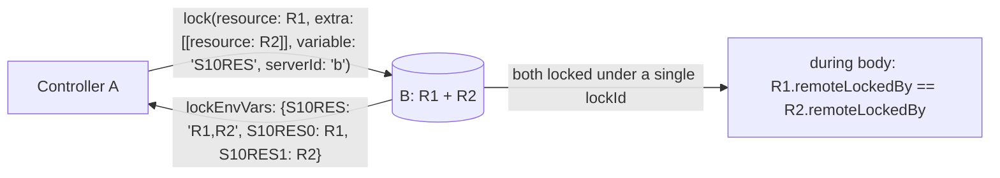
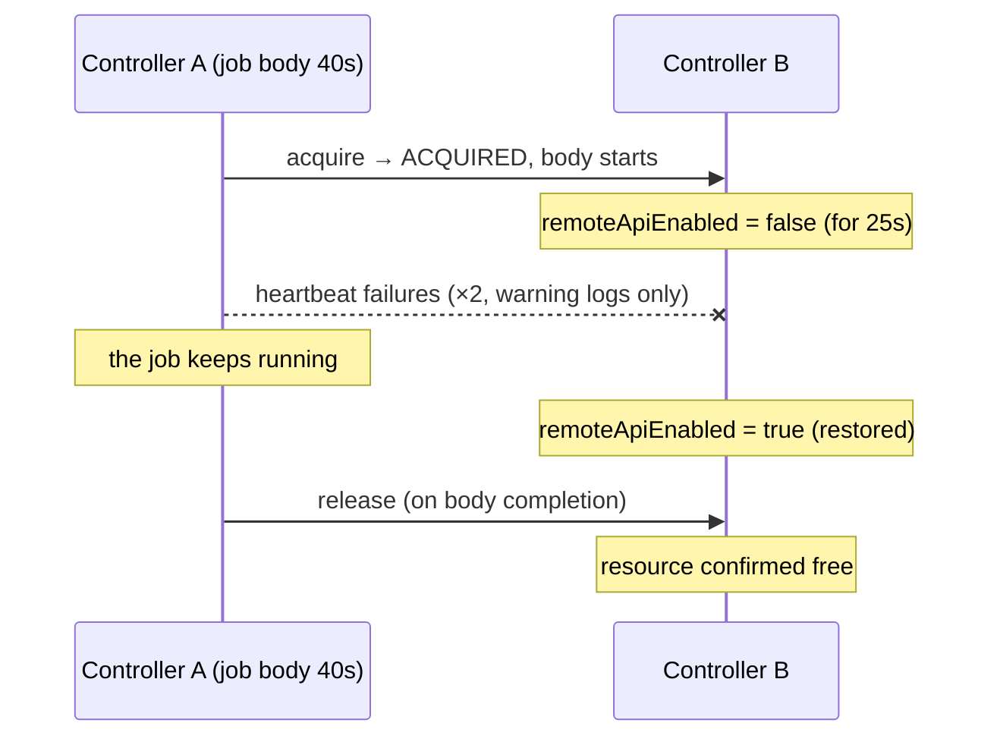
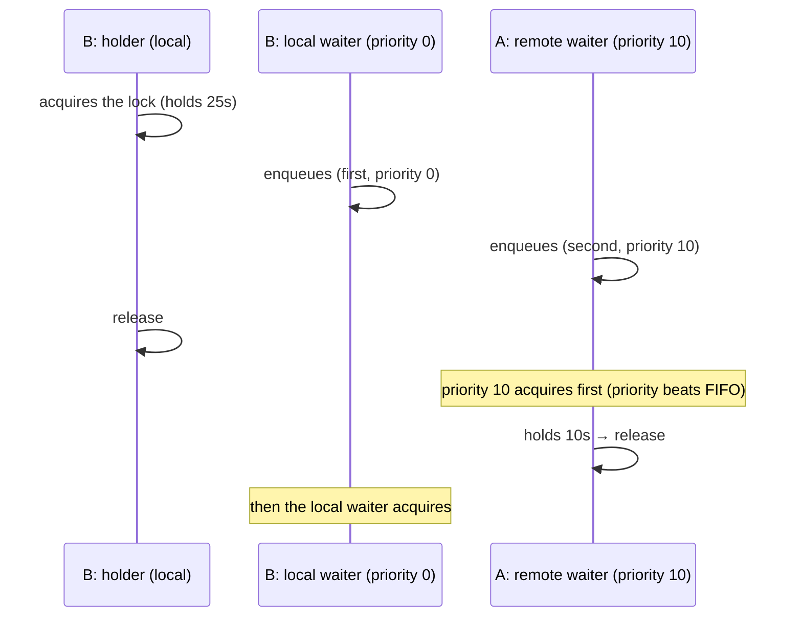
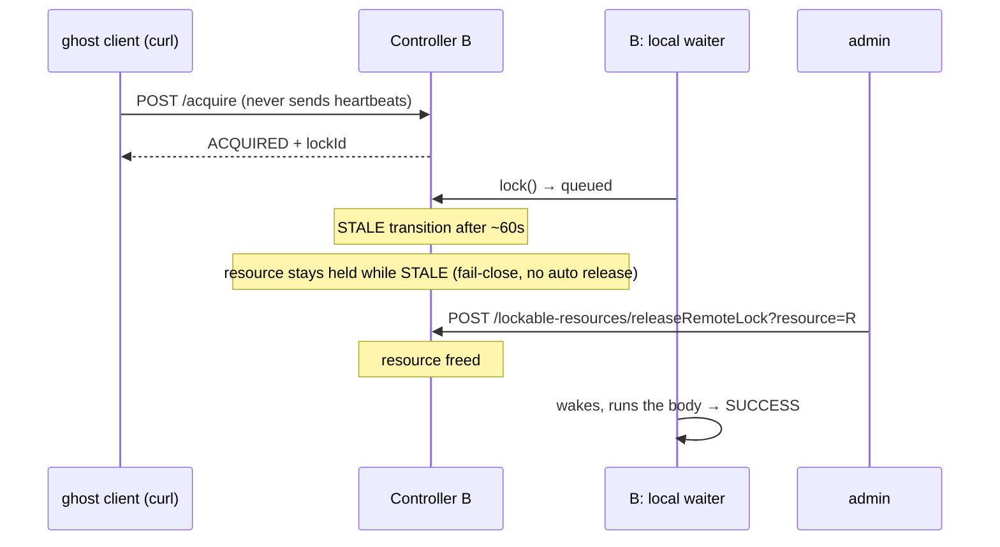

# E2E Test Specification (Phase 1 / M1B)

This document defines the design and specification of the E2E tests covering the
features added in M1B.
For the M1 scenarios (S01–S07, D01–D03) see `E2E_TEST_SPECIFICATION_P1_M1.md`;
for the M1A scenarios (S08–S09) see `E2E_TEST_SPECIFICATION_P1_M1A.md`.

---

## Purpose

Verify the following M1B features in a production-like environment:

1. **Atomic extra acquisition**: `lock(resource:, extra: [...], serverId:)`
   acquires and releases all resources (main + extra) atomically under a single lease
2. **Heartbeat resilience**: heartbeat failures during body execution do not kill
   the job, and the lease is released normally on completion (proof of decision B)
3. **Unified queue priority**: a higher-priority remote waiter acquires the lock
   before a lower-priority local waiter that enqueued earlier (proof of decision E)
4. **STALE admin release**: a lease whose heartbeats stop transitions to STALE,
   stays held under fail-close, and is freed by the admin Force Release, waking
   the local waiter (proof of decision F + fail-close)

---

## Test Structure (M1B additions)

### Scenario list

| ID | Script name | Feature under test | Required controllers |
|---|---|---|---|
| S10 | `extra-resources` | Atomic extra acquisition + comma-joined lockEnvVars | a, b |
| S11 | `heartbeat-resilience` | Job continuation through heartbeat failures | a, b |
| S12 | `priority-ordering` | Unified local/remote priority dispatch | a, b |
| S13 | `stale-admin-release` | STALE transition + fail-close hold + admin release | b |

### Scenario diagrams

#### S10 extra-resources



#### S11 heartbeat-resilience



#### S12 priority-ordering



#### S13 stale-admin-release



---

## run-e2e.sh Extensions

### Scenario registration

```bash
M1B_SCENARIOS=(
  "extra-resources"
  "heartbeat-resilience"
  "priority-ordering"
  "stale-admin-release"
)

SCENARIO_IDS["extra-resources"]="S10"
SCENARIO_IDS["heartbeat-resilience"]="S11"
SCENARIO_IDS["priority-ordering"]="S12"
SCENARIO_IDS["stale-admin-release"]="S13"
```

### --only option extensions

```
--only m1b-series        Run S10–S13
--only all               Run S01–S13 + D01–D03 (including the M1B additions)
```

### Execution order (all)

```
S01 → ... → S09 → S10 → S11 → S12 → S13 → D01 → D02 → D03
```

---

## S10: extra-resources — Atomic extra Acquisition

### Test intent

Verify that remote locks with `extra` **never produce partial locks**
(confirms the resolution of M1A review finding 3-1).

1. Both the main and extra resources are acquired
2. Both resources' `remoteLockedBy` hold the **same lockId** (single lease = atomic)
3. The combined `variable` value is **comma-separated** (confirms finding 3-2)
4. Release frees both resources together

### Pipeline structure

Uses a scripted pipeline (Declarative treats the constructor parameter
`resource` as required — known issue JENKINS-50260; lesson learned from S08).

| Job name | Controller | Content |
|---|---|---|
| `s10-extra` | A | `lock(resource: R1, extra: [[resource: R2]], variable: 'S10RES', serverId: 'b') { echo + sleep 8 }` |

### Checkpoints

| ID | Check | Expected |
|---|---|---|
| CP01 | Build result | `SUCCESS` |
| CP02 | During the body, R1 and R2 on B have the same non-null `remoteLockedBy` | `true` (direct atomicity proof) |
| CP03 | `S10RES` contains both R1 and R2, comma-separated | `true` |
| CP04 | The indexed variables `S10RES0` / `S10RES1` exist | `true` |
| CP05 | Both R1 and R2 are free after completion | `true` |
| CP06 | `Remote lock acquired on` appears in the console | `true` |

---

## S11: heartbeat-resilience — Job Continuation Through Heartbeat Failures

### Test intent

Heartbeat failures must not kill the job (proof of decision B).
**To prevent a vacuous pass, the test proves via logs that heartbeat failures
actually happened.**

### Fault injection

During body execution (40s), set B's `remoteApiEnabled` to `false` for 25
seconds. Roughly 2 heartbeats (10s interval) fail. Restore before the body
ends so the final release succeeds.

### Checkpoints

| ID | Check | Expected |
|---|---|---|
| CP01 | Build result (despite heartbeat failures) | `SUCCESS` |
| CP02 | The body ran to completion (`S11_BODY_END` marker) | `true` |
| CP03 | The warning `Remote heartbeat failed (continuing job; server retains lock)` **actually appears** in container A's logs (collected with `docker logs --since`) | ≥ 1 |
| CP04 | B's resource is free after completion | `true` |

Without CP03 we could not detect "the fault injection didn't take effect and the
test just passed normally". The warnings are saved to
`reports/<runId>-e2e-test/heartbeat-resilience/heartbeat-warnings.txt`.

---

## S12: priority-ordering — Unified Queue Priority Dispatch

### Test intent

Remote waiters participate in the unified LRM queue, and **priority applies
across local and remote** (the core verification of decision E / the unified
queue bridge).

### Contention design

1. A holder (local job) on B holds the resource for 25 seconds
2. A local waiter (priority 0) on B enqueues **first**
3. A remote waiter (priority 10, serverId: 'b') from A enqueues **second**
4. After the holder releases, **the remote waiter acquires first** (holds 10s)
5. Then the local waiter acquires

### Discriminating power (test sensitivity)

Polling after the holder releases:

- Priority works → the resource is observed as **remote-locked** (`remoteLockedBy != null`)
- Priority broken (FIFO) → the first-enqueued local waiter acquires, observed as
  a **build lock** (`isLocked()`)

The two observations are mutually exclusive, so the test cannot pass by accident.

### Checkpoints

| ID | Check | Expected |
|---|---|---|
| CP01 | All three builds (holder / local waiter / remote waiter) | `SUCCESS` |
| CP02 | After the holder releases, the resource is observed remote-locked first (FAIL if the local build lock is observed first) | `true` |
| CP03 | Both waiters' body markers appear | `true` |
| CP04 | The resource is free at the end | `true` |

---

## S13: stale-admin-release — STALE Transition and Admin Release

### Test intent

End-to-end proof of the completed fail-close design (§8 of the M1B spec):

1. A lease that never sends heartbeats transitions to STALE (~60s threshold)
2. While STALE it is **not auto-released** (fail-close)
3. The admin Force Release endpoint frees it
4. The release wakes the queued local waiter (unified-queue wake-up path)

### Ghost client approach

The plugin's own client always sends heartbeats, so the test creates a
"client that never heartbeats" by calling
`POST /lockable-resources/remote/v1/acquire/` directly with curl. The lockId
is taken from the response JSON.

### Checkpoints

| ID | Check | Expected |
|---|---|---|
| CP01 | Ghost acquire response | `state=ACQUIRED` + lockId |
| CP02 | The record becomes `STALE` after ~60s without heartbeats (polled via Groovy: `RemoteLockManager.find(lockId).getState()`) | `true` |
| CP03 | The resource stays held while STALE (`remoteLockedBy != null`) | `true` (fail-close) |
| CP04 | `POST /lockable-resources/releaseRemoteLock?resource=R` (requires UNLOCK permission + crumb) | success |
| CP05 | The queued local job wakes and finishes `SUCCESS` | `true` |
| CP06 | The resource is free at the end | `true` |

### Duration

Includes waiting for the STALE threshold (`max(heartbeatInterval × 6, 60)` = 60s),
so S13 alone takes roughly 70–90 seconds.

---

## Common Conventions (M1B additions)

### Credentials naming

| Scenario | Credentials ID | Location | Content |
|---|---|---|---|
| S10 A→B | `s10-a-for-b` | A | B admin API token |
| S11 A→B | `s11-a-for-b` | A | B admin API token |
| S12 A→B | `s12-a-for-b` | A | B admin API token |
| S13 (direct curl) | none (uses the API token directly) | - | B admin API token |

### Resource naming

`s1X-<role>-<timestamp>` format (e.g. `s10-res1-1781234567`).
The timestamp prevents interference with previous runs even under
`--skip-start` (container reuse).

---

## Regression

Confirm all scenarios PASS after the M1B implementation.

```bash
PLUGIN_DIR=<path> ./run-e2e.sh                    # all 16 scenarios
PLUGIN_DIR=<path> ./run-e2e.sh --only m1b-series  # S10–S13 only
```

| Target | Expected |
|---|---|
| All 16 scenarios (S01–S13 + D01–D03) | `PASS` |

### Results

- 2026-06-12: First run of S10–S13: all 4 PASS (`reports/20260612011450-e2e-test.md`)
- 2026-06-12: Full 16-scenario regression: 16/16 PASS (`reports/20260612011822-e2e-test.md`)

---

## Revision History

- 2026-06-12: Initial version. Defines the M1B scenarios S10–S13.
  Following the S08 lesson (Declarative required-parameter validation),
  the M1B scenarios use scripted pipelines.
