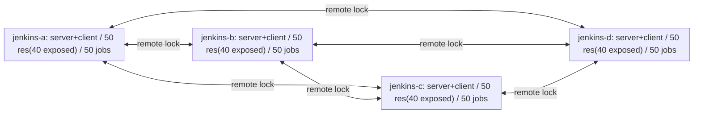

# Load Test Specification (remote lock integration stress)

This document defines the design of the high-load / stress tests run by
`dev/jenkins-env/run-load.sh`. It is a **separate load suite** from the
**correctness suite** in `E2E_TEST_SPECIFICATION.md`; the purpose, output, and
pass/fail criteria differ.

> **Position:** while E2E (`run-e2e.sh`) judges "does the feature work" with
> checkpoints, this suite judges "under production-scale concurrent remote
> locking, is the system **consistent, convergent, and does it degrade
> legitimately**" with metrics + invariants. It shares the common base
> (`lib/common.sh`, the docker controllers) but uses a separate harness
> (`run-load.sh`). It is **not** part of the E2E `all` gate.
>
> **The headline scenario is G01 (a 4-node mutual server/client storm)** — it
> exercises issue #1025's "controllers as both server and client / composition
> of independent one-way relays" at real load, through the unified queue. L01–L03
> (single-layer REST stress) are auxiliary, to isolate the lock layer when G01
> surfaces an anomaly.

---

## Purpose

| # | Verification | Scenario |
|---|---|---|
| 1 | With 4 controllers as both server/client running 50 jobs each, **no resource is ever held beyond its capacity** (mutual exclusion holds at system scale) | G01 |
| 2 | Under heavy contention there is **no deadlock / lost wakeup / phantom lock**, and every job terminates (success or a legitimate timeout) | G01 |
| 3 | A job that timed out did so for a **legitimate resource-exhaustion wait** (not a bug), provable from the queue logs | G01 |
| 4 | The middle `skipIfLocked` acquire **never fails the job** whether it succeeds or not (swallowed) | G01 |
| 5 | Local and remote locks **mutually exclude on the same physical resource** (server-self-use at scale) | G01 |
| 6 | After all jobs stop, each server returns to **all resources free, zero STALE** (clean teardown, no leak) | G01 |
| 7 | The per-resource **queue-wait timeline can be visualized** from the job consoles (PNG) | G01 |
| 8 | (auxiliary) mutual exclusion / throughput / leak with the lock layer isolated | L01–L03 |

---

## Test structure

### Scenario matrix

| ID | Script / job | Load type | Main validation | Default scale | Targets |
|---|---|---|---|---|---|
| **G01** | `grid-storm` (Jenkinsfile + run-load.sh) | integration system stress | 4-node mutual server/client, 50 jobs × 3 iters each, mutual exclusion + legitimacy of convergence/degradation | 4×50=200 concurrent | a,b,c,d |
| L01 | `contention-storm` (direct REST) | consistency under contention (unit) | N concurrent acquires on one capacity-1 resource; critical sections never overlap | 50 concurrent | single server |
| L02 | `throughput-acquire` (direct REST) | throughput/latency (unit) | acquire→release loop with no contention; req/s, p95 | 30 concurrent | single server |
| L03 | `sustained-soak` (direct REST) | endurance/leak (unit) | medium concurrency, long duration, heartbeats; record/resource return to baseline | 10 concurrent | single server |

> This document details **G01**; L01–L03 are summarized at the end ("auxiliary scenarios").

### G01 topology (Mermaid — topology only)



> Each job picks its remote target **randomly** among the controllers (by default,
> excluding self — see loopback). The time-series visualization uses generated **PNGs**, not Mermaid.

---

## Environment

### 4 controllers (each acts as both server and client)

| Service | Host port | Internal URL | jenkins home | Role |
|---|---|---|---|---|
| `jenkins-a` | 8081 | `http://jenkins-a:8080/jenkins` | `jha/` | server + client |
| `jenkins-b` | 8082 | `http://jenkins-b:8080/jenkins` | `jhb/` | server + client |
| `jenkins-c` | 8083 | `http://jenkins-c:8080/jenkins` | `jhc/` | server + client |
| `jenkins-d` | 8084 | `http://jenkins-d:8080/jenkins` | `jhd/` | server + client |

Each controller is wired with `remotes[self→other]` (× the other 3) and a username/password credential holding the peer server's admin API token.

### Resource model (50 per controller, 40 exposed)

`quantity` only applies to **label-based selection** (a named resource is always a single one), so `quantity:2`
etc. are expressed as **label requests**. Each controller creates resources with these labels:

| Group | Count | Labels | Use |
|---|---|---|---|
| all resources | 50 | `pool` | the **single selection label** for both local and remote |
| of which exposed | 40 | + `remote-enabled` (= exposeLabel) | remotely visible (eligible for remote selection) |

The selection label is unified to `pool` (no separate `rpool`). Exposure is decided solely by the exposeLabel
(`remote-enabled`); `quantity` selection always uses `pool`.

- **remote selection**: the client sends `label: 'pool'`; the server picks `quantity` matches **from its exposed
  (`remote-enabled`) set** — 40 of the 50 — so remote supply per controller = 40.
- **local selection**: `label: 'pool'` (quantity:1) can match any of the 50 (exposed or not). Exposed resources
  are therefore **contended by both local and remote**, stressing server-self-use exclusion at scale.

### Executors

Each controller's built-in node is set to **50 executors** (= 50 concurrent jobs). On one WSL2 host this is
**4 JVMs × 50 = 200 concurrent pipelines**, which is heavy. **Staged ramp-up is mandatory** (see Presets): validate
the harness small (e.g. 4×10), then scale up; raise each JVM heap via start.sh / the Dockerfile.

### Jenkinsfile delivery (read file → inline injection)

The load job's pipeline lives as a **Jenkinsfile in the notes repo** (the source of truth); `run-load.sh` reads it
and **injects it inline as a `CpsFlowDefinition` (sandbox disabled)**.

- Why: maintenance is editing one versioned file, yet there is **no runtime git checkout** (zero external
  dependency, no checkout noise) — ideal for a load test (SCM checkout was rejected).
- **sandbox disabled**: only for this trusted, harness-generated load job, so it can use
  `System.currentTimeMillis()` / `Random` (for the structured-event epochs and random target selection).
  Injection approves the exact script via `ScriptApproval.get().preapprove(script, GroovyLanguage.get())`.
- Location: `dev/jenkins-env/load/Jenkinsfile.grid` (parameterized: server list, self id, labels, iterations,
  sleep, the lock allocate timeouts, the whole-job timeout, loopback).

### Dependencies

- `curl`, `python3`, `docker`, `base64`, `flock`
- **matplotlib** (PNG generation): not present on the host, so create `dev/.venv` and `pip install matplotlib`.
  Plotting is `dev/jenkins-env/lib/analyze_load.py` run with the venv python (container-independent).

### REST API contract (endpoints under test)

`RemoteApiV1Action` (`.../actions/RemoteApiV1Action.java`); base URL `<server>/lockable-resources/remote/v1/`.

| Method / path | Use | Success | Main failures |
|---|---|---|---|
| `POST /acquire` | enqueue; body `{"lockRequest":{...},"clientId":"..."}` | `202` `{lockId,state}` | `400`/`403`/`404`/`413` |
| `GET /acquire/{lockId}` | poll state (pure read; QUEUED lifetime owned by the server queue) | `200` `{lockId,state,...}` | `404` |
| `POST /lease/{lockId}/heartbeat` | renew lease | `204` | `410` |
| `POST /lease/{lockId}/release` | release (idempotent) | `204` | — |

G01 drives these through the plugin's client (pipeline `lock(...)`); L01–L03 hit them directly with curl.

---

## Job design (G01 / Jenkinsfile.grid)

**50 jobs are started concurrently** on each controller. One job behaves as:

```groovy
// params: SERVERS=[a,b,c,d], SELF=<this id>, ALLOW_SELF=false, ITER=3, SLEEP=30,
//         RLOCK_TO=3(min), LLOCK_TO=3(min), JOB_TO=15(min)
// pickTarget: ALLOW_SELF=false excludes SELF (pure cross), true keeps the 4-way pick (25% loopback)
timeout(time: JOB_TO, unit: 'MINUTES') {            // whole job: 15 min
  for (i in 1..ITER) {                              // 3 iterations
    def t1 = pickTarget(SELF, SERVERS, ALLOW_SELF)
    lock(label: 'pool', quantity: 2, serverId: t1, variable: 'RMAIN',
         timeoutForAllocateResource: RLOCK_TO, timeoutUnit: 'MINUTES') {   // (1) remote, 2 resources
      lock(label: 'pool', quantity: 1, variable: 'LRES',
           timeoutForAllocateResource: LLOCK_TO, timeoutUnit: 'MINUTES') { // (2) local, 1 resource
        def t2 = pickTarget(SELF, SERVERS, ALLOW_SELF)
        try {                                        // (3) remote, skipIfLocked (swallowed)
          lock(label: 'pool', quantity: 1, serverId: t2, skipIfLocked: true) { /* ... */ }
        } catch (e) { /* swallow: success or failure must not fail the job */ }
        sleep(time: SLEEP, unit: 'SECONDS')          // (4) hold
      }                                              // local released
    }                                                // remote released
  }
}
```

### Structured events (the console output contract)

Visualization and judging are done from structured console lines. The Jenkinsfile's `emit()` prints one line
(epoch millis, pipe-delimited; independent of the Timestamper plugin):

```
LLT|<epochMs>|<jobUid>|<self>|<iter>|<phase>|<event>|<target>|<resources>
  phase     : REMOTE_MAIN | LOCAL | REMOTE_SKIP
  event     : REQUEST | ACQUIRED | SKIPPED | FAILED | BODY | RELEASED
  jobUid    : "<JOB_NAME>#<BUILD_NUMBER>@<self>"
  resources : ACQUIRED lines only — the acquired resource names (comma-separated)
              obtained via lock(variable:'X') / lockEnvVars; empty otherwise
```

- **queue wait** = `ACQUIRED.epochMs − REQUEST.epochMs` for the same `(jobUid,iter,phase)`.
- **hold interval** = `ACQUIRED` … `RELEASED` (paired by the same key). Overlap analysis uses the `ACQUIRED`
  line's `resources` (names) and `target` (the holding server).

`run-load.sh` collects every job's `consoleText`, extracts the `LLT|` lines, and aggregates/analyzes/plots with `python3`.

---

## Presets (convergence ↔ degradation)

Staged operation: first confirm **convergence** with a gentle setting (almost all succeed, measure wait latency),
then raise concurrency/contention to the **degradation point** (legitimate timeouts appear). Set via `run-load.sh` flags.

| Preset | jobs/ctrl | ITER | SLEEP | RLOCK_TO | JOB_TO | Goal |
|---|---|---|---|---|---|---|
| `smoke` | 5 | 1 | 10s | 2min | 5min | harness sanity (4×5=20 concurrent) |
| `converge` | 20 | 3 | 30s | 3min | 15min | expect convergence (validate success, capture latency baseline) |
| `full` | 50 | 3 | 30s | 3min | 15min | the headline scale (4×50=200, ~2.5× overcommit) |
| `stress` | 50 | 3 | 60s | 3min | 15min | induce degradation (longer hold → exhaustion → observe legitimate timeouts) |

```
--preset smoke|converge|full|stress
--jobs-per-controller <N>  --iterations <N>  --sleep <SEC>
--remote-timeout <MIN>  --local-timeout <MIN>  --job-timeout <MIN>
--allow-loopback   include SELF as a remote target (25% loopback). Default OFF = pure cross.
                   In real use a remote-to-self serverId is a bug, so it is excluded by default
                   for the remote-feature load test; enable only to measure loopback performance.
--only grid-storm | contention-storm | throughput-acquire | sustained-soak | g-series | l-series | all
--skip-start
```

> **Timeout budget note:** worst case per iteration = remote wait RLOCK_TO + local wait LLOCK_TO + skip + SLEEP.
> For `full` the worst case ≈ 3+3+0.5+0.5 ≈ 7 min/iter → ≈ 21 min over 3 iters > JOB_TO 15 min. So under pathological
> contention a job can hit the 15-min wall. That is not an anomaly but a **degradation signal**; whether such a
> timeout is a legitimate exhaustion wait is judged by the oracle (CP04 below).

---

## Acceptance criteria / oracle

Heavy-contention outcomes are probabilistic, so **pass/fail is not by success count**. It uses system invariants
plus a per-job **outcome classification + legitimacy**.

### Job outcome classification

Each `jobUid` is classified from its last console event and the build result:

| Class | Definition |
|---|---|
| `COMPLETED` | all ITER iterations' `REMOTE_MAIN/RELEASED` present, build = SUCCESS |
| `TIMED_OUT` | hit the 15-min wall; last event is an unfinished `*_REQUEST` (cut off while waiting) |
| `FAILED` | the remote-main lock fails closed (comm/auth/exhaustion timeout; body not executed) |
| `HUNG` | none of the above and does not terminate within 15 min + grace (**suspected bug**) |

### Acceptance criteria (system invariants)

| ID | Check | Expected |
|---|---|---|
| CP01 | **mutual exclusion**: sweeping all hold intervals across all jobs/controllers, no resource is held beyond capacity at any instant | overlaps `0` |
| CP02 | **local/remote exclusion**: on an exposed resource, local and remote holds never overlap | overlaps `0` |
| CP03 | **termination**: no `HUNG` (every job ends as COMPLETED/TIMED_OUT/FAILED) | `HUNG = 0` (no deadlock/lost wakeup) |
| CP04 | **timeout legitimacy**: each `TIMED_OUT` job can be shown to have been waiting on a genuinely exhausted label at cut-off (not a lost wakeup) | `true` for all TIMED_OUT |
| CP05 | **skip swallowed**: neither ACQUIRED nor FAILED of `REMOTE_SKIP` makes the job `FAILED` | `true` |
| CP06 | **fail-closed**: a `FAILED` job emits no body-progress event (e.g. `LOCAL/ACQUIRED`) after the remote-main failure | `true` |
| CP07 | **teardown**: after all jobs stop, every controller has all resources free and zero STALE/held remote records (Groovy check) | `true` |
| CP08 | (converge preset) COMPLETED ratio | high (e.g. ≥ 0.95; baseline set empirically) |

> CP01/CP02 are the core. Hold intervals (ACQUIRED…RELEASED) are grouped per `(target, resource)` and swept in
> `python3` to detect over-capacity overlaps. **Resource names** come from the `ACQUIRED` line's `resources` field
> (via `lock(variable:'X')` / lockEnvVars) — which is why every lock carries a `variable`.

---

## Report & visualization

`run-load.sh` produces, on completion:

```
reports/<runId>-load-test.md          # self-contained report (scenario + metrics + inline PNGs)
reports/<runId>-load-test/grid-storm/
  consoles/<jobUid>.txt               # each job's consoleText
  events.csv                          # parsed LLT events (all jobs)
  netstats.csv                        # docker stats samples (epochMs,name,cpu,mem,net,block)
  job-classification.csv              # jobUid, outcome, iters_completed
  overlaps.txt                        # CP01/CP02 overlaps (empty = none)
  metrics.json                        # outcome counts, queue-wait p50/p95/p99, netstats summary
  plots/queue-waiters-over-time.png
  plots/queue-wait-scatter.png
  plots/resource-mean-hold-scatter.png
  plots/network-throughput.png        # per-container rx+tx throughput
  plots/cpu-utilization.png           # per-container CPU%
```

The report `.md` embeds the PNGs inline (``, not links), so it is **self-contained** — the scenario, the
metrics, and the figures all render from the single file (when the plots are committed alongside it).

### View 1: was job behaviour as expected

- the outcome breakdown (COMPLETED / TIMED_OUT / FAILED / **HUNG must be 0**),
- **timeout legitimacy**: each TIMED_OUT annotated with CP04 (legitimate exhaustion / suspicious),
- **success legitimacy**: COMPLETED jobs never broke CP01/CP02 mutual exclusion,
- skip swallowed (CP05) and fail-closed (CP06).

### View 2: queue-wait visualization (PNG; no Mermaid)

`analyze_load.py` (matplotlib / venv) generates these from `events.csv`:

| PNG | Content |
|---|---|
| `queue-waiters-over-time.png` | number of QUEUED waiters over time (per-controller + total); peaks = contention |
| `queue-wait-scatter.png` | per-acquisition queue wait (y) vs acquire time (x); the raw distribution across all jobs |
| `resource-mean-hold-scatter.png` | one point per resource (50×4): mean hold time (y) vs median acquire time (x), point size = #acquisitions — shows load skew across the pool |

### View 3: processing load (docker stats)

During the run, `docker stats` is sampled every `SAMPLE_INTERVAL` (default 3s) for all containers into
`netstats.csv`; analysis aggregates **network throughput (rx+tx delta/sec)**, CPU%, and mem. The Jenkins Metrics
plugin is not installed, so instead of server-side HTTP meters we measure the containers directly.

- a **utilization table** in the report: per-container peak CPU% / peak mem / net rx total / net tx total,
- `network-throughput.png`: per-container rx+tx throughput (= the network processing load); spikes on acquire bursts,
- `cpu-utilization.png`: per-container CPU% over time (controllers that were busier remote targets spike higher),
- at full scale these also gauge host capacity (CPU saturation, mem ceiling).

> The remote API poll is an internal plugin call and does not appear in LLT, but it **is reflected as real bytes** in netstats rx/tx.

---

## Exit codes

- all invariants hold (HUNG=0, overlaps=0, teardown ok; TIMED_OUT legitimate per CP04): 0
- invariant violation (HUNG detected / mutual-exclusion overlap / illegitimate timeout / teardown residue): 1
- cannot run (controllers not up, etc.): 10

---

## Auxiliary scenarios (single-layer lock stress: L01–L03)

When G01 surfaces an anomaly, these isolate the **lock layer** (no Jenkins/pipeline) to localize the cause. The
load comes from a pool of host curl workers (direct REST, no pipeline); the target is a single server (default jenkins-b).

| ID | Outline | Core check |
|---|---|---|
| L01 `contention-storm` | N concurrent acquire → (short hold) → release on one capacity-1 resource | **zero overlap** of critical sections (no double-grant); barrier-synced start |
| L02 `throughput-acquire` | a time-bounded acquire→release loop with no contention | error rate ≤ 0.5%; p95/p99, req/s (report-only first, then regression) |
| L03 `sustained-soak` | medium concurrency, long duration, heartbeats | record/held resources **return to baseline**; no STALE accumulation; record count not monotonically increasing |

Each L scenario follows G01's conventions and runs in isolation via `--only <name>`.

---

## Design decisions (why this shape)

- **Not added to run-e2e.sh**: output (checkpoints vs metrics), pass/fail (match vs threshold/invariant), and run
  profile differ; a separate `run-load.sh` keeps E2E's `all` gate clean. `lib/common.sh` is reused.
- **G01 is pipeline-driven**: the point is to exercise the unified queue, lockEnvVars, and cross-controller paths
  in a real system; the direct-REST L01–L03 isolate the lock layer when needed.
- **Jenkinsfile read → inline injection** (no SCM checkout): same maintainability (one file) with zero runtime git
  and no checkout noise — preserving load-test purity.
- **quantity is label-based**: `quantity` only affects label selection, so both remote and local use label requests.
- **pass/fail by invariants, not counts**: heavy contention is probabilistic; judge by mutual exclusion,
  termination, and timeout legitimacy to rule out spurious passes.
- **time-series via PNG**: Mermaid is poor for continuous time-series; matplotlib (venv) generates and the report embeds them.

---

## Implementation & verification log

| Date | Scope | Result | Notes |
|---|---|---|---|
| 2026-06-21 | `smoke` (4×5=20 jobs, ITER1, sleep10s) | **20/20 SUCCESS, HUNG 0, 0 mutual-exclusion violations, queue-wait p95 ≈173ms** | harness sanity; PNGs generated |
| 2026-06-21 | `converge` (4×20=80 jobs, ITER3, sleep30s) | **80/80 COMPLETED, HUNG 0, 0 violations**. queue-wait p50 115ms / **p95 ≈27.2s / max 30.2s** (real contention, converged). waiters peak ≈35 (3 waves = 3 iters). peak CPU b 261% / a 187% | 132 docker-stats samples; net rx/tx ≈0.6–0.8MB/ctrl |
| 2026-06-21 | `full` (4×50=**200 jobs**, ITER3, sleep30s, **loopback ON**) | **200/200 COMPLETED, HUNG 0, 0 violations**. heavy contention: queue-wait p50 3.1s / **p95 ≈78s / max ≈90s**, **waiters saturate ≈140** then fully drain. peak CPU **d 449% / b 295%**, net rx/tx ≈3.5–4.5MB/ctrl. wall ≈6.4 min | self-target 25% (144/600). max wait 90s < lock timeout 180s, so no timeouts |
| 2026-06-22 | `full` (200 jobs, ITER3, sleep30s, **loopback OFF = pure cross**) | **200/200 COMPLETED, HUNG 0, 0 violations**. self=0 (600/600 cross). harsher: queue-wait p50 4.4s / **p95 ≈96s / p99 ≈118s / max ≈124s**. peak CPU **a 366% / b 243% / d 240%**, peak mem ≈1.0GiB/ctrl, net rx/tx ≈4.1–5.5MB/ctrl. wall ≈6.5 min | **goal met (remote LR does not break even in the harshest pure-cross config)**. every remote is a network call → +23% wait / +25% net vs loopback ON. max wait 124s < 180s, fully converged (CP04 needs `stress`) |
| 2026-06-22 | `stress` (200 jobs, ITER3, **sleep60s**, loopback OFF, **after the lock-timeout fix in Jenkinsfile**) | **191 SUCCESS / 9 FAILURE, HUNG 0, 0 violations, all 9 fail-closed (no body)**. queue-wait p95 167s / max 182s (cut at ≈3 min). first observation of the degraded regime | **finding: the 9 failures split into 2 kinds** — 3 clean `LOCK_WAIT_TIMEOUT` (server returns state=FAILED), **6 where the QUEUED poll's `GET /acquire/{id}` got HTTP 404 → the client treated it as a communication failure**. Safe (no break) but it mislabels a legitimate queue-timeout as a transport error. See the finding below |

### Finding from `stress`: inconsistent signal on QUEUED expiry (safe, but a diagnosability rough edge)

Under hold-60s / 200-way exhaustion, a failing remote acquire split into **2 paths** (both fail-closed, integrity intact):

- **A (3/9)**: the client's poll lands while the record still exists and receives `state=FAILED, errorCode=LOCK_WAIT_TIMEOUT` — a clean "lock wait timeout".
- **B (6/9)**: the server-side QUEUED entry timeout removes the record first, so the client's `GET /acquire/{lockId}` gets **404 LOCK_NOT_FOUND**, which the client treats as `Remote API communication failure` and fails closed — **a legitimate exhaustion timeout mislabeled as a transport error**.

**Confirmed root cause:** the terminal-record retention TTL (`TERMINAL_TTL_MS=120s`) was measured from
**`enqueuedAt`** (`RemoteLockManager.maybeScanStale`). A timeout-originated FAILED record is created at
`t=timeoutForAllocateResource`, so when `timeoutForAllocateResource > 120s` it is already past the enqueue-based TTL
the instant it is created and is evicted on the next sweep; the next poll then 404s. The A/B variance is only the
sweep-interval gap between markFailed and removal — **the dominant cause is a deterministic bug, not load-dependent**.
Details, fix, and E2E detectability: `dev/docs-j/LRR_ISSUE_P1_M1H_queued_expiry_poll_404.md`.

**Assessment:** not a `break` (mutual exclusion holds, no deadlock, body not executed) — but a legitimate timeout is
mislabeled as a 404 communication failure. **The primary fix is to measure the TTL from the terminal-transition
time.** Reproducible deterministically with one E2E using `timeoutForAllocateResource > 120s`; load is not required
(the load test only hit it first because `stress` happened to use a 3-minute timeout). Fixed in cycle M1I (plugin
`e231367`), guarded by E2E scenario S18.

### Settled by `smoke` (resolving the earlier "open" items)

- **quantity:2 works via label**: remote `lock(label:'pool', quantity:2, serverId:X)` acquires 2 resources and they reach the body via `variable`.
- **self target works**: `serverId=self` exercises the server-self-use path (self may be in the random pick when loopback is on).
- **job injection**: sandbox=false + `ScriptApproval.get().preapprove(script, GroovyLanguage.get())`, enabling `System.currentTimeMillis()` / `Random` (needed for the LLT epochs).
- **queue coalescing avoided**: parameter-less concurrent triggers coalesce in the Jenkins queue, so a `STORM_IDX` parameter (`buildWithParameters`) makes each trigger a distinct queue item.
- **executors**: `Jenkins.setNumExecutors(jobs/ctrl)` provides the concurrency.
- **CSV alignment**: multiple `resources` names use `;` inside the cell to avoid column drift (the parser splits on `;`).

## Changelog

- 2026-06-21: Initial design (integration stress G01 as the headline). 4-node mutual server/client, 50 resources
  (40 exposed) / 50 jobs × 3 iters per controller, 15-min whole-job timeout. Jenkinsfile in the notes repo, inline
  injection (sandbox off), matplotlib PNG visualization. Pass/fail by system invariants (mutual exclusion,
  termination, timeout legitimacy, teardown). L01–L03 are auxiliary single-layer isolation. Staged
  smoke→converge→full→stress.
- 2026-06-22: Verification log filled in (smoke→converge→full→stress). `stress` surfaced the queued-expiry-poll-404
  regression (fixed in M1I / `e231367`). Report made self-contained with inline PNGs and an explicit scenario section.
