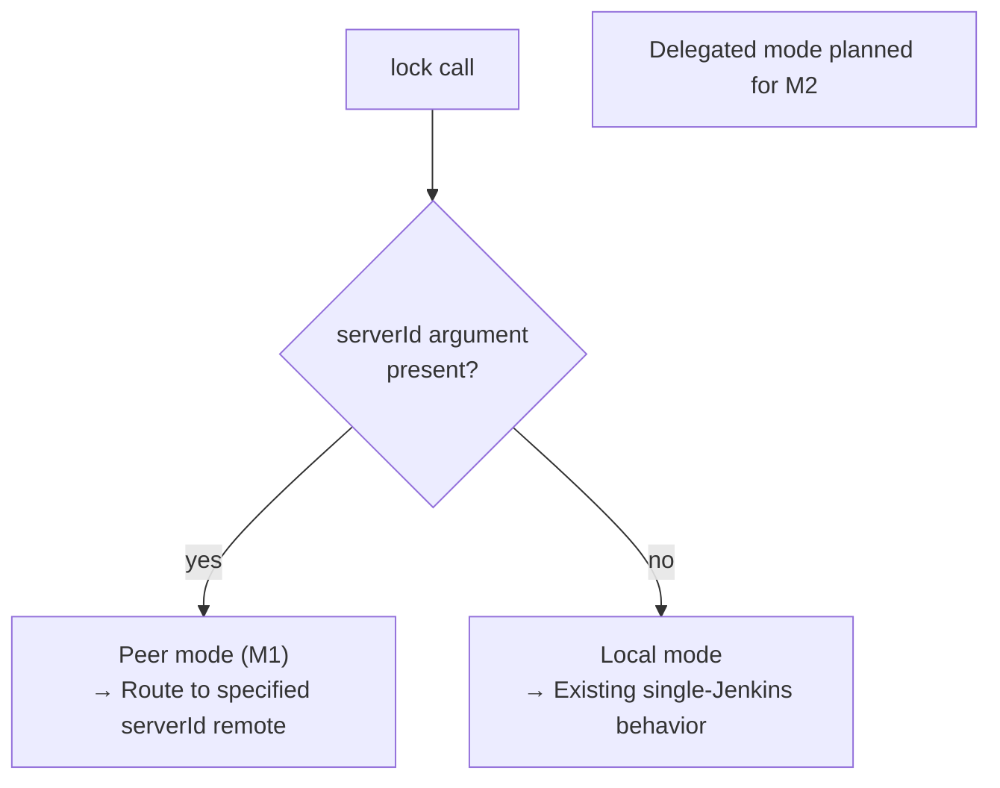
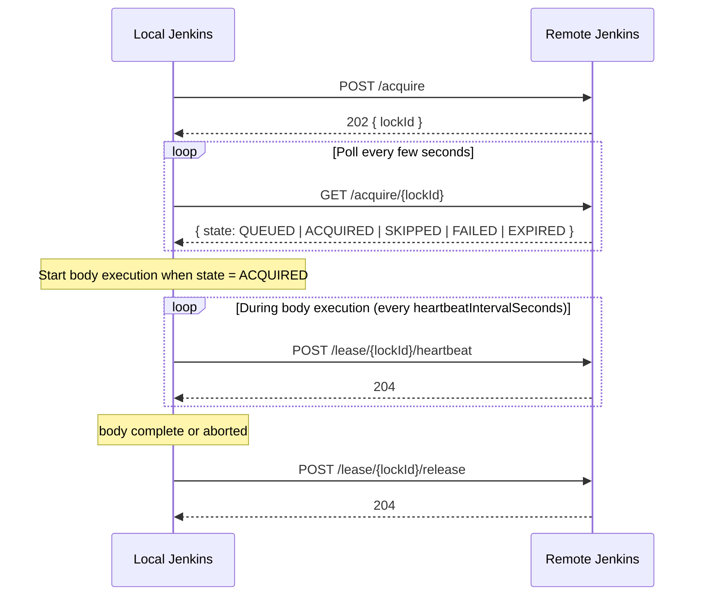
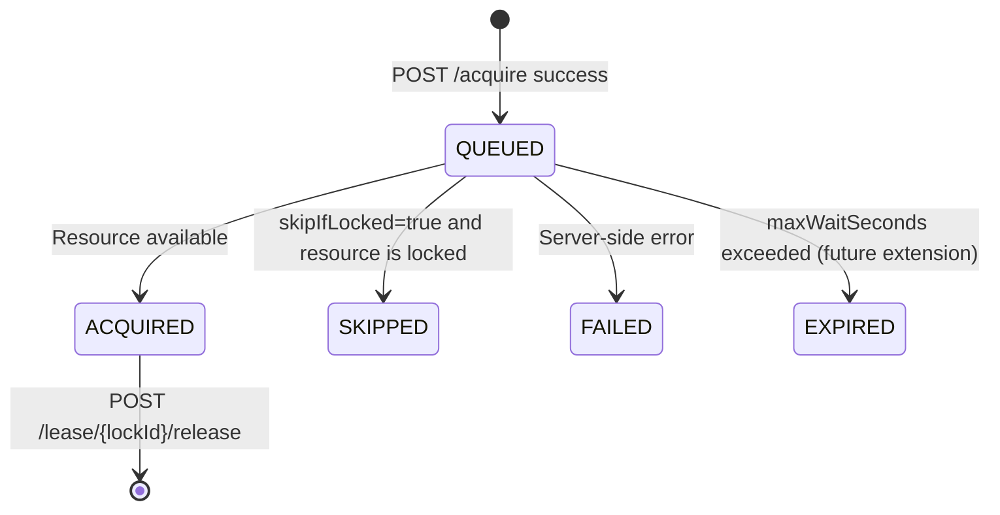
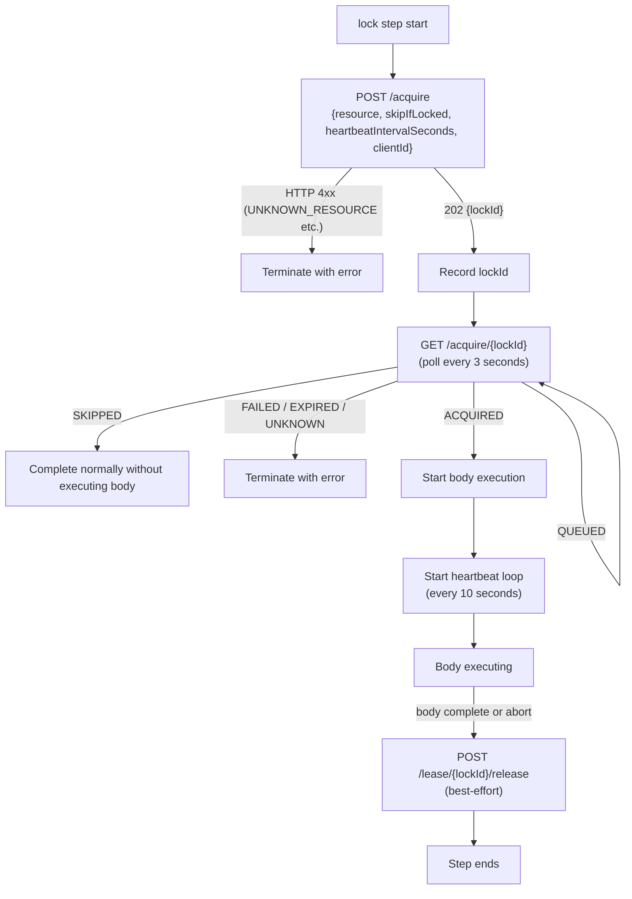
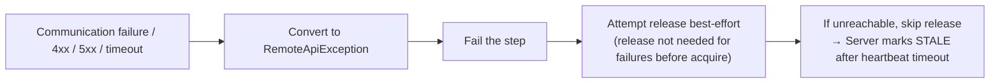

# Remote Lockable Resources Design Spec (Phase 1 / M1)

> **Source:** [jenkinsci/lockable-resources-plugin #1025](https://github.com/jenkinsci/lockable-resources-plugin/issues/1025)
> **Design changes reflected:** `cancel` endpoint removed; `requestId`/`leaseId` unified into `lockId`
> **Target scope:** Phase 1 M1 (minimum viable peer mode)

---

## Table of Contents

1. [Overview & Goals](#1-overview--goals)
2. [Operating Modes](#2-operating-modes)
3. [DSL Resolution Rules](#3-dsl-resolution-rules)
4. [REST API Specification](#4-rest-api-specification)
5. [Client Loop](#5-client-loop)
6. [Configuration Surface](#6-configuration-surface)
7. [Heartbeat and STALE Detection](#7-heartbeat-and-stale-detection)
8. [Error Policy (fail-closed)](#8-error-policy-fail-closed)
9. [Scope Summary (what M1 includes / excludes)](#9-scope-summary-what-m1-includes--excludes)

---

## 1. Overview & Goals

### In a Nutshell

Writing `lock(resource: 'X', serverId: 'B')` is all that is needed to lock a **resource managed by another Jenkins instance**.

### Design Constraints

- `{ body }` is **always executed on the local Jenkins**.
- The remote Jenkins is the **single source of truth** for its resources.
- Communication is **local → remote only** (no callback connection from remote).
- Communication failures are **fail-closed** (locks are not released automatically).
- Remote resources **must be registered in advance** (dynamic creation via API is not supported).

### Goals (M1 / peer mode only)

**M1 implements peer mode only. Delegated mode (M2) and GET /resources (M3) are not included.**

| Goal | Details |
|---|---|
| Peer mode | Explicit `lock(..., serverId: 'X')` specification |
| Backward compatibility | No `serverId` → existing local-mode behavior unchanged |
| Authentication | username/password credential (service account + API token) |
| Scale assumption | Small to medium scale. Polling latency of a few seconds is acceptable |

**Planned future extensions (M2+):**
- Delegated mode (transparent routing via `forcedServerId`) → M2
- GET /resources and remote view on B-side LR page → M3

---

## 2. Operating Modes



### Peer mode (M1 target)

- The pipeline explicitly specifies `serverId: 'X'`.
- The pipeline knows which remote to access.
- Can also be used for debugging or operational overrides.

### Delegated mode (M2+ / not included in M1)

**Implementation planned for M2. This section is included as specification reference.**

- Only requires setting `forcedServerId` on the local Jenkins.
- Delegates all locks to remote without any pipeline code changes.
- Local resource definitions are not used while delegating (eliminates name collision risk).

---

## 3. DSL Resolution Rules

```
if forcedServerId is set:
    target = (forcedServerId, resource name)
    # serverId argument is ignored if present (INFO logged to build log)

else if lock(..., serverId: 'X') is specified:
    target = (X, resource name)          # peer mode

else:
    target = (LOCAL, resource name)      # existing behavior
```

**Notes on Delegated mode:**
- Local resource definitions are never consulted.
- Name mismatches fail immediately with `UNKNOWN_RESOURCE` (prevents "thought it was local but it was actually remote" accidents).

---

## 4. REST API Specification

### Base Path

```
/lockable-resources/remote/v1/
```

When `remoteApiEnabled = false` (default), all endpoints return 403.

> **Design rationale:** Since the Remote LR feature is expected to become a standard feature of the LR plugin in the future, there is no need to hide the existence of endpoints. 403 Forbidden is used to explicitly indicate the disabled state.

---

### Identifier Unification (Design Change)

> **Design change (from issues/1025):**
> The original spec had separate `requestId` for the acquire phase and `leaseId` for the lease phase.
> These have been **unified into `lockId`**.
> The `lockId` returned by `POST /acquire` is reused for polling, heartbeat, and release.

---

### Endpoint Overview



---

### `POST /acquire`

**Purpose:** Enqueue an acquire request.

**Request body:**

```jsonc
{
  "resource": "board-a1",          // Target resource name (required)
  "skipIfLocked": false,           // Skip if locked (optional, default false)
  "heartbeatIntervalSeconds": 10,  // Client-side heartbeat interval (optional)
  "clientId": "https://jenkins-a.example.com/" // Caller Jenkins identifier (optional)
}
```

> `clientId` is an optional field. If omitted, the server displays `(unknown)`.
> In Phase 1, the client automatically sends the configured `clientId` (falling back to `Jenkins.getRootUrl()` if not set).

**Response:**

| HTTP | Meaning |
|---|---|
| `202 Accepted` | Enqueued successfully. Returns `{ "lockId": "..." }` |
| `400 Bad Request` | Invalid input such as `INVALID_HEARTBEAT_INTERVAL` |
| `404 Not Found` | `UNKNOWN_RESOURCE` — resource does not exist or is not exposed |

> The acquisition result is **not included in this response**. Always poll `GET /acquire/{lockId}` to check.

---

### `GET /acquire/{lockId}`

**Purpose:** Returns the current state of the acquire request (for polling).

**Response body:**

```jsonc
{
  "lockId": "...",
  "state": "QUEUED",     // See table below
  "errorCode": null,     // Error code on failure
  "message": null        // Human-readable supplementary message
}
```

**State values:**



| State | Meaning | Client action |
|---|---|---|
| `QUEUED` | Waiting | Continue polling |
| `ACQUIRED` | Lock acquired | Start body execution, start heartbeat |
| `SKIPPED` | Skipped due to skipIfLocked | Complete normally without executing body |
| `FAILED` | Server-side error | Terminate with error |
| `EXPIRED` | Timeout (future extension) | Terminate with error |
| `UNKNOWN` | Uninterpretable response | Terminate fail-closed |

> **Regarding `CANCELLED` (design change):**
> The original spec allowed explicit client-side cancellation via `POST /acquire/{requestId}/cancel`.
> **The cancel endpoint is removed in Phase 1.**
> Both abort and normal completion are consolidated into `POST /lease/{lockId}/release`.
> The `CANCELLED` state from server-side/admin operations can still be received for compatibility, but the client never issues it.

---

### `POST /lease/{lockId}/heartbeat`

**Purpose:** Send a liveness signal during body execution.

- Only sent during body execution (not during polling).
- Interval is `heartbeatIntervalSeconds` (internal constant of 10s in Phase 1).

**Response:** `204 No Content`

---

### `POST /lease/{lockId}/release`

**Purpose:** Release the lease.

- Called on body completion.
- Also called best-effort on abort.
- **Fail-closed**: On communication failure, the server will mark the record STALE after heartbeat timeout.

**Response:** `204 No Content`

---

### `GET /resources` (M3+)

**Purpose:** Returns the list of resources exposed by this remote Jenkins.

- Does not include state (whether locked) — to allow cheap caching.
- Used by the remote view on the client-side LR page.

---

## 5. Client Loop



**Implementation notes:**

| Item | Value (Phase 1 internal constant) |
|---|---|
| Polling interval | 3 seconds |
| Heartbeat interval | 10 seconds |
| Request timeout | 10 seconds |

---

## 6. Configuration Surface

### Server side (Jenkins that exposes resources)

| Setting | Default | Description |
|---|---|---|
| `remoteApiEnabled` | `false` | Master switch. All endpoints return 403 while `false` |
| `exposeLabel` | (not set) | Only resources with this label are exposed. **Nothing is exposed when not set** (opt-in) |

### Client side (Jenkins that initiates remote locks)

| Setting | Description |
|---|---|
| `clientId` | Self-identifier sent to the remote server. Falls back to `Jenkins.getRootUrl()` when blank. Displayed as `Remote: <clientId>` on the server-side LR page (`Remote: (unknown)` when not received) |
| `remotes[]` | Map of server connections (key = `serverId`) |
| `remotes[].url` | Base URL of the remote Jenkins |
| `remotes[].credentialsId` | Jenkins Credentials ID (username/password type; username = service account, password = API token) |
| `forcedServerId` | When set, enables Delegated mode. Must match a key in `remotes` |

> `serverId` is an alias defined by the client; the remote Jenkins does not recognize it.

### B-side LR Page Display

The "Locked by" column in the server-side LR list shows the remote lock holder.

| Situation | Display string |
|---|---|
| Remote lock present, clientId available | `Remote: jenkins-a` |
| Remote lock present, no clientId | `Remote: (unknown)` |
| No remote lock | Normal display (unchanged) |

**Data access pattern (Phase 1):**
- Add `getRemoteLockClientId()` method to `LockableResource`.
- Internally calls `RemoteLockManager.get().getRecord(remoteLockedBy)` to get `clientId`.
- The `LockableResource` display jelly calls this method to render `Remote: <clientId>`.

> Falls back to the normal display path when `remoteLockedBy` is null (no remote lock).

### Validation

- If `forcedServerId` is set, saving fails if the value does not exist as a key in `remotes`.
- Leading/trailing spaces in `serverId` are trimmed automatically (with a warning log).

---

## 7. Heartbeat and STALE Detection

### Why the client sends heartbeatIntervalSeconds on the wire

In Phase 1, `heartbeatIntervalSeconds` is a non-configurable internal constant. However, it is **already included in the API request** to prepare for future configurability. This avoids the need to increment the API version when the setting is exposed.

### Server-side STALE threshold (hardcoded in Phase 1)

```
staleThresholdSeconds = max(heartbeatIntervalSeconds × 6, 60)
```

- Even after becoming STALE, **the lock is not released automatically** (only the state changes to STALE).
- The `GET /lease/{lockId}` response includes `heartbeatIntervalSeconds` and `staleThresholdSeconds` for inspection.

---

## 8. Error Policy (fail-closed)



**Design policy:**

- Locks are not released automatically on communication failure (fail-closed).
- Failures after `ACQUIRED` attempt `release` best-effort.
- Credentials are never logged (only `serverId / method / path / status`).

---

## 9. Scope Summary (what M1 includes / excludes)

### Included (M1)

| Item | Details |
|---|---|
| DSL | Peer mode via `lock(..., serverId: 'X')` |
| Client implementation | `RemoteApiClient` (acquire/poll/heartbeat/release) |
| Server REST API | `POST /acquire`, `GET /acquire/{lockId}`, `POST /lease/{lockId}/heartbeat`, `POST /lease/{lockId}/release` |
| Configuration model | `RemoteConnection` (serverId/url/credentialsId), `LockableResourcesManager.remotes` |
| Error handling | Fail-closed, `RemoteApiException` |

### Not included (outside M1 scope)

| Item | Notes |
|---|---|
| `forcedServerId` (Delegated mode) | M2 |
| `GET /resources` and remote view on client-side LR page | M3 |
| `POST /acquire/{lockId}/cancel` | **Removed** (consolidated into release) |
| Authentication (actual credentialsId resolution) | Not implemented in Phase 1, warning log only |
| User-configurable polling/heartbeat/timeout values | Phase 2 |
| Failover across multiple remotes | Phase 3 |
| Automatic remote selection via `serverId: 'any'` | Phase 3 |
| Freestyle project support | Phase 3+ |
| `GET /lease/{lockId}` (diagnostic endpoint) | Candidate for post-M1 extension |
