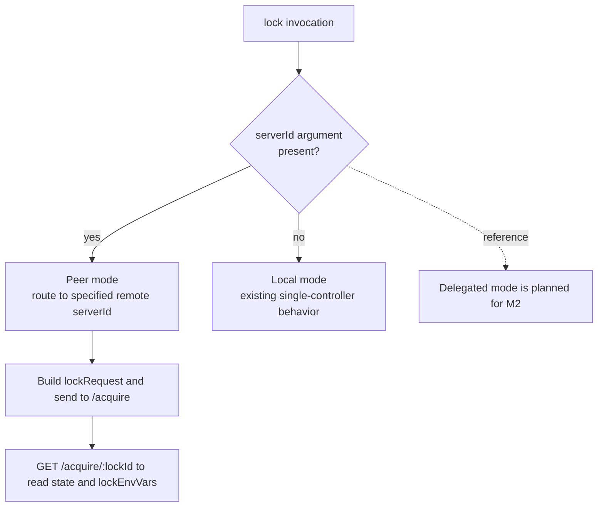
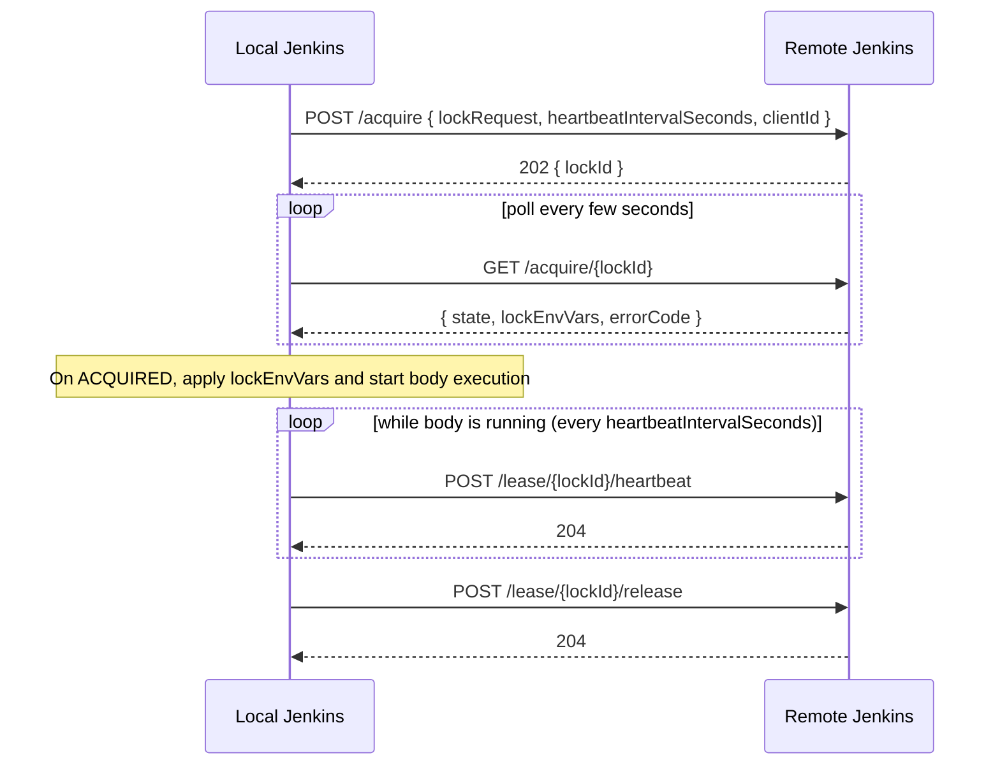
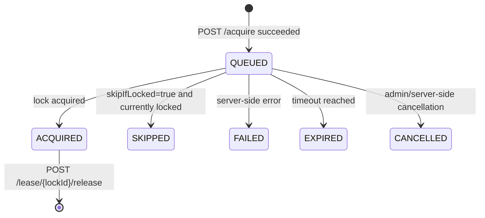
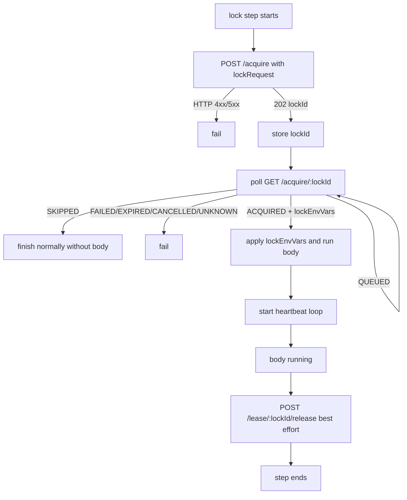
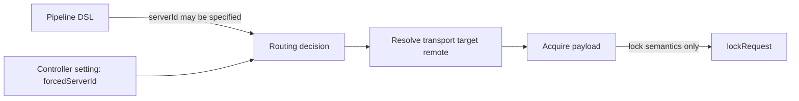
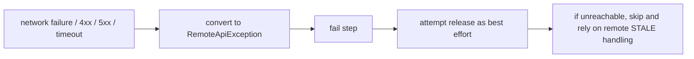

# Remote Lockable Resources Specification (Phase 1 / M1A)

> **Source:** [jenkinsci/lockable-resources-plugin #1025](https://github.com/jenkinsci/lockable-resources-plugin/issues/1025)
> **Design updates reflected:** Removed `cancel` endpoint, unified `requestId`/`leaseId` as `lockId`
> **Scope:** Phase 1 M1A (transparent wrapper for peer mode)

---

## Glossary (for this document)

- `lockRequest`: The lock-semantics payload body sent to the remote server via `POST /acquire`.
  Includes parameters such as `resource`, `label`, `quantity`, `variable`, `skipIfLocked`, `priority`, and `timeoutForAllocateResource`.
- `lockEnvVars`: The environment variable map returned by `GET /acquire/{lockId}` when `state=ACQUIRED`.
  Represents local `lock()`-equivalent expansion such as `LOCKED_RESOURCE`, `LOCKED_RESOURCE0`, and `LOCKED_RESOURCE1`.
- `serverId`: A routing identifier used to select which remote to call. Not included in `lockRequest`.
- `forcedServerId`: A controller-side setting used for delegated routing. Not part of DSL lock semantics.

---

## Table of Contents

1. [Overview and Goals](#1-overview-and-goals)
2. [Operating Modes](#2-operating-modes)
3. [DSL Resolution Rules](#3-dsl-resolution-rules)
4. [REST API Specification](#4-rest-api-specification)
5. [Client Loop](#5-client-loop)
6. [Configuration Surface](#6-configuration-surface)
7. [Heartbeat and STALE Rules](#7-heartbeat-and-stale-rules)
8. [Error Policy (fail-closed)](#8-error-policy-fail-closed)
9. [Scope (In / Out for Phase 1 M1A)](#9-scope-in--out-for-phase-1-m1a)

---

## 1. Overview and Goals

### In One Sentence

A call like `lock(..., serverId: 'B')` is transparently delegated to a remote lock server.
From the pipeline author's perspective, lock semantics remain equivalent to local behavior even when routed remotely.

### Design Constraints

- `{ body }` always runs on the local Jenkins controller.
- The remote Jenkins is the single source of truth for lock state.
- Communication is one-way only: local -> remote (no callback connection from remote).
- Communication failures are handled fail-closed (no automatic unlock by the client).
- Resource existence checks and dynamic-create policy are delegated to the remote server's existing lock algorithm policy.

### Goals (M1A / peer mode)

**M1A implements peer mode only. The remote layer acts as transport, and lock semantics are carried transparently in `lockRequest`.**

| Goal | Details |
|---|---|
| Peer mode | Explicitly target remote with `lock(..., serverId: 'X')` |
| Transparent payload | Send full `lockRequest` via `POST /acquire` |
| Equivalent env expansion | Return local-equivalent env info via `lockEnvVars` from `GET /acquire/{lockId}` |
| Backward compatibility | If `serverId` is not set, existing local mode behavior is unchanged |
| Authentication | Resolve username/password (API token) via `credentialsId` and send Authorization header |

**Planned future extensions (M2+):**
- Delegated mode (transparent routing with `forcedServerId`)
- `GET /resources` and remote view on the B-side page

---

## 2. Operating Modes



### Peer Mode (in M1A)

- The pipeline explicitly specifies `serverId: 'X'`.
- After endpoint selection, lock-semantics parameters are passed as `lockRequest`.
- On `ACQUIRED`, `lockEnvVars` is applied to build a local-equivalent body execution context.

### Delegated Mode (M2+ / out of M1A)

- `forcedServerId` remains a controller-side setting.
- M1A targets peer mode only, and delegated routing is not part of this DSL contract.

---

## 3. DSL Resolution Rules

```text
if lock(..., serverId: 'X') is specified:
  target = (X, lockRequest)      # peer mode

else:
  target = (LOCAL, lockRequest)  # existing behavior
```

### Important Rules

- `serverId` is transport metadata for destination selection.
- `forcedServerId` is an operations setting on the controller.
- Neither is lock semantics; therefore, neither is included in `lockRequest`.

---

## 4. REST API Specification

### Base Path

```text
/lockable-resources/remote/v1/
```

If `remoteApiEnabled = false` (default), all endpoints return 403.

---

### Identifier Unification

- The `lockId` returned by `POST /acquire` is reused for polling, heartbeat, and release.

---

### Endpoint Overview



---

### `POST /acquire`

**Purpose:** Pass `lockRequest` to the remote server's existing lock algorithm.

**Request body:**

```jsonc
{
  "lockRequest": {
    "resource": "board-a1",
    "label": "hw-board",
    "quantity": 2,
    "variable": "LOCKED_RESOURCE",
    "inversePrecedence": false,
    "resourceSelectStrategy": "SEQUENTIAL",
    "skipIfLocked": false,
    "extra": [],
    "priority": 10,
    "timeoutForAllocateResource": 5,
    "timeoutUnit": "MINUTES",
    "reason": "deploy"
  },
  "heartbeatIntervalSeconds": 10,
  "clientId": "https://jenkins-a.example.com/"
}
```

### `lockRequest` Contract

- The full lock-semantics payload accepted by DSL is forwarded transparently.
- `serverId` and `forcedServerId` are routing metadata and are not included.
- The remote server ignores unknown keys (additive extension friendly).
- Resource acquisition/release/queueing/timeout decisions are responsibilities of the remote side's existing lock policy.

**Response:**

| HTTP | Meaning |
|---|---|
| `202 Accepted` | Successfully enqueued. Returns `{ "lockId": "..." }` |
| `400 Bad Request` | Invalid input (for example invalid `timeoutUnit`) |
| `404 Not Found` | Resolution failure such as `UNKNOWN_RESOURCE` |

---

### `GET /acquire/{lockId}`

**Purpose:** Return current acquire state (for polling).

**Response body (QUEUED example):**

```jsonc
{
  "lockId": "...",
  "state": "QUEUED",
  "errorCode": null,
  "message": null,
  "lockEnvVars": null
}
```

**Response body (ACQUIRED example):**

```jsonc
{
  "lockId": "...",
  "state": "ACQUIRED",
  "errorCode": null,
  "message": null,
  "lockEnvVars": {
    "LOCKED_RESOURCE": "resource1 resource2",
    "LOCKED_RESOURCE0": "resource1",
    "LOCKED_RESOURCE1": "resource2"
  }
}
```

### Meaning of `lockEnvVars`

- Returned when `state = ACQUIRED`.
- Matches the environment variable shape injected by local `lock()` execution.
- If `variable` is not set, return `lockEnvVars` as either `null` or an empty object (implementation must choose one and be consistent).

**State list:**



| State | Meaning | Client action |
|---|---|---|
| `QUEUED` | Waiting | Continue polling |
| `ACQUIRED` | Lock acquired | Apply `lockEnvVars` and run body |
| `SKIPPED` | Skipped by `skipIfLocked` | Complete normally without running body |
| `FAILED` | Server-side error | Fail |
| `EXPIRED` | Timed out | Fail |
| `CANCELLED` | Cancelled by server/admin | Fail |
| `UNKNOWN` | Unrecognized response | Fail-closed |

---

### `POST /lease/{lockId}/heartbeat`

**Purpose:** Send liveness signal while body is running.

- Send only while body is running (not during polling-only phase).
- Interval is `heartbeatIntervalSeconds` (Phase 1 default internal constant: 10s).

**Response:** `204 No Content`

---

### `POST /lease/{lockId}/release`

**Purpose:** Release the lease.

- Call on body completion.
- Also call on abort/interruption as best effort.
- **Fail-closed:** on communication failure, remote side handles reclamation via heartbeat timeout and STALE rules.

**Response:** `204 No Content`

---

## 5. Client Loop



**Implementation constants (Phase 1):**

| Item | Value |
|---|---|
| Poll interval | 3 seconds |
| Heartbeat interval | 10 seconds |
| Request timeout | 5 seconds |

---

## 6. Configuration Surface

### Server-side (publishing resources)

| Setting | Default | Description |
|---|---|---|
| `remoteApiEnabled` | `false` | Master switch. All endpoints return 403 while disabled |
| `exposeLabel` | unset | Only resources with this label are exposed (opt-in) |

> In M1A, these are configurable from System settings UI.

### Client-side (initiating remote locks)

| Setting | Description |
|---|---|
| `clientId` | Identity sent to remote server. Uses `Jenkins.getRootUrl()` when blank |
| `remotes[]` | Server connection map (key = `serverId`) |
| `remotes[].url` | Remote Jenkins base URL |
| `remotes[].credentialsId` | Jenkins credentials ID (username/password type) |
| `forcedServerId` | Controller-side delegated mode control value. Routes to this `serverId` when set |

### Design Note (important)



- `forcedServerId` is valid as client-side configuration.
- It is not DSL lock semantics, so it is not included in `lockRequest`.

### B-side LR Page Display

Show remote lock holder in the "Locked by" column on the server-side LR list.

| Condition | Display |
|---|---|
| remote lock with clientId | `Remote: jenkins-a` |
| remote lock without clientId | `Remote: (unknown)` |
| no remote lock | normal display |

### Validation

- If `forcedServerId` is set, it must exist among `remotes` keys at save time.
- Trim leading/trailing spaces in `serverId` (with warning log).

---

## 7. Heartbeat and STALE Rules

### Why send `heartbeatIntervalSeconds` over the wire

In Phase 1, `heartbeatIntervalSeconds` is an internal constant and not user-configurable.
It is still sent in API requests to preserve forward compatibility for future configurability without a version bump.

### Server-side STALE threshold (Phase 1 hardcoded)

```text
staleThresholdSeconds = max(heartbeatIntervalSeconds × 6, 60)
```

- STALE is a state transition, not an automatic unlock action by itself.
- `GET /lease/{lockId}` remains a potential future diagnostics extension.

---

## 8. Error Policy (fail-closed)



**Policy:**

- Never auto-unlock on communication failures (fail-closed).
- After `ACQUIRED`, attempt `release` as best effort.
- Do not log credentials (log only `serverId / method / path / status`).

---

## 9. Scope (In / Out for Phase 1 M1A)

### In Scope (M1A)

| Item | Description |
|---|---|
| DSL | Peer mode via `lock(..., serverId: 'X')` |
| Transparent acquire | Send `lockRequest` via `POST /acquire` |
| Transparent status | Return `lockEnvVars` via `GET /acquire/{lockId}` |
| Client implementation | `RemoteApiClient` (acquire/poll/heartbeat/release) |
| Configuration model | `RemoteConnection` and `forcedServerId` (controller-side control) |
| Authentication | Resolve `credentialsId` and attach Authorization header |
| Error handling | fail-closed, `RemoteApiException` |

### Out of Scope (M1A)

| Item | Notes |
|---|---|
| `GET /resources` and remote view on client LR page | M3 |
| User-configurable polling/heartbeat/timeout | Phase 2 |
| Failover across multiple remotes | Phase 3 |
| Auto-select `serverId: 'any'` | Phase 3 |
| Freestyle project support | Phase 3+ |
| `GET /lease/{lockId}` (diagnostics endpoint) | Candidate after M1A |
| Algorithm changes for acquire/release/queue/timeout behavior | Responsibility of remote side's existing lock policy |
