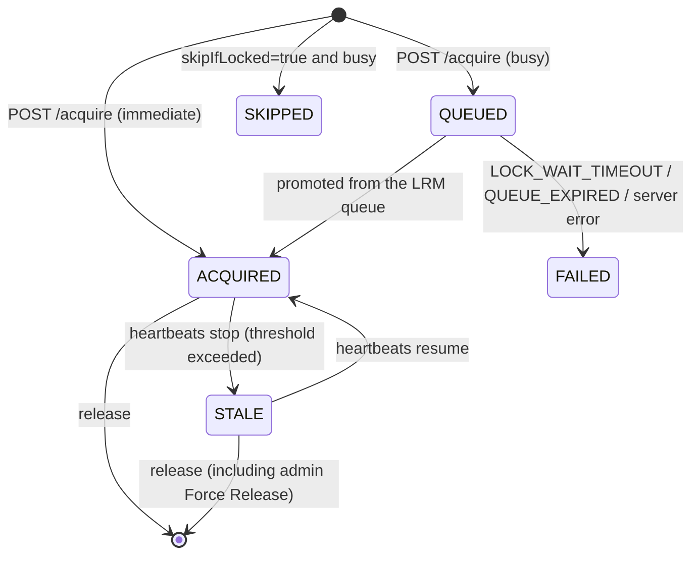

# Remote Lockable Resources Specification (Phase 1 / M1B)

> **Source:** [jenkinsci/lockable-resources-plugin #1025](https://github.com/jenkinsci/lockable-resources-plugin/issues/1025)
> **Prerequisite:** `LRR_DESIGN_P1_M1A.md` (the M1A spec; this document defines the deltas from M1A plus the current truth)
> **Background:** `LRR_REVIEW_P1_M1A.md` (full review on 2026-06-11) which surfaced the critical issues addressed here
> **Scope:** Phase 1 M1B (full transparent equivalence for remote locks)

---

## Table of Contents

1. [M1B Design Philosophy](#1-m1b-design-philosophy)
2. [Decision Record](#2-decision-record)
3. [lockEnvVars Equivalence](#3-lockenvvars-equivalence)
4. [Transparent extra Resource Support](#4-transparent-extra-resource-support)
5. [Unified Queue Bridge (Core Architecture)](#5-unified-queue-bridge-core-architecture)
6. [Client Resilience (heartbeat / poll)](#6-client-resilience-heartbeat--poll)
7. [Restart Semantics (onResume / fail-close)](#7-restart-semantics-onresume--fail-close)
8. [Admin Release of STALE Locks](#8-admin-release-of-stale-locks)
9. [State List (Corrected to Match Implementation)](#9-state-list-corrected-to-match-implementation)
10. [Scope (What M1B Includes / Excludes)](#10-scope-what-m1b-includes--excludes)

---

## 1. M1B Design Philosophy

```text
Apart from "time delay" and "fail-close on network failure", the remote
feature must be fully transparently equivalent to local resources.
The fix policy is not "fall back to safe" but "go all-in on transparent
equivalence".
```

The M1A review surfaced multiple inconsistencies that violated the project's own
core principles of fail-closed behavior and transparent equivalence. M1B resolves
them not by narrowing functionality to a safe subset, but by **fully realizing
equivalence with local `lock()`**.

| Review finding | M1B resolution |
|---|---|
| 3-1 `extra` silently dropped | Implement `extra` fully (instead of rejecting) |
| 3-2 lockEnvVars not equivalent | Unify on comma separator |
| 3-4 missing onResume | Implement QUEUED resume + ACQUIRED cleanup |
| 3-5 no STALE release path | Add admin Force Release UI |
| 4-1 single comm failure kills the build | Poll retry budget + heartbeat warn-and-continue |
| 4-2 queue semantics diverge from local | Bridge into the existing LRM queue |
| 4-3 remote release does not wake local waiters | Solved automatically by the unified queue |

---

## 2. Decision Record

Decisions confirmed after the 2026-06-11 review discussion (details in
`LRR_IMPLEMENTATION_STEPS_P1_M1B.md`):

| # | Topic | Decision |
|---|---|---|
| A | extra | Implement fully in M1B |
| B | heartbeat failure | Warning log only; the job continues. No client-side timeout concept (job timeouts are delegated to Jenkins' standard mechanisms) |
| C | poll failure | Retry through transient failures. Terminate with an error on lockId mismatch (404/410 after a server restart) |
| D | restart recovery | Restart while QUEUED → resume polling. Restart while ACQUIRED → server keeps the lock (fail-close); body behavior is delegated to normal execution |
| E | queue equivalence | Remove `RemoteLockManager`'s independent queue; integrate remote requests into `LockableResourcesManager`'s existing queue (acting as a virtual lock-step instance, peer to local jobs inside the server) |
| F | STALE release | Minimal UI addition (Force Release button) |
| 3-3 | server restart | `remoteLockedBy` stays transient (as designed). Remote locks vanish on a Jenkins restart. Documented as a known constraint under the "resolve before restarting" operational assumption (§7) |

---

## 3. lockEnvVars Equivalence

### Separator (correction from M1A)

Local `lock()` expands `variable` with a **comma separator**
(`String.join(",", ...)` in `LockStepExecution.proceed()`).
The example in M1A spec §4 (space separator) diverged from the local
implementation and is corrected here.

**`lockEnvVars` on ACQUIRED (correct):**

```jsonc
{
  "lockEnvVars": {
    "LOCKED_RESOURCE": "resource1,resource2",   // comma-joined (equivalent to local)
    "LOCKED_RESOURCE0": "resource1",
    "LOCKED_RESOURCE1": "resource2"
  }
}
```

### Known non-equivalence (accepted as of M1B)

- Local also injects resource-property env vars (`VAR0_<PROP>` etc.), which are
  **not** included in remote `lockEnvVars`. **Declared unsupported as of M1B**
  (can be added additively when needed).

---

## 4. Transparent extra Resource Support

### Wire format

The server now actually parses `lockRequest.extra`, which was reserved in M1A.

```jsonc
{
  "lockRequest": {
    "resource": "board-a1",
    "extra": [
      { "resource": "board-a2" },
      { "label": "probe", "quantity": 1 }
    ]
  }
}
```

### Server-side validation

- Each `extra` entry must have either `resource` or `label`. Both null → `400`.
- Resource-based entries **go through the exposeLabel check**
  (an unexposed resource in `extra` → `404 UNKNOWN_RESOURCE`).
- Label-based entries: zero candidates matching exposeLabel → `404 UNKNOWN_LABEL`.

### Atomicity

All resources (main + extra) transition to ACQUIRED **only when every one of
them can be acquired together**. If any is busy, the whole request stays QUEUED
(no partial locks). Release also frees all resources at once.

---

## 5. Unified Queue Bridge (Core Architecture)

### M1A structure (removed)

```text
Remote POST /acquire
    → RemoteLockManager (own ConcurrentHashMap + 1-second tick)
         ↓ tryAcquireQueued() checks resources independently
         ↓ priority / timeout / FIFO unimplemented
    Unrelated to LockableResourcesManager's queue
```

### M1B structure (transparent equivalence)

```text
Remote POST /acquire
    → RemoteLockManager.enqueue()
         → attempt immediate acquisition (skip QUEUED → ACQUIRED if free)
         → if busy, create a RemoteQueueEntry and call
           LockableResourcesManager.queueRemote(entry)
              ↓ priority-sorted alongside queuedContexts (local waiters)
              ↓ proceedNextContext() dispatches local / remote uniformly

Remote POST /lease/{lockId}/release
    → RemoteLockManager.release(lockId)
         → LockableResourcesManager.unlockRemoteResources()
              ↓ free the resources
              ↓ while (proceedNextContext()) → wakes BOTH local and remote waiters
              ↓ scheduleQueueMaintenance()
```

### Dispatch rule

```text
proceedNextContext():
  nextLocal  = getNextQueuedContext()   # next local waiter candidate
  nextRemote = getNextRemoteEntry()     # next remote waiter candidate

  both null → false
  remote.priority > local.priority → dispatch remote
  otherwise (ties included) → dispatch local
```

- **priority** applies uniformly across local and remote (remote priority 10
  beats local priority 0).
- **timeoutForAllocateResource** is checked by `RemoteQueueEntry.isTimedOut()`;
  on expiry the record transitions to `FAILED` (errorCode: `LOCK_WAIT_TIMEOUT`).
- A remote release **immediately wakes local waiters** (resolves review finding 4-3).

### RemoteQueueEntry

A remote-side mirror of `QueuedContextStruct` (local waiters):

| Field | Role |
|---|---|
| `record` | The `RemoteLockRecord` callback target |
| `priority` | From `lockRequest.priority` |
| `timeoutDeadlineMillis` | Computed from `timeoutForAllocateResource` + `timeoutUnit` |
| `onAcquired(names)` | Calls `record.markAcquired()` (including lockEnvVars generation) |
| `onTimeout()` | Calls `record.markFailed("LOCK_WAIT_TIMEOUT")` |

`remoteQueueEntries` is transient (lost on Jenkins restart). This matches the
lifecycle of remote locks themselves (`remoteLockedBy`) and stays consistent (§7).

---

## 6. Client Resilience (heartbeat / poll)

### Heartbeat failure = warning only (decision B)

```text
Heartbeat failure during body execution:
  → WARNING log only. The job continues.
  → finishRemoteFailure() is NOT called.
```

- A multi-hour HW test (UC-1) no longer dies from a few seconds of network blip.
- The server keeps the lock (fail-close), so safety is not compromised.
- If heartbeats stay absent long enough, the server transitions the lease to
  STALE (subject to admin release, §8).
- No client-side timeout is introduced. Whole-job timeouts are delegated to
  Jenkins' standard timeout mechanisms (job/stage timeout).

### Poll failure = retry budget (decision C)

```text
Communication failure while polling (QUEUED):
  → increment consecutivePollFailures
  → below threshold (20 ≈ 60s, matching the STALE threshold): WARNING log, keep retrying
  → threshold reached: terminate with an error

HTTP 404 / 410 received:
  → interpreted as lockId mismatch after a server restart; terminate immediately
    with an error (no retry)
```

| Failure | Client behavior |
|---|---|
| Transient outage (while polling) | Retry for up to ~60 seconds |
| Server restart (while polling) | Detect 404/410, terminate immediately |
| Transient outage (during body) | Heartbeat warning only, job continues |
| Successful poll | Counter resets |

### QUEUED expiry via poll liveness (M1B follow-up, review finding 4-4)

On the server, `GET /acquire/{lockId}` itself acts as the liveness signal for
QUEUED records:

```text
GET /acquire/{lockId} received → update record.lastPolledAt
Periodic scan (1-second tick):
  QUEUED and no poll within the expiry window (= STALE threshold, 60s)
    → FAILED (errorCode: QUEUE_EXPIRED) + removed from the LRM queue
```

- **Consistent with fail-close**: STALE is never auto-released because it
  *holds a resource*. A QUEUED record holds no resource — only a queue slot —
  so automatic expiry is safe.
- The window equals the client's poll retry budget (~60s), so "the server
  gives up" never precedes "the client gives up".
- Expiry is serialized against queue promotion via `syncResources`, so an
  entry cannot be promoted and expired concurrently (eliminates a race of the
  same shape as review finding 4-5).
- No client changes: a poll arriving after expiry sees `FAILED` +
  `QUEUE_EXPIRED` (or 404 after the terminal TTL) and terminates per the
  existing rules.
- Known residue: if the resource frees up within the ~60s between client death
  and expiry, an unattended ACQUIRED can appear; it is recovered via STALE
  (60s later) → admin Force Release.
- The expiry window is overridable via the system property
  `org.jenkins.plugins.lockableresources.remote.RemoteLockManager.queuePollExpiryMs`
  (for tests).

---

## 7. Restart Semantics (onResume / fail-close)

### Server (B) restart — known constraint

- `LockableResource.remoteLockedBy` is **transient** (by design).
- A Jenkins restart on B **erases all remote locks**.
- This is a **known Phase 1 constraint**, predicated on the operational rule
  that restarts happen only while no resources are remote-locked.
- After a restart, polls against old lockIds return 404 and the client
  terminates with an error per §6 (no silent mutual-exclusion violation).

### Client (A) restart — onResume (decision D)

`LockStepExecution.onResume()` implemented:

| State at restart | Behavior after restart |
|---|---|
| QUEUED (`remoteLockId` set, body not started) | Re-arm and resume the polling loop. The server still holds the queue entry, so state stays consistent |
| ACQUIRED (body started) | The body was already interrupted by Jenkins. Call `releaseRemoteLockBestEffort()` to free the server-side lease, then fail the step with an AbortException |
| Not remote (local lock) | Do nothing (local flow recovers via existing persistence) |

---

## 8. Admin Release of STALE Locks

### Path

Adds an admin release path to the resource list page (`LockableResourcesRootAction`):

- Resources with `remoteLockedBy != null` show a **Force Release Remote Lock**
  button (visible only with the `UNLOCK` permission).
- Endpoint: `POST /lockable-resources/releaseRemoteLock?resource=<name>`
- Internally: `RemoteLockManager.release(lockId)` →
  `unlockRemoteResources()` → wakes waiters (both local and remote).

### Relation to fail-close

```text
heartbeats stop → STALE transition (no automatic release)
    → admin reviews the situation and clicks Force Release
        → resource freed, waiters proceed immediately
```

STALE is the visualization of "cannot be released automatically and safely";
the release decision is delegated to a human (the admin). This completes the
fail-close design.

### Dedicated permission: RemoteUse (M1B follow-up, review finding 5-1)

All four remote API endpoints (acquire / poll / heartbeat / release) require
the dedicated **Lockable Resources / RemoteUse** permission instead of
`Jenkins.READ`:

- `REMOTE` (display name RemoteUse) joins the plugin's existing
  PermissionGroup (alongside UNLOCK / RESERVE / STEAL / VIEW / QUEUE / CONFIGURE).
- Implied by `ADMINISTER`, so small setups using an admin token keep working
  with no configuration change.
- Under Matrix Authorization etc., grant it explicitly to the machine users
  whose API tokens remote client controllers use as `credentialsId` — making
  **remote clients auditable in the authorization matrix**.
- Unprivileged access gets 403 (consistent with the 403 returned while
  `remoteApiEnabled=false`).
- Granularity: one permission for all four endpoints (a remote client always
  uses all of them; splitting would only invite misconfiguration).

---

## 9. State List (Corrected to Match Implementation)

The `EXPIRED` / `CANCELLED` states in the M1A spec's state diagram **do not
exist in the implementation**. The implementation-accurate states are these five:



| state | Meaning | Client behavior |
|---|---|---|
| `QUEUED` | Waiting in the LRM queue | Keep polling |
| `ACQUIRED` | Lock held | Apply `lockEnvVars` and run the body |
| `SKIPPED` | Skipped via skipIfLocked | Finish normally without running the body |
| `FAILED` | Acquisition failed (including timeout) | Terminate with the `errorCode` |
| `STALE` | Heartbeats stopped; pending admin review | (Server-internal state. The client keeps operating as for ACQUIRED) |

Timeouts (`timeoutForAllocateResource` exceeded) are expressed as `FAILED` +
`errorCode: "LOCK_WAIT_TIMEOUT"` (no `EXPIRED` state). Expiry caused by the
client ceasing to poll is `FAILED` + `errorCode: "QUEUE_EXPIRED"` (§6).

---

## 10. Scope (What M1B Includes / Excludes)

### Included (M1B)

| Item | Content |
|---|---|
| lockEnvVars equivalence | Comma separator (identical to local) |
| extra | Server-side parsing + exposeLabel checks + atomic acquisition |
| Unified queue | LRM queue bridge via `RemoteQueueEntry`. priority / timeout / FIFO / waiter wake-up unified with local |
| Poll retry | Up to 20 consecutive failures (~60s). 404/410 → immediate error |
| Heartbeat resilience | Failures are warnings only; the job continues |
| onResume | QUEUED resume / ACQUIRED cleanup |
| STALE admin release | Force Release UI + endpoint |
| Restart constraint documentation | Rationale and operational assumption for the transient design (§7) |
| QUEUED poll-liveness expiry [follow-up] | QUEUE_EXPIRED after 60s without GET polls (review 4-4) |
| Dedicated permission [follow-up] | RemoteUse permission gates the remote API (review 5-1) |
| forcedServerId validation [follow-up] | doCheckForcedServerId + save-time warning (drift #4, recovers Step 1-d) |

### Excluded (out of M1B scope)

| Item | Note |
|---|---|
| Propagating resource-property env vars (`VAR0_<PROP>`) | Declared unsupported (additive extension candidate) |
| Persisting `remoteLockedBy` | Transient in Phase 1; mitigated operationally |
| `GET /resources` remote view | M3 |
| User-configurable polling/heartbeat intervals | Phase 2 |

---

## Revision History

- 2026-06-12: Initial version. Defines the M1B (transparent equivalence) design
  based on the M1A review (`LRR_REVIEW_P1_M1A.md`) and the 2026-06-11 decisions.
  Corrected the state list to match the implementation.
- 2026-06-12: M1B follow-up reflected. Moved QUEUED poll-liveness expiry
  (QUEUE_EXPIRED, §6), the dedicated RemoteUse permission (§8), and
  forcedServerId validation (drift #4 recovered) into the included scope.
