# E2E テスト仕様（統合版）

この文書は `dev/jenkins-env/run-e2e.sh` が実行する E2E テストの設計・仕様を定義します。

> **統合について:** 本書は旧 `E2E_TEST_SPECIFICATION_P1_M1.md` / `_P1_M1A.md` /
> `_P1_M1B.md` の 3 文書を統合したものです（2026-06-12）。各テスト項目には
> 導入マイルストーン（**P1M1** / **P1M1A** / **P1M1B**）を付記しています。

---

## 目的

lockable-resources-plugin の remote lock 機能について、次を自動検証します。

| # | 検証内容 | 導入 |
|---|---|---|
| 1 | remote lock の取得・待機・解放という基本ライフサイクルが成立すること | P1M1 |
| 2 | issue #1025 の「独立した一方通行リレーの組み合わせ」モデルの各接続パターンが実環境相当で成立すること | P1M1 |
| 3 | ローカルロックとリモートロックが同一リソース上で正しく排他されること | P1M1 |
| 4 | remote API 障害時に lock を自動解放せず fail-closed で失敗すること | P1M1 |
| 5 | jenkins-d を加えた 4 コントローラー構成での拡張接続トポロジーが成立すること | P1M1 |
| 6 | 実行結果とコンソールログを再現可能な形で保存できること | P1M1 |
| 7 | 透過 lockRequest payload（`label` / `quantity` / `variable` / `skipIfLocked` のサーバー側解釈） | P1M1A |
| 8 | lockEnvVars の local `lock()` 等価展開（`$V`, `${V}0`, `${V}1`） | P1M1A |
| 9 | forcedServerId delegated mode（`serverId` なし DSL の透過委譲） | P1M1A |
| 10 | extra アトミック取得（main + extra が単一 lease で取得・解放） | P1M1B |
| 11 | heartbeat 耐性（失敗してもジョブ継続、完了後に正常 release） | P1M1B |
| 12 | 統一キュー priority（remote 待機者の priority が local 待機者と横断で効く） | P1M1B |
| 13 | STALE 管理者解放（STALE 遷移 → fail-close 保持 → Force Release → 待機者起床） | P1M1B |

---

## テスト体系

### シナリオ一覧

| ID | スクリプト名 | 接続モデル / 検証機能 | 主な検証ポイント | 必要コントローラー | 対象 |
|---|---|---|---|---|---|
| S01 | `mutual-peer` | A→B かつ B→A（相互共有） | 独立一方通行リレーが干渉なく並走 | a, b | P1M1 |
| S02 | `fan-in-contention` | A→B, C→B（同一リソース競合） | キュー動作・QUEUED 状態遷移 | a, b, c | P1M1 |
| S03 | `server-self-use` | B ローカル保持中に A がリモート取得 | ローカルロックとリモートロックの排他 | a, b | P1M1 |
| S04 | `mixed-local-remote` | A が local + B remote を同一パイプラインで保持 | ネストされた local+remote の同時保持 | a, b | P1M1 |
| S05 | `skip-if-locked` | B ローカル保持中に A が skipIfLocked でリモート取得 | skipIfLocked リモート経路 | a, b | P1M1 |
| S06 | `three-way-mesh` | A→B, B→C, C→A（3 者間全リレー） | 3 リレー並走・phantom lock なし | a, b, c | P1M1 |
| S07 | `fail-closed` | A→B（障害注入） | 通信失敗・認証失敗で body 未実行 | a, b | P1M1 |
| S08 | `label-env-vars` | label 指定取得 + variable 展開 | label-based 取得 + lockEnvVars 等価展開 | a, b | P1M1A |
| S09 | `delegated-mode` | forcedServerId による委譲 | `serverId` なし DSL の透過委譲と復帰 | a, b | P1M1A |
| S10 | `extra-resources` | extra アトミック取得 | 同一 lockId での複数リソース取得・カンマ結合変数 | a, b | P1M1B |
| S11 | `heartbeat-resilience` | heartbeat 障害注入 | heartbeat 失敗時のジョブ継続 | a, b | P1M1B |
| S12 | `priority-ordering` | local/remote priority 競合 | 統一キューの priority ディスパッチ | a, b | P1M1B |
| S13 | `stale-admin-release` | ghost lease → STALE → 管理者解放 | STALE 遷移・fail-close 保持・Force Release | b | P1M1B |
| D01 | `fan-in-4` | A, B, C が D のリソースを競合取得 | 4 クライアント→1 サーバー キュー安定性 | a, b, c, d | P1M1 |
| D02 | `chain-4` | A→B, B→C, C→D（独立チェーン） | n 個の一方通行リレー並走 | a, b, c, d | P1M1 |
| D03 | `diamond` | A→(B+C), B→D, C→D（菱形依存） | 間接共有依存での deadlock 非発生 | a, b, c, d | P1M1 |

**歴史的経緯**: 初期の `peer-basic` シナリオは S01/S02 に包含され廃止。旧 `fail-closed` は S07 として引き継ぎ。

### シナリオ詳細図（Mermaid）

#### S01 mutual-peer 【P1M1】

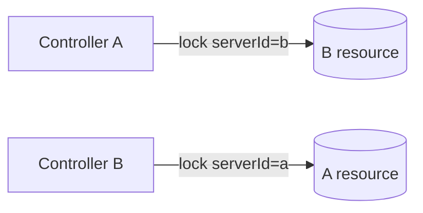

#### S02 fan-in-contention 【P1M1】

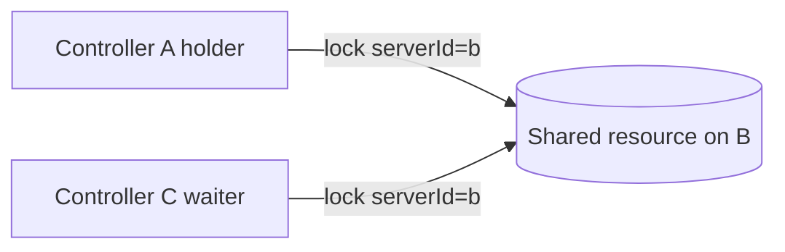

#### S03 server-self-use 【P1M1】

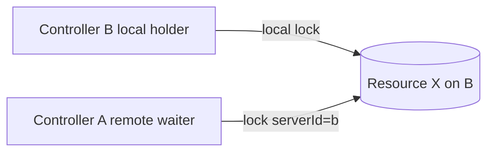

#### S04 mixed-local-remote 【P1M1】

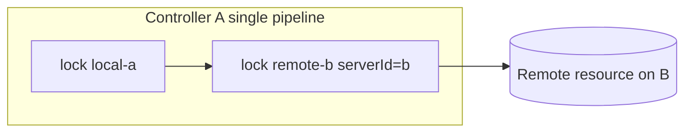

#### S05 skip-if-locked 【P1M1】

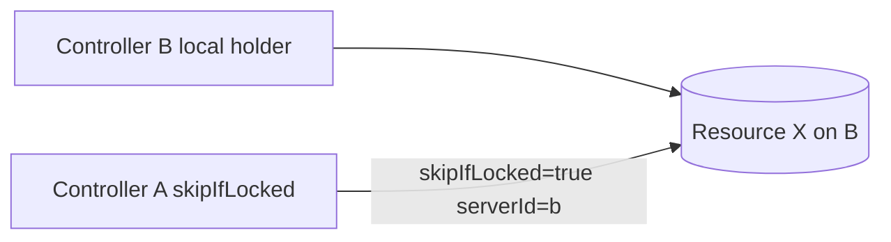

#### S06 three-way-mesh 【P1M1】

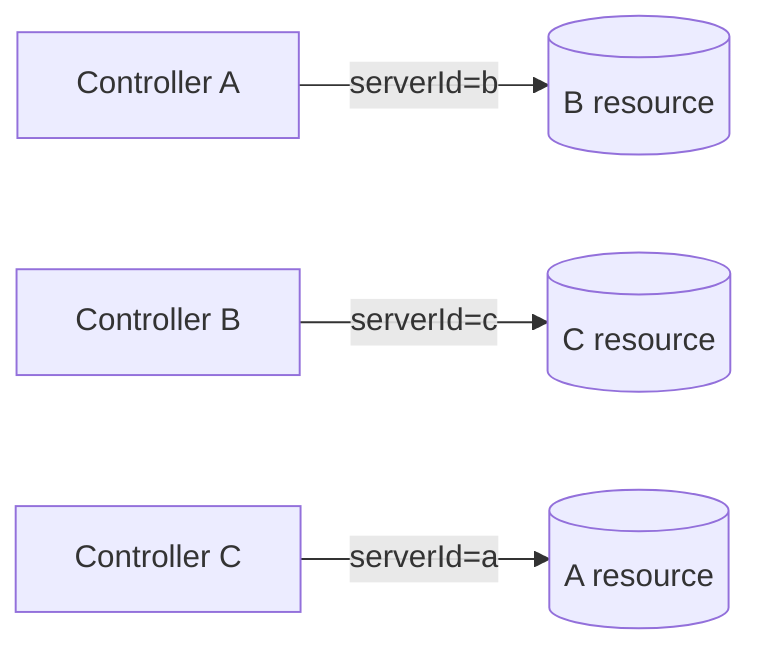

#### S07 fail-closed 【P1M1】

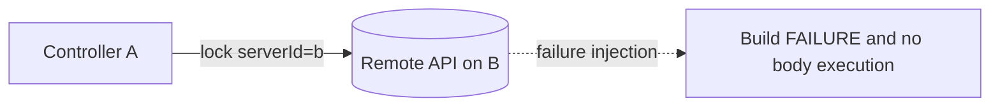

#### S08 label-env-vars 【P1M1A】

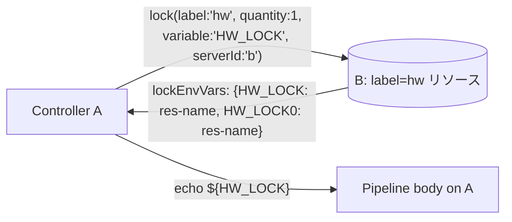

#### S09 delegated-mode 【P1M1A】

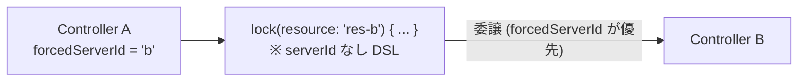

#### S10 extra-resources 【P1M1B】

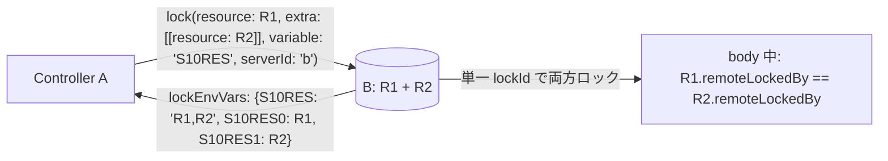

#### S11 heartbeat-resilience 【P1M1B】

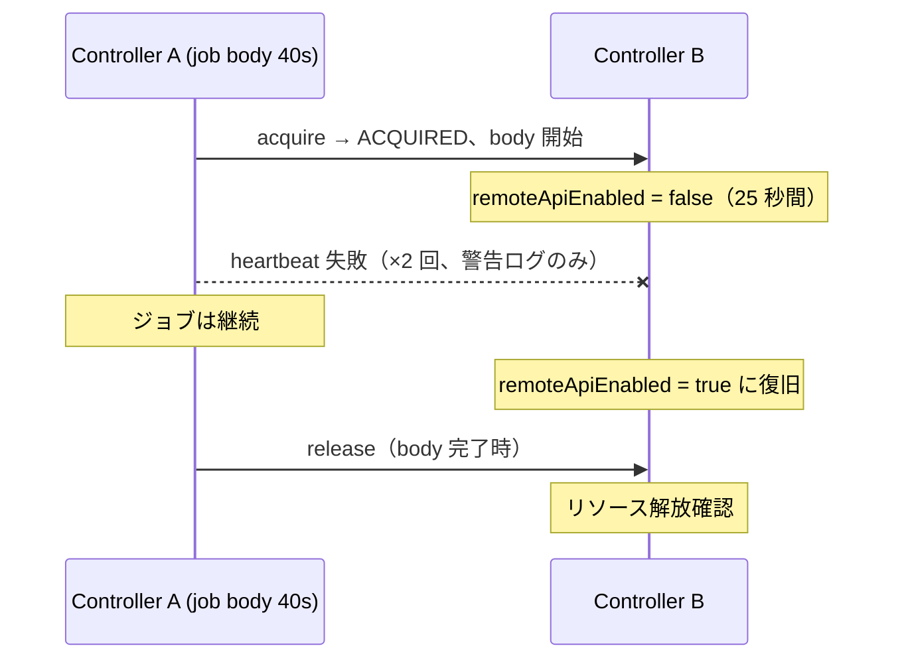

#### S12 priority-ordering 【P1M1B】

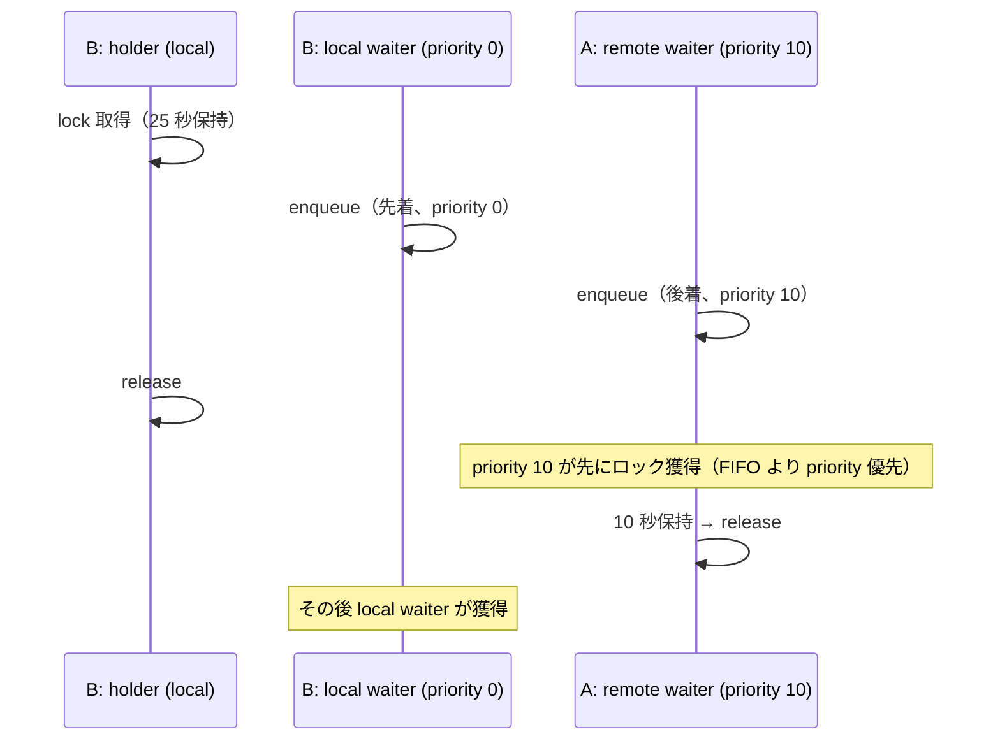

#### S13 stale-admin-release 【P1M1B】

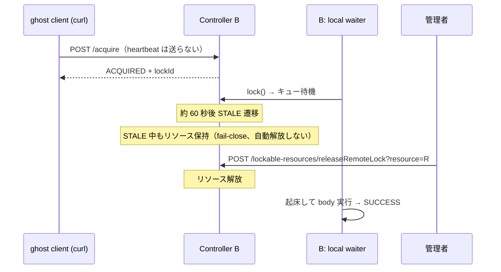

#### D01 fan-in-4 【P1M1】

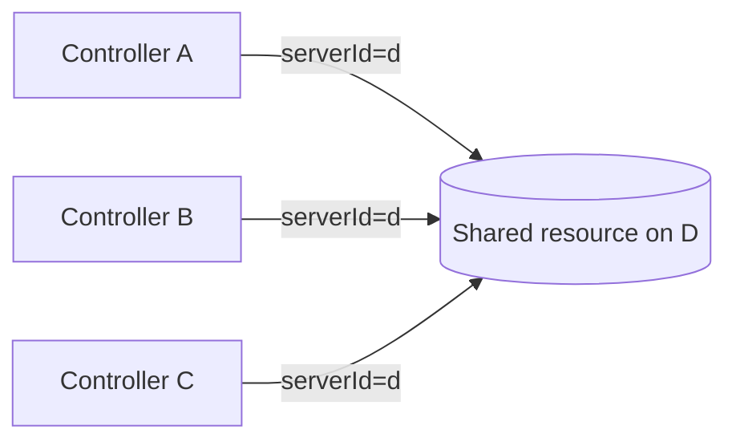

#### D02 chain-4 【P1M1】

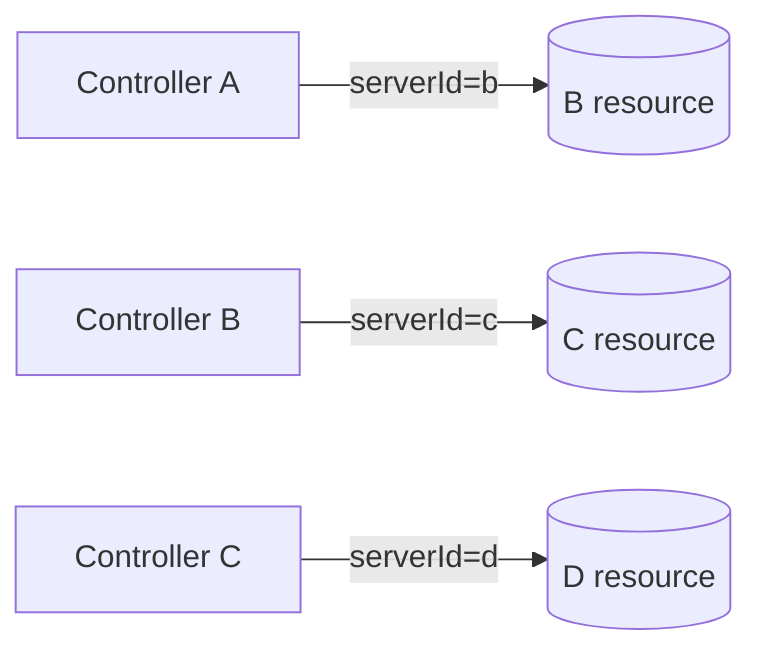

#### D03 diamond 【P1M1】

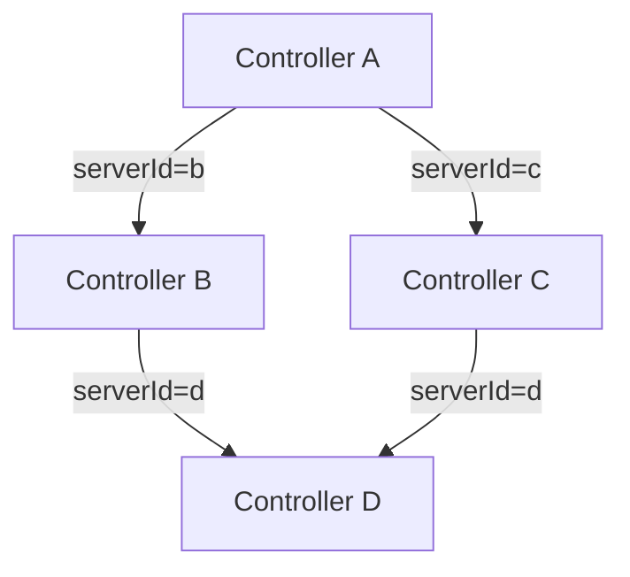

---

## 実行環境

### 4 コントローラー構成

| サービス名 | コンテナ名 | ホスト公開ポート | コンテナ内部 URL | jenkins home |
|---|---|---|---|---|
| `jenkins-a` | `lrr-jenkins-a` | 8081 | `http://jenkins-a:8080/jenkins` | `jha/` |
| `jenkins-b` | `lrr-jenkins-b` | 8082 | `http://jenkins-b:8080/jenkins` | `jhb/` |
| `jenkins-c` | `lrr-jenkins-c` | 8083 | `http://jenkins-c:8080/jenkins` | `jhc/` |
| `jenkins-d` | `lrr-jenkins-d` | 8084 | `http://jenkins-d:8080/jenkins` | `jhd/` |

S シリーズは a/b/c の 3 台、D シリーズは d を加えた 4 台を使用します。
D シリーズはシナリオ開始前に jenkins-d の起動を確認し、未起動なら SKIP（exit 10）。

### common.sh 主要ヘルパー

```
configure_remote_server(base_url, resource_name, label, auth_mode)
  → 任意 controller の remoteApiEnabled/exposeLabel/resource を設定する

configure_local_resource(base_url, resource_name)
  → remote expose なし・serverId なしのローカル専用リソースを作成する

wait_for_controllers_with_d(timeout_seconds)
  → a/b/c/d の 4 台分ヘルスチェック（D シリーズ専用）

configure_forced_server_id(base_url, forced_server_id)          # P1M1A 追加
  → Controller の forcedServerId を設定する

configure_forced_server_id_empty(base_url)                       # P1M1A 追加
  → forcedServerId を空文字（無効化）に戻す

configure_label_resource(base_url, resource_name, label_name)    # P1M1A 追加
  → resource を作成し、exposeLabel と一致するラベル + 任意ラベルを付与する
```

### 必須コマンド

- `curl`
- `docker`
- `python3`
- `base64`

### run-e2e.sh オプション

```
--skip-start          start.sh を呼ばずに既存環境で実行する
--clean-start         start.sh --clean で Jenkins home を初期化してから実行する
--only <name>         単一シナリオまたはグループのみ実行する。指定可能値:
                        mutual-peer | fan-in-contention | server-self-use |
                        mixed-local-remote | skip-if-locked | three-way-mesh |
                        fail-closed | label-env-vars | delegated-mode |
                        extra-resources | heartbeat-resilience |
                        priority-ordering | stale-admin-release |
                        fan-in-4 | chain-4 | diamond |
                        s-series | m1a-series | m1b-series | d-series | all
-h, --help            ヘルプを表示する
```

| グループ | 内容 |
|---|---|
| `s-series` | S01〜S07（P1M1） |
| `m1a-series` | S08〜S09（P1M1A） |
| `m1b-series` | S10〜S13（P1M1B） |
| `d-series` | D01〜D03（P1M1。jenkins-d が起動済みであること） |
| `all` | S01〜S13 + D01〜D03 |

### 実行順序（all）

```
S01 → S02 → S03 → S04 → S05 → S06 → S07 → S08 → S09 → S10 → S11 → S12 → S13 → D01 → D02 → D03
```

---

## 共通設定規約

### リソース命名

E2E 実行ごとに同一の Jenkins home を使い回すため、
リソース名にはシナリオ名プレフィックスと `$(date +%s)` のタイムスタンプを付与します。
（`--skip-start` のコンテナ再利用でも前回実行と干渉しない）

```
<prefix>-<timestamp>

例:
  s01-board-a-1748000000   ← S01 で A が公開するリソース
  s10-res1-1781234567      ← S10 の main リソース
```

### exposeLabel

各コントローラーが remote API で公開するリソースには `remote-enabled` ラベルを付与します。
ローカル専用リソースには `local-only` ラベルを付与して区別します。
S08 以降の label-based シナリオでは、公開ラベル（`remote-enabled` 等）に加えて
検索対象ラベル（`hw` 等）を同時に付与します。

### パイプライン記法（P1M1B からの教訓）

**label-only や extra 付きの lock() は scripted pipeline（`node { }`）で記述する。**
Declarative の `steps` ブロックはコンパイル時に `@DataBoundConstructor` の
`resource` 引数を必須扱いするため（upstream 既知問題 JENKINS-50260）、
`lock(label:...)` だけだと `Missing required parameter: "resource"` で失敗する。
Declarative を使う場合は `resource: null` を明示する（S08 で実際に踏んだ）。

### credentials 命名規約

| シナリオ | credentials ID | 配置先 | 内容 | 対象 |
|---|---|---|---|---|
| S01 A→B | `s01-a-for-b` | A | B の admin API トークン | P1M1 |
| S01 B→A | `s01-b-for-a` | B | A の admin API トークン | P1M1 |
| S02 A/C→B | `s02-for-b` | A, C | B の admin API トークン（同 ID・同値） | P1M1 |
| S03 A→B | `s03-a-for-b` | A | B の admin API トークン | P1M1 |
| S04 A→B | `s04-a-for-b` | A | B の admin API トークン | P1M1 |
| S05 A→B | `s05-a-for-b` | A | B の admin API トークン | P1M1 |
| S06 A→B | `s06-a-for-b` | A | B の admin API トークン | P1M1 |
| S06 B→C | `s06-b-for-c` | B | C の admin API トークン | P1M1 |
| S06 C→A | `s06-c-for-a` | C | A の admin API トークン | P1M1 |
| S07 有効 | `s07-valid-creds` | A | B の admin API トークン | P1M1 |
| S07 認証失敗 | `s07-invalid-auth-creds` | A | `admin/not-a-valid-api-token` | P1M1 |
| S07 ID 欠落 | `s07-missing-creds` | （未作成） | 存在しない ID を指定 | P1M1 |
| S07 型不一致 | `s07-type-mismatch-creds` | A | StringCredentialsImpl | P1M1 |
| S08 A→B | `s08-a-for-b` | A | B の admin API トークン | P1M1A |
| S09 A→B | `s09-a-for-b` | A | B の admin API トークン | P1M1A |
| S10 A→B | `s10-a-for-b` | A | B の admin API トークン | P1M1B |
| S11 A→B | `s11-a-for-b` | A | B の admin API トークン | P1M1B |
| S12 A→B | `s12-a-for-b` | A | B の admin API トークン | P1M1B |
| S13 (curl 直叩き) | なし（API トークンを直接使用） | - | B の admin API トークン | P1M1B |
| D01 A,B,C→D | `d01-for-d` | A, B, C | D の admin API トークン | P1M1 |
| D02 A→B | `d02-a-for-b` | A | B の admin API トークン | P1M1 |
| D02 B→C | `d02-b-for-c` | B | C の admin API トークン | P1M1 |
| D02 C→D | `d02-c-for-d` | C | D の admin API トークン | P1M1 |
| D03 A→B | `d03-a-for-b` | A | B の admin API トークン | P1M1 |
| D03 A→C | `d03-a-for-c` | A | C の admin API トークン | P1M1 |
| D03 B→D | `d03-b-for-d` | B | D の admin API トークン | P1M1 |
| D03 C→D | `d03-c-for-d` | C | D の admin API トークン | P1M1 |

---

## S01: mutual-peer — 相互 peer 共有 【P1M1】

### テスト意図

A→B リレー（A がクライアント、B がサーバー）と B→A リレー（B がクライアント、A がサーバー）が
同時に独立して成立することを確認します。

issue #1025 の「独立した一方通行リレーの組み合わせによる相互共有」の最も基本的なケースです。

```
A pipeline:  lock(resource: '<A_RES>', serverId: 'b') { sleep 20s }   # A→B リレー
B pipeline:  lock(resource: '<B_RES>', serverId: 'a') { sleep 20s }   # B→A リレー
（同時起動）
```

### 前提条件

- **Controller A**: `remoteApiEnabled=true`, `exposeLabel=remote-enabled`, A リソース公開
- **Controller B**: `remoteApiEnabled=true`, `exposeLabel=remote-enabled`, B リソース公開
- **A 側 credentials** (`s01-a-for-b`): A に作成、B の admin API トークン
- **B 側 credentials** (`s01-b-for-a`): B に作成、A の admin API トークン
- **A の remote 設定**: `remotes[a→b]` = B の internal URL + `s01-a-for-b`
- **B の remote 設定**: `remotes[b→a]` = A の internal URL + `s01-b-for-a`

### パイプライン構成

| job 名 | controller | 内容 |
|---|---|---|
| `s01-a-holder` | A | `lock(resource: A公開リソース, serverId: 'b')` で 20 秒 sleep |
| `s01-b-holder` | B | `lock(resource: B公開リソース, serverId: 'a')` で 20 秒 sleep |

### 検証基準

| ID | 検証項目 | 期待値 |
|---|---|---|
| CP01 | `s01-a-holder` の build 結果 | `SUCCESS` |
| CP02 | `s01-b-holder` の build 結果 | `SUCCESS` |
| CP03 | A コンソールに `A_ACQUIRED` が出ること | `true` |
| CP04 | B コンソールに `B_ACQUIRED` が出ること | `true` |
| CP05 | A コンソールに `Remote lock acquired on` が出ること | `true`（WARN 扱い） |
| CP06 | B コンソールに `Remote lock acquired on` が出ること | `true`（WARN 扱い） |
| CP07 | 両ビルドが互いに待機せず並走したこと（合計所要時間 < 40 秒） | `true` |

CP07 は「A と B のリレーが独立していること」の傍証です。

### 出力ファイル

```
reports/<runId>-e2e-test/mutual-peer/a-console.txt
reports/<runId>-e2e-test/mutual-peer/b-console.txt
reports/<runId>-e2e-test/mutual-peer/summary.txt
reports/<runId>-e2e-test/mutual-peer/scenario-details.md
```

---

## S02: fan-in-contention — 複数クライアントの同一リソース競合 【P1M1】

### テスト意図

A と C が同じ B のリソースを同時に取得しようとするとき、
キューが正しく動作すること（片方が QUEUED 状態を経由して順に取得すること）を確認します。

```
A pipeline:  lock(resource: '<SHARED>', serverId: 'b') { sleep 25s }   # 先取得
C pipeline:  lock(resource: '<SHARED>', serverId: 'b') { sleep 5s  }   # 待機 → 後取得
（A 起動後すぐに C を起動）
```

### 前提条件

- **Controller B**: `remoteApiEnabled=true`, `exposeLabel=remote-enabled`, 共有リソース 1 個
- **A 側 credentials** (`s02-for-b`): B の admin API トークン（A に作成）
- **C 側 credentials** (`s02-for-b`): 同 ID・同値（C に作成）
- **A の remote 設定**: `remotes[a→b]`
- **C の remote 設定**: `remotes[c→b]`

### パイプライン構成

| job 名 | controller | 内容 |
|---|---|---|
| `s02-holder` | A | 共有リソースを 25 秒保持 |
| `s02-waiter` | C | 共有リソースを取得後 5 秒保持 |

### 検証基準

| ID | 検証項目 | 期待値 |
|---|---|---|
| CP01 | `s02-holder` の build 結果 | `SUCCESS` |
| CP02 | `s02-waiter` の build 結果 | `SUCCESS` |
| CP03 | A コンソールに `HOLDER_ACQUIRED` | `true` |
| CP04 | C コンソールに `WAITER_ACQUIRED` | `true` |
| CP05 | C の waiter 所要時間 ≥ 15 秒 | `true`（holder 保持中に待機したことの確認） |

### 出力ファイル

```
reports/<runId>-e2e-test/fan-in-contention/holder-console.txt
reports/<runId>-e2e-test/fan-in-contention/waiter-console.txt
reports/<runId>-e2e-test/fan-in-contention/summary.txt
reports/<runId>-e2e-test/fan-in-contention/scenario-details.md
```

---

## S03: server-self-use — サーバーがローカル保持中にリモートクライアントが競合 【P1M1】

### テスト意図

B の pipeline がリソース X をローカルロック（`lock(resource: X)`、`serverId` なし）で保持している間、
A が同じリソース X をリモート経由（`lock(resource: X, serverId: 'b')`）で取得しようとするとき、
`remoteLockedBy` と `isLocked()` が正しく排他されることを確認します。

「サーバー側のローカルロックとリモートロックが同一リソースで排他できるか」を検証する
最重要シナリオです。plugin 側の実装不備があればここで検出できます。

```
B pipeline (local):   lock(resource: X) { sleep 30s }          # ローカルで保持
A pipeline (remote):  lock(resource: X, serverId: 'b') { ... }  # リモートで取得を試みる
（B local 起動後すぐに A を起動）
```

### 前提条件

- **Controller B**: `remoteApiEnabled=true`, `exposeLabel=remote-enabled`, リソース X を公開
  （B の pipeline は serverId なしでも同じ X を lock できます）
- **A 側 credentials** (`s03-a-for-b`): A に作成、B の admin API トークン
- **A の remote 設定**: `remotes[a→b]`

### パイプライン構成

| job 名 | controller | 内容 |
|---|---|---|
| `s03-local-holder` | B | リソース X を `lock(resource: X)` でローカル保持（30 秒） |
| `s03-remote-waiter` | A | リソース X を `lock(resource: X, serverId: 'b')` でリモート取得 |

### 検証基準

| ID | 検証項目 | 期待値 |
|---|---|---|
| CP01 | `s03-local-holder` の build 結果 | `SUCCESS` |
| CP02 | `s03-remote-waiter` の build 結果 | `SUCCESS` |
| CP03 | B コンソールに `LOCAL_HOLDER_ACQUIRED` | `true` |
| CP04 | A コンソールに `REMOTE_WAITER_ACQUIRED` | `true` |
| CP05 | A の remote waiter 所要時間 ≥ 20 秒 | `true`（B local hold 中に A が待機したことの確認） |

### 出力ファイル

```
reports/<runId>-e2e-test/server-self-use/local-holder-console.txt
reports/<runId>-e2e-test/server-self-use/remote-waiter-console.txt
reports/<runId>-e2e-test/server-self-use/summary.txt
reports/<runId>-e2e-test/server-self-use/scenario-details.md
```

---

## S04: mixed-local-remote — ローカルリソースとリモートリソースの同時保持 【P1M1】

### テスト意図

同一パイプライン内で A 自身のローカルリソースと B のリモートリソースを
ネストした `lock()` で同時保持できることを確認します。
また、両方のリソースが解放されることも確認します。

```
A pipeline:
  lock(resource: 'local-a-<ts>') {                       # A のローカルリソース
    lock(resource: 'remote-b-<ts>', serverId: 'b') {     # B のリモートリソース
      echo "BOTH_ACQUIRED"
    }
  }
```

### 前提条件

- **Controller A**: ローカル専用リソース `s04-local-a-<timestamp>` を作成（exposeLabel なし）
- **Controller B**: `remoteApiEnabled=true`, `exposeLabel=remote-enabled`, `s04-remote-b-<timestamp>` を公開
- **A 側 credentials** (`s04-a-for-b`): B の admin API トークン
- **A の remote 設定**: `remotes[a→b]`

### パイプライン構成

| job 名 | controller | 内容 |
|---|---|---|
| `s04-mixed-lock` | A | `lock(local-a) { lock(remote-b, serverId:'b') { echo BOTH_ACQUIRED } }` |

### 検証基準

| ID | 検証項目 | 期待値 |
|---|---|---|
| CP01 | `s04-mixed-lock` の build 結果 | `SUCCESS` |
| CP02 | A コンソールに `BOTH_ACQUIRED` | `true` |
| CP03 | B 側リソース `s04-remote-b-*` が解放されていること | `true`（Groovy scriptText で確認） |
| CP04 | A 側リソース `s04-local-a-*` が解放されていること | `true`（Groovy scriptText で確認） |

CP03/CP04 は `LockableResourcesManager.get().fromName(...).isLocked()` で確認します。

### 出力ファイル

```
reports/<runId>-e2e-test/mixed-local-remote/console.txt
reports/<runId>-e2e-test/mixed-local-remote/summary.txt
reports/<runId>-e2e-test/mixed-local-remote/scenario-details.md
```

---

## S05: skip-if-locked — skipIfLocked のリモート経路 【P1M1】

### テスト意図

B がリソース X をローカルで保持している間、
A が `skipIfLocked: true` でリモート取得を試みたとき、
body を実行せずに pipeline が `SUCCESS` になることを確認します。

```
B pipeline (local):   lock(resource: X) { sleep 30s }
A pipeline (remote):  lock(resource: X, skipIfLocked: true, serverId: 'b') {
                        echo "SKIP_BODY_EXECUTED"   ← 出てはならない
                      }
（B local 起動後すぐに A を起動）
```

### 前提条件

- **Controller B**: `remoteApiEnabled=true`, `exposeLabel=remote-enabled`, リソース X を公開
- **A 側 credentials** (`s05-a-for-b`): B の admin API トークン
- **A の remote 設定**: `remotes[a→b]`

### パイプライン構成

| job 名 | controller | 内容 |
|---|---|---|
| `s05-local-holder` | B | リソース X をローカル保持（30 秒） |
| `s05-skip-test` | A | `lock(resource: X, skipIfLocked: true, serverId: 'b') { echo SKIP_BODY_EXECUTED }` |

### 検証基準

| ID | 検証項目 | 期待値 |
|---|---|---|
| CP01 | `s05-local-holder` の build 結果 | `SUCCESS` |
| CP02 | `s05-skip-test` の build 結果 | `SUCCESS` |
| CP03 | A コンソールに `SKIP_BODY_EXECUTED` が**出ない**こと | `true` |
| CP04 | A コンソールに skip を示す文言が出ること | `true`（WARN 扱い） |

### 出力ファイル

```
reports/<runId>-e2e-test/skip-if-locked/local-holder-console.txt
reports/<runId>-e2e-test/skip-if-locked/skip-test-console.txt
reports/<runId>-e2e-test/skip-if-locked/summary.txt
reports/<runId>-e2e-test/skip-if-locked/scenario-details.md
```

---

## S06: three-way-mesh — 3 コントローラー全リレー並走 【P1M1】

### テスト意図

A→B, B→C, C→A の 3 つの一方通行リレーが同時に成立することを確認します。
各リレーは完全に独立しており、互いの状態に影響を与えないことが期待されます。

```
A pipeline:  lock(resource: B公開リソース, serverId: 'b') { sleep 15s }   # A→B
B pipeline:  lock(resource: C公開リソース, serverId: 'c') { sleep 15s }   # B→C
C pipeline:  lock(resource: A公開リソース, serverId: 'a') { sleep 15s }   # C→A
（3 パイプラインを同時起動）
```

### 前提条件

- **Controller A/B/C**: それぞれ `remoteApiEnabled=true`, `exposeLabel=remote-enabled`, リソース公開
- credentials と remote 設定:
  - `s06-a-for-b`: A に作成（B の API トークン）、A の `remotes[a→b]`
  - `s06-b-for-c`: B に作成（C の API トークン）、B の `remotes[b→c]`
  - `s06-c-for-a`: C に作成（A の API トークン）、C の `remotes[c→a]`

### パイプライン構成

| job 名 | controller | serverId | 保持時間 |
|---|---|---|---|
| `s06-a-to-b` | A | `b` | 15 秒 |
| `s06-b-to-c` | B | `c` | 15 秒 |
| `s06-c-to-a` | C | `a` | 15 秒 |

### 検証基準

| ID | 検証項目 | 期待値 |
|---|---|---|
| CP01 | `s06-a-to-b` の build 結果 | `SUCCESS` |
| CP02 | `s06-b-to-c` の build 結果 | `SUCCESS` |
| CP03 | `s06-c-to-a` の build 結果 | `SUCCESS` |
| CP04 | A コンソールに `A_ACQUIRED` | `true` |
| CP05 | B コンソールに `B_ACQUIRED` | `true` |
| CP06 | C コンソールに `C_ACQUIRED` | `true` |
| CP07 | 全ビルドが互いに待機せず並走（合計所要時間 < 30 秒） | `true` |
| CP08 | 全リソースが解放されていること（LRM 状態確認） | `true` |

### 出力ファイル

```
reports/<runId>-e2e-test/three-way-mesh/a-console.txt
reports/<runId>-e2e-test/three-way-mesh/b-console.txt
reports/<runId>-e2e-test/three-way-mesh/c-console.txt
reports/<runId>-e2e-test/three-way-mesh/summary.txt
reports/<runId>-e2e-test/three-way-mesh/scenario-details.md
```

---

## S07: fail-closed — remote API 障害・設定誤りでの fail-closed 動作 【P1M1】

### テスト意図

remote API の通信失敗・認証失敗・設定誤りが発生したとき、
lock body を実行せずに build を `FAILURE` にすることを確認します。

### 共通の前提

- **Controller B**: 認証必須の remote server（ベース設定）
- **Controller A**: クライアント。credentials `s07-valid-creds` をベースに使用

### lock body

失敗系の全ケースで次の body を使います:

```groovy
lock(resource: X, serverId: 'b') {
  echo "UNEXPECTED_BODY_EXECUTION"
}
```

body が実行されたらログに `UNEXPECTED_BODY_EXECUTION` が残ります。

### ケース一覧

| ID | ケース名 | 障害注入方法 | 期待 build 結果 |
|---|---|---|---|
| S07-C01 | `remote-down` | `docker compose stop jenkins-b` で B を停止 | `FAILURE` |
| S07-C02 | `timeout` | remote URL を `http://10.255.255.1:18082/jenkins`（到達不能）に変更 | `FAILURE` |
| S07-C03 | `auth-error` | credentials に `admin/not-a-valid-api-token` を設定 | `FAILURE` |
| S07-C04 | `missing-credentials-id` | remote connection に存在しない credentials ID を設定 | `FAILURE` |
| S07-C05 | `credentials-type-mismatch` | `StringCredentialsImpl` の ID を remote connection に設定 | `FAILURE` |

### 検証基準（全ケース共通）

| ID | 検証項目 | 期待値 |
|---|---|---|
| CP01 | build 結果 | `FAILURE` |
| CP02 | コンソールに障害を示す文言が出ること | `true`（WARN 扱い） |
| CP03 | コンソールに `UNEXPECTED_BODY_EXECUTION` が**出ない**こと | `true` |

S07-C04/C05 追加: コンソールに `Remote credentials not found for serverId=b, credentialsId=` が出ること

### 出力ファイル

```
reports/<runId>-e2e-test/fail-closed/remote-down/console.txt
reports/<runId>-e2e-test/fail-closed/timeout/console.txt
reports/<runId>-e2e-test/fail-closed/auth-error/console.txt
reports/<runId>-e2e-test/fail-closed/missing-credentials-id/console.txt
reports/<runId>-e2e-test/fail-closed/credentials-type-mismatch/console.txt
reports/<runId>-e2e-test/fail-closed/scenario-details.md
```

---

## S08: label-env-vars — label 指定取得と lockEnvVars 展開 【P1M1A】

### テスト意図

A が `label` と `variable` を指定して B のリソースをリモート取得したとき:

1. B 側で `label` に一致するリソースが取得されること
2. B が生成した `lockEnvVars` が A の pipeline body 内の環境変数として展開されること
3. `echo ${HW_LOCK}` で取得したリソース名が出力されること

```
A pipeline:
  lock(label: 'hw', resource: null, quantity: 1, variable: 'HW_LOCK', serverId: 'b') {
    echo "HW_LOCK=${env.HW_LOCK}"          // 例: "HW_LOCK=s08-hw-board-1748..."
    echo "HW_LOCK0=${env.HW_LOCK0}"        // 同じリソース名
  }
```

これが local `lock(label: 'hw', quantity: 1, variable: 'HW_LOCK')` と等価であることの証左です。

> **注意**: Declarative pipeline では `resource: null` の明示が必須
> （JENKINS-50260、[パイプライン記法](#パイプライン記法p1m1b-からの教訓)参照）。

### 前提条件

- **Controller B**: `remoteApiEnabled=true`, `exposeLabel=remote-enabled`
- **B のリソース**: `s08-hw-board-<timestamp>` に `remote-enabled` + `hw` ラベルを付与
- **A 側 credentials** (`s08-a-for-b`): B の admin API トークン
- **A の remote 設定**: `remotes[a→b]` = B の internal URL + `s08-a-for-b`

### パイプライン構成

| job 名 | controller | 内容 |
|---|---|---|
| `s08-label-env` | A | `lock(label:'hw', resource: null, quantity:1, variable:'HW_LOCK', serverId:'b') { echo HW_LOCK=... ; echo HW_LOCK0=... }` |

### 検証基準

| ID | 検証項目 | 期待値 |
|---|---|---|
| CP01 | `s08-label-env` の build 結果 | `SUCCESS` |
| CP02 | A コンソールに `HW_LOCK=s08-hw-board-` で始まる行が出ること | `true` |
| CP03 | A コンソールに `HW_LOCK0=s08-hw-board-` で始まる行が出ること | `true` |
| CP04 | CP02 と CP03 の値が一致すること（1 リソース取得なので variable と variable0 は同値） | `true` |
| CP05 | B 側リソース `s08-hw-board-*` がジョブ完了後に解放されていること | `true` |
| CP06 | `Remote lock acquired on` が A コンソールに出ること | `true` |

### 出力ファイル

```
reports/<runId>-e2e-test/label-env-vars/console.txt
reports/<runId>-e2e-test/label-env-vars/summary.txt
reports/<runId>-e2e-test/label-env-vars/scenario-details.md
```

---

## S09: delegated-mode — forcedServerId による透過委譲 【P1M1A】

### テスト意図

A の `forcedServerId = 'b'` を設定した状態で、`serverId` 指定なしの `lock()` DSL を実行したとき:

1. B のリモート API に lock が委譲されること（A の build ログに委譲の証跡があること）
2. パイプライン body が正常に実行されること
3. `forcedServerId` をクリアした後は B に委譲されず、ローカルの挙動に戻ること（後片付け確認）

```
A pipeline (forcedServerId='b'):
  lock(resource: '<B_RES>') {        // serverId なし
    echo "DELEGATED_ACQUIRED"
  }
```

DSL 作成者は `serverId` を書かなくても、環境設定により自動で B に委譲されます。

### 前提条件

- **Controller B**: `remoteApiEnabled=true`, `exposeLabel=remote-enabled`, リソース公開
- **A 側 credentials** (`s09-a-for-b`): B の admin API トークン
- **A の remote 設定**: `remotes[a→b]` = B の internal URL + `s09-a-for-b`
- **A の `forcedServerId`**: `b`（シナリオ開始時に設定、終了後にクリア）

### パイプライン構成

| job 名 | controller | DSL | forcedServerId |
|---|---|---|---|
| `s09-delegated` | A | `lock(resource: B_RES) { echo DELEGATED_ACQUIRED }` | `b` (設定済み) |
| `s09-local-fallback` | A | `lock(resource: A_LOCAL_RES) { echo LOCAL_ACQUIRED }` | `` (クリア後) |

### 検証基準

| ID | 検証項目 | 期待値 |
|---|---|---|
| CP01 | `s09-delegated` の build 結果 | `SUCCESS` |
| CP02 | A コンソールに `DELEGATED_ACQUIRED` が出ること | `true` |
| CP03 | A コンソールに `Remote lock acquired on` が出ること（リモート委譲の証跡） | `true` |
| CP04 | A コンソールに `serverId=b` が含まれること（forcedServerId 経由の委譲先確認） | `true` |
| CP05 | `s09-local-fallback` の build 結果 | `SUCCESS` |
| CP06 | `s09-local-fallback` コンソールに `LOCAL_ACQUIRED` が出ること | `true` |
| CP07 | `s09-local-fallback` コンソールに `Remote lock acquired on` が**出ない**こと（ローカル復帰の確認） | `true` |
| CP08 | B 側リソース `s09-res-b-*` が解放されていること | `true` |

CP05〜CP07 は `forcedServerId` クリア後のローカル挙動復帰を確認します。

### 出力ファイル

```
reports/<runId>-e2e-test/delegated-mode/delegated-console.txt
reports/<runId>-e2e-test/delegated-mode/fallback-console.txt
reports/<runId>-e2e-test/delegated-mode/summary.txt
reports/<runId>-e2e-test/delegated-mode/scenario-details.md
```

---

## S10: extra-resources — extra アトミック取得 【P1M1B】

### テスト意図

`extra` 付き remote lock が**部分ロックを起こさない**こと（M1A レビュー指摘 3-1 の解消確認）。

1. main + extra の両リソースが取得されること
2. 両リソースの `remoteLockedBy` が**同一 lockId** であること（単一 lease = アトミック）
3. `variable` の結合値が**カンマ区切り**であること（指摘 3-2 の解消確認）
4. release で両リソースが同時に解放されること

### パイプライン構成

scripted pipeline を使用（[パイプライン記法](#パイプライン記法p1m1b-からの教訓)参照）。

| job 名 | controller | 内容 |
|---|---|---|
| `s10-extra` | A | `lock(resource: R1, extra: [[resource: R2]], variable: 'S10RES', serverId: 'b') { echo + sleep 8 }` |

### 検証基準

| ID | 検証項目 | 期待値 |
|---|---|---|
| CP01 | build 結果 | `SUCCESS` |
| CP02 | body 実行中、B 側で R1・R2 の `remoteLockedBy` が同一非 null 値 | `true`（アトミック性の直接検証） |
| CP03 | `S10RES` に R1・R2 両方が含まれ、カンマ区切りであること | `true` |
| CP04 | `S10RES0` / `S10RES1` の個別変数が存在すること | `true` |
| CP05 | 完了後に R1・R2 とも解放されていること | `true` |
| CP06 | `Remote lock acquired on` がコンソールに出ること | `true` |

### 出力ファイル

```
reports/<runId>-e2e-test/extra-resources/console.txt
reports/<runId>-e2e-test/extra-resources/summary.txt
reports/<runId>-e2e-test/extra-resources/scenario-details.md
```

---

## S11: heartbeat-resilience — heartbeat 失敗時のジョブ継続 【P1M1B】

### テスト意図

heartbeat 失敗がジョブを殺さないこと（M1B 決定 B の実証）。
**テストが空振りで通らないよう、heartbeat 失敗が実際に起きたことをログで実証する。**

### 障害注入方法

body 実行中（40 秒）に B の `remoteApiEnabled` を 25 秒間 `false` にする。
heartbeat（10 秒間隔）が 2 回程度失敗する。body 終了前に復旧させ、
最終 release は成功させる。

### 検証基準

| ID | 検証項目 | 期待値 |
|---|---|---|
| CP01 | build 結果（heartbeat 失敗を挟んでも） | `SUCCESS` |
| CP02 | body が最後まで実行されたこと（`S11_BODY_END` マーカー） | `true` |
| CP03 | A コンテナログに `Remote heartbeat failed (continuing job; server retains lock)` 警告が**実際に出ている**こと（`docker logs --since` で取得） | 1 件以上 |
| CP04 | 完了後に B 側リソースが解放されていること | `true` |

CP03 が無いと「障害注入が効かず普通に成功しただけ」を検出できない。
警告ログは `reports/<runId>-e2e-test/heartbeat-resilience/heartbeat-warnings.txt` に保存する。

### 出力ファイル

```
reports/<runId>-e2e-test/heartbeat-resilience/console.txt
reports/<runId>-e2e-test/heartbeat-resilience/heartbeat-warnings.txt
reports/<runId>-e2e-test/heartbeat-resilience/summary.txt
reports/<runId>-e2e-test/heartbeat-resilience/scenario-details.md
```

---

## S12: priority-ordering — 統一キュー priority ディスパッチ 【P1M1B】

### テスト意図

remote 待機者が LRM 統一キューに参加し、**priority が local / remote 横断で
効く**こと（M1B 決定 E・統一キューブリッジの中核検証）。

### 競合設計

1. B 上の holder（local job）がリソースを 25 秒保持
2. **先に** B 上の local waiter（priority 0）が enqueue
3. **後から** A の remote waiter（priority 10, serverId: 'b'）が enqueue
4. holder 解放後、**remote waiter が先に**ロックを獲得（10 秒保持）
5. その後 local waiter が獲得

### 判別性（テストの感度）

holder 解放後のポーリングで:

- priority が正しい → リソースは **remote-locked**（`remoteLockedBy != null`）として観測される
- priority が壊れて FIFO になっている → 先着の local waiter が獲得し、
  **build lock**（`isLocked()`）として観測される

観測値が排他的なので、リトライ等で偶然 PASS することがない。

### 検証基準

| ID | 検証項目 | 期待値 |
|---|---|---|
| CP01 | holder / local waiter / remote waiter の 3 build とも | `SUCCESS` |
| CP02 | holder 解放後、リソースが remote-locked として先に観測される（local の build lock が先に観測されたら FAIL） | `true` |
| CP03 | 両 waiter の body マーカーが出力されること | `true` |
| CP04 | 終了後リソースが free であること | `true` |

### 出力ファイル

```
reports/<runId>-e2e-test/priority-ordering/holder-console.txt
reports/<runId>-e2e-test/priority-ordering/local-waiter-console.txt
reports/<runId>-e2e-test/priority-ordering/remote-high-console.txt
reports/<runId>-e2e-test/priority-ordering/summary.txt
reports/<runId>-e2e-test/priority-ordering/scenario-details.md
```

---

## S13: stale-admin-release — STALE 遷移と管理者解放 【P1M1B】

### テスト意図

fail-close 設計の完成形（M1B 設計書 §8）を end-to-end で実証する:

1. heartbeat を送らない lease が STALE に遷移すること（しきい値 ~60 秒）
2. STALE 中も**自動解放されない**こと（fail-close）
3. 管理者の Force Release エンドポイントで解放できること
4. 解放により local 待機者が起床すること（統一キューの起床経路）

### ghost client 方式

プラグインのクライアント実装は heartbeat を必ず送るため、curl で直接
`POST /lockable-resources/remote/v1/acquire/` を叩いて「heartbeat を送らない
クライアント」を作る。lockId は応答 JSON から取得する。

### 検証基準

| ID | 検証項目 | 期待値 |
|---|---|---|
| CP01 | ghost acquire の応答 | `state=ACQUIRED` + lockId |
| CP02 | heartbeat なしで約 60 秒後に record が `STALE` になること（Groovy で `RemoteLockManager.find(lockId).getState()` をポーリング） | `true` |
| CP03 | STALE 中もリソースが保持されていること（`remoteLockedBy != null`） | `true`（fail-close） |
| CP04 | `POST /lockable-resources/releaseRemoteLock?resource=R`（要 UNLOCK 権限 + crumb） | 成功 |
| CP05 | 待機していた local job が起床し `SUCCESS` で完了すること | `true` |
| CP06 | 終了後リソースが free であること | `true` |

### 所要時間

STALE しきい値（`max(heartbeatInterval × 6, 60)` = 60 秒）の待機を含むため、
S13 単体で約 70〜90 秒かかる。

### 出力ファイル

```
reports/<runId>-e2e-test/stale-admin-release/waiter-console.txt
reports/<runId>-e2e-test/stale-admin-release/summary.txt
reports/<runId>-e2e-test/stale-admin-release/scenario-details.md
```

---

## D01: fan-in-4 — 4 クライアントによる同一リソース競合 【P1M1】

### テスト意図

A, B, C が D の同一リソースを順次取得しようとするとき、
キューが安定して 3 者全員に順に ACQUIRED を返せることを確認します。

```
A pipeline:  lock(resource: D公開リソース, serverId: 'd') { sleep 20s }
B pipeline:  lock(resource: D公開リソース, serverId: 'd') { sleep 5s  }
C pipeline:  lock(resource: D公開リソース, serverId: 'd') { sleep 5s  }
（3 パイプラインをほぼ同時起動）
```

### 前提条件

- **Controller D**: `remoteApiEnabled=true`, `exposeLabel=remote-enabled`, 共有リソース 1 個
- A, B, C それぞれに credentials `d01-for-d` と `remotes[*→d]` を設定

### 検証基準

| ID | 検証項目 | 期待値 |
|---|---|---|
| CP01 | A の build 結果 | `SUCCESS` |
| CP02 | B の build 結果 | `SUCCESS` |
| CP03 | C の build 結果 | `SUCCESS` |
| CP04 | 3 者全員のコンソールに `ACQUIRED` が出ること | `true` |
| CP05 | 3 者が同時に ACQUIRED にならないこと（時刻ログ確認） | `true`（WARN 扱い） |

### 出力ファイル

```
reports/<runId>-e2e-test/fan-in-4/a-console.txt
reports/<runId>-e2e-test/fan-in-4/b-console.txt
reports/<runId>-e2e-test/fan-in-4/c-console.txt
reports/<runId>-e2e-test/fan-in-4/summary.txt
reports/<runId>-e2e-test/fan-in-4/scenario-details.md
```

---

## D02: chain-4 — 4 コントローラー独立チェーン 【P1M1】

### テスト意図

A→B, B→C, C→D の 3 つの独立した一方通行リレーが同時並走できることを確認します。
各リレーは完全に独立しており（A→B は B→C に依存しない）、
「n 個の一方通行リレーが同時に存在しても互いに影響しない」という
issue #1025 の設計原則を規模で確認します。

```
A pipeline:  lock(resource: B公開リソース, serverId: 'b') { sleep 15s }
B pipeline:  lock(resource: C公開リソース, serverId: 'c') { sleep 15s }
C pipeline:  lock(resource: D公開リソース, serverId: 'd') { sleep 15s }
（3 パイプラインを同時起動）
```

### 前提条件

- B, C, D のそれぞれが `remoteApiEnabled=true` でリソースを公開
- credentials と remote 設定:
  - `d02-a-for-b`: A に作成、A の `remotes[a→b]`
  - `d02-b-for-c`: B に作成、B の `remotes[b→c]`
  - `d02-c-for-d`: C に作成、C の `remotes[c→d]`

### 検証基準

| ID | 検証項目 | 期待値 |
|---|---|---|
| CP01〜CP03 | 全 build 結果 | `SUCCESS` |
| CP04〜CP06 | 各コンソールに `ACQUIRED` | `true` |
| CP07 | 全ビルドが並走（合計所要時間 < 30 秒） | `true` |

### 出力ファイル

```
reports/<runId>-e2e-test/chain-4/a-console.txt
reports/<runId>-e2e-test/chain-4/b-console.txt
reports/<runId>-e2e-test/chain-4/c-console.txt
reports/<runId>-e2e-test/chain-4/summary.txt
reports/<runId>-e2e-test/chain-4/scenario-details.md
```

---

## D03: diamond — 菱形依存トポロジー 【P1M1】

### テスト意図

A が B と C のリソースを同時要求し、B と C がそれぞれ独立して D のリソースを要求する
菱形依存トポロジーにおいて、デッドロックが発生しないことを確認します。

```
           A
          / \
         B   C
          \ /
           D
```

各パイプラインの動作:

```
A pipeline:  lock(B公開リソース, serverId:'b') {
               lock(C公開リソース, serverId:'c') {
                 echo "DIAMOND_ACQUIRED"
               }
             }

B pipeline:  lock(D公開リソース, serverId:'d') { sleep 10s }
C pipeline:  lock(D公開リソース, serverId:'d') { sleep 10s }
```

**注意**: B と C は D の同一リソースを奪い合うため、片方は QUEUED で待機します。
A は B と C の両方が完了するまで block されます（ネストした `lock()` のため順次取得）。
デッドロックは発生しないはずですが、B/C の D 取得待ちが fail-closed タイムアウトを引き起こす
可能性があるため、全体の timeout を 180 秒と設定します。

### 前提条件

- B, C, D のそれぞれが `remoteApiEnabled=true` でリソースを公開
- credentials と remote 設定:
  - `d03-a-for-b`, `d03-a-for-c`: A に作成
  - `d03-b-for-d`: B に作成
  - `d03-c-for-d`: C に作成
  - A の `remotes[a→b]`, `remotes[a→c]`
  - B の `remotes[b→d]`、C の `remotes[c→d]`

### 検証基準

| ID | 検証項目 | 期待値 |
|---|---|---|
| CP01 | A の build 結果 | `SUCCESS` |
| CP02 | B の build 結果 | `SUCCESS` |
| CP03 | C の build 結果 | `SUCCESS` |
| CP04 | A コンソールに `DIAMOND_ACQUIRED` | `true` |
| CP05 | デッドロック（3 者全員が無限待機）が発生しないこと | `true` |

### 出力ファイル

```
reports/<runId>-e2e-test/diamond/a-console.txt
reports/<runId>-e2e-test/diamond/b-console.txt
reports/<runId>-e2e-test/diamond/c-console.txt
reports/<runId>-e2e-test/diamond/summary.txt
reports/<runId>-e2e-test/diamond/scenario-details.md
```

---

## レポート出力

`run-e2e.sh` の終了時に生成されます:

```
reports/<runId>-e2e-test.md
reports/<runId>-e2e-test/          ← シナリオ別アーティファクト
```

レポート内容:
- runId, executedAt, mode, commandLine, skipStart, cleanStart
- 成功数 / 失敗数 / スキップ数
- シナリオ別状態テーブル（16 行）
- 各 `scenario-details.md` の内容

---

## 終了コード

- 全シナリオ成功: 0
- 1 シナリオでも失敗: 1
- シナリオスキップ（D シリーズで jenkins-d 未起動など）: exit 10（`run_scenario` 内で処理）

---

## 検証実績

| 日付 | 範囲 | 結果 | レポート |
|---|---|---|---|
| 2026-05-23 | S01〜S07 + D01〜D03（10 件、P1M1） | 10/10 PASS | `dev/reports/20260523133947-e2e-test.md` |
| 2026-06-11 | 全 12 件（P1M1 + P1M1A） | 11/12（S08 はシナリオ記述問題） | `dev/reports/20260611162303-e2e-test.md` |
| 2026-06-12 | 全 16 件（P1M1B 含む、`--clean-start`） | **16/16 PASS** | `dev/reports/20260612011822-e2e-test.md` |
| 2026-06-12 | 全 16 件（M1B 追補 F-1〜F-3 込み、`--clean-start`） | **16/16 PASS** | `dev/reports/20260612110631-e2e-test.md` |

---

## 更新履歴

- 2026-05-23: Step 6d の検証を E2E に統合。`peer-basic` を認証必須前提へ切替え、
  `fail-closed` に `missing-credentials-id` / `credentials-type-mismatch` を追加。
- 2026-05-23: S/D シリーズ追加。テスト体系を全面改訂。既存 `peer-basic` を S01/S02 に包含・廃止。
  `fail-closed` を S07 として引き継ぎ。接続モデル全域カバレッジ（S01〜S07, D01〜D03）を策定。
- 2026-06-11: M1A 追加シナリオ S08 (label-env-vars), S09 (delegated-mode) を定義（旧 `_P1_M1A.md`）。
- 2026-06-12: M1B 追加シナリオ S10〜S13 を定義（旧 `_P1_M1B.md`）。
  S08 の教訓（Declarative の required-parameter 検証）から M1B シナリオは scripted pipeline を使用。
- 2026-06-12: **3 文書（P1_M1 / P1_M1A / P1_M1B）を本書に統合。**
  各テスト項目にマイルストーン（P1M1 / P1M1A / P1M1B）を付記。
  実行環境・run-e2e.sh 仕様・命名規約を現行状態に更新。
