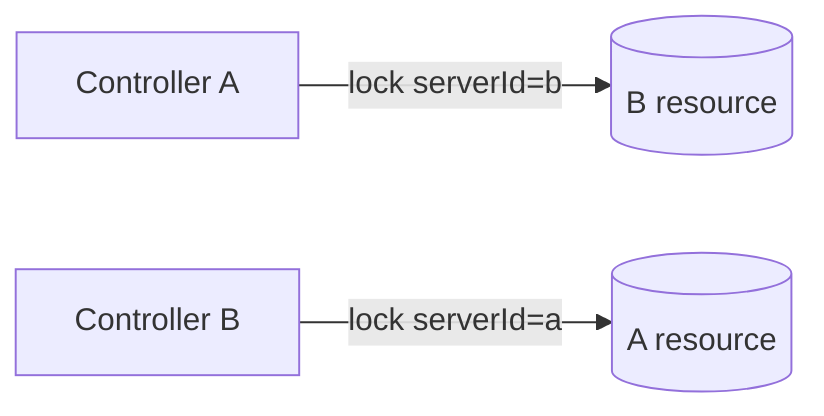
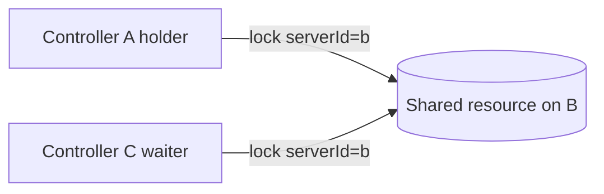
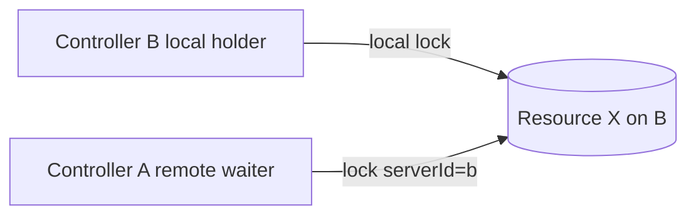
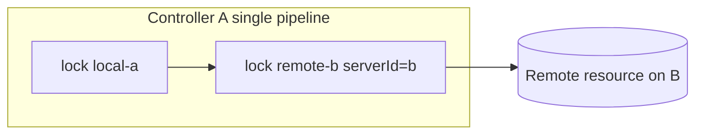
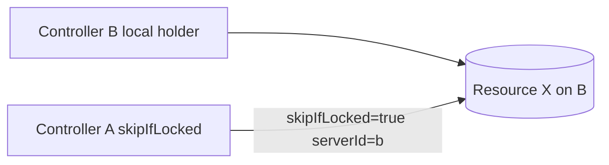
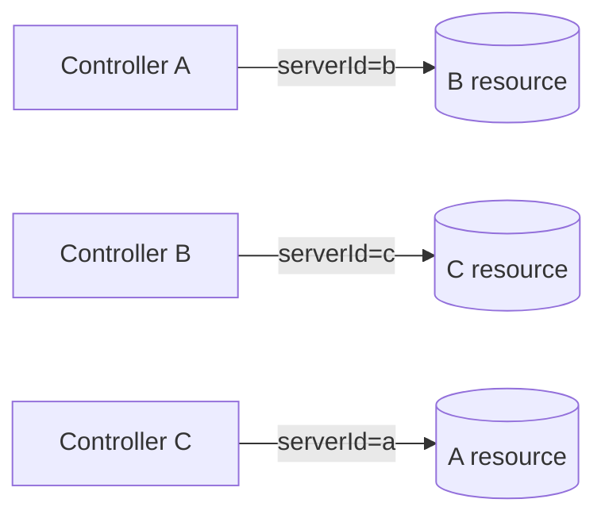
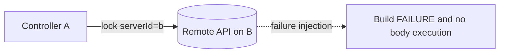
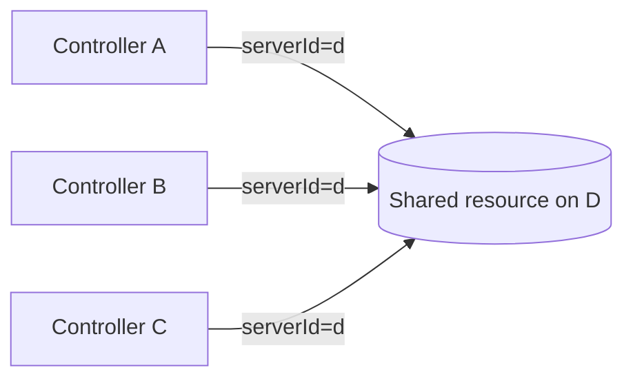
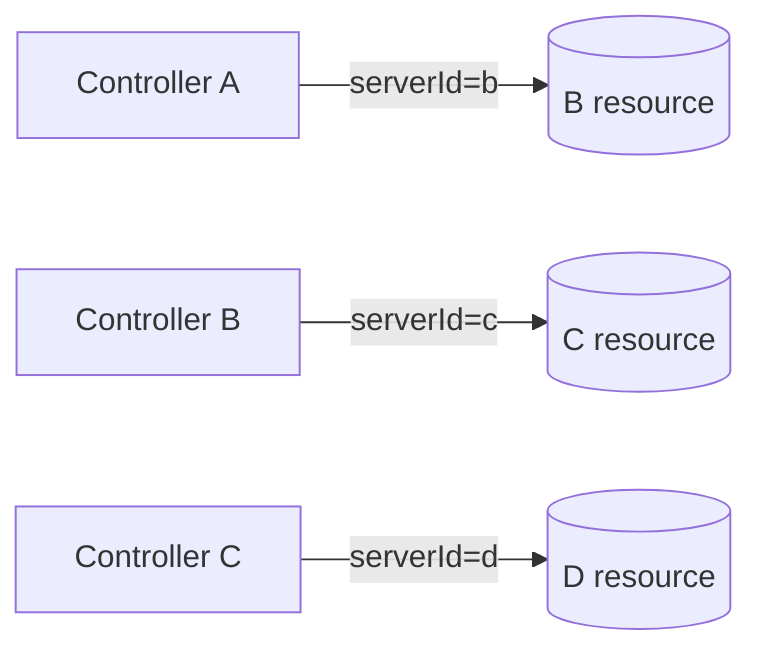
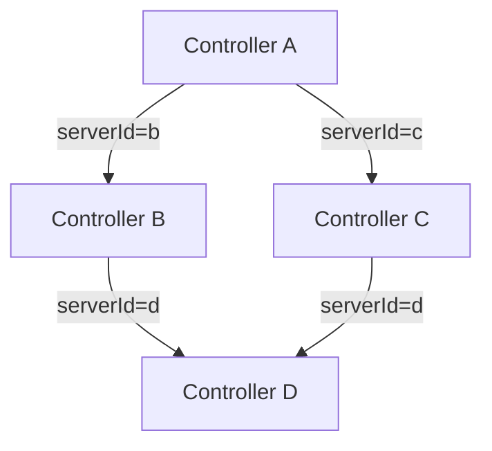

# E2E テスト仕様

この文書は `dev/jenkins-env/run-e2e.sh` が実行する E2E テストの設計・仕様を定義します。

---

## 目的

lockable-resources-plugin の remote lock 機能について、次を自動検証します。

1. remote lock の取得・待機・解放という基本ライフサイクルが成立すること
2. issue #1025 が設計した「独立した一方通行リレーの組み合わせ」モデルの各接続パターンが
   実環境相当で成立すること
3. ローカルロックとリモートロックが同一リソース上で正しく排他されること
4. remote API 障害時に lock を自動解放せず fail-closed で失敗すること
5. Jenkins d を加えた 4 コントローラー構成での拡張接続トポロジーが成立すること
6. 実行結果とコンソールログを再現可能な形で保存できること

---

## テスト体系

### シナリオ分類

| 分類 | 接頭辞 | 目的 | 必要コントローラー |
|---|---|---|---|
| 正常系（3 台） | `S` | 3 コントローラー構成での接続モデル検証 | a, b, c |
| 異常系 | `S` | remote API 障害・設定誤りでの fail-closed 検証 | a, b |
| 拡張系（4 台） | `D` | jenkins-d を加えた拡張トポロジー検証 | a, b, c, d |

### シナリオ一覧

| ID | スクリプト名 | 接続モデル | 主な検証ポイント | 旧シナリオとの関係 |
|---|---|---|---|---|
| S01 | `mutual-peer` | A→B かつ B→A（相互共有） | 独立一方通行リレーが干渉なく並走 | `peer-basic` を包含・置換 |
| S02 | `fan-in-contention` | A→B, C→B（同一リソース競合） | キュー動作・QUEUED 状態遷移 | `peer-basic` を包含・置換 |
| S03 | `server-self-use` | B ローカル保持中に A がリモート取得 | ローカルロックとリモートロックの排他 | 新規 |
| S04 | `mixed-local-remote` | A が local + B remote を同一パイプラインで保持 | ネストされた local+remote の同時保持 | 新規 |
| S05 | `skip-if-locked` | B ローカル保持中に A が skipIfLocked でリモート取得 | skipIfLocked リモート経路 | 新規 |
| S06 | `three-way-mesh` | A→B, B→C, C→A（3 者間全リレー） | 3 リレー並走・phantom lock なし | 新規 |
| S07 | `fail-closed` | A→B（障害注入） | 通信失敗・認証失敗で body 未実行 | `fail-closed` を引き継ぎ |
| D01 | `fan-in-4` | A, B, C が D のリソースを競合取得 | 4 クライアント→1 サーバー キュー安定性 | 新規（D 追加後） |
| D02 | `chain-4` | A→B, B→C, C→D（独立チェーン） | n 個の一方通行リレー並走 | 新規（D 追加後） |
| D03 | `diamond` | A→(B+C), B→D, C→D（菱形依存） | 間接共有依存での deadlock 非発生 | 新規（D 追加後） |

**旧シナリオとの対応**: 既存の `peer-basic` は S01 および S02 に包含されるため廃止。`fail-closed` は S07 として引き継ぎ。

### シナリオ詳細図（Mermaid）

以下の図は、各シナリオで「どの controller がどの controller の resource を lock するか」を視覚化したものです。

#### S01 mutual-peer



#### S02 fan-in-contention



#### S03 server-self-use



#### S04 mixed-local-remote



#### S05 skip-if-locked



#### S06 three-way-mesh



#### S07 fail-closed



#### D01 fan-in-4



#### D02 chain-4



#### D03 diamond



---

## 実行環境

### 3 コントローラー構成（S シリーズ）

| サービス名 | コンテナ名 | ホスト公開ポート | コンテナ内部 URL | jenkins home |
|---|---|---|---|---|
| `jenkins-a` | `lrr-jenkins-a` | 8081 | `http://jenkins-a:8080/jenkins` | `jha/` |
| `jenkins-b` | `lrr-jenkins-b` | 8082 | `http://jenkins-b:8080/jenkins` | `jhb/` |
| `jenkins-c` | `lrr-jenkins-c` | 8083 | `http://jenkins-c:8080/jenkins` | `jhc/` |

### 4 コントローラー構成（D シリーズ）

D シリーズを実行するには `docker-compose.yml` に `jenkins-d` サービスを追加します。

```yaml
  jenkins-d:
    <<: *jenkins-common
    container_name: lrr-jenkins-d
    ports:
      - "8084:8080"
    volumes:
      - ./jhd:/var/jenkins_home
```

| サービス名 | コンテナ名 | ホスト公開ポート | コンテナ内部 URL | jenkins home |
|---|---|---|---|---|
| `jenkins-d` | `lrr-jenkins-d` | 8084 | `http://jenkins-d:8080/jenkins` | `jhd/` |

`common.sh` への追加変数:

```bash
CONTROLLER_D_URL="http://127.0.0.1:8084/jenkins"
CONTROLLER_D_INTERNAL_URL="http://jenkins-d:8080/jenkins"
```

### common.sh 追加ヘルパー

現状は `configure_controller_b_remote_server` が B に固定されているため、
S01 以降の新シナリオでは任意コントローラーを remote server として設定できる汎用版が必要です。

```
configure_remote_server(base_url, resource_name, label, auth_mode)
  → 任意 controller の remoteApiEnabled/exposeLabel/resource を設定する

configure_local_resource(base_url, resource_name)
  → remote expose なし・serverId なしのローカル専用リソースを作成する

wait_for_controllers_with_d(timeout_seconds)
  → a/b/c/d の 4 台分ヘルスチェック（D シリーズ専用）
```

### 必須コマンド

- `curl`
- `docker`
- `python3`
- `base64`

### run-e2e.sh オプション

```
--skip-start          start.sh を呼ばずに既存環境で実行する
--clean-start         start.sh --clean で Jenkins home を初期化してから実行する
--only <name>         単一シナリオのみ実行する。指定可能値:
                        mutual-peer | fan-in-contention | server-self-use |
                        mixed-local-remote | skip-if-locked | three-way-mesh |
                        fail-closed |
                        fan-in-4 | chain-4 | diamond |
                        s-series | d-series | all
-h, --help            ヘルプを表示する
```

`--only s-series` は S01〜S07 をすべて実行します。  
`--only d-series` は D01〜D03 をすべて実行します（jenkins-d が起動済みであること）。  
`--only all` は S01〜S07 + D01〜D03 を実行します。

---

## 共通設定規約

### リソース命名

E2E 実行ごとに同一の Jenkins home を使い回すため、
リソース名にはシナリオ名プレフィックスと `$(date +%s)` のタイムスタンプを付与します。

```
<prefix>-<timestamp>

例:
  s01-board-a-1748000000   ← S01 で A が公開するリソース
  s02-shared-1748000001    ← S02 で B が公開する競合リソース
```

### exposeLabel

各コントローラーが remote API で公開するリソースには `remote-enabled` ラベルを付与します。  
ローカル専用リソースには `local-only` ラベルを付与して区別します。

### credentials 命名規約

| シナリオ | credentials ID | 配置先 | 内容 |
|---|---|---|---|
| S01 A→B | `s01-a-for-b` | A | B の admin API トークン |
| S01 B→A | `s01-b-for-a` | B | A の admin API トークン |
| S02 A/C→B | `s02-for-b` | A, C | B の admin API トークン（同 ID・同値） |
| S03 A→B | `s03-a-for-b` | A | B の admin API トークン |
| S04 A→B | `s04-a-for-b` | A | B の admin API トークン |
| S05 A→B | `s05-a-for-b` | A | B の admin API トークン |
| S06 A→B | `s06-a-for-b` | A | B の admin API トークン |
| S06 B→C | `s06-b-for-c` | B | C の admin API トークン |
| S06 C→A | `s06-c-for-a` | C | A の admin API トークン |
| S07 有効 | `s07-valid-creds` | A | B の admin API トークン |
| S07 認証失敗 | `s07-invalid-auth-creds` | A | `admin/not-a-valid-api-token` |
| S07 ID 欠落 | `s07-missing-creds` | （未作成） | 存在しない ID を指定 |
| S07 型不一致 | `s07-type-mismatch-creds` | A | StringCredentialsImpl |
| D01 A,B,C→D | `d01-for-d` | A, B, C | D の admin API トークン |
| D02 A→B | `d02-a-for-b` | A | B の admin API トークン |
| D02 B→C | `d02-b-for-c` | B | C の admin API トークン |
| D02 C→D | `d02-c-for-d` | C | D の admin API トークン |
| D03 A→B | `d03-a-for-b` | A | B の admin API トークン |
| D03 A→C | `d03-a-for-c` | A | C の admin API トークン |
| D03 B→D | `d03-b-for-d` | B | D の admin API トークン |
| D03 C→D | `d03-c-for-d` | C | D の admin API トークン |

---

## S01: mutual-peer — 相互 peer 共有

### テスト意図

A→B リレー（A がクライアント、B がサーバー）と B→A リレー（B がクライアント、A がサーバー）が
同時に独立して成立することを確認します。

issue #1025 の「独立した一方通行リレーの組み合わせによる相互共有」の最も基本的なケースです。

```
A pipeline:  lock(resource: '<A_RES>', serverId: 'b') { sleep 20s }   # A→B リレー
B pipeline:  lock(resource: '<B_RES>', serverId: 'a') { sleep 20s }   # B→A リレー
（同時起動）
```

### 前提条件

- **Controller A**: `remoteApiEnabled=true`, `exposeLabel=remote-enabled`, A リソース公開
- **Controller B**: `remoteApiEnabled=true`, `exposeLabel=remote-enabled`, B リソース公開
- **A 側 credentials** (`s01-a-for-b`): A に作成、B の admin API トークン
- **B 側 credentials** (`s01-b-for-a`): B に作成、A の admin API トークン
- **A の remote 設定**: `remotes[a→b]` = B の internal URL + `s01-a-for-b`
- **B の remote 設定**: `remotes[b→a]` = A の internal URL + `s01-b-for-a`

### パイプライン構成

| job 名 | controller | 内容 |
|---|---|---|
| `s01-a-holder` | A | `lock(resource: A公開リソース, serverId: 'b')` で 20 秒 sleep |
| `s01-b-holder` | B | `lock(resource: B公開リソース, serverId: 'a')` で 20 秒 sleep |

### 検証基準

| ID | 検証項目 | 期待値 |
|---|---|---|
| CP01 | `s01-a-holder` の build 結果 | `SUCCESS` |
| CP02 | `s01-b-holder` の build 結果 | `SUCCESS` |
| CP03 | A コンソールに `A_ACQUIRED` が出ること | `true` |
| CP04 | B コンソールに `B_ACQUIRED` が出ること | `true` |
| CP05 | A コンソールに `Remote lock acquired on` が出ること | `true`（WARN 扱い） |
| CP06 | B コンソールに `Remote lock acquired on` が出ること | `true`（WARN 扱い） |
| CP07 | 両ビルドが互いに待機せず並走したこと（合計所要時間 < 40 秒） | `true` |

CP07 は「A と B のリレーが独立していること」の傍証です。

### 出力ファイル

```
reports/<runId>-e2e-test/mutual-peer/a-console.txt
reports/<runId>-e2e-test/mutual-peer/b-console.txt
reports/<runId>-e2e-test/mutual-peer/summary.txt
reports/<runId>-e2e-test/mutual-peer/scenario-details.md
```

---

## S02: fan-in-contention — 複数クライアントの同一リソース競合

### テスト意図

A と C が同じ B のリソースを同時に取得しようとするとき、
キューが正しく動作すること（片方が QUEUED 状態を経由して順に取得すること）を確認します。

```
A pipeline:  lock(resource: '<SHARED>', serverId: 'b') { sleep 25s }   # 先取得
C pipeline:  lock(resource: '<SHARED>', serverId: 'b') { sleep 5s  }   # 待機 → 後取得
（A 起動後すぐに C を起動）
```

### 前提条件

- **Controller B**: `remoteApiEnabled=true`, `exposeLabel=remote-enabled`, 共有リソース 1 個
- **A 側 credentials** (`s02-for-b`): B の admin API トークン（A に作成）
- **C 側 credentials** (`s02-for-b`): 同 ID・同値（C に作成）
- **A の remote 設定**: `remotes[a→b]`
- **C の remote 設定**: `remotes[c→b]`

### パイプライン構成

| job 名 | controller | 内容 |
|---|---|---|
| `s02-holder` | A | 共有リソースを 25 秒保持 |
| `s02-waiter` | C | 共有リソースを取得後 5 秒保持 |

### 検証基準

| ID | 検証項目 | 期待値 |
|---|---|---|
| CP01 | `s02-holder` の build 結果 | `SUCCESS` |
| CP02 | `s02-waiter` の build 結果 | `SUCCESS` |
| CP03 | A コンソールに `HOLDER_ACQUIRED` | `true` |
| CP04 | C コンソールに `WAITER_ACQUIRED` | `true` |
| CP05 | C の waiter 所要時間 ≥ 15 秒 | `true`（holder 保持中に待機したことの確認） |

### 出力ファイル

```
reports/<runId>-e2e-test/fan-in-contention/holder-console.txt
reports/<runId>-e2e-test/fan-in-contention/waiter-console.txt
reports/<runId>-e2e-test/fan-in-contention/summary.txt
reports/<runId>-e2e-test/fan-in-contention/scenario-details.md
```

---

## S03: server-self-use — サーバーがローカル保持中にリモートクライアントが競合

### テスト意図

B の pipeline がリソース X をローカルロック（`lock(resource: X)`、`serverId` なし）で保持している間、
A が同じリソース X をリモート経由（`lock(resource: X, serverId: 'b')`）で取得しようとするとき、
`remoteLockedBy` と `isLocked()` が正しく排他されることを確認します。

「サーバー側のローカルロックとリモートロックが同一リソースで排他できるか」を検証する
最重要シナリオです。plugin 側の実装不備があればここで検出できます。

```
B pipeline (local):   lock(resource: X) { sleep 30s }          # ローカルで保持
A pipeline (remote):  lock(resource: X, serverId: 'b') { ... }  # リモートで取得を試みる
（B local 起動後すぐに A を起動）
```

**注意**: plugin 側で `RemoteLockManager` の tick が「ローカルロック中は QUEUED 維持」を
正しく行っていない場合、このシナリオが失敗します。
その場合は plugin 側の不具合として別途調査します。

### 前提条件

- **Controller B**: `remoteApiEnabled=true`, `exposeLabel=remote-enabled`, リソース X を公開
  （B の pipeline は serverId なしでも同じ X を lock できます）
- **A 側 credentials** (`s03-a-for-b`): A に作成、B の admin API トークン
- **A の remote 設定**: `remotes[a→b]`

### パイプライン構成

| job 名 | controller | 内容 |
|---|---|---|
| `s03-local-holder` | B | リソース X を `lock(resource: X)` でローカル保持（30 秒） |
| `s03-remote-waiter` | A | リソース X を `lock(resource: X, serverId: 'b')` でリモート取得 |

### 検証基準

| ID | 検証項目 | 期待値 |
|---|---|---|
| CP01 | `s03-local-holder` の build 結果 | `SUCCESS` |
| CP02 | `s03-remote-waiter` の build 結果 | `SUCCESS` |
| CP03 | B コンソールに `LOCAL_HOLDER_ACQUIRED` | `true` |
| CP04 | A コンソールに `REMOTE_WAITER_ACQUIRED` | `true` |
| CP05 | A の remote waiter 所要時間 ≥ 20 秒 | `true`（B local hold 中に A が待機したことの確認） |

### 出力ファイル

```
reports/<runId>-e2e-test/server-self-use/local-holder-console.txt
reports/<runId>-e2e-test/server-self-use/remote-waiter-console.txt
reports/<runId>-e2e-test/server-self-use/summary.txt
reports/<runId>-e2e-test/server-self-use/scenario-details.md
```

---

## S04: mixed-local-remote — ローカルリソースとリモートリソースの同時保持

### テスト意図

同一パイプライン内で A 自身のローカルリソースと B のリモートリソースを
ネストした `lock()` で同時保持できることを確認します。
また、両方のリソースが解放されることも確認します。

```
A pipeline:
  lock(resource: 'local-a-<ts>') {                       # A のローカルリソース
    lock(resource: 'remote-b-<ts>', serverId: 'b') {     # B のリモートリソース
      echo "BOTH_ACQUIRED"
    }
  }
```

### 前提条件

- **Controller A**: ローカル専用リソース `s04-local-a-<timestamp>` を作成（exposeLabel なし）
- **Controller B**: `remoteApiEnabled=true`, `exposeLabel=remote-enabled`, `s04-remote-b-<timestamp>` を公開
- **A 側 credentials** (`s04-a-for-b`): B の admin API トークン
- **A の remote 設定**: `remotes[a→b]`

### パイプライン構成

| job 名 | controller | 内容 |
|---|---|---|
| `s04-mixed-lock` | A | `lock(local-a) { lock(remote-b, serverId:'b') { echo BOTH_ACQUIRED } }` |

### 検証基準

| ID | 検証項目 | 期待値 |
|---|---|---|
| CP01 | `s04-mixed-lock` の build 結果 | `SUCCESS` |
| CP02 | A コンソールに `BOTH_ACQUIRED` | `true` |
| CP03 | B 側リソース `s04-remote-b-*` が解放されていること | `true`（Groovy scriptText で確認） |
| CP04 | A 側リソース `s04-local-a-*` が解放されていること | `true`（Groovy scriptText で確認） |

CP03/CP04 は `LockableResourcesManager.get().fromName(...).isLocked()` で確認します。

### 出力ファイル

```
reports/<runId>-e2e-test/mixed-local-remote/console.txt
reports/<runId>-e2e-test/mixed-local-remote/summary.txt
reports/<runId>-e2e-test/mixed-local-remote/scenario-details.md
```

---

## S05: skip-if-locked — skipIfLocked のリモート経路

### テスト意図

B がリソース X をローカルで保持している間、
A が `skipIfLocked: true` でリモート取得を試みたとき、
body を実行せずに pipeline が `SUCCESS` になることを確認します。

```
B pipeline (local):   lock(resource: X) { sleep 30s }
A pipeline (remote):  lock(resource: X, skipIfLocked: true, serverId: 'b') {
                        echo "SKIP_BODY_EXECUTED"   ← 出てはならない
                      }
（B local 起動後すぐに A を起動）
```

**実装確認事項**: DSL `lock(resource, skipIfLocked: true, serverId: 'X')` の組み合わせが
`RemoteApiClient.enqueueAcquire()` に `skipIfLocked=true` を正しく伝搬するかを
このシナリオで検証します。  
伝搬していない場合（body が実行される場合）は plugin 側の不具合として記録します。

### 前提条件

- **Controller B**: `remoteApiEnabled=true`, `exposeLabel=remote-enabled`, リソース X を公開
- **A 側 credentials** (`s05-a-for-b`): B の admin API トークン
- **A の remote 設定**: `remotes[a→b]`

### パイプライン構成

| job 名 | controller | 内容 |
|---|---|---|
| `s05-local-holder` | B | リソース X をローカル保持（30 秒） |
| `s05-skip-test` | A | `lock(resource: X, skipIfLocked: true, serverId: 'b') { echo SKIP_BODY_EXECUTED }` |

### 検証基準

| ID | 検証項目 | 期待値 |
|---|---|---|
| CP01 | `s05-local-holder` の build 結果 | `SUCCESS` |
| CP02 | `s05-skip-test` の build 結果 | `SUCCESS` |
| CP03 | A コンソールに `SKIP_BODY_EXECUTED` が**出ない**こと | `true` |
| CP04 | A コンソールに skip を示す文言が出ること | `true`（WARN 扱い） |

CP03 が失敗する（body が実行される）場合は、plugin 側の `skipIfLocked` リモート伝搬が未対応です。
その場合は FAIL として記録し、調査を行います。

### 出力ファイル

```
reports/<runId>-e2e-test/skip-if-locked/local-holder-console.txt
reports/<runId>-e2e-test/skip-if-locked/skip-test-console.txt
reports/<runId>-e2e-test/skip-if-locked/summary.txt
reports/<runId>-e2e-test/skip-if-locked/scenario-details.md
```

---

## S06: three-way-mesh — 3 コントローラー全リレー並走

### テスト意図

A→B, B→C, C→A の 3 つの一方通行リレーが同時に成立することを確認します。
各リレーは完全に独立しており、互いの状態に影響を与えないことが期待されます。

```
A pipeline:  lock(resource: B公開リソース, serverId: 'b') { sleep 15s }   # A→B
B pipeline:  lock(resource: C公開リソース, serverId: 'c') { sleep 15s }   # B→C
C pipeline:  lock(resource: A公開リソース, serverId: 'a') { sleep 15s }   # C→A
（3 パイプラインを同時起動）
```

### 前提条件

- **Controller A**: `remoteApiEnabled=true`, `exposeLabel=remote-enabled`, A リソース公開
- **Controller B**: `remoteApiEnabled=true`, `exposeLabel=remote-enabled`, B リソース公開
- **Controller C**: `remoteApiEnabled=true`, `exposeLabel=remote-enabled`, C リソース公開
- credentials と remote 設定:
  - `s06-a-for-b`: A に作成（B の API トークン）、A の `remotes[a→b]`
  - `s06-b-for-c`: B に作成（C の API トークン）、B の `remotes[b→c]`
  - `s06-c-for-a`: C に作成（A の API トークン）、C の `remotes[c→a]`

### パイプライン構成

| job 名 | controller | serverId | 保持時間 |
|---|---|---|---|
| `s06-a-to-b` | A | `b` | 15 秒 |
| `s06-b-to-c` | B | `c` | 15 秒 |
| `s06-c-to-a` | C | `a` | 15 秒 |

### 検証基準

| ID | 検証項目 | 期待値 |
|---|---|---|
| CP01 | `s06-a-to-b` の build 結果 | `SUCCESS` |
| CP02 | `s06-b-to-c` の build 結果 | `SUCCESS` |
| CP03 | `s06-c-to-a` の build 結果 | `SUCCESS` |
| CP04 | A コンソールに `A_ACQUIRED` | `true` |
| CP05 | B コンソールに `B_ACQUIRED` | `true` |
| CP06 | C コンソールに `C_ACQUIRED` | `true` |
| CP07 | 全ビルドが互いに待機せず並走（合計所要時間 < 30 秒） | `true` |
| CP08 | 全リソースが解放されていること（LRM 状態確認） | `true` |

### 出力ファイル

```
reports/<runId>-e2e-test/three-way-mesh/a-console.txt
reports/<runId>-e2e-test/three-way-mesh/b-console.txt
reports/<runId>-e2e-test/three-way-mesh/c-console.txt
reports/<runId>-e2e-test/three-way-mesh/summary.txt
reports/<runId>-e2e-test/three-way-mesh/scenario-details.md
```

---

## S07: fail-closed — remote API 障害・設定誤りでの fail-closed 動作

### テスト意図

remote API の通信失敗・認証失敗・設定誤りが発生したとき、
lock body を実行せずに build を `FAILURE` にすることを確認します。

旧 `fail-closed` シナリオを引き継ぎ、credentials 命名を S07 規約に更新します。

### 共通の前提

- **Controller B**: 認証必須の remote server（ベース設定）
- **Controller A**: クライアント。credentials `s07-valid-creds` をベースに使用

### lock body

失敗系の全ケースで次の body を使います:

```groovy
lock(resource: X, serverId: 'b') {
  echo "UNEXPECTED_BODY_EXECUTION"
}
```

body が実行されたらログに `UNEXPECTED_BODY_EXECUTION` が残ります。

### ケース一覧

| ID | ケース名 | 障害注入方法 | 期待 build 結果 |
|---|---|---|---|
| S07-C01 | `remote-down` | `docker compose stop jenkins-b` で B を停止 | `FAILURE` |
| S07-C02 | `timeout` | remote URL を `http://10.255.255.1:18082/jenkins`（到達不能）に変更 | `FAILURE` |
| S07-C03 | `auth-error` | credentials に `admin/not-a-valid-api-token` を設定 | `FAILURE` |
| S07-C04 | `missing-credentials-id` | remote connection に存在しない credentials ID を設定 | `FAILURE` |
| S07-C05 | `credentials-type-mismatch` | `StringCredentialsImpl` の ID を remote connection に設定 | `FAILURE` |

### 検証基準（全ケース共通）

| ID | 検証項目 | 期待値 |
|---|---|---|
| CP01 | build 結果 | `FAILURE` |
| CP02 | コンソールに障害を示す文言が出ること | `true`（WARN 扱い） |
| CP03 | コンソールに `UNEXPECTED_BODY_EXECUTION` が**出ない**こと | `true` |

S07-C04 追加: コンソールに `Remote credentials not found for serverId=b, credentialsId=` が出ること  
S07-C05 追加: コンソールに `Remote credentials not found for serverId=b, credentialsId=` が出ること

### 出力ファイル

```
reports/<runId>-e2e-test/fail-closed/remote-down/console.txt
reports/<runId>-e2e-test/fail-closed/timeout/console.txt
reports/<runId>-e2e-test/fail-closed/auth-error/console.txt
reports/<runId>-e2e-test/fail-closed/missing-credentials-id/console.txt
reports/<runId>-e2e-test/fail-closed/credentials-type-mismatch/console.txt
reports/<runId>-e2e-test/fail-closed/scenario-details.md
```

---

## D01: fan-in-4 — 4 クライアントによる同一リソース競合

### テスト意図

A, B, C が D の同一リソースを順次取得しようとするとき、
キューが安定して 3 者全員に順に ACQUIRED を返せることを確認します。

```
A pipeline:  lock(resource: D公開リソース, serverId: 'd') { sleep 20s }
B pipeline:  lock(resource: D公開リソース, serverId: 'd') { sleep 5s  }
C pipeline:  lock(resource: D公開リソース, serverId: 'd') { sleep 5s  }
（3 パイプラインをほぼ同時起動）
```

### 前提条件（jenkins-d 追加後）

- **Controller D**: `remoteApiEnabled=true`, `exposeLabel=remote-enabled`, 共有リソース 1 個
- A, B, C それぞれに credentials `d01-for-d` と `remotes[*→d]` を設定

### 検証基準

| ID | 検証項目 | 期待値 |
|---|---|---|
| CP01 | A の build 結果 | `SUCCESS` |
| CP02 | B の build 結果 | `SUCCESS` |
| CP03 | C の build 結果 | `SUCCESS` |
| CP04 | 3 者全員のコンソールに `ACQUIRED` が出ること | `true` |
| CP05 | 3 者が同時に ACQUIRED にならないこと（時刻ログ確認） | `true`（WARN 扱い） |

### 出力ファイル

```
reports/<runId>-e2e-test/fan-in-4/a-console.txt
reports/<runId>-e2e-test/fan-in-4/b-console.txt
reports/<runId>-e2e-test/fan-in-4/c-console.txt
reports/<runId>-e2e-test/fan-in-4/summary.txt
reports/<runId>-e2e-test/fan-in-4/scenario-details.md
```

---

## D02: chain-4 — 4 コントローラー独立チェーン

### テスト意図

A→B, B→C, C→D の 3 つの独立した一方通行リレーが同時並走できることを確認します。
各リレーは完全に独立しており（A→B は B→C に依存しない）、
「n 個の一方通行リレーが同時に存在しても互いに影響しない」という
issue #1025 の設計原則を規模で確認します。

```
A pipeline:  lock(resource: B公開リソース, serverId: 'b') { sleep 15s }
B pipeline:  lock(resource: C公開リソース, serverId: 'c') { sleep 15s }
C pipeline:  lock(resource: D公開リソース, serverId: 'd') { sleep 15s }
（3 パイプラインを同時起動）
```

### 前提条件（jenkins-d 追加後）

- B, C, D のそれぞれが `remoteApiEnabled=true` でリソースを公開
- credentials と remote 設定:
  - `d02-a-for-b`: A に作成、A の `remotes[a→b]`
  - `d02-b-for-c`: B に作成、B の `remotes[b→c]`
  - `d02-c-for-d`: C に作成、C の `remotes[c→d]`

### 検証基準

| ID | 検証項目 | 期待値 |
|---|---|---|
| CP01〜CP03 | 全 build 結果 | `SUCCESS` |
| CP04〜CP06 | 各コンソールに `ACQUIRED` | `true` |
| CP07 | 全ビルドが並走（合計所要時間 < 30 秒） | `true` |

### 出力ファイル

```
reports/<runId>-e2e-test/chain-4/a-console.txt
reports/<runId>-e2e-test/chain-4/b-console.txt
reports/<runId>-e2e-test/chain-4/c-console.txt
reports/<runId>-e2e-test/chain-4/summary.txt
reports/<runId>-e2e-test/chain-4/scenario-details.md
```

---

## D03: diamond — 菱形依存トポロジー

### テスト意図

A が B と C のリソースを同時要求し、B と C がそれぞれ独立して D のリソースを要求する
菱形依存トポロジーにおいて、デッドロックが発生しないことを確認します。

```
           A
          / \
         B   C
          \ /
           D
```

各パイプラインの動作:

```
A pipeline:  lock(B公開リソース, serverId:'b') {
               lock(C公開リソース, serverId:'c') {
                 echo "DIAMOND_ACQUIRED"
               }
             }

B pipeline:  lock(D公開リソース, serverId:'d') { sleep 10s }
C pipeline:  lock(D公開リソース, serverId:'d') { sleep 10s }
```

**注意**: B と C は D の同一リソースを奪い合うため、片方は QUEUED で待機します。
A は B と C の両方が完了するまで block されます（ネストした `lock()` のため順次取得）。
デッドロックは発生しないはずですが、B/C の D 取得待ちが fail-closed タイムアウトを引き起こす
可能性があるため、全体の timeout を 180 秒と設定します。

### 前提条件（jenkins-d 追加後）

- B, C, D のそれぞれが `remoteApiEnabled=true` でリソースを公開
- credentials と remote 設定:
  - `d03-a-for-b`, `d03-a-for-c`: A に作成
  - `d03-b-for-d`: B に作成
  - `d03-c-for-d`: C に作成
  - A の `remotes[a→b]`, `remotes[a→c]`
  - B の `remotes[b→d]`、C の `remotes[c→d]`

### 検証基準

| ID | 検証項目 | 期待値 |
|---|---|---|
| CP01 | A の build 結果 | `SUCCESS` |
| CP02 | B の build 結果 | `SUCCESS` |
| CP03 | C の build 結果 | `SUCCESS` |
| CP04 | A コンソールに `DIAMOND_ACQUIRED` | `true` |
| CP05 | デッドロック（3 者全員が無限待機）が発生しないこと | `true` |

### 出力ファイル

```
reports/<runId>-e2e-test/diamond/a-console.txt
reports/<runId>-e2e-test/diamond/b-console.txt
reports/<runId>-e2e-test/diamond/c-console.txt
reports/<runId>-e2e-test/diamond/summary.txt
reports/<runId>-e2e-test/diamond/scenario-details.md
```

---

## run-e2e.sh 拡張仕様

### 実行順序

```
S01 → S02 → S03 → S04 → S05 → S06 → S07 → D01 → D02 → D03
```

`--only s-series`: S01〜S07 のみ  
`--only d-series`: D01〜D03 のみ（jenkins-d が起動済みであること）  
`--only all`: 全シナリオ

D シリーズはシナリオ開始前に `wait_for_d_controller` で jenkins-d の起動を確認し、
未起動の場合は SKIP（exit code 10）とします。

### スクリプトファイル対応

| シナリオ ID | スクリプトファイル |
|---|---|
| S01 | `scenarios/mutual-peer.sh` |
| S02 | `scenarios/fan-in-contention.sh` |
| S03 | `scenarios/server-self-use.sh` |
| S04 | `scenarios/mixed-local-remote.sh` |
| S05 | `scenarios/skip-if-locked.sh` |
| S06 | `scenarios/three-way-mesh.sh` |
| S07 | `scenarios/fail-closed.sh` |
| D01 | `scenarios/fan-in-4.sh` |
| D02 | `scenarios/chain-4.sh` |
| D03 | `scenarios/diamond.sh` |

旧 `scenarios/peer-basic.sh` は廃止します。

### レポート出力

`run-e2e.sh` の終了時に生成されます:

```
reports/<runId>-e2e-test.md
```

内容:
- runId, executedAt, mode, skipStart, cleanStart
- 成功数 / 失敗数 / スキップ数
- シナリオ別状態テーブル（10 行）
- 各 `scenario-details.md` の内容

---

## 終了コード

- 全シナリオ成功: 0
- 1 シナリオでも失敗: 1
- シナリオスキップ（D シリーズで jenkins-d 未起動など）: exit 10（`run_scenario` 内で処理）

---

## 更新履歴

- 2026-05-23: Step 6d の検証を E2E に統合。`peer-basic` を認証必須前提へ切替え、
  `fail-closed` に `missing-credentials-id` / `credentials-type-mismatch` を追加。
- 2026-05-23: S/D シリーズ追加。テスト体系を全面改訂。既存 `peer-basic` を S01/S02 に包含・廃止。
  `fail-closed` を S07 として引き継ぎ。接続モデル全域カバレッジ（S01〜S07, D01〜D03）を策定。
  issue #1025 の「独立した一方通行リレーの組み合わせ」モデルに基づき
  mutual-peer / fan-in-contention / server-self-use / mixed-local-remote / skip-if-locked /
  three-way-mesh / fail-closed / fan-in-4 / chain-4 / diamond の各トポロジーをシナリオ化。
