# E2E テスト仕様（統合版）

この文書は `dev/jenkins-env/run-e2e.sh` が実行する E2E テストの設計・仕様を定義します。

> **統合について:** 本書は旧 `E2E_TEST_SPECIFICATION_P1_M1.md` / `_P1_M1A.md` /
> `_P1_M1B.md` の 3 文書を統合したものです（2026-06-12）。各テスト項目には
> 導入マイルストーン（**P1M1** / **P1M1A** / **P1M1B** / **P1M1C** / **P1M1D**）を付記しています。

---

## 目的

lockable-resources-plugin の remote lock 機能について、次を自動検証します。

| # | 検証内容 | 導入 |
|---|---|---|
| 1 | remote lock の取得・待機・解放という基本ライフサイクルが成立すること | P1M1 |
| 2 | issue #1025 の「独立した一方通行リレーの組み合わせ」モデルの各接続パターンが実環境相当で成立すること | P1M1 |
| 3 | ローカルロックとリモートロックが同一リソース上で正しく排他されること | P1M1 |
| 4 | remote API 障害時に lock を自動解放せず fail-closed で失敗すること | P1M1 |
| 5 | jenkins-d を加えた 4 コントローラー構成での拡張接続トポロジーが成立すること | P1M1 |
| 6 | 実行結果とコンソールログを再現可能な形で保存できること | P1M1 |
| 7 | 透過 lockRequest payload（`label` / `quantity` / `variable` / `skipIfLocked` のサーバー側解釈） | P1M1A |
| 8 | lockEnvVars の local `lock()` 等価展開（`$V`, `${V}0`, `${V}1`） | P1M1A |
| 9 | forcedServerId delegated mode（`serverId` なし DSL の透過委譲） | P1M1A |
| 10 | extra アトミック取得（main + extra が単一 lease で取得・解放） | P1M1B |
| 11 | heartbeat 耐性（失敗してもジョブ継続、完了後に正常 release） | P1M1B |
| 12 | 統一キュー priority（remote 待機者の priority が local 待機者と横断で効く） | P1M1B |
| 13 | STALE 管理者解放（STALE 遷移 → fail-close 保持 → Force Release → 待機者起床） | P1M1B |
| 14 | label 指定 extra のアトミック取得（main + label-extra が単一 lease で取得） | P1M1C |
| 15 | label の quantity 未指定 = マッチ全部のロック（local "0 = all" と等価） | P1M1C |
| 16 | リソースプロパティ env var の remote 伝搬（`VAR0_<PROP>` が body に届く） | P1M1D |
| 17 | **データ境界**: POST /acquire の拒否契約（status + errorCode）と 1 MiB body 上限 | Boundary |
| 18 | **データ境界**: リソース名のエンコーディング往復（空白 / 多バイト / 長名 / カンマ） | Boundary |
| 19 | **時系列境界**: 終端レコード TTL・カタログ TTL・中断（abort）の各しきい値の内外両側 | Boundary |
| 20 | **スケール境界**: カタログ規模に対する discovery のコストと、lock 取得への干渉 | Boundary |

---

## テスト体系

### シナリオ一覧

| ID | スクリプト名 | 接続モデル / 検証機能 | 主な検証ポイント | 必要コントローラー | 対象 |
|---|---|---|---|---|---|
| S01 | `mutual-peer` | A→B かつ B→A（相互共有） | 独立一方通行リレーが干渉なく並走 | a, b | P1M1 |
| S02 | `fan-in-contention` | A→B, C→B（同一リソース競合） | キュー動作・QUEUED 状態遷移 | a, b, c | P1M1 |
| S03 | `server-self-use` | B ローカル保持中に A がリモート取得 | ローカルロックとリモートロックの排他 | a, b | P1M1 |
| S04 | `mixed-local-remote` | A が local + B remote を同一パイプラインで保持 | ネストされた local+remote の同時保持 | a, b | P1M1 |
| S05 | `skip-if-locked` | B ローカル保持中に A が skipIfLocked でリモート取得 | skipIfLocked リモート経路 | a, b | P1M1 |
| S06 | `three-way-mesh` | A→B, B→C, C→A（3 者間全リレー） | 3 リレー並走・phantom lock なし | a, b, c | P1M1 |
| S07 | `fail-closed` | A→B（障害注入） | 通信失敗・認証失敗で body 未実行 | a, b | P1M1 |
| S08 | `label-env-vars` | label 指定取得 + variable 展開 | label-based 取得 + lockEnvVars 等価展開 | a, b | P1M1A |
| S09 | `delegated-mode` | forcedServerId による委譲 | `serverId` なし DSL の透過委譲と復帰 | a, b | P1M1A |
| S10 | `extra-resources` | extra アトミック取得 | 同一 lockId での複数リソース取得・カンマ結合変数 | a, b | P1M1B |
| S11 | `heartbeat-resilience` | heartbeat 障害注入 | heartbeat 失敗時のジョブ継続 | a, b | P1M1B |
| S12 | `priority-ordering` | local/remote priority 競合 | 統一キューの priority ディスパッチ | a, b | P1M1B |
| S13 | `stale-admin-release` | ghost lease → STALE → 管理者解放 | STALE 遷移・fail-close 保持・Force Release | b | P1M1B |
| S14 | `extra-label-resources` | resource + label 指定 extra のアトミック取得 | label-extra が単一 lease で取得（C-1 回帰） | a, b | P1M1C |
| S15 | `label-quantity-all` | quantity 未指定の label 取得 | マッチ全部を単一 lease で取得（"0 = all" 等価） | a, b | P1M1C |
| S16 | `remote-resource-properties` | リソースプロパティ env var の伝搬 | `VAR0_<PROP>` が remote body に届く（M1D 共有 env var 生成） | a, b | P1M1D |
| S17 | `remote-unknown-rejected` | 未知/未公開リソースの acquire | 一律 404 で即時拒否＋サーバーに ephemeral 非作成（H-1 回帰） | a, b | P1M1E |
| S18 | `remote-acquire-timeout` | 枯渇 allocate timeout（>120s）| timeout が `LOCK_WAIT_TIMEOUT` で fail-closed（404/通信失敗でない）。queued-expiry-poll-404 回帰 | a, b | P1M1I |
| B01 | `acquire-payload-boundaries` | POST /acquire の値域 | 拒否 13 種の status+errorCode、1 MiB 上限の両側 | a, b | Boundary |
| B02 | `lease-lifecycle-edges` | lease の状態不整合な操作 | 未知/解放済/QUEUED への heartbeat・release・poll、TERMINAL_TTL の両側 | a, b | Boundary |
| B03 | `resource-name-boundaries` | リソース名のエンコーディング | 空白 / 多バイト / 244 文字 / カンマ入り名の往復 | a, b | Boundary |
| B04 | `catalog-cache-ttl` | クライアント側カタログの鮮度 | TTL 内は据え置き / TTL 超で追随 / サーバー停止中も描画 | a, b | Boundary |
| B05 | `acquire-abort-races` | ビルド中断 | QUEUED 中断＝幽霊ロック無し、ACQUIRED 中断＝STALE 前に解放 | a, b | Boundary |
| B06 | `catalog-scale` | カタログ規模 | 100/500/2000 件の応答時間・全件性、discovery 負荷下の acquire レイテンシ | a, b | Boundary |
| B07 | `queue-depth-scale` | 待機列の深さ | 同一リソースに 1/10/50 件並べたときの昇格スループットと公平性 | b | Boundary |
| D01 | `fan-in-4` | A, B, C が D のリソースを競合取得 | 4 クライアント→1 サーバー キュー安定性 | a, b, c, d | P1M1 |
| D02 | `chain-4` | A→B, B→C, C→D（独立チェーン） | n 個の一方通行リレー並走 | a, b, c, d | P1M1 |
| D03 | `diamond` | A→(B+C), B→D, C→D（菱形依存） | 間接共有依存での deadlock 非発生 | a, b, c, d | P1M1 |

> **B シリーズ（境界）について**: S/D シリーズが「機能が動くこと」を確かめるのに対し、B シリーズは
> **値域・時間しきい値・規模**の境界を突く。設計の背景・残ギャップ・実測所見は
> `BOUNDARY_COVERAGE_ANALYSIS.md` を参照。B01 は API を直接叩くため 21 チェックポイントを 3 秒弱で回す。

**歴史的経緯**: 初期の `peer-basic` シナリオは S01/S02 に包含され廃止。旧 `fail-closed` は S07 として引き継ぎ。

### シナリオ詳細図（Mermaid）

#### S01 mutual-peer 【P1M1】

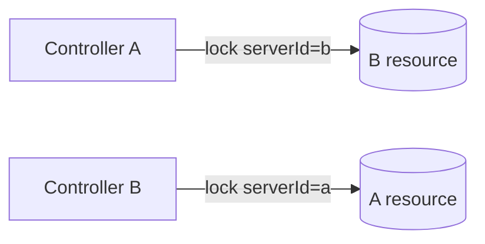
```mermaid
flowchart LR
  A[Controller A] -- lock serverId=b --> BR[(B resource)]
  B[Controller B] -- lock serverId=a --> AR[(A resource)]
```

#### S02 fan-in-contention 【P1M1】

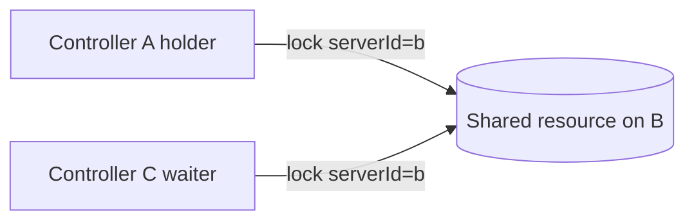
```mermaid
flowchart LR
  A[Controller A holder] -- lock serverId=b --> BR[(Shared resource on B)]
  C[Controller C waiter] -- lock serverId=b --> BR
```

#### S03 server-self-use 【P1M1】

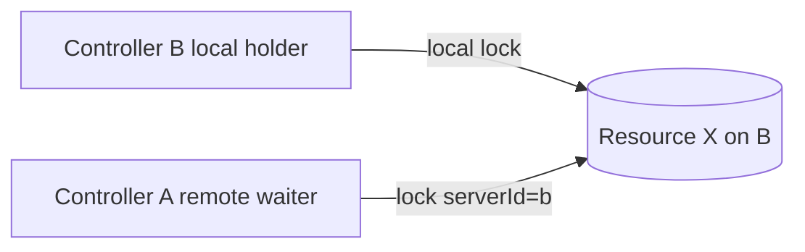
```mermaid
flowchart LR
  B[Controller B local holder] -- local lock --> XR[(Resource X on B)]
  A[Controller A remote waiter] -- lock serverId=b --> XR
```

#### S04 mixed-local-remote 【P1M1】

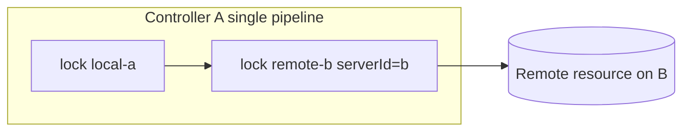
```mermaid
flowchart LR
  subgraph AFlow[Controller A single pipeline]
    L[lock local-a]
    R[lock remote-b serverId=b]
    L --> R
  end
  R --> BR[(Remote resource on B)]
```

#### S05 skip-if-locked 【P1M1】

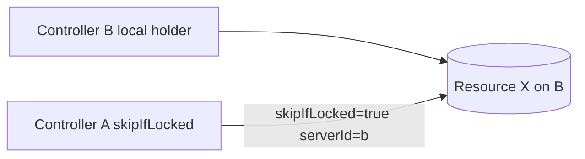
```mermaid
flowchart LR
  B[Controller B local holder] --> XR[(Resource X on B)]
  A[Controller A skipIfLocked] -- skipIfLocked=true serverId=b --> XR
```

#### S06 three-way-mesh 【P1M1】

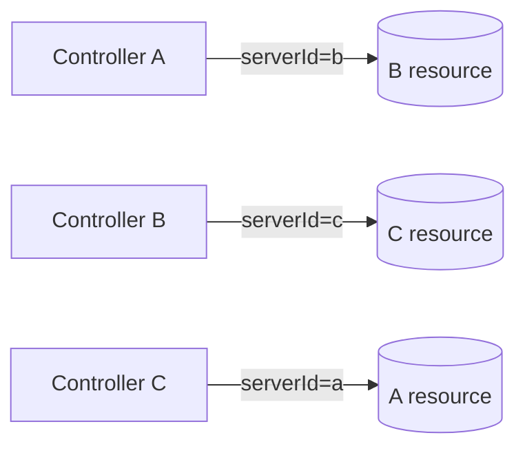
```mermaid
flowchart LR
  A[Controller A] -- serverId=b --> BR[(B resource)]
  B[Controller B] -- serverId=c --> CR[(C resource)]
  C[Controller C] -- serverId=a --> AR[(A resource)]
```

#### S07 fail-closed 【P1M1】

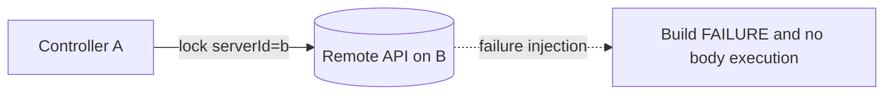
```mermaid
flowchart LR
  A[Controller A] -- lock serverId=b --> BAPI[(Remote API on B)]
  BAPI -. failure injection .-> F[Build FAILURE and no body execution]
```

#### S08 label-env-vars 【P1M1A】

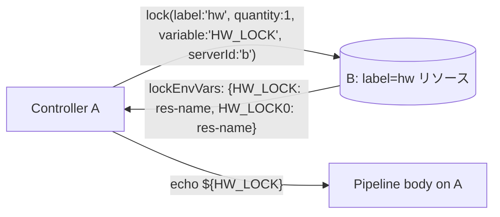
```mermaid
flowchart LR
  A[Controller A] -- "lock(label:'hw', quantity:1, variable:'HW_LOCK', serverId:'b')" --> BHW[(B: label=hw リソース)]
  BHW -- "lockEnvVars: {HW_LOCK: res-name, HW_LOCK0: res-name}" --> A
  A -- "echo ${HW_LOCK}" --> BODY[Pipeline body on A]
```

#### S09 delegated-mode 【P1M1A】

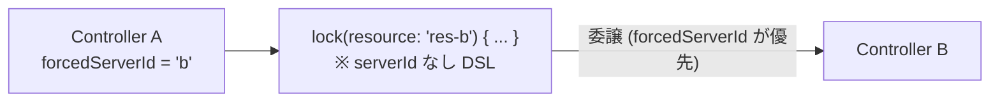
```mermaid
flowchart LR
  CONFIG[Controller A\nforcedServerId = 'b'] --> LOCK["lock(resource: 'res-b') { ... }\n※ serverId なし DSL"]
  LOCK -- "委譲 (forcedServerId が優先)" --> B[Controller B]
```

#### S10 extra-resources 【P1M1B】

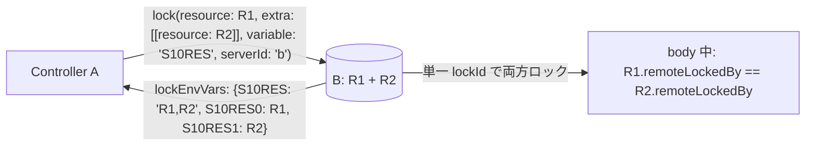
```mermaid
flowchart LR
  A[Controller A] -- "lock(resource: R1, extra: [[resource: R2]], variable: 'S10RES', serverId: 'b')" --> B[(B: R1 + R2)]
  B -- "単一 lockId で両方ロック" --> CHECK["body 中: R1.remoteLockedBy == R2.remoteLockedBy"]
  B -- "lockEnvVars: {S10RES: 'R1,R2', S10RES0: R1, S10RES1: R2}" --> A
```

#### S11 heartbeat-resilience 【P1M1B】

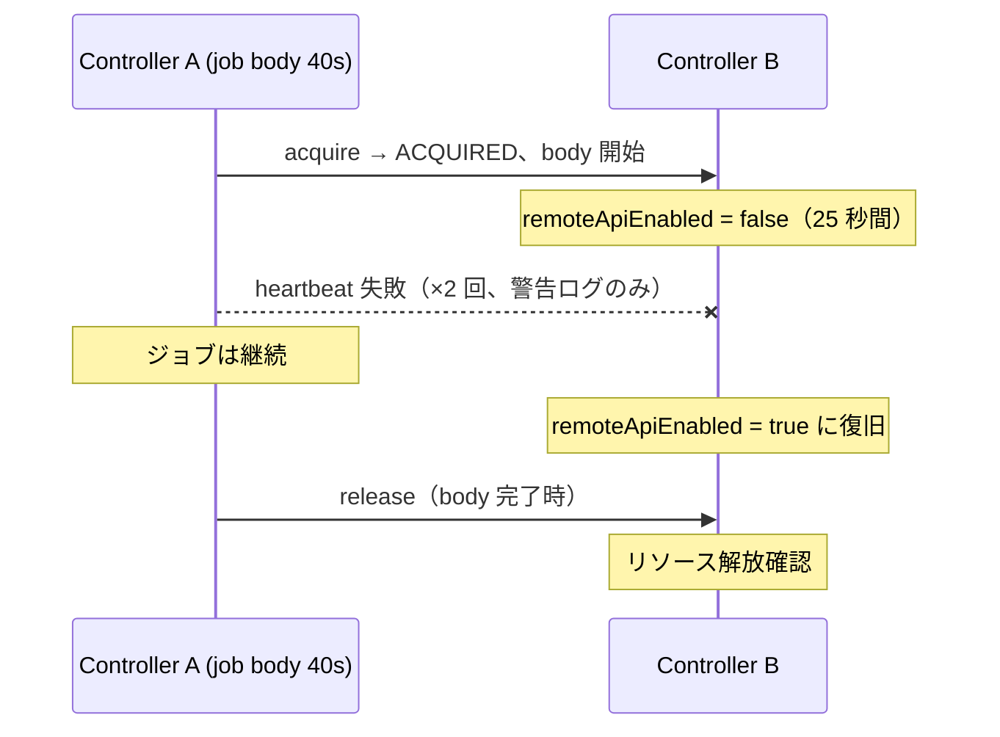
```mermaid
sequenceDiagram
    participant A as Controller A (job body 40s)
    participant B as Controller B

    A->>B: acquire → ACQUIRED、body 開始
    Note over B: remoteApiEnabled = false（25 秒間）
    A--xB: heartbeat 失敗（×2 回、警告ログのみ）
    Note over A: ジョブは継続
    Note over B: remoteApiEnabled = true に復旧
    A->>B: release（body 完了時）
    Note over B: リソース解放確認
```

#### S12 priority-ordering 【P1M1B】

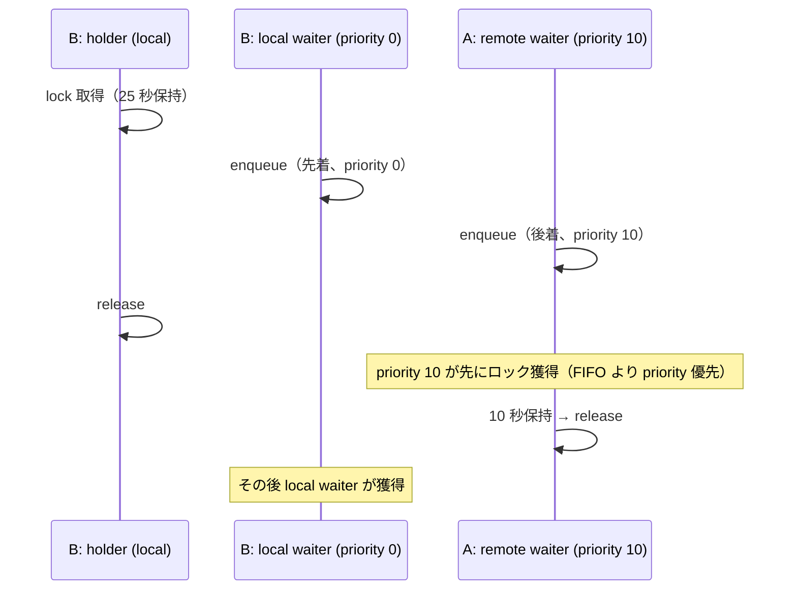
```mermaid
sequenceDiagram
    participant H as B: holder (local)
    participant L as B: local waiter (priority 0)
    participant R as A: remote waiter (priority 10)

    H->>H: lock 取得（25 秒保持）
    L->>L: enqueue（先着、priority 0）
    R->>R: enqueue（後着、priority 10）
    H->>H: release
    Note over R: priority 10 が先にロック獲得（FIFO より priority 優先）
    R->>R: 10 秒保持 → release
    Note over L: その後 local waiter が獲得
```

#### S13 stale-admin-release 【P1M1B】

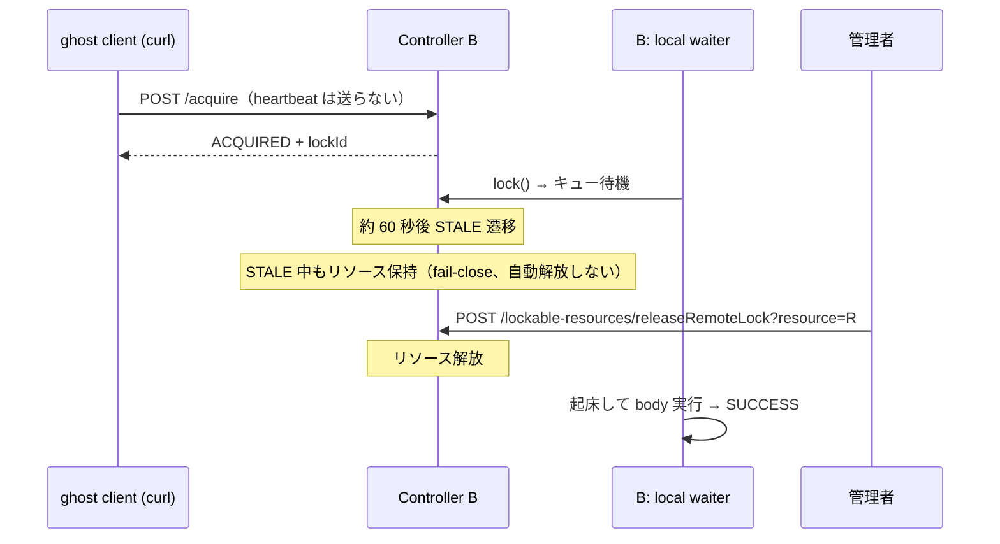
```mermaid
sequenceDiagram
    participant G as ghost client (curl)
    participant B as Controller B
    participant W as B: local waiter
    participant ADM as 管理者

    G->>B: POST /acquire（heartbeat は送らない）
    B-->>G: ACQUIRED + lockId
    W->>B: lock() → キュー待機
    Note over B: 約 60 秒後 STALE 遷移
    Note over B: STALE 中もリソース保持（fail-close、自動解放しない）
    ADM->>B: POST /lockable-resources/releaseRemoteLock?resource=R
    Note over B: リソース解放
    W->>W: 起床して body 実行 → SUCCESS
```

#### S14 extra-label-resources 【P1M1C】

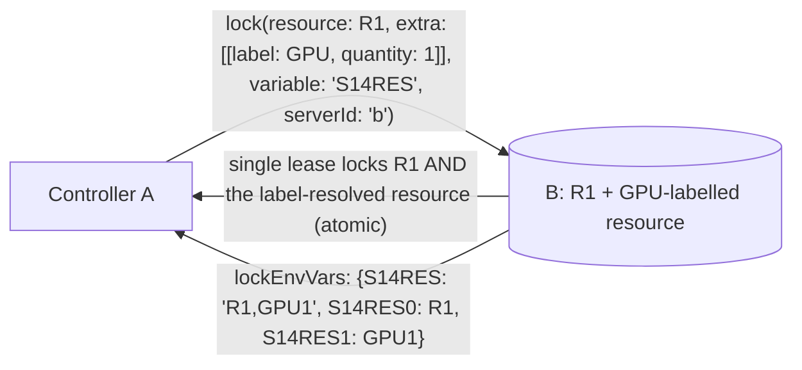
```mermaid
flowchart LR
  A[Controller A] -- "lock(resource: R1, extra: [[label: GPU, quantity: 1]], variable: 'S14RES', serverId: 'b')" --> B[(B: R1 + GPU-labelled resource)]
  B -- "single lease locks R1 AND the label-resolved resource (atomic)" --> A
  B -- "lockEnvVars: {S14RES: 'R1,GPU1', S14RES0: R1, S14RES1: GPU1}" --> A
```

#### S15 label-quantity-all 【P1M1C】

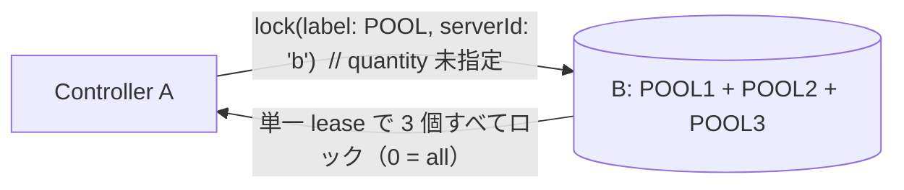
```mermaid
flowchart LR
  A[Controller A] -- "lock(label: POOL, serverId: 'b')  // quantity 未指定" --> B[(B: POOL1 + POOL2 + POOL3)]
  B -- "単一 lease で 3 個すべてロック（0 = all）" --> A
```

#### S16 remote-resource-properties 【P1M1D】

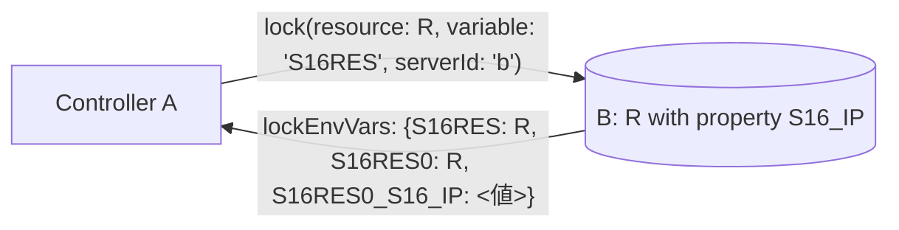
```mermaid
flowchart LR
  A[Controller A] -- "lock(resource: R, variable: 'S16RES', serverId: 'b')" --> B[(B: R with property S16_IP)]
  B -- "lockEnvVars: {S16RES: R, S16RES0: R, S16RES0_S16_IP: <値>}" --> A
```

#### D01 fan-in-4 【P1M1】

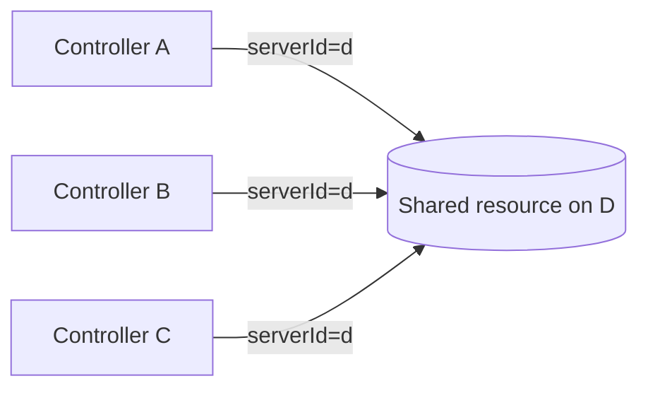
```mermaid
flowchart LR
  A[Controller A] -- serverId=d --> DR[(Shared resource on D)]
  B[Controller B] -- serverId=d --> DR
  C[Controller C] -- serverId=d --> DR
```

#### D02 chain-4 【P1M1】

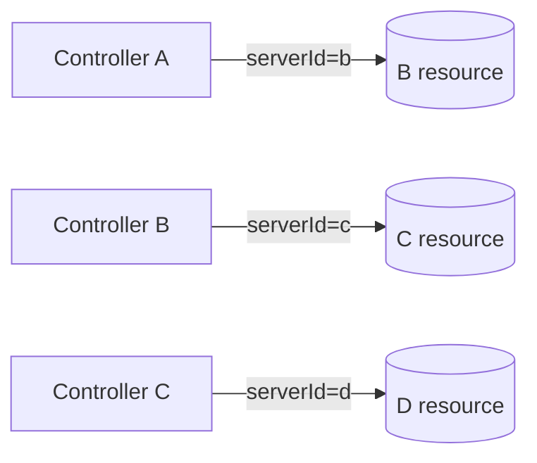
```mermaid
flowchart LR
  A[Controller A] -- serverId=b --> BR[(B resource)]
  B[Controller B] -- serverId=c --> CR[(C resource)]
  C[Controller C] -- serverId=d --> DR[(D resource)]
```

#### D03 diamond 【P1M1】

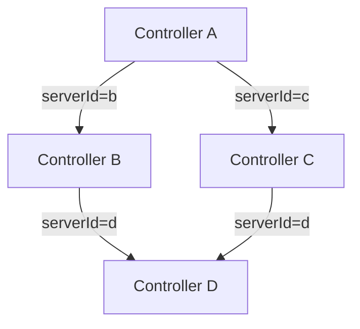
```mermaid
flowchart TD
  A[Controller A]
  B[Controller B]
  C[Controller C]
  D[Controller D]
  A -->|serverId=b| B
  A -->|serverId=c| C
  B -->|serverId=d| D
  C -->|serverId=d| D
```

---

## 実行環境

### 4 コントローラー構成

| サービス名 | コンテナ名 | ホスト公開ポート | コンテナ内部 URL | jenkins home |
|---|---|---|---|---|
| `jenkins-a` | `lrr-jenkins-a` | 8081 | `http://jenkins-a:8080/jenkins` | `jha/` |
| `jenkins-b` | `lrr-jenkins-b` | 8082 | `http://jenkins-b:8080/jenkins` | `jhb/` |
| `jenkins-c` | `lrr-jenkins-c` | 8083 | `http://jenkins-c:8080/jenkins` | `jhc/` |
| `jenkins-d` | `lrr-jenkins-d` | 8084 | `http://jenkins-d:8080/jenkins` | `jhd/` |

各シナリオが必要とするコントローラーは `lib/scenarios.tsv` の `controllers` 列で宣言します。
**run-e2e.sh は選択されたシナリオが必要とする台数だけ起動確認し、揃わないシナリオを名指しで SKIP**
します（旧: 各 D シリーズスクリプトが自前で jenkins-d を probe していた）。

### ハーネス構成

```
run-e2e.sh              シナリオ選択・実行・レポート生成。シナリオ定義は持たない
lib/scenarios.tsv       シナリオ登録簿（唯一の定義元）
                          id / name / series / controllers / axis / summary
lib/scenario.sh         チェックポイント記録・narrative・成果物・details 生成
lib/timings.sh          プラグインの時間定数（名前付き）とドリフト検出
lib/common.sh           Jenkins 操作・REST クライアント・リソース状態・リレー実行
scenarios/<name>.sh     シナリオ本体
```

**シナリオの追加は `lib/scenarios.tsv` に 1 行足すだけ**で、`--only` の選択肢・実行順序・
レポートの行・軸別集計にすべて反映されます（旧: run-e2e.sh 内の 4 箇所を同期させる必要があった）。

### lib/scenario.sh: 判定の記録

チェックポイントは**判定した場所で記録**し、`scenario-details.md` は EXIT トラップで必ず生成されます。

```
scenario_init <id> <name> <results_dir>     初期化（EXIT トラップ設置）
scenario_step "<text>"                       narrative（SEQnn）
scenario_check <label> <action> <expected> <actual>
scenario_check_contains / _absent / _matches / _ge / _lt
scenario_check_resource_free / _resource_locked <label> <ctrl> <resource>
scenario_check_api <label> <status> <actual> <errorCode> <response_file>
scenario_observe <label> <action> <value>    測定値の記録（合否にしない）
scenario_require*                            前提条件（失敗で即停止）
scenario_fact / scenario_artifact / scenario_cleanup_hook / scenario_skip
scenario_finish                              正常終了マーク
```

既定は**累積**（1 回の実行で壊れている箇所を全部出す）。前提条件だけ `scenario_require*` で即停止。
`set -e` による予期しない停止も「どのステップの途中で落ちたか」を含む ABORT 行として記録されます。

### lib/timings.sh: 時間定数

プラグイン側の定数を名前付きで保持し、**実行のたびにプラグインソースと突き合わせて乖離を検出**します
（一致しなければ実行を止める）。時系列シナリオは裸の `sleep 25` ではなくこれらから待ち時間を導出します。

| 変数 | 値 | 出典 |
|---|---|---|
| `RLR_POLL_INTERVAL_S` | 3 | `RemoteClientDefaults.DEFAULT_POLL_INTERVAL_SECONDS` |
| `RLR_HEARTBEAT_INTERVAL_S` | 10 | `RemoteClientDefaults.DEFAULT_HEARTBEAT_INTERVAL_SECONDS` |
| `RLR_REQUEST_TIMEOUT_S` | 5 | `RemoteClientDefaults.DEFAULT_REQUEST_TIMEOUT_SECONDS` |
| `RLR_MAX_POLL_FAILURES` | 20 | `RemoteLockSession.MAX_CONSECUTIVE_POLL_FAILURES` |
| `RLR_STALE_THRESHOLD_S` | 60 | `RemoteLockManager.STALE_THRESHOLD_MS` |
| `RLR_TERMINAL_TTL_S` | 120 | `RemoteLockManager.TERMINAL_TTL_MS` |
| `RLR_CATALOG_TTL_S` | 10 | `RemoteCatalogCache.TTL_MILLIS` |
| `RLR_MAX_BODY_CHARS` | 1048576 | `RemoteApiV1Action.MAX_BODY_CHARS` |

`rlr_inside <threshold>` / `rlr_past <threshold>` でしきい値の内側・外側の待ち時間を導出します
（余裕はポーリング間隔 +1 秒）。

### common.sh 主要ヘルパー

```
# セットアップ
setup_remote_pair(prefix, client_key, server_key, resource, [auth_mode])
  → server 公開 → token 発行 → client に credential 登録 → remote 設定 → 検証 を一括で行う
     （この 5 手順が全シナリオで重複していたのを集約）
expose_resource(server_key, resource)         既存 server に公開リソースを追加
configure_local_resource(base_url, resource)  ローカル専用リソース
configure_label_resource(base_url, resource, label, [expose_label])
configure_forced_server_id / _empty(base_url) 委譲モードの設定・解除
drop_resources(server_key, resource...)       シナリオが作ったリソースの後始末（free のみ削除）

# REST（lock() を通さず API を直接叩く。境界テスト用）
api_acquire / api_acquire_file / api_poll / api_heartbeat / api_release / api_resources
api_field(response_file, key)                 レスポンスのフィールド
remote_record_state(server_key, lock_id)      サーバー側レコードの状態（無ければ GONE）

# 状態
resource_state(controller_key, resource)      EXISTS/LOCKED/QUEUED/REMOTE_LOCK_ID/RESERVED_BY
remote_lease_id(controller_key, resource)     lease id（未保持なら空）
wait_for_resource_free(controller_key, resource, timeout)

# 実行
relay_reset / relay_trigger(key, job, marker) / relay_await_all(timeout)
  → 複数コントローラーの同時実行を 1 レッグ 1 チェックポイントで検証する
abort_build(base_url, build_url)              ビルド中断（赤 X 相当）
console_value(console_file, NAME)             パイプラインが echo した NAME=... の値
poll_until(timeout, command...)               唯一のポーリングループ
```

### 必須コマンド

- `curl`
- `docker`
- `python3`
- `base64`

### run-e2e.sh オプション

```
PLUGIN_DIR=<path> ./run-e2e.sh [options]

--only <name|series>  単一シナリオまたはシリーズのみ実行する（既定: all）
--list                シナリオ登録簿を表示して終了する
--debug               plugin / harness の未コミット変更を許可する。
                      レポートは reports/debug/ に出力され NOT REPRODUCIBLE と明記される
-h, --help            ヘルプを表示する
```

`--debug` なしの実行は必ずプラグインの commit 済み HEAD からビルド・デプロイし直すため、
レポートは常に再現可能な状態を記述します。実行前に `lib/timings.sh` とプラグイン定数の
乖離チェックが走ります。

| シリーズ | 内容 |
|---|---|
| `s` | S01〜S07（P1M1） |
| `m1a` | S08〜S09（P1M1A） |
| `m1b` | S10〜S13（P1M1B） |
| `m1c` | S14〜S15（P1M1C） |
| `m1d` | S16（P1M1D） |
| `m1e` | S17（P1M1E） |
| `m1i` | S18（P1M1I。allocate timeout は TERMINAL_TTL から導出。単体 ~150 秒） |
| `m2m3` | S19〜S22（Phase C） |
| `boundary` | B01〜B07（データ / 時系列 / スケール境界） |
| `d` | D01〜D03（jenkins-d が必要。未起動なら run-e2e.sh が SKIP） |
| `all` | 全 32 シナリオ |

### 実行順序（all）

`lib/scenarios.tsv` の記載順がそのまま実行順です。

```
S01 → … → S22 → B01 → … → B07 → D01 → D02 → D03
```

### レポート

`reports/<runId>-e2e-test.md` に以下を出力します。

- 実行環境（plugin commit / harness commit / commandLine）
- 合否サマリと**軸別カバレッジ**（function / data / time / scale ごとの pass/fail/skip）
- シナリオ一覧（ID / 軸 / 状態 / 成果物リンク）
- 各シナリオの詳細（Result 行・Sequence・Checkpoints 表・Summary・Artifacts）

---

## 共通設定規約

### リソース命名

E2E 実行ごとに同一の Jenkins home を使い回すため、
リソース名にはシナリオ名プレフィックスと `$(date +%s)` のタイムスタンプを付与します。
（`--skip-start` のコンテナ再利用でも前回実行と干渉しない）

```
<prefix>-<timestamp>

例:
  s01-board-a-1748000000   ← S01 で A が公開するリソース
  s10-res1-1781234567      ← S10 の main リソース
```

### exposeLabel

各コントローラーが remote API で公開するリソースには `remote-enabled` ラベルを付与します。
ローカル専用リソースには `local-only` ラベルを付与して区別します。
S08 以降の label-based シナリオでは、公開ラベル（`remote-enabled` 等）に加えて
検索対象ラベル（`hw` 等）を同時に付与します。

### パイプライン記法（P1M1B からの教訓）

**label-only や extra 付きの lock() は scripted pipeline（`node { }`）で記述する。**
Declarative の `steps` ブロックはコンパイル時に `@DataBoundConstructor` の
`resource` 引数を必須扱いするため（upstream 既知問題 JENKINS-50260）、
`lock(label:...)` だけだと `Missing required parameter: "resource"` で失敗する。
Declarative を使う場合は `resource: null` を明示する（S08 で実際に踏んだ）。

### credentials 命名規約

| シナリオ | credentials ID | 配置先 | 内容 | 対象 |
|---|---|---|---|---|
| S01 A→B | `s01-a-for-b` | A | B の admin API トークン | P1M1 |
| S01 B→A | `s01-b-for-a` | B | A の admin API トークン | P1M1 |
| S02 A/C→B | `s02-for-b` | A, C | B の admin API トークン（同 ID・同値） | P1M1 |
| S03 A→B | `s03-a-for-b` | A | B の admin API トークン | P1M1 |
| S04 A→B | `s04-a-for-b` | A | B の admin API トークン | P1M1 |
| S05 A→B | `s05-a-for-b` | A | B の admin API トークン | P1M1 |
| S06 A→B | `s06-a-for-b` | A | B の admin API トークン | P1M1 |
| S06 B→C | `s06-b-for-c` | B | C の admin API トークン | P1M1 |
| S06 C→A | `s06-c-for-a` | C | A の admin API トークン | P1M1 |
| S07 有効 | `s07-valid-creds` | A | B の admin API トークン | P1M1 |
| S07 認証失敗 | `s07-invalid-auth-creds` | A | `admin/not-a-valid-api-token` | P1M1 |
| S07 ID 欠落 | `s07-missing-creds` | （未作成） | 存在しない ID を指定 | P1M1 |
| S07 型不一致 | `s07-type-mismatch-creds` | A | StringCredentialsImpl | P1M1 |
| S08 A→B | `s08-a-for-b` | A | B の admin API トークン | P1M1A |
| S09 A→B | `s09-a-for-b` | A | B の admin API トークン | P1M1A |
| S10 A→B | `s10-a-for-b` | A | B の admin API トークン | P1M1B |
| S11 A→B | `s11-a-for-b` | A | B の admin API トークン | P1M1B |
| S12 A→B | `s12-a-for-b` | A | B の admin API トークン | P1M1B |
| S13 (curl 直叩き) | なし（API トークンを直接使用） | - | B の admin API トークン | P1M1B |
| S14 A→B | `s14-a-for-b` | A | B の admin API トークン | P1M1C |
| S15 A→B | `s15-a-for-b` | A | B の admin API トークン | P1M1C |
| S16 A→B | `s16-a-for-b` | A | B の admin API トークン | P1M1D |
| S17 A→B | `s17-a-for-b` | A | B の admin API トークン | P1M1E |
| D01 A,B,C→D | `d01-for-d` | A, B, C | D の admin API トークン | P1M1 |
| D02 A→B | `d02-a-for-b` | A | B の admin API トークン | P1M1 |
| D02 B→C | `d02-b-for-c` | B | C の admin API トークン | P1M1 |
| D02 C→D | `d02-c-for-d` | C | D の admin API トークン | P1M1 |
| D03 A→B | `d03-a-for-b` | A | B の admin API トークン | P1M1 |
| D03 A→C | `d03-a-for-c` | A | C の admin API トークン | P1M1 |
| D03 B→D | `d03-b-for-d` | B | D の admin API トークン | P1M1 |
| D03 C→D | `d03-c-for-d` | C | D の admin API トークン | P1M1 |

---

## S01: mutual-peer — 相互 peer 共有 【P1M1】

### テスト意図

A→B リレー（A がクライアント、B がサーバー）と B→A リレー（B がクライアント、A がサーバー）が
同時に独立して成立することを確認します。

issue #1025 の「独立した一方通行リレーの組み合わせによる相互共有」の最も基本的なケースです。

```
A pipeline:  lock(resource: '<A_RES>', serverId: 'b') { sleep 20s }   # A→B リレー
B pipeline:  lock(resource: '<B_RES>', serverId: 'a') { sleep 20s }   # B→A リレー
（同時起動）
```

### 前提条件

- **Controller A**: `remoteApiEnabled=true`, `exposeLabel=remote-enabled`, A リソース公開
- **Controller B**: `remoteApiEnabled=true`, `exposeLabel=remote-enabled`, B リソース公開
- **A 側 credentials** (`s01-a-for-b`): A に作成、B の admin API トークン
- **B 側 credentials** (`s01-b-for-a`): B に作成、A の admin API トークン
- **A の remote 設定**: `remotes[a→b]` = B の internal URL + `s01-a-for-b`
- **B の remote 設定**: `remotes[b→a]` = A の internal URL + `s01-b-for-a`

### パイプライン構成

| job 名 | controller | 内容 |
|---|---|---|
| `s01-a-holder` | A | `lock(resource: A公開リソース, serverId: 'b')` で 20 秒 sleep |
| `s01-b-holder` | B | `lock(resource: B公開リソース, serverId: 'a')` で 20 秒 sleep |

### 検証基準

| ID | 検証項目 | 期待値 |
|---|---|---|
| CP01 | `s01-a-holder` の build 結果 | `SUCCESS` |
| CP02 | `s01-b-holder` の build 結果 | `SUCCESS` |
| CP03 | A コンソールに `A_ACQUIRED` が出ること | `true` |
| CP04 | B コンソールに `B_ACQUIRED` が出ること | `true` |
| CP05 | A コンソールに `Remote lock acquired on` が出ること | `true`（WARN 扱い） |
| CP06 | B コンソールに `Remote lock acquired on` が出ること | `true`（WARN 扱い） |
| CP07 | 両ビルドが互いに待機せず並走したこと（合計所要時間 < 40 秒） | `true` |

CP07 は「A と B のリレーが独立していること」の傍証です。

### 出力ファイル

```
reports/<runId>-e2e-test/mutual-peer/a-console.txt
reports/<runId>-e2e-test/mutual-peer/b-console.txt
reports/<runId>-e2e-test/mutual-peer/summary.txt
reports/<runId>-e2e-test/mutual-peer/scenario-details.md
```

---

## S02: fan-in-contention — 複数クライアントの同一リソース競合 【P1M1】

### テスト意図

A と C が同じ B のリソースを同時に取得しようとするとき、
キューが正しく動作すること（片方が QUEUED 状態を経由して順に取得すること）を確認します。

```
A pipeline:  lock(resource: '<SHARED>', serverId: 'b') { sleep 25s }   # 先取得
C pipeline:  lock(resource: '<SHARED>', serverId: 'b') { sleep 5s  }   # 待機 → 後取得
（A 起動後すぐに C を起動）
```

### 前提条件

- **Controller B**: `remoteApiEnabled=true`, `exposeLabel=remote-enabled`, 共有リソース 1 個
- **A 側 credentials** (`s02-for-b`): B の admin API トークン（A に作成）
- **C 側 credentials** (`s02-for-b`): 同 ID・同値（C に作成）
- **A の remote 設定**: `remotes[a→b]`
- **C の remote 設定**: `remotes[c→b]`

### パイプライン構成

| job 名 | controller | 内容 |
|---|---|---|
| `s02-holder` | A | 共有リソースを 25 秒保持 |
| `s02-waiter` | C | 共有リソースを取得後 5 秒保持 |

### 検証基準

| ID | 検証項目 | 期待値 |
|---|---|---|
| CP01 | `s02-holder` の build 結果 | `SUCCESS` |
| CP02 | `s02-waiter` の build 結果 | `SUCCESS` |
| CP03 | A コンソールに `HOLDER_ACQUIRED` | `true` |
| CP04 | C コンソールに `WAITER_ACQUIRED` | `true` |
| CP05 | C の waiter 所要時間 ≥ 15 秒 | `true`（holder 保持中に待機したことの確認） |

### 出力ファイル

```
reports/<runId>-e2e-test/fan-in-contention/holder-console.txt
reports/<runId>-e2e-test/fan-in-contention/waiter-console.txt
reports/<runId>-e2e-test/fan-in-contention/summary.txt
reports/<runId>-e2e-test/fan-in-contention/scenario-details.md
```

---

## S03: server-self-use — サーバーがローカル保持中にリモートクライアントが競合 【P1M1】

### テスト意図

B の pipeline がリソース X をローカルロック（`lock(resource: X)`、`serverId` なし）で保持している間、
A が同じリソース X をリモート経由（`lock(resource: X, serverId: 'b')`）で取得しようとするとき、
`remoteLockedBy` と `isLocked()` が正しく排他されることを確認します。

「サーバー側のローカルロックとリモートロックが同一リソースで排他できるか」を検証する
最重要シナリオです。plugin 側の実装不備があればここで検出できます。

```
B pipeline (local):   lock(resource: X) { sleep 30s }          # ローカルで保持
A pipeline (remote):  lock(resource: X, serverId: 'b') { ... }  # リモートで取得を試みる
（B local 起動後すぐに A を起動）
```

### 前提条件

- **Controller B**: `remoteApiEnabled=true`, `exposeLabel=remote-enabled`, リソース X を公開
  （B の pipeline は serverId なしでも同じ X を lock できます）
- **A 側 credentials** (`s03-a-for-b`): A に作成、B の admin API トークン
- **A の remote 設定**: `remotes[a→b]`

### パイプライン構成

| job 名 | controller | 内容 |
|---|---|---|
| `s03-local-holder` | B | リソース X を `lock(resource: X)` でローカル保持（30 秒） |
| `s03-remote-waiter` | A | リソース X を `lock(resource: X, serverId: 'b')` でリモート取得 |

### 検証基準

| ID | 検証項目 | 期待値 |
|---|---|---|
| CP01 | `s03-local-holder` の build 結果 | `SUCCESS` |
| CP02 | `s03-remote-waiter` の build 結果 | `SUCCESS` |
| CP03 | B コンソールに `LOCAL_HOLDER_ACQUIRED` | `true` |
| CP04 | A コンソールに `REMOTE_WAITER_ACQUIRED` | `true` |
| CP05 | A の remote waiter 所要時間 ≥ 20 秒 | `true`（B local hold 中に A が待機したことの確認） |

### 出力ファイル

```
reports/<runId>-e2e-test/server-self-use/local-holder-console.txt
reports/<runId>-e2e-test/server-self-use/remote-waiter-console.txt
reports/<runId>-e2e-test/server-self-use/summary.txt
reports/<runId>-e2e-test/server-self-use/scenario-details.md
```

---

## S04: mixed-local-remote — ローカルリソースとリモートリソースの同時保持 【P1M1】

### テスト意図

同一パイプライン内で A 自身のローカルリソースと B のリモートリソースを
ネストした `lock()` で同時保持できることを確認します。
また、両方のリソースが解放されることも確認します。

```
A pipeline:
  lock(resource: 'local-a-<ts>') {                       # A のローカルリソース
    lock(resource: 'remote-b-<ts>', serverId: 'b') {     # B のリモートリソース
      echo "BOTH_ACQUIRED"
    }
  }
```

### 前提条件

- **Controller A**: ローカル専用リソース `s04-local-a-<timestamp>` を作成（exposeLabel なし）
- **Controller B**: `remoteApiEnabled=true`, `exposeLabel=remote-enabled`, `s04-remote-b-<timestamp>` を公開
- **A 側 credentials** (`s04-a-for-b`): B の admin API トークン
- **A の remote 設定**: `remotes[a→b]`

### パイプライン構成

| job 名 | controller | 内容 |
|---|---|---|
| `s04-mixed-lock` | A | `lock(local-a) { lock(remote-b, serverId:'b') { echo BOTH_ACQUIRED } }` |

### 検証基準

| ID | 検証項目 | 期待値 |
|---|---|---|
| CP01 | `s04-mixed-lock` の build 結果 | `SUCCESS` |
| CP02 | A コンソールに `BOTH_ACQUIRED` | `true` |
| CP03 | B 側リソース `s04-remote-b-*` が解放されていること | `true`（Groovy scriptText で確認） |
| CP04 | A 側リソース `s04-local-a-*` が解放されていること | `true`（Groovy scriptText で確認） |

CP03/CP04 は `LockableResourcesManager.get().fromName(...).isLocked()` で確認します。

### 出力ファイル

```
reports/<runId>-e2e-test/mixed-local-remote/console.txt
reports/<runId>-e2e-test/mixed-local-remote/summary.txt
reports/<runId>-e2e-test/mixed-local-remote/scenario-details.md
```

---

## S05: skip-if-locked — skipIfLocked のリモート経路 【P1M1】

### テスト意図

B がリソース X をローカルで保持している間、
A が `skipIfLocked: true` でリモート取得を試みたとき、
body を実行せずに pipeline が `SUCCESS` になることを確認します。

```
B pipeline (local):   lock(resource: X) { sleep 30s }
A pipeline (remote):  lock(resource: X, skipIfLocked: true, serverId: 'b') {
                        echo "SKIP_BODY_EXECUTED"   ← 出てはならない
                      }
（B local 起動後すぐに A を起動）
```

### 前提条件

- **Controller B**: `remoteApiEnabled=true`, `exposeLabel=remote-enabled`, リソース X を公開
- **A 側 credentials** (`s05-a-for-b`): B の admin API トークン
- **A の remote 設定**: `remotes[a→b]`

### パイプライン構成

| job 名 | controller | 内容 |
|---|---|---|
| `s05-local-holder` | B | リソース X をローカル保持（30 秒） |
| `s05-skip-test` | A | `lock(resource: X, skipIfLocked: true, serverId: 'b') { echo SKIP_BODY_EXECUTED }` |

### 検証基準

| ID | 検証項目 | 期待値 |
|---|---|---|
| CP01 | `s05-local-holder` の build 結果 | `SUCCESS` |
| CP02 | `s05-skip-test` の build 結果 | `SUCCESS` |
| CP03 | A コンソールに `SKIP_BODY_EXECUTED` が**出ない**こと | `true` |
| CP04 | A コンソールに skip を示す文言が出ること | `true`（WARN 扱い） |

### 出力ファイル

```
reports/<runId>-e2e-test/skip-if-locked/local-holder-console.txt
reports/<runId>-e2e-test/skip-if-locked/skip-test-console.txt
reports/<runId>-e2e-test/skip-if-locked/summary.txt
reports/<runId>-e2e-test/skip-if-locked/scenario-details.md
```

---

## S06: three-way-mesh — 3 コントローラー全リレー並走 【P1M1】

### テスト意図

A→B, B→C, C→A の 3 つの一方通行リレーが同時に成立することを確認します。
各リレーは完全に独立しており、互いの状態に影響を与えないことが期待されます。

```
A pipeline:  lock(resource: B公開リソース, serverId: 'b') { sleep 15s }   # A→B
B pipeline:  lock(resource: C公開リソース, serverId: 'c') { sleep 15s }   # B→C
C pipeline:  lock(resource: A公開リソース, serverId: 'a') { sleep 15s }   # C→A
（3 パイプラインを同時起動）
```

### 前提条件

- **Controller A/B/C**: それぞれ `remoteApiEnabled=true`, `exposeLabel=remote-enabled`, リソース公開
- credentials と remote 設定:
  - `s06-a-for-b`: A に作成（B の API トークン）、A の `remotes[a→b]`
  - `s06-b-for-c`: B に作成（C の API トークン）、B の `remotes[b→c]`
  - `s06-c-for-a`: C に作成（A の API トークン）、C の `remotes[c→a]`

### パイプライン構成

| job 名 | controller | serverId | 保持時間 |
|---|---|---|---|
| `s06-a-to-b` | A | `b` | 15 秒 |
| `s06-b-to-c` | B | `c` | 15 秒 |
| `s06-c-to-a` | C | `a` | 15 秒 |

### 検証基準

| ID | 検証項目 | 期待値 |
|---|---|---|
| CP01 | `s06-a-to-b` の build 結果 | `SUCCESS` |
| CP02 | `s06-b-to-c` の build 結果 | `SUCCESS` |
| CP03 | `s06-c-to-a` の build 結果 | `SUCCESS` |
| CP04 | A コンソールに `A_ACQUIRED` | `true` |
| CP05 | B コンソールに `B_ACQUIRED` | `true` |
| CP06 | C コンソールに `C_ACQUIRED` | `true` |
| CP07 | 全ビルドが互いに待機せず並走（合計所要時間 < 30 秒） | `true` |
| CP08 | 全リソースが解放されていること（LRM 状態確認） | `true` |

### 出力ファイル

```
reports/<runId>-e2e-test/three-way-mesh/a-console.txt
reports/<runId>-e2e-test/three-way-mesh/b-console.txt
reports/<runId>-e2e-test/three-way-mesh/c-console.txt
reports/<runId>-e2e-test/three-way-mesh/summary.txt
reports/<runId>-e2e-test/three-way-mesh/scenario-details.md
```

---

## S07: fail-closed — remote API 障害・設定誤りでの fail-closed 動作 【P1M1】

### テスト意図

remote API の通信失敗・認証失敗・設定誤りが発生したとき、
lock body を実行せずに build を `FAILURE` にすることを確認します。

### 共通の前提

- **Controller B**: 認証必須の remote server（ベース設定）
- **Controller A**: クライアント。credentials `s07-valid-creds` をベースに使用

### lock body

失敗系の全ケースで次の body を使います:

```groovy
lock(resource: X, serverId: 'b') {
  echo "UNEXPECTED_BODY_EXECUTION"
}
```

body が実行されたらログに `UNEXPECTED_BODY_EXECUTION` が残ります。

### ケース一覧

| ID | ケース名 | 障害注入方法 | 期待 build 結果 |
|---|---|---|---|
| S07-C01 | `remote-down` | `docker compose stop jenkins-b` で B を停止 | `FAILURE` |
| S07-C02 | `timeout` | remote URL を `http://10.255.255.1:18082/jenkins`（到達不能）に変更 | `FAILURE` |
| S07-C03 | `auth-error` | credentials に `admin/not-a-valid-api-token` を設定 | `FAILURE` |
| S07-C04 | `missing-credentials-id` | remote connection に存在しない credentials ID を設定 | `FAILURE` |
| S07-C05 | `credentials-type-mismatch` | `StringCredentialsImpl` の ID を remote connection に設定 | `FAILURE` |

### 検証基準（全ケース共通）

| ID | 検証項目 | 期待値 |
|---|---|---|
| CP01 | build 結果 | `FAILURE` |
| CP02 | コンソールに障害を示す文言が出ること | `true`（WARN 扱い） |
| CP03 | コンソールに `UNEXPECTED_BODY_EXECUTION` が**出ない**こと | `true` |

S07-C04/C05 追加: コンソールに `Remote credentials not found for serverId=b, credentialsId=` が出ること

### 出力ファイル

```
reports/<runId>-e2e-test/fail-closed/remote-down/console.txt
reports/<runId>-e2e-test/fail-closed/timeout/console.txt
reports/<runId>-e2e-test/fail-closed/auth-error/console.txt
reports/<runId>-e2e-test/fail-closed/missing-credentials-id/console.txt
reports/<runId>-e2e-test/fail-closed/credentials-type-mismatch/console.txt
reports/<runId>-e2e-test/fail-closed/scenario-details.md
```

---

## S08: label-env-vars — label 指定取得と lockEnvVars 展開 【P1M1A】

### テスト意図

A が `label` と `variable` を指定して B のリソースをリモート取得したとき:

1. B 側で `label` に一致するリソースが取得されること
2. B が生成した `lockEnvVars` が A の pipeline body 内の環境変数として展開されること
3. `echo ${HW_LOCK}` で取得したリソース名が出力されること

```
A pipeline:
  lock(label: 'hw', resource: null, quantity: 1, variable: 'HW_LOCK', serverId: 'b') {
    echo "HW_LOCK=${env.HW_LOCK}"          // 例: "HW_LOCK=s08-hw-board-1748..."
    echo "HW_LOCK0=${env.HW_LOCK0}"        // 同じリソース名
  }
```

これが local `lock(label: 'hw', quantity: 1, variable: 'HW_LOCK')` と等価であることの証左です。

> **注意**: Declarative pipeline では `resource: null` の明示が必須
> （JENKINS-50260、[パイプライン記法](#パイプライン記法p1m1b-からの教訓)参照）。

### 前提条件

- **Controller B**: `remoteApiEnabled=true`, `exposeLabel=remote-enabled`
- **B のリソース**: `s08-hw-board-<timestamp>` に `remote-enabled` + `hw` ラベルを付与
- **A 側 credentials** (`s08-a-for-b`): B の admin API トークン
- **A の remote 設定**: `remotes[a→b]` = B の internal URL + `s08-a-for-b`

### パイプライン構成

| job 名 | controller | 内容 |
|---|---|---|
| `s08-label-env` | A | `lock(label:'hw', resource: null, quantity:1, variable:'HW_LOCK', serverId:'b') { echo HW_LOCK=... ; echo HW_LOCK0=... }` |

### 検証基準

| ID | 検証項目 | 期待値 |
|---|---|---|
| CP01 | `s08-label-env` の build 結果 | `SUCCESS` |
| CP02 | A コンソールに `HW_LOCK=s08-hw-board-` で始まる行が出ること | `true` |
| CP03 | A コンソールに `HW_LOCK0=s08-hw-board-` で始まる行が出ること | `true` |
| CP04 | CP02 と CP03 の値が一致すること（1 リソース取得なので variable と variable0 は同値） | `true` |
| CP05 | B 側リソース `s08-hw-board-*` がジョブ完了後に解放されていること | `true` |
| CP06 | `Remote lock acquired on` が A コンソールに出ること | `true` |

### 出力ファイル

```
reports/<runId>-e2e-test/label-env-vars/console.txt
reports/<runId>-e2e-test/label-env-vars/summary.txt
reports/<runId>-e2e-test/label-env-vars/scenario-details.md
```

---

## S09: delegated-mode — forcedServerId による透過委譲 【P1M1A】

### テスト意図

A の `forcedServerId = 'b'` を設定した状態で、`serverId` 指定なしの `lock()` DSL を実行したとき:

1. B のリモート API に lock が委譲されること（A の build ログに委譲の証跡があること）
2. パイプライン body が正常に実行されること
3. `forcedServerId` をクリアした後は B に委譲されず、ローカルの挙動に戻ること（後片付け確認）

```
A pipeline (forcedServerId='b'):
  lock(resource: '<B_RES>') {        // serverId なし
    echo "DELEGATED_ACQUIRED"
  }
```

DSL 作成者は `serverId` を書かなくても、環境設定により自動で B に委譲されます。

### 前提条件

- **Controller B**: `remoteApiEnabled=true`, `exposeLabel=remote-enabled`, リソース公開
- **A 側 credentials** (`s09-a-for-b`): B の admin API トークン
- **A の remote 設定**: `remotes[a→b]` = B の internal URL + `s09-a-for-b`
- **A の `forcedServerId`**: `b`（シナリオ開始時に設定、終了後にクリア）

### パイプライン構成

| job 名 | controller | DSL | forcedServerId |
|---|---|---|---|
| `s09-delegated` | A | `lock(resource: B_RES) { echo DELEGATED_ACQUIRED }` | `b` (設定済み) |
| `s09-local-fallback` | A | `lock(resource: A_LOCAL_RES) { echo LOCAL_ACQUIRED }` | `` (クリア後) |

### 検証基準

| ID | 検証項目 | 期待値 |
|---|---|---|
| CP01 | `s09-delegated` の build 結果 | `SUCCESS` |
| CP02 | A コンソールに `DELEGATED_ACQUIRED` が出ること | `true` |
| CP03 | A コンソールに `Remote lock acquired on` が出ること（リモート委譲の証跡） | `true` |
| CP04 | A コンソールに `serverId=b` が含まれること（forcedServerId 経由の委譲先確認） | `true` |
| CP05 | `s09-local-fallback` の build 結果 | `SUCCESS` |
| CP06 | `s09-local-fallback` コンソールに `LOCAL_ACQUIRED` が出ること | `true` |
| CP07 | `s09-local-fallback` コンソールに `Remote lock acquired on` が**出ない**こと（ローカル復帰の確認） | `true` |
| CP08 | B 側リソース `s09-res-b-*` が解放されていること | `true` |

CP05〜CP07 は `forcedServerId` クリア後のローカル挙動復帰を確認します。

### 出力ファイル

```
reports/<runId>-e2e-test/delegated-mode/delegated-console.txt
reports/<runId>-e2e-test/delegated-mode/fallback-console.txt
reports/<runId>-e2e-test/delegated-mode/summary.txt
reports/<runId>-e2e-test/delegated-mode/scenario-details.md
```

---

## S10: extra-resources — extra アトミック取得 【P1M1B】

### テスト意図

`extra` 付き remote lock が**部分ロックを起こさない**こと（M1A レビュー指摘 3-1 の解消確認）。

1. main + extra の両リソースが取得されること
2. 両リソースの `remoteLockedBy` が**同一 lockId** であること（単一 lease = アトミック）
3. `variable` の結合値が**カンマ区切り**であること（指摘 3-2 の解消確認）
4. release で両リソースが同時に解放されること

### パイプライン構成

scripted pipeline を使用（[パイプライン記法](#パイプライン記法p1m1b-からの教訓)参照）。

| job 名 | controller | 内容 |
|---|---|---|
| `s10-extra` | A | `lock(resource: R1, extra: [[resource: R2]], variable: 'S10RES', serverId: 'b') { echo + sleep 8 }` |

### 検証基準

| ID | 検証項目 | 期待値 |
|---|---|---|
| CP01 | build 結果 | `SUCCESS` |
| CP02 | body 実行中、B 側で R1・R2 の `remoteLockedBy` が同一非 null 値 | `true`（アトミック性の直接検証） |
| CP03 | `S10RES` に R1・R2 両方が含まれ、カンマ区切りであること | `true` |
| CP04 | `S10RES0` / `S10RES1` の個別変数が存在すること | `true` |
| CP05 | 完了後に R1・R2 とも解放されていること | `true` |
| CP06 | `Remote lock acquired on` がコンソールに出ること | `true` |

### 出力ファイル

```
reports/<runId>-e2e-test/extra-resources/console.txt
reports/<runId>-e2e-test/extra-resources/summary.txt
reports/<runId>-e2e-test/extra-resources/scenario-details.md
```

---

## S11: heartbeat-resilience — heartbeat 失敗時のジョブ継続 【P1M1B】

### テスト意図

heartbeat 失敗がジョブを殺さないこと（M1B 決定 B の実証）。
**テストが空振りで通らないよう、heartbeat 失敗が実際に起きたことをログで実証する。**

### 障害注入方法

body 実行中（40 秒）に B の `remoteApiEnabled` を 25 秒間 `false` にする。
heartbeat（10 秒間隔）が 2 回程度失敗する。body 終了前に復旧させ、
最終 release は成功させる。

### 検証基準

| ID | 検証項目 | 期待値 |
|---|---|---|
| CP01 | build 結果（heartbeat 失敗を挟んでも） | `SUCCESS` |
| CP02 | body が最後まで実行されたこと（`S11_BODY_END` マーカー） | `true` |
| CP03 | A コンテナログに `Remote heartbeat failed (continuing job; server retains lock)` 警告が**実際に出ている**こと（`docker logs --since` で取得） | 1 件以上 |
| CP04 | 完了後に B 側リソースが解放されていること | `true` |

CP03 が無いと「障害注入が効かず普通に成功しただけ」を検出できない。
警告ログは `reports/<runId>-e2e-test/heartbeat-resilience/heartbeat-warnings.txt` に保存する。

### 出力ファイル

```
reports/<runId>-e2e-test/heartbeat-resilience/console.txt
reports/<runId>-e2e-test/heartbeat-resilience/heartbeat-warnings.txt
reports/<runId>-e2e-test/heartbeat-resilience/summary.txt
reports/<runId>-e2e-test/heartbeat-resilience/scenario-details.md
```

---

## S12: priority-ordering — 統一キュー priority ディスパッチ 【P1M1B】

### テスト意図

remote 待機者が LRM 統一キューに参加し、**priority が local / remote 横断で
効く**こと（M1B 決定 E・統一キューブリッジの中核検証）。

### 競合設計

1. B 上の holder（local job）がリソースを 25 秒保持
2. **先に** B 上の local waiter（priority 0）が enqueue
3. **後から** A の remote waiter（priority 10, serverId: 'b'）が enqueue
4. holder 解放後、**remote waiter が先に**ロックを獲得（10 秒保持）
5. その後 local waiter が獲得

### 判別性（テストの感度）

holder 解放後のポーリングで:

- priority が正しい → リソースは **remote-locked**（`remoteLockedBy != null`）として観測される
- priority が壊れて FIFO になっている → 先着の local waiter が獲得し、
  **build lock**（`isLocked()`）として観測される

観測値が排他的なので、リトライ等で偶然 PASS することがない。

### 検証基準

| ID | 検証項目 | 期待値 |
|---|---|---|
| CP01 | holder / local waiter / remote waiter の 3 build とも | `SUCCESS` |
| CP02 | holder 解放後、リソースが remote-locked として先に観測される（local の build lock が先に観測されたら FAIL） | `true` |
| CP03 | 両 waiter の body マーカーが出力されること | `true` |
| CP04 | 終了後リソースが free であること | `true` |

### 出力ファイル

```
reports/<runId>-e2e-test/priority-ordering/holder-console.txt
reports/<runId>-e2e-test/priority-ordering/local-waiter-console.txt
reports/<runId>-e2e-test/priority-ordering/remote-high-console.txt
reports/<runId>-e2e-test/priority-ordering/summary.txt
reports/<runId>-e2e-test/priority-ordering/scenario-details.md
```

---

## S13: stale-admin-release — STALE 遷移と管理者解放 【P1M1B】

### テスト意図

fail-close 設計の完成形（M1B 設計書 §8）を end-to-end で実証する:

1. heartbeat を送らない lease が STALE に遷移すること（しきい値 ~60 秒）
2. STALE 中も**自動解放されない**こと（fail-close）
3. 管理者の Force Release エンドポイントで解放できること
4. 解放により local 待機者が起床すること（統一キューの起床経路）

### ghost client 方式

プラグインのクライアント実装は heartbeat を必ず送るため、curl で直接
`POST /lockable-resources/remote/v1/acquire/` を叩いて「heartbeat を送らない
クライアント」を作る。lockId は応答 JSON から取得する。

### 検証基準

| ID | 検証項目 | 期待値 |
|---|---|---|
| CP01 | ghost acquire の応答 | `state=ACQUIRED` + lockId |
| CP02 | heartbeat なしで約 60 秒後に record が `STALE` になること（Groovy で `RemoteLockManager.find(lockId).getState()` をポーリング） | `true` |
| CP03 | STALE 中もリソースが保持されていること（`remoteLockedBy != null`） | `true`（fail-close） |
| CP04 | `POST /lockable-resources/releaseRemoteLock?resource=R`（要 UNLOCK 権限 + crumb） | 成功 |
| CP05 | 待機していた local job が起床し `SUCCESS` で完了すること | `true` |
| CP06 | 終了後リソースが free であること | `true` |

### 所要時間

STALE しきい値（`max(heartbeatInterval × 6, 60)` = 60 秒）の待機を含むため、
S13 単体で約 70〜90 秒かかる。

### 出力ファイル

```
reports/<runId>-e2e-test/stale-admin-release/waiter-console.txt
reports/<runId>-e2e-test/stale-admin-release/summary.txt
reports/<runId>-e2e-test/stale-admin-release/scenario-details.md
```

---

## S14: extra-label-resources — label 指定 extra のアトミック取得 【P1M1C】

### テスト意図

`extra` に **label 指定エントリ**を含む remote lock が、ラベルで解決された
リソースを実際にロックすること（M1B レビュー指摘 **C-1** の解消確認）。

M1B では label 指定の extra エントリがサーバー側で**黙って捨てられ**、main だけ
ロックして body が走る（fail-open の部分ロック）状態だった。本シナリオは、
label-extra が main と**単一 lease でアトミックに取得**されることを直接実証する。

1. main resource（R1）と label-extra が解決したリソース（GPU）の両方が取得されること
2. 両リソースの `remoteLockedBy` が**同一 lockId** であること（単一 lease = アトミック）
3. `variable` の結合値がカンマ区切りで両リソースを含むこと
4. release で両リソースが同時に解放されること

### B 側セットアップ

- R1: `configure_remote_server` で公開リソース（`remote-enabled`）。
- GPU: `configure_label_resource` で `[remote-enabled, <GPU_LABEL>]` の 2 ラベルを付与
  （公開かつ label-match 可能）。`GPU_LABEL` はタイムスタンプ付きで一意化。

### パイプライン構成

scripted pipeline を使用（[パイプライン記法](#パイプライン記法p1m1b-からの教訓)参照）。

| job 名 | controller | 内容 |
|---|---|---|
| `s14-extra-label` | A | `lock(resource: R1, extra: [[label: GPU_LABEL, quantity: 1]], variable: 'S14RES', serverId: 'b') { echo + sleep 8 }` |

### 検証基準

| ID | 検証項目 | 期待値 |
|---|---|---|
| CP01 | build 結果 | `SUCCESS` |
| CP02 | body 実行中、B 側で R1・GPU の `remoteLockedBy` が同一非 null 値（**C-1 の核心**: label-extra が捨てられず単一 lease で取得） | `true` |
| CP03 | `S14RES` に R1・GPU 両方が含まれ、カンマ区切りであること | `true` |
| CP04 | `S14RES0` / `S14RES1` の個別変数が存在すること | `true` |
| CP05 | 完了後に R1・GPU とも解放されていること | `true` |
| CP06 | `Remote lock acquired on` がコンソールに出ること | `true` |

### 出力ファイル

```
reports/<runId>-e2e-test/extra-label-resources/console.txt
reports/<runId>-e2e-test/extra-label-resources/summary.txt
reports/<runId>-e2e-test/extra-label-resources/scenario-details.md
```

---

## S15: label-quantity-all — quantity 未指定 label = 全部ロック 【P1M1C】

### テスト意図

`lock(label: X)` を **quantity 指定なし**で実行したとき、X にマッチする
**全リソース**がロックされること（M1C follow-up の解消確認）。

local `lock()` は `requiredNumber == null`（quantity 0/未指定）を「0 = all」と解釈し、
ラベルにマッチする全リソースを取得する（`LockableResourcesManager.getRequiredAmount`）。
M1A 以降の remote はこれを 1 個に倒しており（`claimSelector` の `?: 1`、POST の
`optInt("quantity", 1)`）、`lock(label: X)` が local では全部・remote では 1 個という
排他の乖離があった。**毎テストが quantity を明示していたため 3 サイクル素通り**した。

### B 側セットアップ

`$POOL_LABEL`（タイムスタンプで一意化）を持つ公開リソースを 3 つ用意
（POOL1 は `configure_remote_server` で auth＋公開、POOL1〜3 に `configure_label_resource`
で `[remote-enabled, $POOL_LABEL]` を付与）。

### パイプライン構成

scripted pipeline を使用。**quantity を指定しない**のが要点。

| job 名 | controller | 内容 |
|---|---|---|
| `s15-label-all` | A | `lock(label: POOL_LABEL, variable: 'S15RES', serverId: 'b') { echo + sleep 8 }`（quantity なし） |

### 検証基準

| ID | 検証項目 | 期待値 |
|---|---|---|
| CP01 | build 結果 | `SUCCESS` |
| CP02 | body 実行中、B 側で POOL1/2/3 の `remoteLockedBy` が**同一非 null 値**（3 個すべて＝"0 = all" を単一 lease で） | `true` |
| CP03 | `S15RES` に POOL1/2/3 全部が含まれ、カンマ区切りであること | `true` |
| CP05 | 完了後に 3 個とも解放されていること | `true` |
| CP06 | `Remote lock acquired on` がコンソールに出ること | `true` |

### 出力ファイル

```
reports/<runId>-e2e-test/label-quantity-all/console.txt
reports/<runId>-e2e-test/label-quantity-all/summary.txt
reports/<runId>-e2e-test/label-quantity-all/scenario-details.md
```

---

## S16: remote-resource-properties — リソースプロパティ env var の伝搬 【P1M1D】

### テスト意図

local `lock()` はロックしたリソースのプロパティを `VAR0_<プロパティ名>` env var として body に
注入する。M1D で env var 生成を local/remote 共有（`LockStepExecution.buildLockEnvVars`）したことにより、
**remote lock でも同じ `VAR0_<PROP>` が body に届く**ことを実環境で実証する（M1C までは remote が
プロパティ env var を落としていた＝真の非等価の 1 つ。canonical 委譲で解消）。

### B 側セットアップ

`configure_remote_server` で公開リソース `RES` を用意し、Groovy で `RES` にプロパティ
`S16_IP=<値>` を付与（`LockableResourceProperty` を `setProperties` で設定）。

### パイプライン構成

scripted pipeline。`variable: 'S16RES'` を指定し、body で `env.S16RES0_S16_IP` を echo する。

| job 名 | controller | 内容 |
|---|---|---|
| `s16-props` | A | `lock(resource: RES, variable: 'S16RES', serverId: 'b') { echo S16RES0_S16_IP }` |

### 検証基準

| ID | 検証項目 | 期待値 |
|---|---|---|
| CP01 | build 結果 | `SUCCESS` |
| CP02 | `S16RES` / `S16RES0` が `RES` に等しいこと | `true` |
| CP03 | **`S16RES0_S16_IP` がプロパティ値に等しいこと（プロパティ env var の伝搬＝M1D）** | `true` |
| CP04 | `Remote lock acquired on` がコンソールに出ること | `true` |
| CP05 | 完了後に `RES` が解放されていること | `true` |

### 出力ファイル

```
reports/<runId>-e2e-test/remote-resource-properties/console.txt
reports/<runId>-e2e-test/remote-resource-properties/summary.txt
reports/<runId>-e2e-test/remote-resource-properties/scenario-details.md
```

---

## S17: remote-unknown-rejected — 未知/未公開リソースの 404 拒否＋ephemeral 非作成 【P1M1E】

### テスト意図

M1E は「そのクライアントがロックし得ないリソース（未存在・未公開）」を **API 流に一律 404 で即時拒否**する
（M1D の「未知→QUEUED」を意図的に置き換え）。同時に、**サーバーが未存在名に対して ephemeral リソースを
作成しない**ことを実環境で実証する（H-1 回帰ガード。M1D では `createValue` が公開フィルタ前に走り、
公開もロックもされない ephemeral が永続作成・滞留していた＝`createResource` が公開フィルタ前に走っていた）。
クライアントは 404 で**即座に失敗**する
（M1D ではタイムアウトまでハングしていた）点も併せて確認する。

### B 側セットアップ

`configure_remote_server` で公開リソース `EXPOSED`（exposeLabel=`remote-enabled`）を 1 つ用意。
別途、未存在名 `UNKNOWN`（作成しない）を要求対象にする。

### パイプライン構成

scripted pipeline。未存在リソースを serverId=b でロックしようとする（body は実行されないはず）。

| job 名 | controller | 内容 |
|---|---|---|
| `s17-unknown` | A | `lock(resource: UNKNOWN, serverId: 'b') { echo "should not run" }` |

### 検証基準

| ID | 検証項目 | 期待値 |
|---|---|---|
| CP01 | build 結果（404 で即時失敗＝ハングしない） | `FAILURE` |
| CP02 | コンソールに `HTTP 404` / `UNKNOWN_RESOURCE` が出ること（404 拒否に紐付く） | `true` |
| CP03 | lock body が実行されていないこと | `true` |
| CP04 | **サーバー B に `UNKNOWN` の ephemeral リソースが作成されていないこと（H-1）** | `true` |

### 出力ファイル

```
reports/<runId>-e2e-test/remote-unknown-rejected/console.txt
reports/<runId>-e2e-test/remote-unknown-rejected/summary.txt
reports/<runId>-e2e-test/remote-unknown-rejected/scenario-details.md
```

---

## S18: remote-acquire-timeout — 枯渇 allocate timeout のクリーンな終端 【P1M1I】

### テスト意図

remote acquire が**リソース枯渇で allocate timeout したとき、`LOCK_WAIT_TIMEOUT` を明示して fail-closed**
することを実環境で実証する（**queued-expiry-poll-404 回帰の決定的ガード**）。

高負荷テスト（`run-load.sh` stress）で発見した不具合の回帰テスト。`RemoteLockManager` の terminal record
保持 TTL（120s）が `enqueuedAt` 起点で測られていたため、`timeoutForAllocateResource > 120s` だと FAILED
記録が生成直後に期限超過扱いで即削除され、クライアントの `GET /acquire/{lockId}` poll が **404 →「server
may have restarted / communication failure」**になっていた（正当な timeout が通信失敗と誤表示）。
修正（terminal 遷移時刻起点で TTL を測る＋client が poll 404 を timeout に正規化）後は、クライアントが
**クリーンな `LOCK_WAIT_TIMEOUT`** を受け取る。詳細は `LRR_ISSUE_P1_M1H_queued_expiry_poll_404.md`。

> **TTL 境界が要点**: allocate timeout は**必ず 120s（terminal TTL）超**にする（本シナリオは 130s）。
> 120s 以下だと FAILED 窓が残りバグが顕在化せず素通りする。

### 前提条件

- **Controller B**: `remoteApiEnabled=true`, `exposeLabel=remote-enabled`, リソース `s18-shared-*` を公開
- **A 側 credentials** (`s18-a-for-b`): B の admin API トークン
- **A の remote 設定**: `remotes[a→b]`

### パイプライン構成

| job 名 | controller | 内容 |
|---|---|---|
| `s18-local-holder` | B | `lock(resource: R) { sleep 150s }` でローカル保持（waiter の timeout より長く） |
| `s18-remote-waiter` | A | `lock(resource: R, serverId:'b', timeoutForAllocateResource:130, timeoutUnit:'SECONDS') { echo SHOULD_NOT_RUN }` |

### 検証基準

| ID | 検証項目 | 期待値 |
|---|---|---|
| CP01 | `s18-local-holder` の build 結果 | `SUCCESS`（waiter の allocate 窓を通して保持） |
| CP02 | `s18-remote-waiter` の build 結果 | `FAILURE`（allocate timeout で fail-closed） |
| CP03 | **waiter コンソールに `LOCK_WAIT_TIMEOUT` が出る**こと（**核心**） | `true` |
| CP03b | waiter コンソールに `server may have restarted` / `communication failure` / `HTTP 404` が**出ない**こと | `true` |
| CP04 | waiter コンソールに `SHOULD_NOT_RUN` が**出ない**こと（fail-closed・body 未実行） | `true` |
| CP05 | waiter の待機時間 ≥ 120 秒（即失敗でなく真の allocate timeout） | `true` |
| CP08 | **timeout が自身の期限で発火したか**（保持者の解放時ではなく） | 期限 +20 秒以内 |
| —    | 完了後 R が free に復帰 | （holder 解放で確認） |

> **CP08 の由来（F1）**: allocate timeout は「最長どれだけ待つか」の約束である。他の理由で走った
> キュー整備でしか気づかれない期限はその約束ではない — 他の通信がキューを動かし続けている間しか成立せず、
> **リソースが詰まったとき、つまり上限が最も必要な場面でこそ効かない**。
>
> 旧 S18 は holder 保持 150s / 期限 130s と両者が近く、判定も `>= 120s` だったため
> **「期限で失敗」と「解放で失敗」を構造的に区別できなかった**。現在は holder 保持を期限 +60 秒にし、
> 両者が離れる設計にしてある。修正前の実測は期限 124s に対し 183s（59 秒遅れ）。
> 詳細は `BOUNDARY_COVERAGE_ANALYSIS.md` §4 F1。

### 所要時間

allocate timeout は `RLR_TERMINAL_TTL_S` から導出（124s）、holder 保持はその +60 秒。
S18 単体で**約 190 秒**かかる。

### 出力ファイル

```
reports/<runId>-e2e-test/remote-acquire-timeout/local-holder-console.txt
reports/<runId>-e2e-test/remote-acquire-timeout/remote-waiter-console.txt
reports/<runId>-e2e-test/remote-acquire-timeout/summary.txt
reports/<runId>-e2e-test/remote-acquire-timeout/scenario-details.md
```

---

## B01: acquire-payload-boundaries — POST /acquire の値域 【Boundary / data】

### テスト意図

他の全シナリオは `lock()` 経由で API に到達する。クライアントは整形された要求しか送らないため、
**契約の拒否側（どの status・どの errorCode を返すか）が丸ごと未検証**だった。
呼び出し側は「400」だけでは行動を決められない（再試行するのか、パイプラインを直すのか）ため、
status と errorCode の**対**を検証する。

加えて、**エンドポイントが拒否しない値**を観測値として固定する。これらは仕様として宣言されたものではなく
現在の挙動なので合否にはしないが、ここに固定しておけば変化がレポートの差分として現れる。

### 検証基準

| 分類 | ケース | 期待 |
|---|---|---|
| 構造 | JSON でない / `lockRequest` 欠落 / `lockRequest` が非オブジェクト | 400 `INVALID_JSON` / `MISSING_LOCK_REQUEST` ×2 |
| lock() 意味論 | ターゲット無し / resource+label 併記 / 未知 strategy / priority+inversePrecedence | 400 `INVALID_REQUEST` |
| extra | resource も label も無い要素 | 400 `INVALID_EXTRA` |
| heartbeat | `heartbeatIntervalSeconds` = 0 / 負 / 非整数 | 400 `INVALID_HEARTBEAT_INTERVAL` |
| 権限外 | 存在しない resource / マッチしない label | 404 `UNKNOWN_RESOURCE` / `UNKNOWN_LABEL` |
| **body 上限** | ちょうど 1 MiB / +1 文字 | **202** / **413 `PAYLOAD_TOO_LARGE`**（両側） |
| 観測のみ | `quantity` 非数値・負値、`timeoutUnit` 不正、`timeoutForAllocateResource` 負値 | 記録して固定 |
| 後始末 | 拒否された要求が何も残していないこと | リソース free・ephemeral 非作成 |

> 所見: `timeoutUnit` の不正値は 400 にならず、`RemoteQueueEntry` で deadline 0（＝無期限待ち）に化ける。
> 同じ列挙値のタイポでも `resourceSelectStrategy` は 400 で弾いており非対称。
> 詳細は `BOUNDARY_COVERAGE_ANALYSIS.md` §4 F1。

---

## B02: lease-lifecycle-edges — lease の状態不整合な操作 【Boundary / time】

### テスト意図

正しいクライアントは acquire → heartbeat → release を 1 回ずつ順に辿る。実際のクライアントはそうしない
（中断でその間に終わる、再試行で release が 2 回飛ぶ、復帰したセッションが終わった lease を heartbeat する）。
いずれも**期待した状態にない lease への呼び出し**であり、返答はクライアントが行動できるものでなければならない。

時系列側は終端レコード TTL。解放・失敗したレコードは `RLR_TERMINAL_TTL_S` の間読める（クライアントが
直後に poll して何が起きたか知るため）が、それを過ぎれば 404 になる。**両側**を検証する。

### 検証基準

| ケース | 期待 |
|---|---|
| 未知 lockId への heartbeat / poll | 410 `LOCK_NOT_FOUND` / 404 `LOCK_NOT_FOUND` |
| 未知 lockId への release | **204**（冪等。再試行を失敗にしない） |
| 生存 lease への heartbeat / release | 204 / 204 |
| 二重 release | 204 |
| release 後の heartbeat | 410 `LOCK_NOT_FOUND` |
| release 直後の poll | 200 かつ `state=FAILED` / `errorCode=RELEASED`（RELEASED という state は無い） |
| QUEUED への heartbeat | 410 `LOCK_NOT_FOUND` |
| QUEUED の release（取り下げ） | 204。保持者解放後もそのリソースを取らない |
| TERMINAL_TTL 経過後の poll | 404 `LOCK_NOT_FOUND`、レコードは GONE |

---

## B03: resource-name-boundaries — リソース名のエンコーディング 【Boundary / data】

### テスト意図

サーバー上の名前は JSON → JSON パーサ → 環境変数 → シェル と長い経路を通る。既存シナリオは
英小文字＋ハイフン＋数字しか使っておらず、経路上のエンコーディングを一切検証していない。

カンマだけは性質が異なる。`lock(variable: 'V')` は取得したリソース名を**カンマ連結**して `V` に入れるため、
名前自体がカンマを含むと 1 リソースでも 2 リソースと区別がつかない。インデックス付き `V0` は影響を受けない。

### 検証基準

| ケース | 期待 |
|---|---|
| 空白入りの名前 | `V0` が完全一致で往復する |
| 多バイト（日本語）の名前 | 同上。カタログ応答にも生の UTF-8 で載る |
| 244 文字の名前 | 切り詰められない |
| カンマ入りの名前 | `V0` は正確。`V` を `,` で split した要素数を**観測値として記録** |
| カタログ健全性 | 上記の名前があっても `GET /resources` が 200 で全件返る |

> 所見: 1 リソースのロックに対し `V.split(',')` は 2 要素を返す（どちらも存在しない名前）。
> 詳細は `BOUNDARY_COVERAGE_ANALYSIS.md` §4 F3。

---

## B04: catalog-cache-ttl — クライアント側カタログの鮮度 【Boundary / time】

### テスト意図

ページ描画は HTTP 呼び出しをしない。手元のスナップショットを表示し、`RLR_CATALOG_TTL_S` より古ければ
バックグラウンドで更新を要求する。ここから**互いに緊張関係にある 2 つの挙動**が出る。

- TTL 内はわざと古い（サーバーに増えたリソースはまだ見えない）＝ページが安いことの根拠
- TTL 超では追随しなければならない＝でなければ「キャッシュ」が「永久に間違い」になる

3 つめがこの設計の正当化: **サーバー到達不能でもページは描画されなければならない**。
表示は best-effort（ロック取得の fail-closed とは違う）であり、障害は「表示の陳腐化」であって
「ページのハング」であってはならない。

更新は非同期なので、「TTL 超」の確認は 2 回読む（1 回目が更新を起動し、2 回目が結果を見る）。

### 検証基準

| ケース | 期待 |
|---|---|
| ウォームアップ後 | サーバーのリソースがクライアントページに出る |
| リソース追加直後（TTL 内） | **まだ出ない**（キャッシュが効いている証拠） |
| TTL 経過後 | 新リソースが出る。既存も残る |
| サーバー停止中 | ページは描画され、直前に知っていた内容を保つ。描画は `RLR_REQUEST_TIMEOUT_S`+10 秒未満 |
| サーバー復帰後 | 表示が回復する |

---

## B05: acquire-abort-races — ビルド中断 【Boundary / time】

### テスト意図

他のシナリオはすべて同じ終わり方をする（body が終わり、step が抜けざまに解放する）。
中断はその経路を通らず、しかも**実運用でロックの生涯が終わる最も一般的な形**である。
2 つの瞬間があり、壊れ方が異なる。

- **QUEUED 中の中断**: 要求はまだ待機中。取り下げがサーバーのキューに届かなければ、
  聞いていないクライアントにリソースが昇格される＝ロック済みに見えるが誰も使っていない、管理者しか解けない状態。
- **ACQUIRED 中の中断**: lease は生きている。解放されなければ STALE（`RLR_STALE_THRESHOLD_S`）まで
  保持され続け、人手が要る。

後者の判定は STALE 閾値の**十分内側**の境界で行う。STALE に到達するのは安全網が働いた証拠ではなく、
このテストがゆっくり失敗している状態である。

### 検証基準

| ケース | 期待 |
|---|---|
| QUEUED 中に中断 | build = ABORTED、body 未実行 |
| 保持者の解放後 | リソースは free（中断された要求に渡らない） |
| ACQUIRED 中に中断 | build = ABORTED |
| 中断からの解放時間 | STALE 閾値の 1/2 以内に free。実測値も記録 |

---

## B06: catalog-scale — カタログ規模と干渉 【Boundary / scale】

### テスト意図

負荷スイートは「同時にロックするクライアント数」という 1 次元だけを振り、他は「一握り」に固定している。
カタログ規模は誰も振っていない次元であり、しかも新設の discovery エンドポイントには構造的リスクがある:
`GET /resources` は**ページングなしで全公開リソースを 1 応答に直列化**し、それを
`syncResources`（＝あらゆるロック取得が必要とする同じモニタ）を保持したまま行う。

したがって規模の問題と干渉の問題は同じ 1 つの問いになる。数百台なら問題ない。数千台の現場が
自分で気づく前に知っておきたいのは、**一覧の配信が lock のレイテンシを食い始めるか**である。

判定は緩い絶対値（健全なシステムが楽に通る値）にしてある。回帰しきい値にしないのは、
数値がホスト性能に依存するため。**測定値は合否と無関係に必ず記録**するので、実行間の比較はできる。

### 検証基準

| ケース | 期待 |
|---|---|
| 100 / 500 / 2000 件 | 応答時間・サイズを記録。**全件が載る**（無ページング＝短い応答は切り詰め） |
| 2000 件での応答時間 | 15 秒未満 |
| discovery 4 並列負荷下の acquire | 中央値 5 秒未満。無負荷との倍率も記録 |

規模は `B06_SIZES="100 1000 5000" ./scenarios/catalog-scale.sh <dir>` で変更可能。

> 基準値（2026-08-10・当該ホスト）: 100 件 12ms/15KB、500 件 21ms/53KB、2000 件 42ms/197KB。
> acquire 中央値 71ms →（2000 件を 4 並列取得中）119ms = 1.68 倍。
> クリフは無いが干渉は測定可能な形で存在する。

---

## B07: queue-depth-scale — 待機列の深さ 【Boundary / scale】

### テスト意図

負荷スイートは「同時にロックするクライアント数」を、多数のリソースに散らして振る。こちらが振るのは
**同一リソースを待つ件数**であり、ロック機構が本来評価されるのはこの次元。他のシナリオは待機 1〜2 件しか作らない。

- **スループット**: 保持者が解放してから次の 1 件が入るまで。昇格のたびにキューを先頭から
  再スキャンしていれば二次的に劣化し、それが最初に見えるのは深いキュー。
- **公平性**: 全員がいつか服されるか。片端だけを昇格し続けるキューは反対端を飢餓させるが、
  深さ 2 では**どんな順序でも全員に順番が回る**ので見えない。

公平性は合否判定、時間は測定値として記録（ホスト性能に依存するため）。

### 検証基準

| ケース | 期待 |
|---|---|
| 深さ 1 / 10 / 50 の受理 | 全件 202 で受理される |
| 公平性 | **accepted 件数 = served 件数**（飢餓なし） |
| 昇格レイテンシ | 記録（解放→最初の 1 件が服されるまで。サーバー側の純粋な指標） |
| ドレイン時間 | 記録（全件。**クライアントの検知遅延を含むためサーバー指標ではない**） |
| 後始末 | 各深さの後にリソースが free |

深さは `B07_DEPTHS="1 10 100 500" ./scenarios/queue-depth-scale.sh <dir>` で変更可能。

> 基準値（2026-08-10・当該ホスト、2 回実行）: 昇格レイテンシ 深さ1=50/55ms・深さ10=54/106ms・深さ50=125/99ms。
> 深さ 50 が深さ 10 より速い実行もあり、差は深さでなくノイズ＝**キュー再スキャンによる二次劣化は無い**。
> 公平性は全深さで 100%。

> **測定上の注意**: 待機 1 件につき 1 クライアントが**自分の lease だけ**を見る。
> 全 ID を 1 ループで走査すると深さ N の監視に O(N²) リクエストを要し、
> 測定結果がハーネス自身のポーリングで埋まる（初版はこれで深さ 50 のドレインが 33 秒→修正後 15 秒）。

---

## D01: fan-in-4 — 4 クライアントによる同一リソース競合 【P1M1】

### テスト意図

A, B, C が D の同一リソースを順次取得しようとするとき、
キューが安定して 3 者全員に順に ACQUIRED を返せることを確認します。

```
A pipeline:  lock(resource: D公開リソース, serverId: 'd') { sleep 20s }
B pipeline:  lock(resource: D公開リソース, serverId: 'd') { sleep 5s  }
C pipeline:  lock(resource: D公開リソース, serverId: 'd') { sleep 5s  }
（3 パイプラインをほぼ同時起動）
```

### 前提条件

- **Controller D**: `remoteApiEnabled=true`, `exposeLabel=remote-enabled`, 共有リソース 1 個
- A, B, C それぞれに credentials `d01-for-d` と `remotes[*→d]` を設定

### 検証基準

| ID | 検証項目 | 期待値 |
|---|---|---|
| CP01 | A の build 結果 | `SUCCESS` |
| CP02 | B の build 結果 | `SUCCESS` |
| CP03 | C の build 結果 | `SUCCESS` |
| CP04 | 3 者全員のコンソールに `ACQUIRED` が出ること | `true` |
| CP05 | 3 者が同時に ACQUIRED にならないこと（時刻ログ確認） | `true`（WARN 扱い） |

### 出力ファイル

```
reports/<runId>-e2e-test/fan-in-4/a-console.txt
reports/<runId>-e2e-test/fan-in-4/b-console.txt
reports/<runId>-e2e-test/fan-in-4/c-console.txt
reports/<runId>-e2e-test/fan-in-4/summary.txt
reports/<runId>-e2e-test/fan-in-4/scenario-details.md
```

---

## D02: chain-4 — 4 コントローラー独立チェーン 【P1M1】

### テスト意図

A→B, B→C, C→D の 3 つの独立した一方通行リレーが同時並走できることを確認します。
各リレーは完全に独立しており（A→B は B→C に依存しない）、
「n 個の一方通行リレーが同時に存在しても互いに影響しない」という
issue #1025 の設計原則を規模で確認します。

```
A pipeline:  lock(resource: B公開リソース, serverId: 'b') { sleep 15s }
B pipeline:  lock(resource: C公開リソース, serverId: 'c') { sleep 15s }
C pipeline:  lock(resource: D公開リソース, serverId: 'd') { sleep 15s }
（3 パイプラインを同時起動）
```

### 前提条件

- B, C, D のそれぞれが `remoteApiEnabled=true` でリソースを公開
- credentials と remote 設定:
  - `d02-a-for-b`: A に作成、A の `remotes[a→b]`
  - `d02-b-for-c`: B に作成、B の `remotes[b→c]`
  - `d02-c-for-d`: C に作成、C の `remotes[c→d]`

### 検証基準

| ID | 検証項目 | 期待値 |
|---|---|---|
| CP01〜CP03 | 全 build 結果 | `SUCCESS` |
| CP04〜CP06 | 各コンソールに `ACQUIRED` | `true` |
| CP07 | 全ビルドが並走（合計所要時間 < 30 秒） | `true` |

### 出力ファイル

```
reports/<runId>-e2e-test/chain-4/a-console.txt
reports/<runId>-e2e-test/chain-4/b-console.txt
reports/<runId>-e2e-test/chain-4/c-console.txt
reports/<runId>-e2e-test/chain-4/summary.txt
reports/<runId>-e2e-test/chain-4/scenario-details.md
```

---

## D03: diamond — 菱形依存トポロジー 【P1M1】

### テスト意図

A が B と C のリソースを同時要求し、B と C がそれぞれ独立して D のリソースを要求する
菱形依存トポロジーにおいて、デッドロックが発生しないことを確認します。

```
           A
          / \
         B   C
          \ /
           D
```

各パイプラインの動作:

```
A pipeline:  lock(B公開リソース, serverId:'b') {
               lock(C公開リソース, serverId:'c') {
                 echo "DIAMOND_ACQUIRED"
               }
             }

B pipeline:  lock(D公開リソース, serverId:'d') { sleep 10s }
C pipeline:  lock(D公開リソース, serverId:'d') { sleep 10s }
```

**注意**: B と C は D の同一リソースを奪い合うため、片方は QUEUED で待機します。
A は B と C の両方が完了するまで block されます（ネストした `lock()` のため順次取得）。
デッドロックは発生しないはずですが、B/C の D 取得待ちが fail-closed タイムアウトを引き起こす
可能性があるため、全体の timeout を 180 秒と設定します。

### 前提条件

- B, C, D のそれぞれが `remoteApiEnabled=true` でリソースを公開
- credentials と remote 設定:
  - `d03-a-for-b`, `d03-a-for-c`: A に作成
  - `d03-b-for-d`: B に作成
  - `d03-c-for-d`: C に作成
  - A の `remotes[a→b]`, `remotes[a→c]`
  - B の `remotes[b→d]`、C の `remotes[c→d]`

### 検証基準

| ID | 検証項目 | 期待値 |
|---|---|---|
| CP01 | A の build 結果 | `SUCCESS` |
| CP02 | B の build 結果 | `SUCCESS` |
| CP03 | C の build 結果 | `SUCCESS` |
| CP04 | A コンソールに `DIAMOND_ACQUIRED` | `true` |
| CP05 | デッドロック（3 者全員が無限待機）が発生しないこと | `true` |

### 出力ファイル

```
reports/<runId>-e2e-test/diamond/a-console.txt
reports/<runId>-e2e-test/diamond/b-console.txt
reports/<runId>-e2e-test/diamond/c-console.txt
reports/<runId>-e2e-test/diamond/summary.txt
reports/<runId>-e2e-test/diamond/scenario-details.md
```

---

## レポート出力

`run-e2e.sh` の終了時に生成されます:

```
reports/<runId>-e2e-test.md
reports/<runId>-e2e-test/          ← シナリオ別アーティファクト
```

レポート内容:
- runId, executedAt, mode, commandLine, skipStart, cleanStart
- 成功数 / 失敗数 / スキップ数
- シナリオ別状態テーブル（16 行）
- 各 `scenario-details.md` の内容

---

## 終了コード

- 全シナリオ成功: 0
- 1 シナリオでも失敗: 1
- シナリオスキップ（D シリーズで jenkins-d 未起動など）: exit 10（`run_scenario` 内で処理）

---

## 検証実績

| 日付 | 範囲 | 結果 | レポート |
|---|---|---|---|
| 2026-05-23 | S01〜S07 + D01〜D03（10 件、P1M1） | 10/10 PASS | `dev/reports/20260523133947-e2e-test.md` |
| 2026-06-11 | 全 12 件（P1M1 + P1M1A） | 11/12（S08 はシナリオ記述問題） | `dev/reports/20260611162303-e2e-test.md` |
| 2026-06-12 | 全 16 件（P1M1B 含む、`--clean-start`） | **16/16 PASS** | `dev/reports/20260612011822-e2e-test.md` |
| 2026-06-12 | 全 16 件（M1B 追補 F-1〜F-3 込み、`--clean-start`） | **16/16 PASS** | `dev/reports/20260612110631-e2e-test.md` |
| 2026-06-12 | 全 17 件（M1C / S14 込み、`--clean-start`） | **17/17 PASS** | `dev/reports/20260612201703-e2e-test.md` |
| 2026-06-12 | 全 18 件（M1C follow-up / S15 込み、`--clean-start`） | **18/18 PASS** | `dev/reports/20260612233944-e2e-test.md` |
| 2026-06-13 | 全 19 件（M1D / S16 込み、`--clean-start`） | **19/19 PASS** | `dev/reports/20260613132702-e2e-test.md` |
| 2026-06-14 | 全 20 件（M1E / S17 込み、`--clean-start`） | **20/20 PASS** | `dev/reports/20260614004015-e2e-test.md` |

---

## 更新履歴

- 2026-05-23: Step 6d の検証を E2E に統合。`peer-basic` を認証必須前提へ切替え、
  `fail-closed` に `missing-credentials-id` / `credentials-type-mismatch` を追加。
- 2026-05-23: S/D シリーズ追加。テスト体系を全面改訂。既存 `peer-basic` を S01/S02 に包含・廃止。
  `fail-closed` を S07 として引き継ぎ。接続モデル全域カバレッジ（S01〜S07, D01〜D03）を策定。
- 2026-06-11: M1A 追加シナリオ S08 (label-env-vars), S09 (delegated-mode) を定義（旧 `_P1_M1A.md`）。
- 2026-06-12: M1B 追加シナリオ S10〜S13 を定義（旧 `_P1_M1B.md`）。
  S08 の教訓（Declarative の required-parameter 検証）から M1B シナリオは scripted pipeline を使用。
- 2026-06-12: **3 文書（P1_M1 / P1_M1A / P1_M1B）を本書に統合。**
  各テスト項目にマイルストーン（P1M1 / P1M1A / P1M1B）を付記。
  実行環境・run-e2e.sh 仕様・命名規約を現行状態に更新。
- 2026-06-12: M1C 追加シナリオ S14 (extra-label-resources) を定義（M1B レビュー C-1 の回帰）。
  `m1c-series` グループを追加。`--only extra-label-resources` で単独実行可能。
- 2026-06-12: M1C follow-up シナリオ S15 (label-quantity-all) を追加。quantity 未指定の
  label 取得が「0 = all」で全リソースをロックすること（local 等価）を実証。`m1c-series` に追加。
- 2026-06-13: M1D シナリオ S16 (remote-resource-properties) を追加。リソースプロパティ env var
  （`VAR0_<PROP>`）が remote body に伝搬すること（canonical 委譲＋env var 共有）を実証。`m1d-series` 追加。
- 2026-06-14: M1E シナリオ S17 (remote-unknown-rejected) を追加。未知/未公開リソースの acquire が一律 404 で
  即時失敗し、サーバーに ephemeral を作成しないこと（H-1 解消）を実証。`m1e-series` 追加、全 20 件 20/20 PASS。
- 2026-06-22: M1I シナリオ S18 (remote-acquire-timeout) を追加。高負荷テストで発見した queued-expiry-poll-404
  回帰の決定的ガード。allocate timeout（130s > 120s terminal TTL）が `LOCK_WAIT_TIMEOUT` でクリーンに
  fail-closed すること（404/通信失敗でない）を実証。`m1i-series` 追加。TTL 境界を突くため timeout > 120s が必須。
- 2026-08-10: **ハーネスをリファクタリングし、境界シリーズ B01〜B06 を追加。**
  (1) `lib/scenario.sh` を新設。チェックポイントを判定した場所で記録し、`scenario-details.md` を
  EXIT トラップで必ず生成する（旧: 22 シナリオが末尾ヒアドキュメントで `PASS` をべた書きしており、
  **失敗すると details がまったく生成されなかった**）。既定は累積判定、前提条件のみ即停止。
  (2) `lib/scenarios.tsv` を唯一のシナリオ定義元にし、run-e2e.sh から定義を排除（旧: 同じ一覧が 4 箇所）。
  `controllers` 列により jenkins-d の probe は run-e2e.sh 側に集約（D シリーズから自前 probe を削除）。
  (3) `lib/timings.sh` にプラグインの時間定数を名前付きで集約し、実行時にソースとの乖離を検出。
  時系列シナリオの裸の `sleep` を定数由来に変更。
  (4) `setup_remote_pair` / `poll_until` / REST クライアント / `resource_state` / relay 実行を共通化。
  シナリオ合計 3534 行 → 2090 行。同時に検証は強化（解放確認・排他の時間的証拠を追加）。
  (5) 境界シリーズ B01〜B07（data 2 / time 3 / scale 2）を追加。`--only boundary`。
  分析と残ギャップは `BOUNDARY_COVERAGE_ANALYSIS.md`。
  副産物: S08 が固定ラベル `hw` を使っていたため**前回実行のリソースを掴んでいた**ことを検出・修正
  （旧アサーションが前方一致だったため露見していなかった）。
