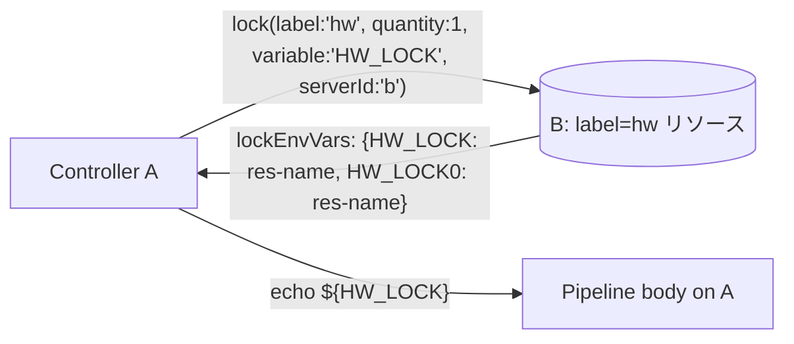
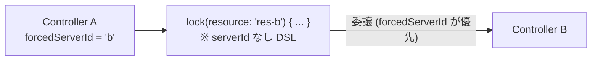

# E2E テスト仕様（Phase 1 / M1A）

この文書は M1A で追加された機能を対象とする E2E テストの設計・仕様を定義します。  
M1 シナリオ（S01〜S07, D01〜D03）の定義は `E2E_TEST_SPECIFICATION_P1_M1.md` を参照してください。

---

## 目的

M1A で実装した以下の機能を実環境相当で検証します。

1. **透過 lockRequest payload**: `POST /acquire` に `lockRequest` ネストオブジェクトを送信し、
   サーバー側が `label` / `quantity` / `variable` / `skipIfLocked` を正しく解釈すること
2. **lockEnvVars 等価展開**: `lock(variable:'V', ...)` の body 内で `$V`, `${V}0`, `${V}1` 等が
   local `lock()` と等価に展開されること
3. **forcedServerId delegated mode**: Controller A に `forcedServerId = B` を設定したとき、
   `serverId` なし DSL が B に透過委譲されること

---

## M1 シナリオへの影響（後方互換確認）

M1A では POST /acquire のワイヤフォーマットが変更されました（`lockRequest` ネスト化）。
既存シナリオのスクリプトはプラグインコードを通じて自動的に新フォーマットを使用するため、
**スクリプト自体の変更は不要**です。  
M1A 適用後に M1 シナリオ全件（S01〜S07）が SUCCESS になることを回帰確認として実施します。

---

## テスト体系（M1A 追加分）

### シナリオ分類

| 分類 | ID | 目的 |
|---|---|---|
| M1A 正常系 | `S08` | label-based 取得 + lockEnvVars 展開 |
| M1A 正常系 | `S09` | forcedServerId delegated mode |

### シナリオ一覧

| ID | スクリプト名 | 検証機能 | 必要コントローラー |
|---|---|---|---|
| S08 | `label-env-vars` | label 指定取得 + variable 環境変数展開 | a, b |
| S09 | `delegated-mode` | forcedServerId による全 lock() 委譲 | a, b |

### シナリオ詳細図

#### S08 label-env-vars



#### S09 delegated-mode



---

## 実行環境

M1A シナリオは M1 と同じ 3 コントローラー構成（a, b, c）で実行します。

| サービス名 | ホスト公開ポート | コンテナ内部 URL |
|---|---|---|
| `jenkins-a` | 8081 | `http://jenkins-a:8080/jenkins` |
| `jenkins-b` | 8082 | `http://jenkins-b:8080/jenkins` |
| `jenkins-c` | 8083 | `http://jenkins-c:8080/jenkins` |

詳細は `E2E_TEST_SPECIFICATION_P1_M1.md` の「実行環境」セクション参照。

---

## common.sh 追加ヘルパー

M1A シナリオで必要な設定操作を汎用関数として追加します。

```bash
configure_forced_server_id(base_url, forced_server_id)
  → Controller の forcedServerId を設定する（Management/Configure 経由）
  → 例: configure_forced_server_id "$CONTROLLER_A_URL" "b"

configure_forced_server_id_empty(base_url)
  → forcedServerId を空文字（無効化）に戻す

configure_label_resource(base_url, resource_name, label_name)
  → resource を作成し、exposeLabel と一致するラベルを付与する
  → 例: configure_label_resource "$CONTROLLER_B_URL" "hw-board-01" "remote-enabled"
```

---

## run-e2e.sh 拡張仕様

### 追加シナリオ登録

`run-e2e.sh` に以下を追加します。

```bash
M1A_SCENARIOS=(
  "label-env-vars"
  "delegated-mode"
)

SCENARIO_IDS["label-env-vars"]="S08"
SCENARIO_IDS["delegated-mode"]="S09"
```

### --only オプション拡張

```
--only label-env-vars    S08 のみ実行
--only delegated-mode    S09 のみ実行
--only m1a-series        S08 + S09 を実行
--only s-series          S01〜S07 のみ実行（変更なし）
--only all               S01〜S09 + D01〜D03 を実行（M1A 追加分を含む）
```

### 実行順序（all）

```
S01 → S02 → S03 → S04 → S05 → S06 → S07 → S08 → S09 → D01 → D02 → D03
```

### スクリプトファイル対応

| シナリオ ID | スクリプトファイル |
|---|---|
| S08 | `scenarios/label-env-vars.sh` |
| S09 | `scenarios/delegated-mode.sh` |

---

## 共通設定規約（M1A 追加分）

### exposeLabel

M1A シナリオでも M1 同様、`exposeLabel = "remote-enabled"` を使用します。  
label-based 取得（S08）では、取得対象のリソースに `remote-enabled` ラベルを付与し、
さらに `quantity` で指定したラベル（例: `hw`）も同時に付与します。

```
exposeLabel = "remote-enabled"
lock(label: 'hw', quantity: 1, serverId: 'b')
→ B 側で remote-enabled かつ hw ラベルを持つリソースが対象
```

実際には `RemoteLockManager.isExposedResource()` は `exposeLabel` のみを確認するため、
`hw` ラベルによる絞り込みはサーバー側の label マッチングで実施されます。

### credentials 命名規約

| シナリオ | credentials ID | 配置先 | 内容 |
|---|---|---|---|
| S08 A→B | `s08-a-for-b` | A | B の admin API トークン |
| S09 A→B | `s09-a-for-b` | A | B の admin API トークン |

---

## S08: label-env-vars — label 指定取得と lockEnvVars 展開

### テスト意図

A が `label` と `variable` を指定して B のリソースをリモート取得したとき:

1. B 側で `label` に一致するリソースが取得されること
2. B が生成した `lockEnvVars` が A の pipeline body 内の環境変数として展開されること
3. `echo ${HW_LOCK}` で取得したリソース名が出力されること

```
A pipeline:
  lock(label: 'hw', quantity: 1, variable: 'HW_LOCK', serverId: 'b') {
    echo "HW_LOCK=${env.HW_LOCK}"          // 例: "HW_LOCK=s08-hw-board-1748..."
    echo "HW_LOCK0=${env.HW_LOCK0}"        // 同じリソース名
  }
```

これが local `lock(label: 'hw', quantity: 1, variable: 'HW_LOCK')` と等価であることの証左です。

### 前提条件

- **Controller B**: `remoteApiEnabled=true`, `exposeLabel=remote-enabled`
- **B のリソース**: `s08-hw-board-<timestamp>` に `remote-enabled` + `hw` ラベルを付与
- **A 側 credentials** (`s08-a-for-b`): B の admin API トークン
- **A の remote 設定**: `remotes[a→b]` = B の internal URL + `s08-a-for-b`

### パイプライン構成

| job 名 | controller | 内容 |
|---|---|---|
| `s08-label-env` | A | `lock(label:'hw', quantity:1, variable:'HW_LOCK', serverId:'b') { echo HW_LOCK=... ; echo HW_LOCK0=... }` |

### 検証基準

| ID | 検証項目 | 期待値 |
|---|---|---|
| CP01 | `s08-label-env` の build 結果 | `SUCCESS` |
| CP02 | A コンソールに `HW_LOCK=s08-hw-board-` で始まる行が出ること | `true` |
| CP03 | A コンソールに `HW_LOCK0=s08-hw-board-` で始まる行が出ること | `true` |
| CP04 | CP02 と CP03 の値が一致すること（1 リソース取得なので variable と variable0 は同値） | `true` |
| CP05 | B 側リソース `s08-hw-board-*` がジョブ完了後に解放されていること | `true` |
| CP06 | `Remote lock acquired on` が A コンソールに出ること | `true` |

### 出力ファイル

```
reports/<runId>-e2e-test/label-env-vars/console.txt
reports/<runId>-e2e-test/label-env-vars/summary.txt
reports/<runId>-e2e-test/label-env-vars/scenario-details.md
```

---

## S09: delegated-mode — forcedServerId による透過委譲

### テスト意図

A の `forcedServerId = 'b'` を設定した状態で、`serverId` 指定なしの `lock()` DSL を実行したとき:

1. B のリモート API に lock が委譲されること（A の build ログに委譲の証跡があること）
2. パイプライン body が正常に実行されること
3. `forcedServerId` をクリアした後は B に委譲されず、ローカルの挙動に戻ること（後片付け確認）

```
A pipeline (forcedServerId='b'):
  lock(resource: '<B_RES>') {        // serverId なし
    echo "DELEGATED_ACQUIRED"
  }
```

DSL 作成者は `serverId` を書かなくても、環境設定により自動で B に委譲されます。

### 前提条件

- **Controller B**: `remoteApiEnabled=true`, `exposeLabel=remote-enabled`, リソース公開
- **A 側 credentials** (`s09-a-for-b`): B の admin API トークン
- **A の remote 設定**: `remotes[a→b]` = B の internal URL + `s09-a-for-b`
- **A の `forcedServerId`**: `b`（シナリオ開始時に設定、終了後にクリア）

### パイプライン構成

| job 名 | controller | DSL | forcedServerId |
|---|---|---|---|
| `s09-delegated` | A | `lock(resource: B_RES) { echo DELEGATED_ACQUIRED }` | `b` (設定済み) |
| `s09-local-fallback` | A | `lock(resource: A_LOCAL_RES) { echo LOCAL_ACQUIRED }` | `` (クリア後) |

### 検証基準

| ID | 検証項目 | 期待値 |
|---|---|---|
| CP01 | `s09-delegated` の build 結果 | `SUCCESS` |
| CP02 | A コンソールに `DELEGATED_ACQUIRED` が出ること | `true` |
| CP03 | A コンソールに `Remote lock acquired on` が出ること（リモート委譲の証跡） | `true` |
| CP04 | A コンソールに `serverId=b` が含まれること（forcedServerId 経由の委譲先確認） | `true` |
| CP05 | `s09-local-fallback` の build 結果 | `SUCCESS` |
| CP06 | `s09-local-fallback` コンソールに `LOCAL_ACQUIRED` が出ること | `true` |
| CP07 | `s09-local-fallback` コンソールに `Remote lock acquired on` が**出ない**こと（ローカル復帰の確認） | `true` |
| CP08 | B 側リソース `s09-res-b-*` が解放されていること | `true` |

CP05〜CP07 は `forcedServerId` クリア後のローカル挙動復帰を確認します。

### 出力ファイル

```
reports/<runId>-e2e-test/delegated-mode/delegated-console.txt
reports/<runId>-e2e-test/delegated-mode/fallback-console.txt
reports/<runId>-e2e-test/delegated-mode/summary.txt
reports/<runId>-e2e-test/delegated-mode/scenario-details.md
```

---

## 回帰確認（M1A 適用後の M1 シナリオ）

M1A 実装後に M1 シナリオが全件 PASS であることを確認します。

### 確認方法

```bash
PLUGIN_DIR=<path> ./run-e2e.sh --only s-series
```

### 確認基準

| 対象 | 期待結果 |
|---|---|
| S01〜S07 全シナリオ | `PASS`（M1A 前後で挙動変化なし） |
| ワイヤフォーマット変化 | スクリプト側変更不要（プラグインコードが自動的に新フォーマットを使用） |

---

## 終了コード

M1A シナリオも M1 と同じ終了コード規約に従います。

- 全シナリオ成功: `0`
- 1 シナリオでも失敗: `1`
- SKIP（jenkins-d 未起動など）: `10`

---

## 更新履歴

- 2026-06-11: 初版作成。M1A 追加シナリオ S08 (label-env-vars), S09 (delegated-mode) を定義。
  M1 シナリオへの後方互換確認方法を追記。
