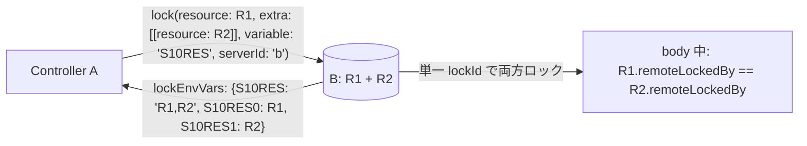
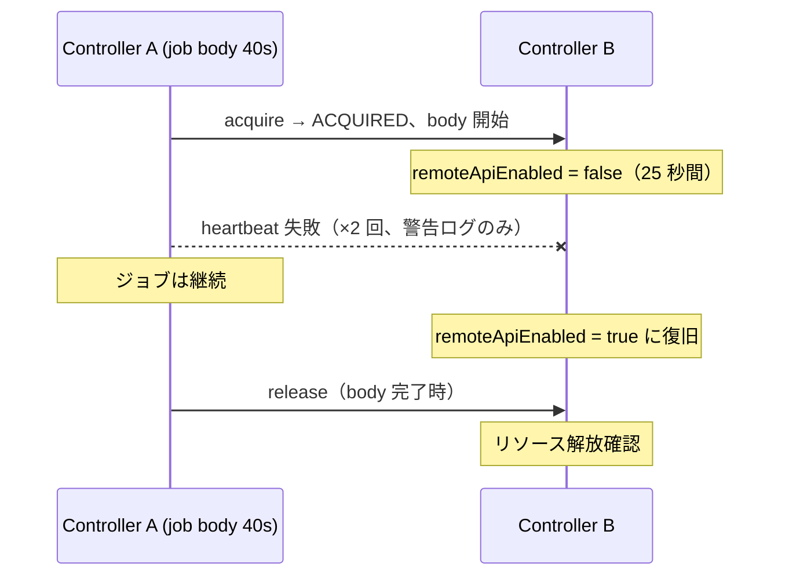
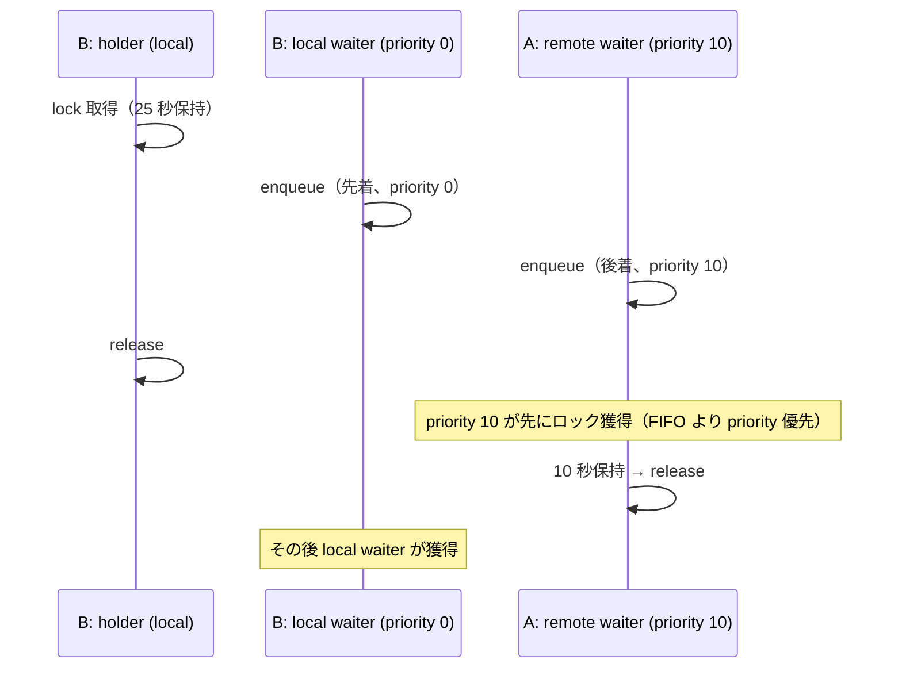
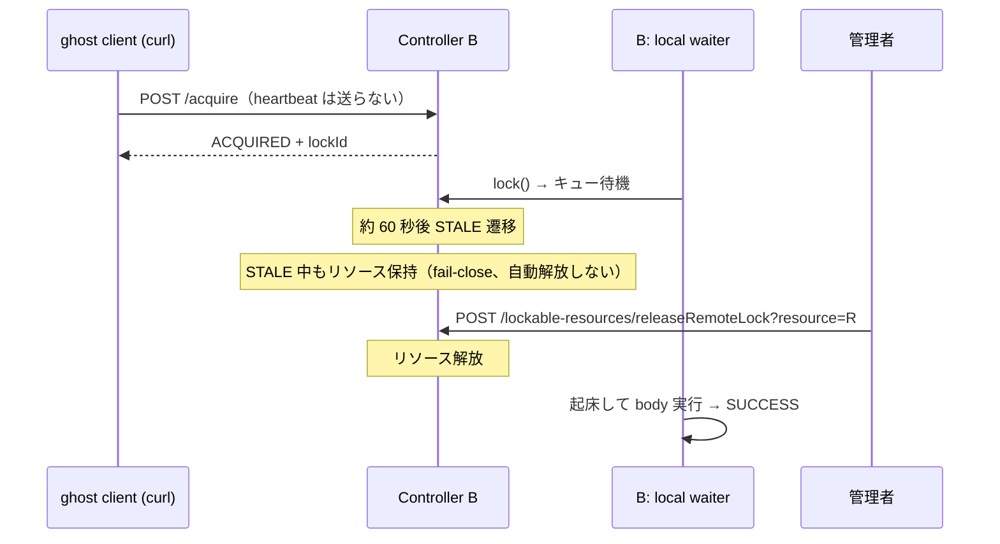

# E2E テスト仕様（Phase 1 / M1B）

この文書は M1B で追加された機能を対象とする E2E テストの設計・仕様を定義します。
M1 シナリオ（S01〜S07, D01〜D03）は `E2E_TEST_SPECIFICATION_P1_M1.md`、
M1A シナリオ（S08〜S09）は `E2E_TEST_SPECIFICATION_P1_M1A.md` を参照してください。

---

## 目的

M1B で実装した以下の機能を実環境相当で検証します。

1. **extra アトミック取得**: `lock(resource:, extra: [...], serverId:)` が
   main + extra 全リソースを単一 lease でアトミックに取得・解放すること
2. **heartbeat 耐性**: body 実行中の heartbeat 失敗でジョブが死なず、
   完了後に正常 release されること（決定 B の実証）
3. **統一キュー priority**: priority の高い remote 待機者が、先に並んだ
   priority の低い local 待機者より先にロックを取れること（決定 E の実証）
4. **STALE 管理者解放**: heartbeat が途絶した lease が STALE に遷移し、
   fail-close で保持され続け、管理者の Force Release で解放され
   local 待機者が起床すること（決定 F + fail-close の実証）

---

## テスト体系（M1B 追加分）

### シナリオ一覧

| ID | スクリプト名 | 検証機能 | 必要コントローラー |
|---|---|---|---|
| S10 | `extra-resources` | extra アトミック取得 + lockEnvVars カンマ結合 | a, b |
| S11 | `heartbeat-resilience` | heartbeat 失敗時のジョブ継続 | a, b |
| S12 | `priority-ordering` | local/remote 統一 priority ディスパッチ | a, b |
| S13 | `stale-admin-release` | STALE 遷移 + fail-close 保持 + 管理者解放 | b |

### シナリオ詳細図

#### S10 extra-resources



#### S11 heartbeat-resilience



#### S12 priority-ordering



#### S13 stale-admin-release



---

## run-e2e.sh 拡張仕様

### 追加シナリオ登録

```bash
M1B_SCENARIOS=(
  "extra-resources"
  "heartbeat-resilience"
  "priority-ordering"
  "stale-admin-release"
)

SCENARIO_IDS["extra-resources"]="S10"
SCENARIO_IDS["heartbeat-resilience"]="S11"
SCENARIO_IDS["priority-ordering"]="S12"
SCENARIO_IDS["stale-admin-release"]="S13"
```

### --only オプション拡張

```
--only m1b-series        S10〜S13 を実行
--only all               S01〜S13 + D01〜D03 を実行（M1B 追加分を含む）
```

### 実行順序（all）

```
S01 → ... → S09 → S10 → S11 → S12 → S13 → D01 → D02 → D03
```

---

## S10: extra-resources — extra アトミック取得

### テスト意図

`extra` 付き remote lock が**部分ロックを起こさない**こと（M1A レビュー指摘 3-1 の解消確認）。

1. main + extra の両リソースが取得されること
2. 両リソースの `remoteLockedBy` が**同一 lockId** であること（単一 lease = アトミック）
3. `variable` の結合値が**カンマ区切り**であること（指摘 3-2 の解消確認）
4. release で両リソースが同時に解放されること

### パイプライン構成

scripted pipeline を使用する（Declarative はコンストラクタ引数 `resource` を
必須扱いする既知問題 JENKINS-50260 があるため。S08 の教訓）。

| job 名 | controller | 内容 |
|---|---|---|
| `s10-extra` | A | `lock(resource: R1, extra: [[resource: R2]], variable: 'S10RES', serverId: 'b') { echo + sleep 8 }` |

### 検証基準

| ID | 検証項目 | 期待値 |
|---|---|---|
| CP01 | build 結果 | `SUCCESS` |
| CP02 | body 実行中、B 側で R1・R2 の `remoteLockedBy` が同一非 null 値 | `true`（アトミック性の直接検証） |
| CP03 | `S10RES` に R1・R2 両方が含まれ、カンマ区切りであること | `true` |
| CP04 | `S10RES0` / `S10RES1` の個別変数が存在すること | `true` |
| CP05 | 完了後に R1・R2 とも解放されていること | `true` |
| CP06 | `Remote lock acquired on` がコンソールに出ること | `true` |

---

## S11: heartbeat-resilience — heartbeat 失敗時のジョブ継続

### テスト意図

heartbeat 失敗がジョブを殺さないこと（決定 B の実証）。
**テストが空振りで通らないよう、heartbeat 失敗が実際に起きたことをログで実証する。**

### 障害注入方法

body 実行中（40 秒）に B の `remoteApiEnabled` を 25 秒間 `false` にする。
heartbeat（10 秒間隔）が 2 回程度失敗する。body 終了前に復旧させ、
最終 release は成功させる。

### 検証基準

| ID | 検証項目 | 期待値 |
|---|---|---|
| CP01 | build 結果（heartbeat 失敗を挟んでも） | `SUCCESS` |
| CP02 | body が最後まで実行されたこと（`S11_BODY_END` マーカー） | `true` |
| CP03 | A コンテナログに `Remote heartbeat failed (continuing job; server retains lock)` 警告が**実際に出ている**こと（`docker logs --since` で取得） | 1 件以上 |
| CP04 | 完了後に B 側リソースが解放されていること | `true` |

CP03 が無いと「障害注入が効かず普通に成功しただけ」を検出できない。
警告ログは `reports/<runId>-e2e-test/heartbeat-resilience/heartbeat-warnings.txt` に保存する。

---

## S12: priority-ordering — 統一キュー priority ディスパッチ

### テスト意図

remote 待機者が LRM 統一キューに参加し、**priority が local / remote 横断で
効く**こと（決定 E・統一キューブリッジの中核検証）。

### 競合設計

1. B 上の holder（local job）がリソースを 25 秒保持
2. **先に** B 上の local waiter（priority 0）が enqueue
3. **後から** A の remote waiter（priority 10, serverId: 'b'）が enqueue
4. holder 解放後、**remote waiter が先に**ロックを獲得（10 秒保持）
5. その後 local waiter が獲得

### 判別性（テストの感度）

holder 解放後のポーリングで:

- priority が正しい → リソースは **remote-locked**（`remoteLockedBy != null`）として観測される
- priority が壊れて FIFO になっている → 先着の local waiter が獲得し、
  **build lock**（`isLocked()`）として観測される

観測値が排他的なので、リトライ等で偶然 PASS することがない。

### 検証基準

| ID | 検証項目 | 期待値 |
|---|---|---|
| CP01 | holder / local waiter / remote waiter の 3 build とも | `SUCCESS` |
| CP02 | holder 解放後、リソースが remote-locked として先に観測される（local の build lock が先に観測されたら FAIL） | `true` |
| CP03 | 両 waiter の body マーカーが出力されること | `true` |
| CP04 | 終了後リソースが free であること | `true` |

---

## S13: stale-admin-release — STALE 遷移と管理者解放

### テスト意図

fail-close 設計の完成形（§8）を end-to-end で実証する:

1. heartbeat を送らない lease が STALE に遷移すること（しきい値 ~60 秒）
2. STALE 中も**自動解放されない**こと（fail-close）
3. 管理者の Force Release エンドポイントで解放できること
4. 解放により local 待機者が起床すること（統一キューの起床経路）

### ghost client 方式

プラグインのクライアント実装は heartbeat を必ず送るため、curl で直接
`POST /lockable-resources/remote/v1/acquire/` を叩いて「heartbeat を送らない
クライアント」を作る。lockId は応答 JSON から取得する。

### 検証基準

| ID | 検証項目 | 期待値 |
|---|---|---|
| CP01 | ghost acquire の応答 | `state=ACQUIRED` + lockId |
| CP02 | heartbeat なしで約 60 秒後に record が `STALE` になること（Groovy で `RemoteLockManager.find(lockId).getState()` をポーリング） | `true` |
| CP03 | STALE 中もリソースが保持されていること（`remoteLockedBy != null`） | `true`（fail-close） |
| CP04 | `POST /lockable-resources/releaseRemoteLock?resource=R`（要 UNLOCK 権限 + crumb） | 成功 |
| CP05 | 待機していた local job が起床し `SUCCESS` で完了すること | `true` |
| CP06 | 終了後リソースが free であること | `true` |

### 所要時間

STALE しきい値（`max(heartbeatInterval × 6, 60)` = 60 秒）の待機を含むため、
S13 単体で約 70〜90 秒かかる。

---

## 共通設定規約（M1B 追加分）

### credentials 命名規約

| シナリオ | credentials ID | 配置先 | 内容 |
|---|---|---|---|
| S10 A→B | `s10-a-for-b` | A | B の admin API トークン |
| S11 A→B | `s11-a-for-b` | A | B の admin API トークン |
| S12 A→B | `s12-a-for-b` | A | B の admin API トークン |
| S13 (curl 直叩き) | なし（API トークンを直接使用） | - | B の admin API トークン |

### リソース命名規約

`s1X-<役割>-<timestamp>` 形式（例: `s10-res1-1781234567`）。
タイムスタンプ付与により、`--skip-start`（コンテナ再利用）でも前回実行と干渉しない。

---

## 回帰確認

M1B 実装後に全シナリオが PASS であることを確認します。

```bash
PLUGIN_DIR=<path> ./run-e2e.sh                  # 全 16 シナリオ
PLUGIN_DIR=<path> ./run-e2e.sh --only m1b-series  # S10〜S13 のみ
```

| 対象 | 期待結果 |
|---|---|
| S01〜S13 + D01〜D03 全 16 シナリオ | `PASS` |

### 実績

- 2026-06-12: S10〜S13 初回実行 全 4 件 PASS（`reports/20260612011450-e2e-test.md`）
- 2026-06-12: 全 16 シナリオ統合回帰 16/16 PASS（`reports/20260612011822-e2e-test.md`）

---

## 更新履歴

- 2026-06-12: 初版作成。M1B 追加シナリオ S10〜S13 を定義。
  S08 の教訓（Declarative の required-parameter 検証）を踏まえ
  M1B シナリオは scripted pipeline を使用。
