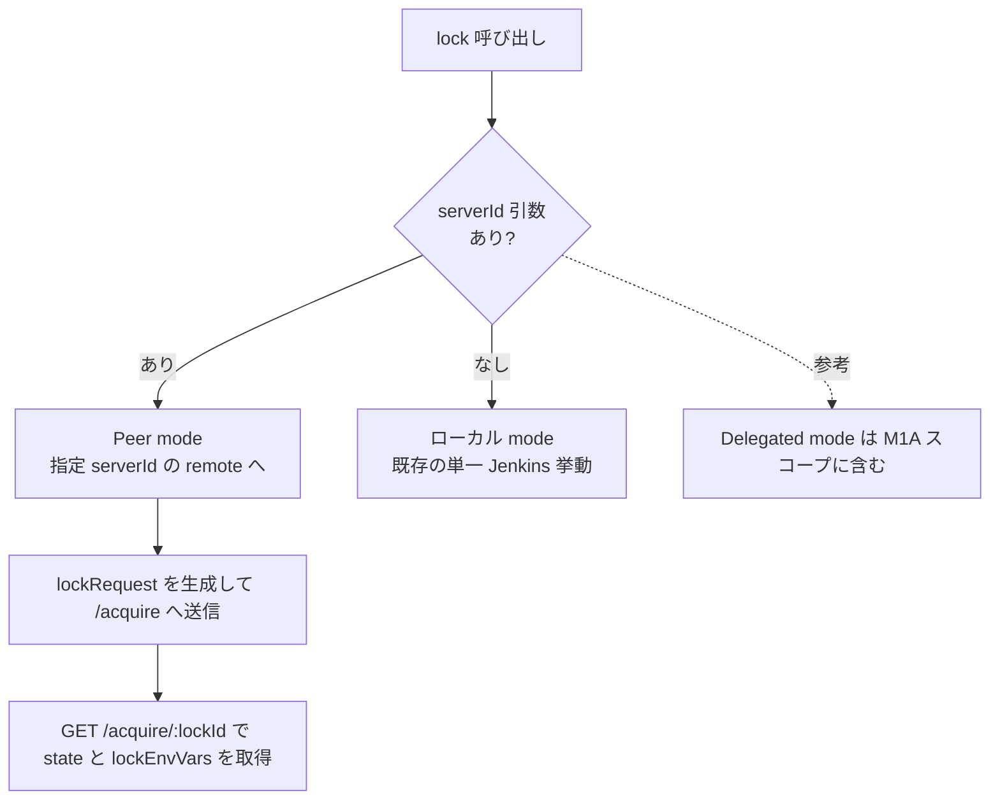
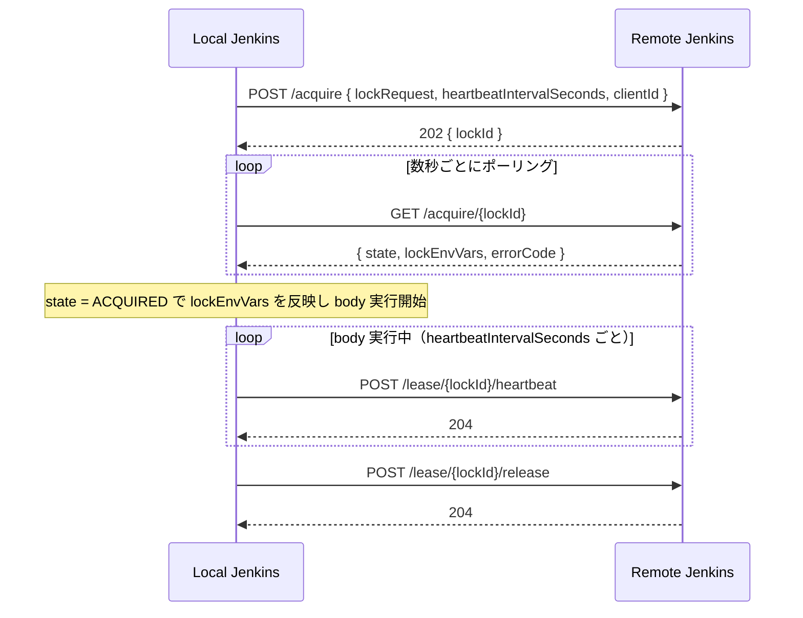
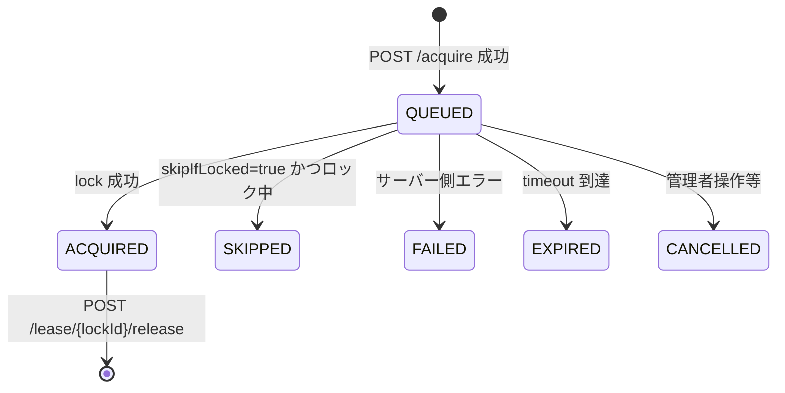
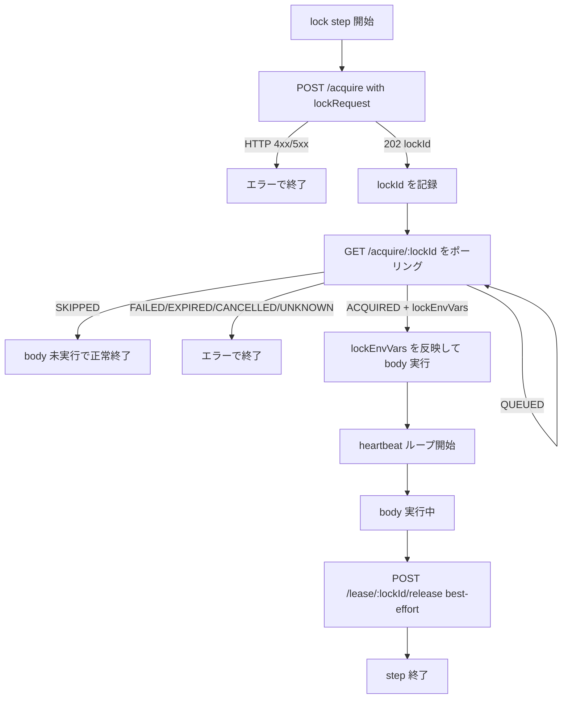
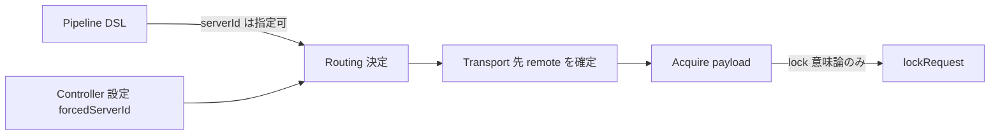
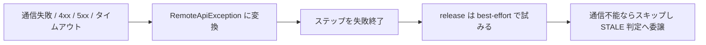

# Remote Lockable Resources 仕様書（Phase 1 / M1A）

> **出典:** [jenkinsci/lockable-resources-plugin #1025](https://github.com/jenkinsci/lockable-resources-plugin/issues/1025)
> **設計変更反映:** `cancel` エンドポイント廃止、`requestId`/`leaseId` を `lockId` に統一
> **対象スコープ:** Phase 1 M1A（peer mode の透過ラッパー成立）
>
> **⚠️ M1B による更新あり:** 本書の一部（lockEnvVars 結合文字、キュー意味論、state 一覧、
> 耐障害性・再起動方針）は M1B で更新された。現行真実は `LRR_DESIGN_P1_M1B.md` を参照。

---

## 用語定義（この文書）

- `lockRequest`: `POST /acquire` で remote server に渡す lock 意味論パラメータ本体。
  `resource` / `label` / `quantity` / `variable` / `skipIfLocked` / `priority` / `timeoutForAllocateResource` などを含む。
- `lockEnvVars`: `GET /acquire/{lockId}` の `state=ACQUIRED` 時に返る環境変数マップ。
  `LOCKED_RESOURCE` / `LOCKED_RESOURCE0` / `LOCKED_RESOURCE1` など、local `lock()` と同等の展開情報を表す。
- `serverId`: 接続先 remote を選ぶための routing 識別子。`lockRequest` には含めない。
- `forcedServerId`: Controller 側で delegated routing を制御する設定値。DSL の lock 意味論には含めない。

---

## 目次

1. [概要・目標](#1-概要目標)
2. [動作モード](#2-動作モード)
3. [DSL 解決ルール](#3-dsl-解決ルール)
4. [REST API 仕様](#4-rest-api-仕様)
5. [クライアントループ](#5-クライアントループ)
6. [設定サーフェス](#6-設定サーフェス)
7. [ハートビートと STALE 判定](#7-ハートビートと-stale-判定)
8. [エラー方針（fail-closed）](#8-エラー方針fail-closed)
9. [スコープ整理（Phase 1 M1A の含む/含まない）](#9-スコープ整理phase-1-m1a-の含む含まない)

---

## 1. 概要・目標

### 一言で言うと

`lock(..., serverId: 'B')` の呼び出しを、remote lock server に**透過的に委譲**する。
パイプライン利用者から見た lock の意味論は、remote 経由でも local と等価に保つ。

### 設計上の制約

- `{ body }` は **常にローカル Jenkins 上** で実行される。
- リモート Jenkins がリソースの **single source of truth**。
- 通信方向は **local → remote のみ**（リモートから折り返し接続しない）。
- 通信失敗は **fail-closed**（ロックを自動解放しない）。
- リソースの存在判定や動的作成可否は、remote server 側従来の lock アルゴリズムのポリシーに委譲する。

### ゴール（M1A / peer mode）

**M1A では peer mode のみを実装します。remote 層は lock の transport とし、lock パラメータは `lockRequest` で透過的に運びます。**

| ゴール | 詳細 |
|---|---|
| peer mode | `lock(..., serverId: 'X')` で明示指定 |
| 透過 payload | `POST /acquire` に `lockRequest` を丸ごと送る |
| 等価 env 展開 | `GET /acquire/{lockId}` の `lockEnvVars` で local 同等の環境変数情報を返す |
| 後方互換 | `serverId` 未指定 → 既存ローカルモード挙動そのまま |
| 認証 | `credentialsId` から username/password（API token）を解決し、Authorization ヘッダを付与 |

**今後の拡張予定（M2 以降）:**
- GET /resources と B-side ページのリモートビュー

---

## 2. 動作モード



### Peer mode（M1A 対象）

- パイプライン側が `serverId: 'X'` を明示指定する。
- 接続先選択後、lock 意味論パラメータは `lockRequest` として remote に渡す。
- `ACQUIRED` 時の `lockEnvVars` を使って local と同等の body 実行コンテキストを構築する。

### Delegated mode（M1A 対象）

- `forcedServerId` は Controller 側設定として有効。
- `forcedServerId` が設定されている場合、routing は controller 側設定に従う。
- ただし DSL の lock 意味論には持ち込まない（`lockRequest` には含めない）。

---

## 3. DSL 解決ルール

```text
if lock(..., serverId: 'X') が指定された場合:
  target = (X, lockRequest)      # peer mode

else:
  target = (LOCAL, lockRequest)  # 既存挙動
```

### 重要なルール

- `serverId` は**接続先選択のための transport 情報**。
- `forcedServerId` は**Controller 側の運用設定**。
- どちらも lock 意味論ではないため、`lockRequest` には含めない。

---

## 4. REST API 仕様

### ベースパス

```text
/lockable-resources/remote/v1/
```

`remoteApiEnabled = false`（デフォルト）の場合、全エンドポイントが 403 を返す。

---

### 識別子の統一

- `POST /acquire` が返した `lockId` を、ポーリング・heartbeat・release のすべてで使い回す。

---

### エンドポイント一覧



---

### `POST /acquire`

**目的:** `lockRequest` を remote server 側従来の lock アルゴリズムへ引き渡す。

**リクエストボディ:**

```jsonc
{
  "lockRequest": {
    "resource": "board-a1",
    "label": "hw-board",
    "quantity": 2,
    "variable": "LOCKED_RESOURCE",
    "inversePrecedence": false,
    "resourceSelectStrategy": "SEQUENTIAL",
    "skipIfLocked": false,
    "extra": [],
    "priority": 10,
    "timeoutForAllocateResource": 5,
    "timeoutUnit": "MINUTES",
    "reason": "deploy"
  },
  "heartbeatIntervalSeconds": 10,
  "clientId": "https://jenkins-a.example.com/"
}
```

### lockRequest 契約

- lock DSL が受理する意味論パラメータを透過的に渡す。
- `serverId` / `forcedServerId` は routing 情報なので含めない。
- remote 側は未知キーを無視する（additive 拡張を許容）。
- リソース確保・解放・キュー制御・timeout 判定は remote 側の 従来lockポリシー責務とする。

**レスポンス:**

| HTTP | 意味 |
|---|---|
| `202 Accepted` | キュー登録成功。`{ "lockId": "..." }` を返す |
| `400 Bad Request` | 入力不正（例: 不正な timeoutUnit） |
| `404 Not Found` | `UNKNOWN_RESOURCE` など対象解決失敗 |

---

### `GET /acquire/{lockId}`

**目的:** acquire リクエストの現在状態を返す（ポーリング用）。

**レスポンスボディ（QUEUED 例）:**

```jsonc
{
  "lockId": "...",
  "state": "QUEUED",
  "errorCode": null,
  "message": null,
  "lockEnvVars": null
}
```

**レスポンスボディ（ACQUIRED 例）:**

```jsonc
{
  "lockId": "...",
  "state": "ACQUIRED",
  "errorCode": null,
  "message": null,
  "lockEnvVars": {
    "LOCKED_RESOURCE": "resource1,resource2",
    "LOCKED_RESOURCE0": "resource1",
    "LOCKED_RESOURCE1": "resource2"
  }
}
```

### `lockEnvVars` の意味

- `state = ACQUIRED` 時に返す。
- `lock()` が local 実行時に注入する環境変数体系に合わせる。
- `variable` 未指定時は `lockEnvVars` を `null` または空オブジェクトで返す（実装でどちらかに統一）。

**state 一覧:**



| state | 意味 | クライアントの対応 |
|---|---|---|
| `QUEUED` | 待機中 | ポーリング継続 |
| `ACQUIRED` | ロック取得済み | `lockEnvVars` を反映して body 実行 |
| `SKIPPED` | skipIfLocked でスキップ | body 未実行で正常終了 |
| `FAILED` | サーバー側エラー | エラーで終了 |
| `EXPIRED` | タイムアウト | エラーで終了 |
| `CANCELLED` | サーバー都合のキャンセル | エラーで終了 |
| `UNKNOWN` | 解釈不能な応答 | fail-closed で終了 |

---

### `POST /lease/{lockId}/heartbeat`

**目的:** body 実行中の死活確認シグナルを送る。

- body 実行中のみ送信する（ポーリング中は送らない）。
- 間隔は `heartbeatIntervalSeconds`（Phase 1 は内部定数 10s）。

**レスポンス:** `204 No Content`

---

### `POST /lease/{lockId}/release`

**目的:** リースを解放する。

- body 完了時に呼ぶ。
- abort（中断）時も best-effort で呼ぶ。
- **fail-closed**: 通信失敗時はサーバー側が heartbeat タイムアウトで STALE 判定する。

**レスポンス:** `204 No Content`

---

## 5. クライアントループ



**実装上のポイント:**

| 項目 | 値（Phase 1 内部定数） |
|---|---|
| ポーリング間隔 | 3 秒 |
| heartbeat 間隔 | 10 秒 |
| リクエストタイムアウト | 5 秒 |

---

## 6. 設定サーフェス

### サーバー側（リソースを公開する Jenkins）

| 設定 | デフォルト | 説明 |
|---|---|---|
| `remoteApiEnabled` | `false` | マスタースイッチ。`false` の間は全エンドポイントが 403 |
| `exposeLabel` | 未設定 | このラベルを持つリソースのみ公開（opt-in） |

> M1A ではこれらを System 設定 UI から変更可能にする。

### クライアント側（リモートロックを起動する Jenkins）

| 設定 | 説明 |
|---|---|
| `clientId` | リモートサーバーに送る自己識別子。空白時は `Jenkins.getRootUrl()` |
| `remotes[]` | サーバー接続マップ（キー = `serverId`） |
| `remotes[].url` | リモート Jenkins のベース URL |
| `remotes[].credentialsId` | Jenkins Credentials ID（username/password 型） |
| `forcedServerId` | Controller 側の delegated mode 制御値。設定時はこの `serverId` へルーティング |

### 設計補足（重要）



- `forcedServerId` は**クライアント設定として有効**。
- ただし DSL の lock 意味論ではないため、`lockRequest` には含めない。

### B-side LR ページ表示

サーバー側 LR 一覧の "Locked by" 列に remote lock 保有者を表示する。

| 状況 | 表示文字列 |
|---|---|
| remote lock あり、clientId あり | `Remote: jenkins-a` |
| remote lock あり、clientId なし | `Remote: (unknown)` |
| remote lock なし | 通常表示 |

### バリデーション

- `forcedServerId` が設定されている場合、`remotes` のキーに存在しないと保存時にエラー。
- `serverId` の前後スペースは自動トリム（警告ログあり）。

---

## 7. ハートビートと STALE 判定

### クライアントが heartbeatIntervalSeconds をワイヤーで送る理由

Phase 1 では `heartbeatIntervalSeconds` はユーザー設定不可の内部定数だが、将来の設定化に備えて **API リクエスト上には既に含める**。これにより、設定化時に API バージョンを上げる必要がない。

### サーバー側の STALE しきい値（Phase 1 ハードコード）

```text
staleThresholdSeconds = max(heartbeatIntervalSeconds × 6, 60)
```

- STALE になっても **自動解放はしない**（状態遷移のみ）。
- 必要に応じて `GET /lease/{lockId}` は将来の診断拡張候補。

---

## 8. エラー方針（fail-closed）



**設計方針:**

- 通信失敗時にロックを自動解放しない（fail-closed）。
- `ACQUIRED` 後の失敗は best-effort で `release` を試みる。
- 認証情報はログに出力しない（`serverId / method / path / status` のみ）。

---

## 9. スコープ整理（Phase 1 M1A の含む/含まない）

### 含む（M1A）

| 項目 | 内容 |
|---|---|
| DSL | `lock(..., serverId: 'X')` による peer mode |
| 透過 acquire | `POST /acquire` に `lockRequest` を送信 |
| 透過 status | `GET /acquire/{lockId}` で `lockEnvVars` を返却 |
| クライアント実装 | `RemoteApiClient`（acquire/poll/heartbeat/release） |
| 設定モデル | `RemoteConnection` と `forcedServerId`（Controller 側制御） |
| 認証実装 | `credentialsId` を解決して Authorization ヘッダを付与 |
| エラー処理 | fail-closed、`RemoteApiException` |

### 含まない（M1A スコープ外）

| 項目 | 備考 |
|---|---|
| `GET /resources` とクライアント側 LR ページのリモートビュー | M3 |
| ユーザー設定可能なポーリング/heartbeat/タイムアウト値 | Phase 2 |
| 複数リモートへのフェイルオーバー | Phase 3 |
| `serverId: 'any'` 自動選択 | Phase 3 |
| フリースタイルプロジェクトサポート | Phase 3 以降 |
| `GET /lease/{lockId}`（診断エンドポイント） | M1A 後の拡張候補 |
| リソース確保・解放・キュー制御・timeout のアルゴリズム設計変更 | remote 側の 従来lockポリシー責務 |
