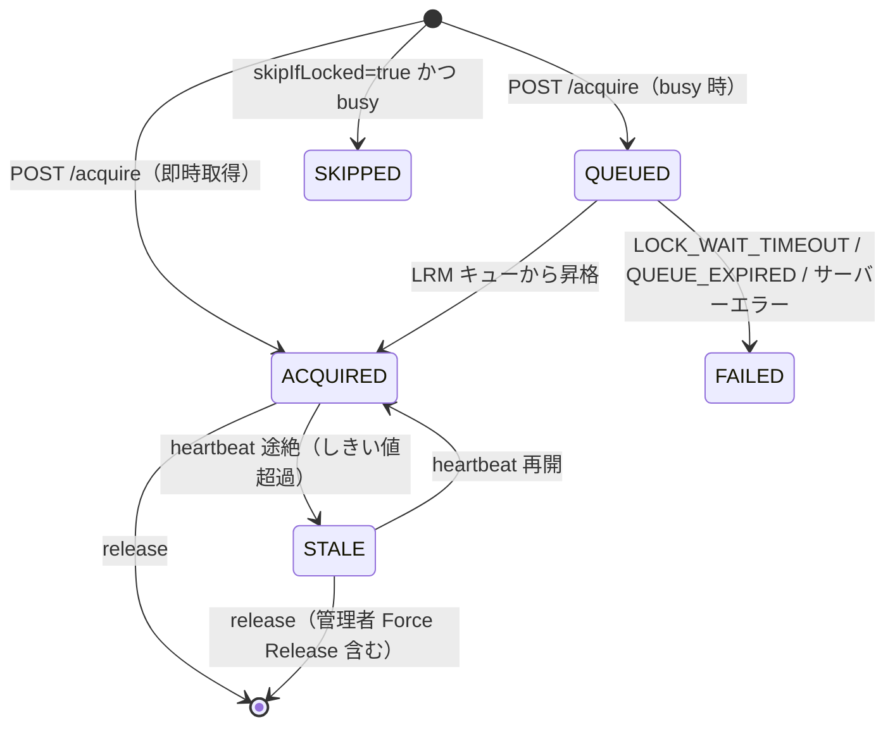

# Remote Lockable Resources 仕様書（Phase 1 / M1B）

> **出典:** [jenkinsci/lockable-resources-plugin #1025](https://github.com/jenkinsci/lockable-resources-plugin/issues/1025)
> **前提文書:** `LRR_DESIGN_P1_M1A.md`（M1A 仕様。本書は M1A からの差分＋現行真実を定義する）
> **背景:** `LRR_REVIEW_P1_M1A.md`（2026-06-11 全体レビュー）で発覚した Critical 問題群への対応
> **対象スコープ:** Phase 1 M1B（remote lock の透過等価化）

---

## 目次

1. [M1B の設計思想](#1-m1b-の設計思想)
2. [意思決定の記録](#2-意思決定の記録)
3. [lockEnvVars の等価化](#3-lockenvvars-の等価化)
4. [extra リソースの透過サポート](#4-extra-リソースの透過サポート)
5. [統一キューブリッジ（中核アーキテクチャ）](#5-統一キューブリッジ中核アーキテクチャ)
6. [クライアント耐障害性（heartbeat / poll）](#6-クライアント耐障害性heartbeat--poll)
7. [再起動セマンティクス（onResume / fail-close）](#7-再起動セマンティクスonresume--fail-close)
8. [STALE ロックの管理者解放](#8-stale-ロックの管理者解放)
9. [state 一覧（実装準拠に訂正）](#9-state-一覧実装準拠に訂正)
10. [スコープ整理（M1B の含む/含まない）](#10-スコープ整理m1b-の含む含まない)

---

## 1. M1B の設計思想

```text
remote 機能は「時間的遅延」と「ネットワーク障害時の fail-close」を除けば、
ローカルリソースと透過等価であるのが大前提。
修正方針は「安全に振る」ではなく「透過等価に全振り」。
```

M1A レビューで、自ら掲げた「fail-closed・透過等価」の中核原則を破る不整合が
複数発覚した。M1B はこれらを「機能を狭めて安全に倒す」のではなく、
**local lock() との等価性を完全に実現する方向**で解消する。

| レビュー指摘 | M1B の解 |
|---|---|
| 3-1 extra サイレント欠落 | extra を完全実装（拒否ではなく） |
| 3-2 lockEnvVars 非等価 | カンマ結合に統一 |
| 3-4 onResume 欠落 | QUEUED 復帰 + ACQUIRED 後始末を実装 |
| 3-5 STALE 解放手段なし | 管理者用 Force Release UI を追加 |
| 4-1 1 回の通信失敗で即死 | poll リトライ予算 + heartbeat 警告継続 |
| 4-2 キュー意味論が別物 | LRM 既存キューへの統合（ブリッジ） |
| 4-3 remote release が local を起こさない | 統合キューが自動的に解決 |

---

## 2. 意思決定の記録

2026-06-11 のレビュー後協議で確定した方針（詳細は `LRR_IMPLEMENTATION_STEPS_P1_M1B.md`）:

| # | 論点 | 決定 |
|---|---|---|
| A | extra | M1B で完全実装する |
| B | heartbeat 失敗 | ログ警告のみ・ジョブ継続。client 側に timeout 概念は持ち込まない（ジョブ timeout は Jenkins 標準機構に委ねる） |
| C | poll 失敗 | 一時障害はリトライ継続。lockId 不整合（server 再起動後の 404/410）でエラー終了 |
| D | 再起動復帰 | QUEUED 中の再起動 → ポーリング再開。ACQUIRED 中の再起動 → server 側は fail-close でロック保持、body 挙動は通常実行に委譲 |
| E | キュー等価 | `RemoteLockManager` の独立キューを廃止し、`LockableResourcesManager` の既存キューに統合（仮想 lock step インスタンス相当として server 内 local job と対等に振る舞う） |
| F | STALE 解放 | 最低限の UI 追加（Force Release ボタン） |
| 3-3 | server 再起動 | `remoteLockedBy` は transient のまま（設計通り）。Jenkins 再起動で remote lock は消失する。「起動前に解消する」運用前提の既知制約として文書化（§7） |

---

## 3. lockEnvVars の等価化

### 結合文字（M1A からの訂正）

local `lock()` の `variable` 展開は**カンマ結合**である
（`LockStepExecution.proceed()` の `String.join(",", ...)`）。
M1A 仕様書 §4 の例示（スペース結合）は local 実装と乖離していたため、本書で訂正する。

**ACQUIRED 時の `lockEnvVars`（正）:**

```jsonc
{
  "lockEnvVars": {
    "LOCKED_RESOURCE": "resource1,resource2",   // カンマ結合（local と等価）
    "LOCKED_RESOURCE0": "resource1",
    "LOCKED_RESOURCE1": "resource2"
  }
}
```

### 既知の非等価（M1B 時点で許容）

- local はリソースプロパティの env var（`VAR0_<PROP>` 等）も注入するが、
  remote の `lockEnvVars` には含めない。**M1B 時点では非対応と宣言**する
  （必要になった時点で additive に追加可能）。

---

## 4. extra リソースの透過サポート

### ワイヤフォーマット

M1A で予約済みだった `lockRequest.extra` をサーバー側で実際にパースする。

```jsonc
{
  "lockRequest": {
    "resource": "board-a1",
    "extra": [
      { "resource": "board-a2" },
      { "label": "probe", "quantity": 1 }
    ]
  }
}
```

### サーバー側バリデーション

- `extra` の各エントリは `resource` か `label` のどちらかが必須。両方 null は `400`。
- resource 指定エントリは **exposeLabel チェックを通す**
  （非公開リソースが含まれていれば `404 UNKNOWN_RESOURCE`）。
- label 指定エントリは exposeLabel と一致する候補 0 件なら `404 UNKNOWN_LABEL`。

### アトミック性

main + extra の全リソースは**全部まとめて取得できる時のみ** ACQUIRED に遷移する。
一部でも busy なら全体が QUEUED（部分ロックは発生しない）。
release も全リソースを一括解放する。

---

## 5. 統一キューブリッジ（中核アーキテクチャ）

### M1A 構造（廃止）

```text
Remote POST /acquire
    → RemoteLockManager（独自 ConcurrentHashMap + 1 秒 tick）
         ↓ tryAcquireQueued() が独自に資源チェック
         ↓ priority / timeout / FIFO 未実装
    LockableResourcesManager のキューとは無関係
```

### M1B 構造（透過等価）

```text
Remote POST /acquire
    → RemoteLockManager.enqueue()
         → 即時取得を試行（空きあれば QUEUED を飛ばして ACQUIRED）
         → busy なら RemoteQueueEntry を生成して
           LockableResourcesManager.queueRemote(entry)
              ↓ queuedContexts（local 待機者）と同列で priority ソート
              ↓ proceedNextContext() が local / remote を統一的に処理

Remote POST /lease/{lockId}/release
    → RemoteLockManager.release(lockId)
         → LockableResourcesManager.unlockRemoteResources()
              ↓ リソース解放
              ↓ while (proceedNextContext()) → local / remote 両方の待機者を起こす
              ↓ scheduleQueueMaintenance()
```

### ディスパッチ規則

```text
proceedNextContext():
  nextLocal  = getNextQueuedContext()   # local 待機者の次候補
  nextRemote = getNextRemoteEntry()     # remote 待機者の次候補

  両方 null → false
  remote.priority > local.priority → remote を処理
  それ以外（同値含む）→ local を処理
```

- **priority** が local / remote で統一的に効く（remote priority 10 は local priority 0 に勝つ）。
- **timeoutForAllocateResource** は `RemoteQueueEntry.isTimedOut()` で判定し、
  超過時は `FAILED`（errorCode: `LOCK_WAIT_TIMEOUT`）に遷移する。
- remote の release が **local 待機者を即座に起こす**（レビュー指摘 4-3 の解消）。

### RemoteQueueEntry

`QueuedContextStruct`（local 待機者）のリモート版ミラー:

| フィールド | 役割 |
|---|---|
| `record` | コールバック対象の `RemoteLockRecord` |
| `priority` | `lockRequest.priority` から |
| `timeoutDeadlineMillis` | `timeoutForAllocateResource` + `timeoutUnit` から算出 |
| `onAcquired(names)` | `record.markAcquired()`（lockEnvVars 生成込み） |
| `onTimeout()` | `record.markFailed("LOCK_WAIT_TIMEOUT")` |

`remoteQueueEntries` は transient（Jenkins 再起動で消える）。
remote lock 自体（`remoteLockedBy`）と同じライフサイクルであり、整合する（§7）。

### 充足不可能な要求の扱い（設計判断・クローズ済み、レビュー 4-6）

`label` + `quantity` が総リソース数を超えるなど**永遠に充足できない要求**は、
`timeoutForAllocateResource` 未指定であれば QUEUED に留まり続ける
（client が poll を続ける限り）。

これは**意図された挙動**であり、未解決の問題ではない（2026-06-12 決定）:

- local `lock()` も同一挙動である。`getAvailableResources()` は「現在空いて
  いるか」だけを見ており、総数に対する充足可能性チェックは存在しない。
  local でも総数超過の要求はジョブ abort まで待ち続ける。
- 透過等価の大前提（§1）に照らすと、remote 側だけ「気を利かせて」FAILED に
  倒すことは**むしろ等価性を壊す**。リソースは後から追加され得るため、
  「現時点の総数では充足不可能」は「永遠に充足不可能」を意味しない点も
  local と同じ。
- 待ちたくない場合の手段も local と同一: `timeoutForAllocateResource` を指定
  する（M1B で remote でも機能する。超過時 `LOCK_WAIT_TIMEOUT` で FAILED）。
- client が消滅したケースは poll 生存失効（`QUEUE_EXPIRED`、§6）が回収する。

> **再議論しないこと**: 「充足不可能要求を server 側で検出して即 FAILED に
> すべきでは」という案は、local との非等価を生むため透過等価の原則下では
> 採用しない。挙動を変えたい場合は upstream の local lock() 側の変更として
> 提案するのが筋である。

---

## 6. クライアント耐障害性（heartbeat / poll）

### heartbeat 失敗 = 警告のみ（決定 B）

```text
body 実行中の heartbeat 失敗:
  → WARNING ログのみ。ジョブは継続する。
  → finishRemoteFailure() は呼ばない。
```

- 数時間の HW テスト（UC-1）が数秒のネットワーク瞬断で死なない。
- server 側は fail-close でロックを保持し続けるため、安全性は損なわれない。
- heartbeat が長期間届かなければ server 側で STALE 遷移（§8 の管理者解放対象）。
- client 側に独自 timeout は持ち込まない。ジョブ全体の timeout は
  Jenkins 標準の timeout 機構（job/stage timeout）に委ねる。

### poll 失敗 = リトライ予算（決定 C）

```text
ポーリング（QUEUED 中）の通信失敗:
  → consecutivePollFailures をカウント
  → 閾値（20 回 ≒ 60 秒 = STALE しきい値と同等）未満: WARNING ログでリトライ継続
  → 閾値到達: エラー終了

HTTP 404 / 410 を受信:
  → server 再起動による lockId 不整合と判断し、即エラー終了（リトライしない）
```

| 障害 | client の挙動 |
|---|---|
| 一時的な接続断（poll 中） | 最長 ~60 秒リトライ |
| server 再起動（poll 中） | 404/410 検知で即エラー終了 |
| 一時的な接続断（body 中） | heartbeat 警告のみ、ジョブ継続 |
| 成功 poll | カウンタリセット |

### QUEUED の poll 生存シグナル失効（M1B 追補、レビュー 4-4）

server 側では `GET /acquire/{lockId}` 自体を QUEUED レコードの生存シグナルとする:

```text
GET /acquire/{lockId} 受信 → record.lastPolledAt を更新
定期スキャン（1 秒 tick）:
  QUEUED かつ poll 途絶が失効しきい値（= STALE しきい値、60 秒）超過
    → FAILED（errorCode: QUEUE_EXPIRED）+ LRM キューから除去
```

- **fail-close と矛盾しない**: STALE が自動解放されないのは「リソースを保持して
  いる」から。QUEUED はリソースを持たず、キュー上の順番だけなので自動失効できる。
- しきい値は client の poll リトライ予算（~60 秒）と同じため、「server が諦める
  のは client が諦めた後」の関係が成立する。
- 失効は LRM キュー昇格処理と `syncResources` で直列化されており、
  「昇格と失効が同時に起きる」競合はない（レビュー 4-5 と同型の競合を排除）。
- client は無改修: 失効後の poll は `FAILED` + `QUEUE_EXPIRED`（または terminal
  TTL 経過後の 404）を受けて既存の規則どおりエラー終了する。
- 既知の残余: client 消滅から失効までの ~60 秒間にリソースが空くと、無人の
  ACQUIRED が生まれ得る。これは 60 秒後の STALE → 管理者 Force Release で回収する。
- 失効しきい値はシステムプロパティ
  `org.jenkins.plugins.lockableresources.remote.RemoteLockManager.queuePollExpiryMs`
  で上書き可能（テスト用途）。

---

## 7. 再起動セマンティクス（onResume / fail-close）

### server（B）側の再起動 — 既知の制約

- `LockableResource.remoteLockedBy` は **transient**（設計通り）。
- B の Jenkins 再起動で remote lock は**すべて消失**する。
- これは「再起動はリソースが remote lock されていない状態で行う」運用を
  前提とした **Phase 1 の既知の制約**である。
- 再起動後、旧 lockId への poll は 404 となり、client は §6 の規則で
  エラー終了する（サイレントな相互排他侵害は起きない）。

### client（A）側の再起動 — onResume（決定 D）

`LockStepExecution.onResume()` を実装:

| 再起動時の状態 | 再起動後の挙動 |
|---|---|
| QUEUED 中（`remoteLockId` あり、body 未開始） | ポーリングループを再武装して再開。server 側はキュー保持済みのため整合 |
| ACQUIRED 中（body 開始済み） | body は Jenkins により中断済み。`releaseRemoteLockBestEffort()` で server 側 lease を解放し、step は AbortException で失敗終了 |
| remote でない（local lock） | 何もしない（local は既存の永続化機構で復帰） |

---

## 8. STALE ロックの管理者解放

### 経路

リソース一覧画面（`LockableResourcesRootAction`）に管理者用の解放経路を追加:

- `remoteLockedBy != null` のリソースに **Force Release Remote Lock** ボタンを表示
  （`UNLOCK` 権限保有者のみ）。
- エンドポイント: `POST /lockable-resources/releaseRemoteLock?resource=<name>`
- 内部処理: `RemoteLockManager.release(lockId)` →
  `unlockRemoteResources()` → 待機者（local / remote とも）を起こす。

### fail-close との関係

```text
heartbeat 途絶 → STALE 遷移（自動解放はしない）
    → 管理者が状況確認のうえ Force Release
        → リソース解放、待機者が即座に進行
```

STALE は「自動で安全に解放できない」状態の可視化であり、
解放判断は人間（管理者）に委ねる。これが fail-close 設計の完成形。

### 専用 Permission: RemoteUse（M1B 追補、レビュー 5-1）

remote API 全 4 エンドポイント（acquire / poll / heartbeat / release）は
`Jenkins.READ` ではなく専用の **Lockable Resources / RemoteUse** 権限を要求する:

- プラグイン既存の PermissionGroup（UNLOCK / RESERVE / STEAL / VIEW / QUEUE /
  CONFIGURE と同列）に `REMOTE`（表示名 RemoteUse）を追加。
- `ADMINISTER` に implied されるため、管理者トークン運用の小規模環境は
  設定変更なしで動き続ける。
- Matrix Authorization 等では、remote クライアントが `credentialsId` に使う
  マシンユーザーへ明示的に付与する。**誰が remote クライアントかが権限表で
  監査可能**になる。
- 権限なしアクセスは 403（`remoteApiEnabled=false` 時の 403 と整合）。
- 粒度は 4 エンドポイント共通の 1 権限（remote クライアントは必ず全部使うため、
  分割は設定ミスの温床になるだけ）。

---

## 9. state 一覧（実装準拠に訂正）

M1A 仕様書の state 図にあった `EXPIRED` / `CANCELLED` は**実装に存在しない**。
実装準拠の state は以下の 5 つ:



| state | 意味 | client の対応 |
|---|---|---|
| `QUEUED` | LRM キューで待機中 | ポーリング継続 |
| `ACQUIRED` | ロック取得済み | `lockEnvVars` を反映して body 実行 |
| `SKIPPED` | skipIfLocked でスキップ | body 未実行で正常終了 |
| `FAILED` | 取得失敗（timeout 含む） | `errorCode` を添えてエラー終了 |
| `STALE` | heartbeat 途絶、管理者レビュー待ち | （server 内部状態。client は通常 ACQUIRED と同様に動作継続） |

timeout（`timeoutForAllocateResource` 超過）は `FAILED` +
`errorCode: "LOCK_WAIT_TIMEOUT"` で表現する（`EXPIRED` state は使わない）。
client の poll 途絶による失効は `FAILED` + `errorCode: "QUEUE_EXPIRED"`（§6）。

---

## 10. スコープ整理（M1B の含む/含まない）

### 含む（M1B）

| 項目 | 内容 |
|---|---|
| lockEnvVars 等価化 | カンマ結合（local と同一） |
| extra | サーバー側パース + exposeLabel チェック + アトミック取得 |
| 統一キュー | `RemoteQueueEntry` による LRM キューブリッジ。priority / timeout / FIFO / 待機者起床が local と統一 |
| poll リトライ | 連続失敗 20 回（~60 秒）まで継続。404/410 は即エラー |
| heartbeat 耐性 | 失敗は警告のみ、ジョブ継続 |
| onResume | QUEUED 復帰 / ACQUIRED 後始末 |
| STALE 管理者解放 | Force Release UI + エンドポイント |
| 再起動制約の文書化 | transient 設計の理由と運用前提（§7） |
| QUEUED の poll 生存失効【追補】 | GET 途絶 60 秒で QUEUE_EXPIRED（レビュー 4-4） |
| 専用 Permission【追補】 | RemoteUse 権限で remote API をゲート（レビュー 5-1） |
| forcedServerId バリデーション【追補】 | doCheckForcedServerId + 保存時警告（ドリフト #4、Step 1-d 回収） |

### 含まない（M1B スコープ外）

| 項目 | 備考 |
|---|---|
| リソースプロパティ env var（`VAR0_<PROP>`）の remote 伝搬 | 非対応と宣言（additive 拡張候補） |
| `remoteLockedBy` の永続化 | Phase 1 は transient。運用前提で回避 |
| `GET /resources` リモートビュー | M3 |
| ユーザー設定可能なポーリング/heartbeat 間隔 | Phase 2 |

---

## 更新履歴

- 2026-06-12: 初版作成。M1A レビュー（`LRR_REVIEW_P1_M1A.md`）と 2026-06-11 意思決定
  に基づき、M1B（透過等価化）の設計を定義。state 一覧を実装準拠に訂正。
- 2026-06-12: M1B 追補を反映。QUEUED の poll 生存失効（QUEUE_EXPIRED、§6）、
  専用 RemoteUse 権限（§8）、forcedServerId バリデーション（ドリフト #4 回収）を
  「含む」に移動。
- 2026-06-12: 充足不可能要求の扱い（レビュー 4-6）を「透過等価により設計どおり」
  として §5 に明記しクローズ。再議論防止の注記付き。
- 2026-06-12（M1C）: 本書 §4 が「サポート」と記していた **label 指定 extra** が M1B 実装で
  サイレント欠落していた件（M1B レビュー C-1）を解消。即時取得・キュー昇格を統一セレクタ
  リゾルバに一本化し、§4 の記載どおりに実装を一致させた。あわせて空 exposeLabel 時の
  即時/キュー経路の挙動差を統一、extra-only リクエストを server でも受理（local 等価）、
  `release()` を `syncResources` 下に直列化（孤児ロック競合 C-2 を構造的に排除）。詳細は
  `LRR_REVIEW_P1_M1B.md` の M1C 解消状況表。
