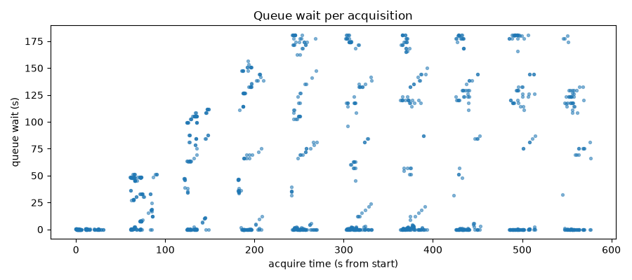
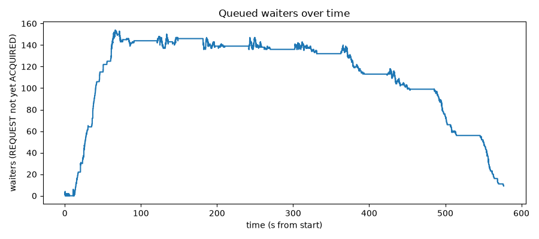
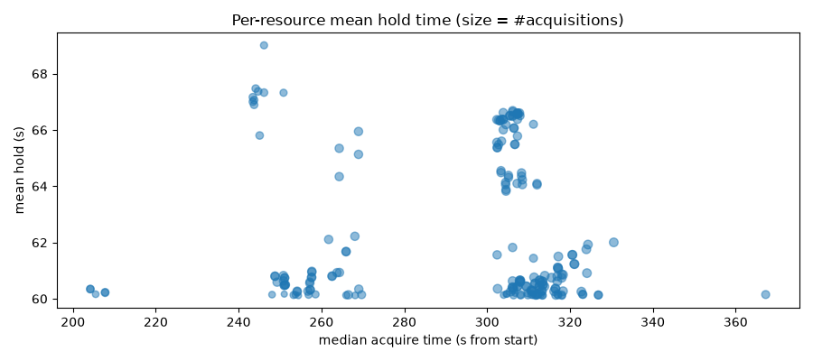
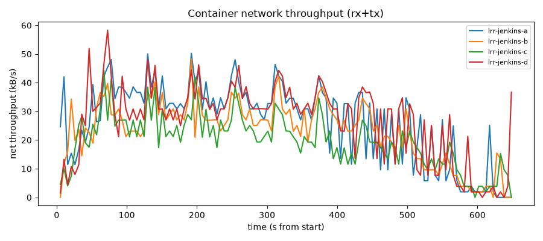
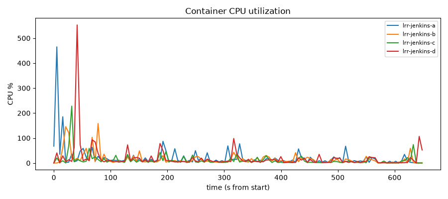

# Load Test Report — grid-storm

- runId: 20260622153253
- preset: stress
- plugin under test: `e231367`
- builds: 200 (jobs with events: 200)

## Scenario — what was tested

**G01 grid-storm**: all 4 controllers (a/b/c/d) act as both lock **server and client**. Each controller starts **50 concurrent pipeline jobs** (**200 jobs total** across the grid). Each controller defines 50 lockable resources (label `pool`); 40 are exposed for remote acquisition.

Every job repeats the following **3 time(s)** (whole-job timeout 15 min):

1. **remote lock** `lock(label:'pool', quantity:2, serverId:<random>)` — 2 exposed resources on a randomly chosen OTHER controller (allocate timeout 3 min)
2. **local lock** `lock(label:'pool', quantity:1)` — 1 local resource, nested inside the remote hold (allocate timeout 3 min)
3. **remote skipIfLocked** `lock(label:'pool', quantity:1, serverId:<random>, skipIfLocked:true)` — best-effort; success or failure is swallowed (must not fail the job)
4. **hold** for 60s
5. **release** the local lock, then the remote lock

| parameter | value |
|---|---|
| jobs / controller | 50 |
| total concurrent jobs | 200 |
| iterations / job | 3 |
| hold (sleep) | 60s |
| remote-lock allocate timeout | 3 min |
| local-lock allocate timeout | 3 min |
| whole-job timeout | 15 min |
| loopback (self as remote target) | off (cross-controller only) |

## Result

- build FAILURE: 9
- build SUCCESS: 191

**Failure breakdown** (by console signature)

- `LOCK_WAIT_TIMEOUT` (clean allocate timeout, fail-closed): 9

**Invariants**

- mutual-exclusion overlap violations (a resource held beyond capacity at any instant): **0** (PASS)
- termination — HUNG / UNKNOWN result (possible deadlock or lost wakeup): **0** (PASS)

## Queue wait (ms)

- count: 1154  p50: 6443.5  p95: 177458.7  p99: 180492.41  max: 180620

## Resource utilization (docker stats)

| container | peak CPU% | peak mem (MiB) | net rx (MB) | net tx (MB) | samples |
|---|---|---|---|---|---|
| lrr-jenkins-a | 465.1 | 1045.5 | 8.26 | 8.93 | 126 |
| lrr-jenkins-b | 158.2 | 774.1 | 7.36 | 7.48 | 126 |
| lrr-jenkins-c | 227.9 | 945.5 | 6.43 | 6.36 | 126 |
| lrr-jenkins-d | 552.9 | 936.2 | 8.49 | 8.73 | 126 |

> net rx/tx = cumulative delta over the run.

## Plots

### Queue wait per acquisition

One point per lock acquisition: how long it waited (y) vs when it was acquired (x).

### Queued waiters over time

Lock requests waiting (REQUESTed but not yet ACQUIRED) at each instant. Peaks = contention.

### Per-resource mean hold time

One point per resource: mean hold time (y) vs median acquire time (x); point size = number of acquisitions. Shows load skew across the pool.

### Container network throughput (REST API load)

Per-container rx+tx throughput over time = load on the remote-lock REST API.

### Container CPU utilization

Per-container CPU% over time; busier remote targets spike higher.

## Artifacts

- events: `20260622153253-load-test/grid-storm/events.csv`
- classification: `20260622153253-load-test/grid-storm/job-classification.csv`
- overlaps: `20260622153253-load-test/grid-storm/overlaps.txt`
- metrics: `20260622153253-load-test/grid-storm/metrics.json`
- consoles: `20260622153253-load-test/grid-storm/consoles/`
