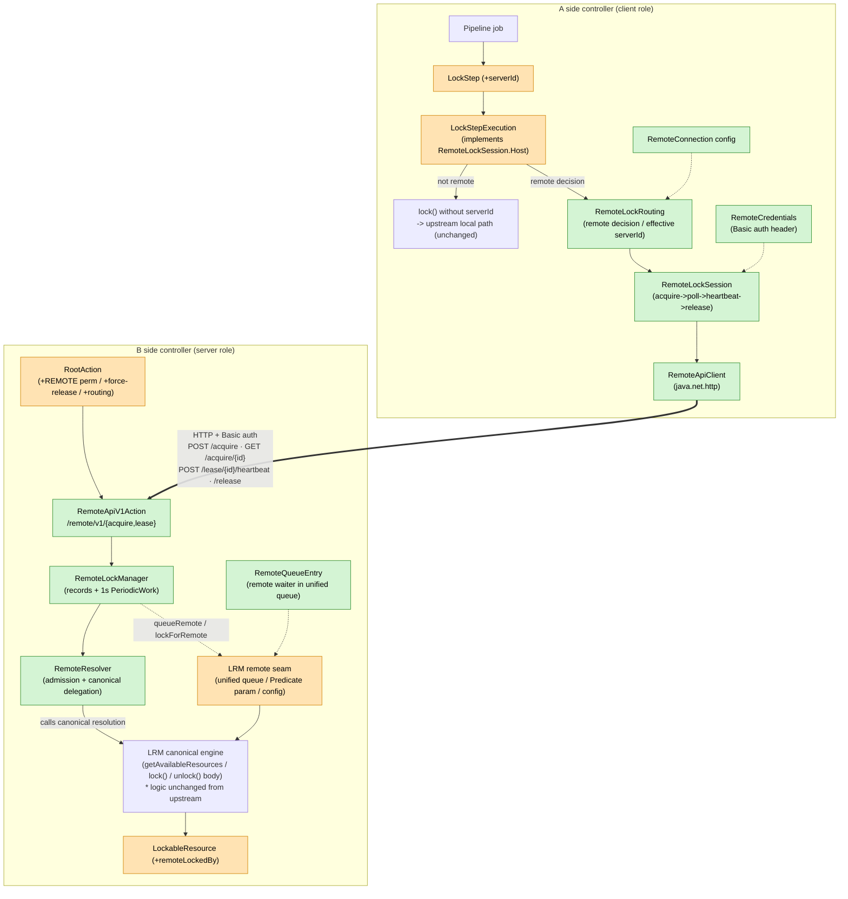
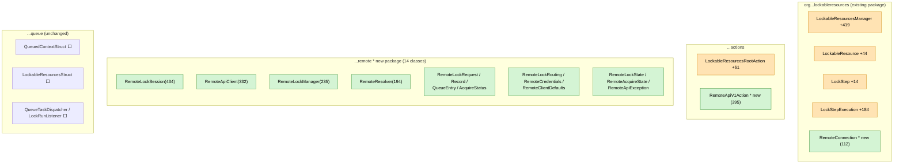
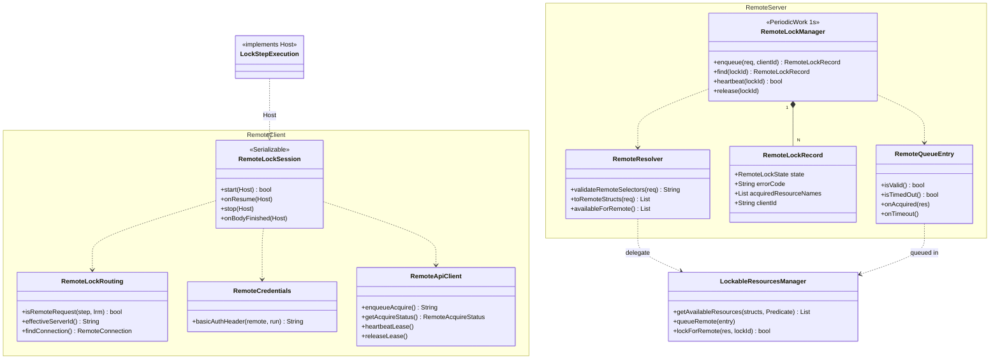
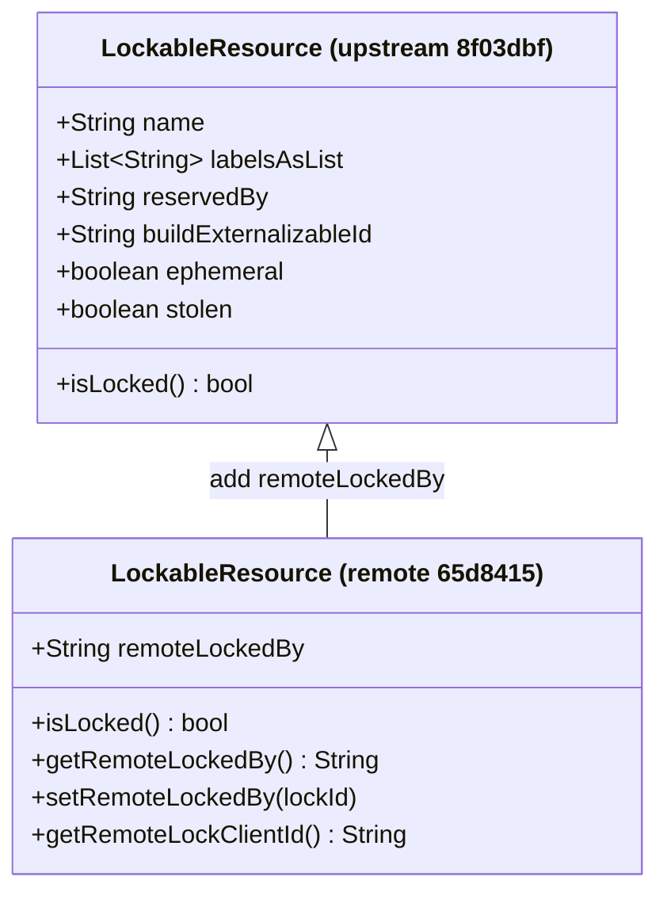
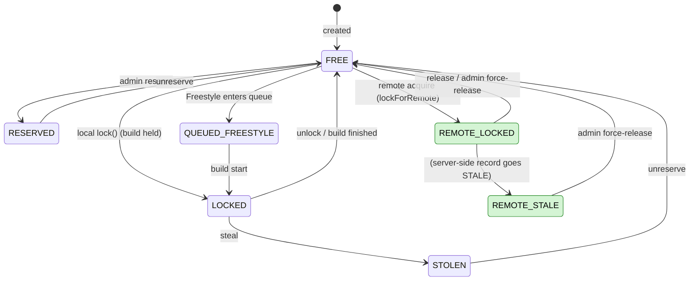
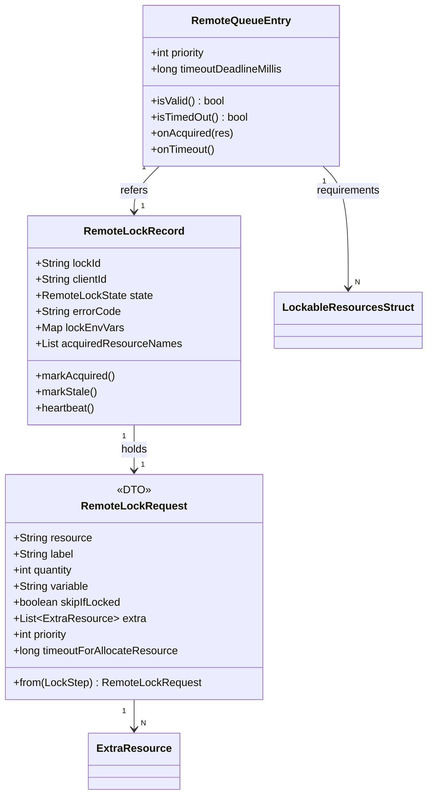
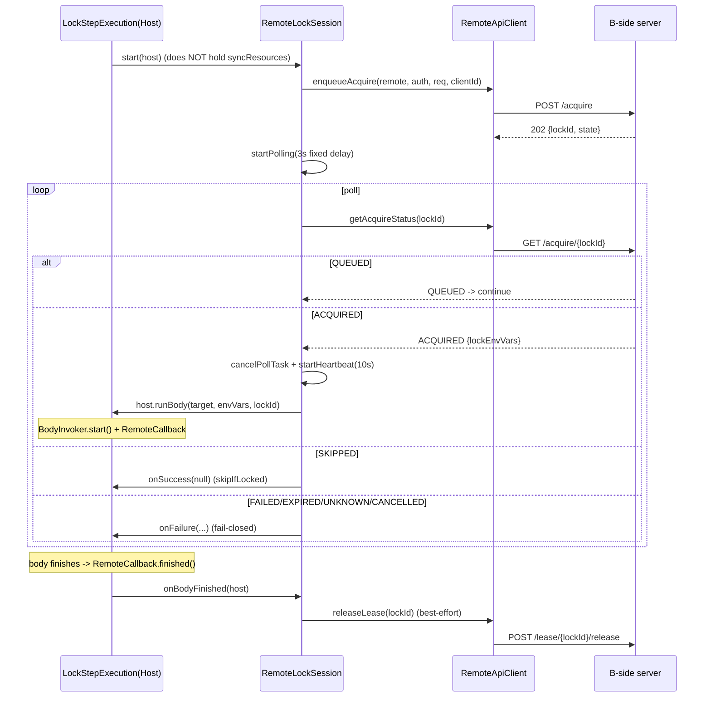
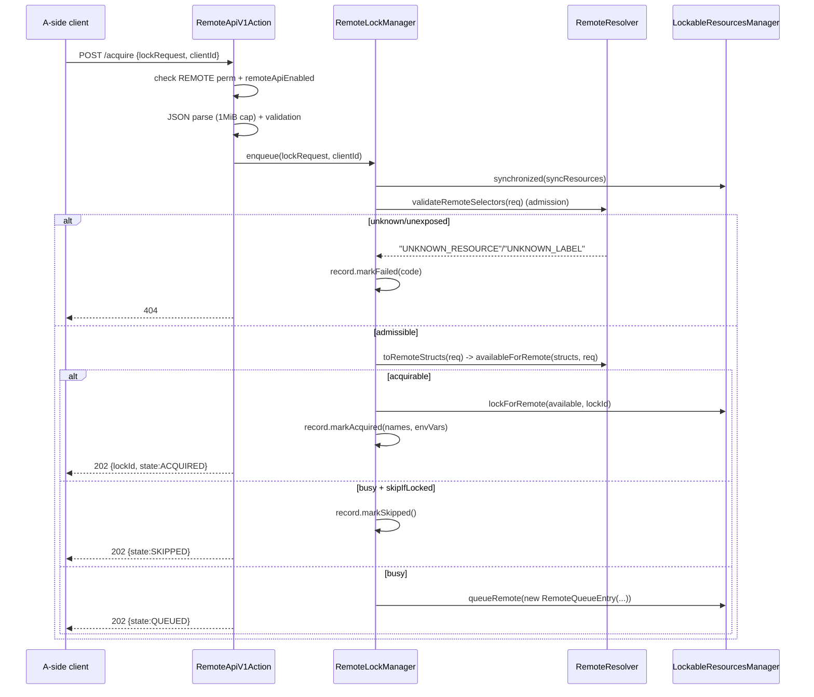
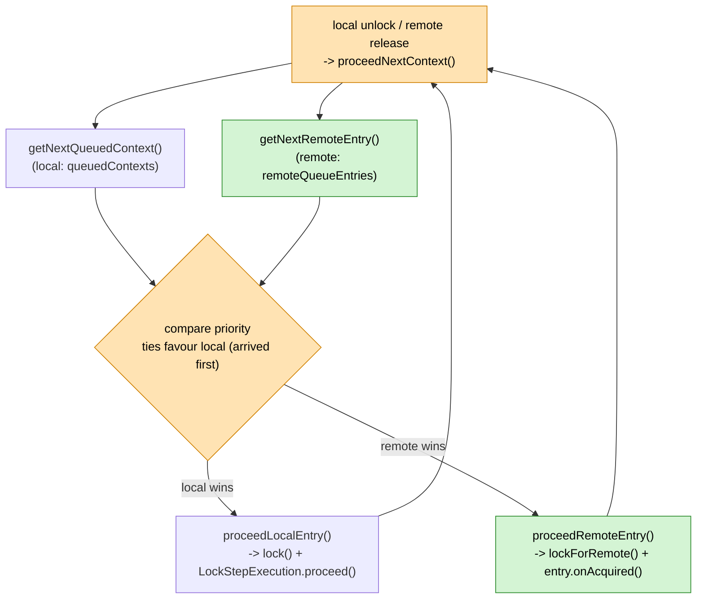
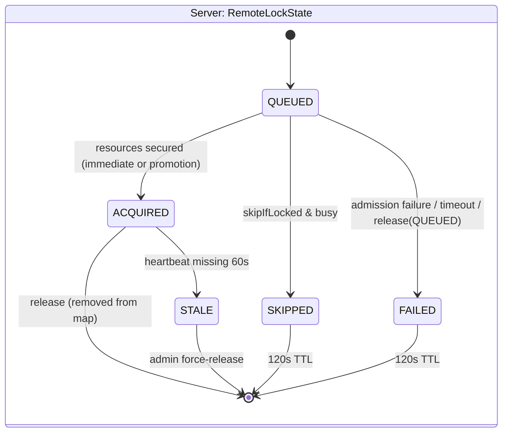

# Remote Lockable Resources Architectural Analysis (development build `65d8415`)

Target repository: development fork (`feature/1025-remote-lr-p1-m1`)
Target commit: **`65d8415782d06a1c11df9be49b12c3de5c29a47e`** (`Address Jenkins Security Scan findings on the remote API`)
Baseline: **upstream master `8f03dbf`** ([lockable-resources-architecture-8f03dbf-e.md](lockable-resources-architecture-8f03dbf-e.md))
Source epic: [jenkinsci/lockable-resources-plugin#1025](https://github.com/jenkinsci/lockable-resources-plugin/issues/1025) (Phase 1 / as of M1H)

> Purpose: to give a single view, at a granularity that survives deep review, of **what changed from
> upstream** and **the design principles, decisions, and trade-offs readable from the code**. The primary
> sources for the design cycles are `dev/docs-e/LRR_DESIGN_P1_M1*.md`; this document consolidates them into
> "the structure of the final code".

> **Diagram legend (diff vs upstream `8f03dbf`)**
> ```mermaid
> graph LR
>     classDef new fill:#d4f4d4,stroke:#2a8a2a,color:#000
>     classDef mod fill:#ffe3b3,stroke:#d08000,color:#000
>     N["🟩 new (added for remote)"]:::new
>     M["🟧 modified (touched an upstream class)"]:::mod
>     U["⬜ unchanged (upstream as-is)"]
> ```

---

## Table of Contents

1. [High-Level Architectural Overview](#1-high-level-architectural-overview)
2. [Package Structure and Class Responsibilities](#2-package-structure-and-class-responsibilities)
3. [Data Model Details](#3-data-model-details)
4. [What Was Added (diff summary)](#4-what-was-added-diff-summary)
5. [Design Principles (read from the code)](#5-design-principles-read-from-the-code)
6. [Client-Side Flow (RemoteLockSession state machine)](#6-client-side-flow-remotelocksession-state-machine)
7. [Server-Side Flow (REST API -> RemoteLockManager -> unified queue)](#7-server-side-flow-rest-api---remotelockmanager---unified-queue)
8. [Unified Priority Queue (the heart of core integration)](#8-unified-priority-queue-the-heart-of-core-integration)
9. [HTTP API Specification](#9-http-api-specification)
10. [State Machines (client state vs server state)](#10-state-machines-client-state-vs-server-state)
11. [Core Modifications, Point by Point (unavoidable seams)](#11-core-modifications-point-by-point-unavoidable-seams)
12. [Design Decisions and Trade-offs (review points)](#12-design-decisions-and-trade-offs-review-points)
13. [Known Intentional Deferrals / Caveats](#13-known-intentional-deferrals--caveats)
14. [Files Changed vs Upstream](#14-files-changed-vs-upstream)

---

## 1. High-Level Architectural Overview

In one line: **make `lock()` work across separate Jenkins controllers.** A Pipeline `lock(..., serverId:'X')`
on one controller (the A side / client role) acquires, holds, and releases a lockable resource owned by
another controller (the B side / server role) over HTTP. **A single plugin contains both roles** (peer mode).

**Legend:** ⬜ = logic reused unchanged from upstream; 🟧 = a seam where an upstream file was touched;
🟩 = entirely new. Upstream (`8f03dbf`) has no 🟩 at all -- the ⬜ logic completed within a single JVM under
`syncResources`. The remote edition adds 🟩 and **crosses the JVM boundary over HTTP** (even in the 🟧 files,
the body of the upstream logic -- `CORE`/`LOCAL` below -- is unchanged).



### Two operating modes (client-side routing)

The decision is `RemoteLockRouting.isRemoteRequest(step, lrm)` (remote if either serverId or forcedServerId
is non-empty).

| Mode | Trigger | Behaviour |
|---|---|---|
| **peer mode** | `lock(..., serverId:'X')` | Targets the server X named in the DSL |
| **delegated mode** | global config `forcedServerId` | **All lock()s** on this controller are forcibly delegated to that server (overriding any DSL serverId, with an INFO log) |

> The biggest structural difference from upstream: there, `LockStepExecution.start()` completed inside
> `synchronized(syncResources)`. The remote edition places the **remote branch before acquiring the lock**
> (the A side cannot hold the B side's `syncResources` over HTTP).

---

## 2. Package Structure and Class Responsibilities

### 2.1 Package overview (diff-highlighted)



Point: **the new logic is cohered into the `remote` package**, and the changes to the existing packages
(root/actions) are only the "unavoidable seams" of [§11](#11-core-modifications-point-by-point-unavoidable-seams).
The `queue` package is untouched.

### 2.2 Class relationships (detail)



### 2.3 Responsibilities

| Class | Side | Kind | Responsibility |
|---|---|---|---|
| `RemoteLockSession` | A | 🟩 | **Client state machine.** acquire->poll->heartbeat->release. `Serializable` (survives restart). Minimal callbacks into the step via `Host` |
| `RemoteLockRouting` | A | 🟩 | Remote decision / effective serverId / connection lookup / display name (static helpers) |
| `RemoteCredentials` | A | 🟩 | credentialsId -> Basic auth header (Run context first, then system store) |
| `RemoteApiClient` | A | 🟩 | Thin HTTP client (`java.net.http.HttpClient`); only 4 endpoints |
| `RemoteClientDefaults` | A | 🟩 | poll=3s / heartbeat=10s / request timeout=5s / base path |
| `RemoteApiV1Action` | B | 🟩 | **REST endpoint.** JSON parsing / validation / HTTP status mapping |
| `RemoteLockManager` | B | 🟩 | **Server-side authority.** `records` map + 1s tick (STALE detection, terminal-record TTL cleanup) |
| `RemoteResolver` | B | 🟩 | **Admission (existence/exposure) check + canonical resolution.** Uses only LRM public API; never takes the lock |
| `RemoteLockRecord` | B | 🟩 | Lifecycle of one lock (volatile fields) |
| `RemoteQueueEntry` | B | 🟩 | Remote waiter that rides the unified queue (counterpart to local `QueuedContextStruct`) |
| `RemoteLockRequest` | both | 🟩 | DTO of lock semantics (does not carry serverId -- routing is a separate concern) |
| `RemoteConnection` | A | 🟩 | Connection config (`AbstractDescribableImpl`, persisted as a list on LRM) |
| `LockableResourcesManager` | B | 🟧 | Unified queue / Predicate seam / config / `lockForRemote` ([§11.1](#11-core-modifications-point-by-point-unavoidable-seams)) |
| `LockStepExecution` | A | 🟧 | `Host` impl / remote branch / `buildLockEnvVars` extraction |
| `LockableResource` | B | 🟧 | `remoteLockedBy` / `isLocked()` extension |
| `LockStep` | A | 🟧 | `serverId` DSL |
| `LockableResourcesRootAction` | B | 🟧 | `REMOTE` permission / force-release / `/remote` routing |

---

## 3. Data Model Details

### 3.1 Changes to LockableResource (diff vs upstream)



> The remote edition **inherits all upstream fields as-is** and adds the above (`remoteLockedBy` and related
> accessors). `remoteLockedBy` is `transient volatile`, and `isLocked()` is extended to
> `getBuild()!=null || remoteLockedBy!=null` (the diagram shows only signatures to avoid symbol clashes).

| Change | Kind | Effect |
|---|---|---|
| `transient volatile String remoteLockedBy` | 🟩 | Holds the lockId of the remote holder. **transient** = lost on restart ([§5 principle 5](#5-design-principles-read-from-the-code)) |
| `isLocked()` -> `getBuild()!=null \|\| remoteLockedBy!=null` | 🟧 | Dashboard display + **excludes remote-held resources from local lock candidates**. Essential so the two paths never double-acquire the same resource |
| `getRemoteLockClientId()` | 🟩 | Looks up the clientId via `RemoteLockManager.find()` for UI display |
| remote branch in `getLockCauseDetail()` | 🟧 | Shows "resource X is locked by remote lockId ..." |

> `name`/`labelsAsList`/`reservedBy`/`buildExternalizableId`/`ephemeral`/`stolen` are **completely
> unchanged**. The remote lock is expressed by a single `remoteLockedBy` field as a **second lock axis
> independent of the build** (acquired via `setRemoteLockedBy()`, not `setBuild()` -- no active Run needed).

### 3.2 LockableResource state transitions (with the remote branch added)



Green is the new remote occupancy axis. `REMOTE_LOCKED`/`REMOTE_STALE` are the `remoteLockedBy != null`
states and are **orthogonal** to upstream `LOCKED` (build held) -- the `isLocked()` extension makes it
impossible for the same resource to be in both at once.

### 3.3 New data model (server-side record / request / queue)



| Class | Role | Local counterpart |
|---|---|---|
| `RemoteLockRequest` | Lock semantics of an acquire (no routing) | The semantic part of `LockStep` |
| `RemoteLockRecord` | State of one lock held by the server (in-memory, volatile) | (none in upstream) |
| `RemoteQueueEntry` | Remote waiter that rides the unified queue | `QueuedContextStruct` |
| `RemoteConnection` | Connection target config (A side) | (none in upstream) |

- `RemoteLockRequest` deliberately omits `serverId` -- **lock semantics and routing are separate concerns**
  (routing belongs to `RemoteLockRouting` / `forcedServerId`).
- `RemoteQueueEntry.structs` is a list of `LockableResourcesStruct` (the same type local lock uses), so
  queue-promotion resolution goes through the canonical path as-is ([§8](#8-unified-priority-queue-the-heart-of-core-integration)).

### 3.4 Enums (state split into two families)

| enum | Kind | Values | Use |
|---|---|---|---|
| `RemoteLockState` | 🟩 | QUEUED / ACQUIRED / SKIPPED / FAILED / STALE | **Server-internal** record state |
| `RemoteAcquireState` | 🟩 | QUEUED / ACQUIRED / SKIPPED / FAILED / CANCELLED / EXPIRED / UNKNOWN | **Client-observed** (GET response; `fromString` normalises unknown values to UNKNOWN) |

For detailed transitions and the mapping see [§10](#10-state-machines-client-state-vs-server-state).

---

## 4. What Was Added (diff summary)

```
8f03dbf..65d8415   47 files changed, +5648 / -43
```

| Category | Content |
|---|---|
| **New `remote` package** | 14 classes (state machine, server manager, resolution, HTTP client, DTOs, enums) |
| **New REST endpoint** | `actions/RemoteApiV1Action` (`/lockable-resources/remote/v1/*`) |
| **New global-config holder** | `RemoteConnection` (serverId / url / credentialsId) |
| **Core changes (5 files)** | `LockableResourcesManager` +419 / `LockStepExecution` +184 / `LockableResource` +44 / `LockStep` +14 / `RootAction` +61 |
| **UI (jelly/properties)** | Global config screen, remote column in the resource table, help |
| **Tests** | 8 test classes (unit) + E2E scenarios (separately under `dev/jenkins-env`) |

---

## 5. Design Principles (read from the code)

Design principles consistently readable from the code and Javadoc. They are the yardstick for "how it
should be" during review.

### Principle 1: ride canonical `lock()`; add only network-bridge-derived judgement

The server **does not re-implement `lock()` semantics**. Resource resolution goes through the same upstream
`LockableResourcesManager.getAvailableResources(...)`. What remote adds is only the *visibility judgement* of
"which resources may a remote client see (the exposeLabel filter)".

- `RemoteResolver.availableForRemote()` simply calls `getAvailableResources(structs, null, strategy, predicate)`.
- `predicate = r -> isExposed(r, exposeLabels)`. The canonical side knows nothing about exposeLabel (a generic `Predicate`).
- As a result, upstream features -- a label's "quantity 0 = all", atomic acquisition of `extra`,
  `resourceSelectStrategy`, property env vars -- all **take effect transparently with zero extra
  implementation** (= transparent equivalence; the theme of M1B-M1D in `dev`).

### Principle 2: unified priority queue (remote competes on the same footing as local)

The remote wait is **not a separate queue**. It piggybacks on the local wait-drain `LRM.proceedNextContext()`
and competes fairly by priority ([§8](#8-unified-priority-queue-the-heart-of-core-integration)). No "remote
jumps ahead / is deprioritised".

### Principle 3: fail-closed (do not release the lock on communication failure)

On communication/state failure the client **does not attempt release** and fails the job. A lock held on the
server is reclaimed via heartbeat timeout (STALE). This avoids "the network dropped, so release on its own"
-- a breeding ground for double acquisition.

- `RemoteLockSession.finishFailure()`: `// Fail-closed: do not attempt release on communication/state failures.`
- A heartbeat failure **keeps the job running** (the server still holds it).

### Principle 4: exposeLabel is opt-in (nothing is exposed by default)

Empty `exposeLabel` = **zero exposure**. `getExposeLabels()` returns an empty set, and
`isExposed`/`hasExposedCandidate` are false. Only resources explicitly given a label are visible to remote.
This prevents accidentally exposing every resource.

### Principle 5: remote lock state is volatile (transient, lost on restart)

`LockableResource.remoteLockedBy` is **`transient`** and the server's `RemoteLockManager.records` are
in-memory. Restarting the B side loses all remote locks. This accepts the premise "released before restart
(operator runbook)" while **deliberately not creating ghost locks via restore**.

### Principle 6: make the core changes read as a "minimal feature addition" (M1G packaging)

Remote-specific logic is cohered into the `remote` package as much as possible, narrowing the diff to the
five core files to just the **unavoidable seams**
([§11](#11-core-modifications-point-by-point-unavoidable-seams)). The structure aims for an upstream PR
reviewer to read it as "the existing code is nearly untouched; the feature is added as an independent
package" (M1G compressed +1208 -> +665).

---

## 6. Client-Side Flow (RemoteLockSession state machine)

### 6.1 Acquire -> run -> release



### 6.2 Key implementation points of the state machine

- **Two-timer design**: poll (`Timer.get().scheduleWithFixedDelay`, 3s) and heartbeat (10s). On observing
  ACQUIRED, stop poll and start heartbeat (no more status reads after acquisition).
- **`completionSignaled` (AtomicBoolean)**: a CAS guard that signals success/failure/release **exactly
  once**. Even if poll, heartbeat, and the callback race, no double signal.
- **Poll failures are split in two**:
  - HTTP **404/410** -> the server has no record (e.g. restarted) -> **fail immediately** (retrying is futile).
  - Otherwise (transient network failure) -> increment `consecutivePollFailures` and retry **up to 20 times
    (~60s)**; beyond that, fail-closed.
- **A heartbeat failure keeps the job running**: the server is assumed to still hold it; going STALE is the
  server's responsibility.
- **Across restart (`onResume`)**:
  - Body was running -> Jenkins interrupts the body, so **best-effort release and fail the job**.
  - Was polling in QUEUED/ACQUIRED -> rebuild the poll loop (retry budget reset).
  - Not yet enqueued (lockId null) -> do nothing.
- **`stop` (step aborted)**: stop timers -> best-effort release -> onFailure.

### 6.3 The Host seam (peeling the state machine off the core)

`RemoteLockSession` delegates only the **StepExecution-specific dependencies** -- `StepContext`, body
invocation, surviving serialization -- to the host (`LockStepExecution`) via the `Host` interface.

```java
interface Host extends Serializable {
    StepContext context();   // Run/FlowNode/TaskListener, onSuccess/onFailure
    LockStep step();
    void runBody(String displayTarget, Map<String,String> lockEnvVars, String lockId); // body invocation
}
```

As a result, the remote branch in `LockStepExecution.start()` is just a few lines --
`if (RemoteLockRouting.isRemoteRequest(step, lrm)) { remoteSession = new RemoteLockSession(); return remoteSession.start(this); }`
-- and the state machine body (+434 lines) lives in the `remote` package.

---

## 7. Server-Side Flow (REST API -> RemoteLockManager -> unified queue)



### 7.1 Server-side authority = `RemoteLockManager`

- `records`: `ConcurrentHashMap<lockId, RemoteLockRecord>` (in-memory only).
- **1s `PeriodicWork` (`doRun` -> `maybeScanStale`)**:
  - ACQUIRED with heartbeat missing for more than **STALE_THRESHOLD_MS (= max(heartbeat x 6, 60) = 60s)** -> `markStale()`.
  - Terminal (SKIPPED/FAILED) records are swept from the map after a **120s TTL**.
  - **QUEUED expiry is NOT handled here** (the unified queue's `RemoteQueueEntry` timeout owns it; result of M1H/B2).
- Queue promotion (QUEUED->ACQUIRED) is **also not done here**; it goes via LRM's `proceedNextContext()`
  ([§8](#8-unified-priority-queue-the-heart-of-core-integration)).

### 7.2 Admission (RemoteResolver.validateRemoteSelectors)

**Before** canonical resolution, it checks that the main selector and every `extra` entry "exists and carries
an exposeLabel":

- resource by name: exists via `fromName` AND `isExposed` (intersects exposeLabel) -> OK, else `UNKNOWN_RESOURCE`.
- by label: OK if at least one candidate carries that label AND an exposeLabel, else `UNKNOWN_LABEL`.
- Only requests that pass proceed to canonical resolution. **Unknown/unexposed -> a uniform 404** (a uniform
  response that does not reveal existence).

Design intent (per code comments): rejecting at admission **(1)** prevents creating ephemeral resources and
**(2)** avoids queueing forever for something that will never be lockable. "Exposed but busy" is QUEUEd, just
like local.

---

## 8. Unified Priority Queue (the heart of core integration)

Draining remote waits through the **same drain** as local waits is the part that cuts deepest into the core.



Upstream `LockableResourcesManager.proceedNextContext()` is modified to **compare the heads of both queues**:

```java
boolean pickRemote = nextRemote != null
    && (nextLocal == null || nextRemote.getPriority() > nextLocal.getPriority());
```

- Fair by **descending priority**; on a tie, local (arrived first) wins.
- `getNextRemoteEntry()` scans the remote queue, removing invalid (state != QUEUED) / timed-out entries, and
  returns the **first entry resolvable by the canonical `availableForRemote()`** (setting its resolved list).
- Both `unlockRemoteResources()` and `unlockResources()` (local) **drain all newly satisfiable waiters** via
  `while (proceedNextContext())`.

### 8.1 Remote queue state and boundaries

| Item | Value / contract |
|---|---|
| Storage | `LRM.remoteQueueEntries` (**transient** List) |
| Sync | All access under `synchronized (syncResources)` |
| Insert | `queueRemote(entry)` (inserted at the priority-descending position) |
| Remove | `unqueueRemote(lockId)` (client cancel / QUEUED release) |
| Timeout | `RemoteQueueEntry.timeoutDeadlineMillis` (= `timeoutForAllocateResource`, 0 = infinite) |
| Promotion | `proceedRemoteEntry()` -> `lockForRemote()` -> `onAcquired()` (mark record ACQUIRED, build envVars) |

### 8.2 How the release vs promotion race is closed (review-critical)

`RemoteLockManager.release()`, **under syncResources**, does "if QUEUED, first `markFailed("RELEASED")` then
`unqueueRemote`". This prevents a promotion that runs exactly when resources free up (`proceedRemoteEntry`
checks `entry.isValid()` == QUEUED) from **grabbing resources for an already-released record** = a ghost lock
(resource pinned, record gone). Meanwhile `unlockRemoteResources()` / `scheduleQueueMaintenance()` touch the
Jenkins Queue lock, so they are called **outside syncResources** -- a two-stage boundary (noted explicitly in
the code comments).

---

## 9. HTTP API Specification

base path: **`/lockable-resources/remote/v1`** (`RootAction.getDynamic("remote")` -> `RemoteRouterAction` -> `RemoteApiV1Action`)

| Method | Path | Role | Success | Main failures |
|---|---|---|---|---|
| `POST` | `/acquire` | enqueue an acquire | `202 {lockId, state}` | 400 (bad JSON/target), 404 (unknown/unexposed), 413 (>1MiB), 403 (disabled/perm) |
| `GET` | `/acquire/{lockId}` | read status (**pure read**) | `200 {state, errorCode?, lockEnvVars?}` | 404 (lock unknown), 403 |
| `POST` | `/lease/{lockId}/heartbeat` | renew lease | `204` | 410 (STALE / not found), 403 |
| `POST` | `/lease/{lockId}/release` | release (idempotent) | `204` | 403 |

### 9.1 Security hardening (M1H = the focus of `65d8415`)

This commit addresses the Jenkins Security Scan findings (#49-52) on PR #1055.

| Finding | Fix |
|---|---|
| #49/#51 `RemoteConnection.doCheckUrl` | `@POST` + `Jenkins.ADMINISTER` check; `checkMethod="post"` in the jelly |
| #50 `LRM.doCheckForcedServerId` | `@POST` added (ADMINISTER already present); `checkMethod="post"` in the jelly |
| #52 side effect of `GET /acquire/{lockId}` | **B2 adopted**: make GET a pure read. Remove the old `touchPoll` keepalive and **fold QUEUED liveness onto the queue timeout** |

Other defences (from the code):

- All endpoints: check the **`REMOTE` (RemoteUse) permission** + `isRemoteApiEnabled()` every time (403 if disabled).
- Mutating endpoints use `@RequirePOST` (CSRF).
- POST body is capped at **1 MiB** (`MAX_BODY_CHARS`, 413 on overflow) to prevent an authenticated client from OOMing the server.
- 404 admission **avoids revealing existence** (unknown/unexposed are indistinguishable 404s).
- Auth is Basic (`RemoteCredentials`, credentialsId -> username:apiToken).

### 9.2 Acquire JSON acceptance rules (the details behind transparent equivalence)

`RemoteApiV1Action.AcquireRouter.doIndex` parsing matches the local `lock()` defaults **strictly**:

- `quantity` defaults to **0 (= all)**. It must NOT default to 1 (so a label's "take all" is not broken).
- `resource`/`label`/`reason`/`variable` are trimmed -> null if empty.
- **extra-only** requests are valid (accepted if there is no main target but there is extra).
- An unknown `resourceSelectStrategy` is 400.
- `heartbeatIntervalSeconds` is accepted but **ignored in Phase 1** (the server uses a fixed STALE constant).

> This "always poke defaults / unspecified / 0 / empty" stance comes from the lesson that `extra` once slipped
> through the transparent-equivalence tests in an earlier cycle (the equivalence-test policy in `dev`).

---

## 10. State Machines (client state vs server state)

The **client observation** (`RemoteAcquireState`) and the **server internals** (`RemoteLockState`) are
deliberately **separate enums**.



| Server `RemoteLockState` | Client `RemoteAcquireState` (GET response) | Client behaviour |
|---|---|---|
| QUEUED | QUEUED | keep polling |
| ACQUIRED | ACQUIRED | start body + heartbeat |
| SKIPPED | SKIPPED | onSuccess(null) |
| FAILED | FAILED | onFailure (fail-closed) |
| STALE | (410 LOCK_STALE on heartbeat) | treated as heartbeat failure (job continues) |
| -- (record lost on server restart) | GET returns 404/410 | immediate onFailure |

The client enum also has `CANCELLED`/`EXPIRED`/`UNKNOWN`, to cope with server/admin-initiated cancellation and
unknown responses (normalised to UNKNOWN by `fromString`).

---

## 11. Core Modifications, Point by Point (unavoidable seams)

Most of the remote logic lives in the `remote` package, but the following touchpoints have to stay in the
core. **Review should focus here.**

### 11.1 `LockableResourcesManager` (+419)

| Change | Content | Impact on local behaviour |
|---|---|---|
| `getAvailableResources(..., Predicate candidateFilter)` overload | The old signature delegates with `r -> true`; the filter is applied to the candidate pool **before count-based selection** | **None** (old calls all pass `true`). Just inserts the filter in both the label and name branches |
| local/remote interleave in `proceedNextContext()` | Compares `getNextRemoteEntry()` and branches into `proceedLocalEntry`/`proceedRemoteEntry` | Local is merely extracted into `proceedLocalEntry`; behaviour identical |
| remote queue ops | `queueRemote`/`unqueueRemote`/`lockForRemote`/`unlockRemoteResources`/`getNextRemoteEntry`/`proceedRemoteEntry` | Directly mutates local resources, so it correctly belongs to LRM |
| global config | `remoteApiEnabled`/`exposeLabel`/`clientId`/`forcedServerId`/`remotes` + getters/setters/`doCheckForcedServerId` + `readResolve` | No interference with existing behaviour; `readResolve` backfills missing fields in old XML |

`lockForRemote`: uses `setRemoteLockedBy(lockId)` instead of `setBuild()`, holding a resource **without an
active Jenkins build**. This is the fundamental difference from local lock (remote has no Run).

### 11.2 `LockableResource` (+44)

- `transient volatile String remoteLockedBy`: lockId of the remote holder. **transient** (lost on restart).
- `isLocked()` extended to `getBuild() != null || remoteLockedBy != null` -> drives dashboard display and
  **excludes remote-held resources from local lock candidates**.
- `getRemoteLockClientId()`: looks up the clientId via `RemoteLockManager.find()` (for UI display).
- Added a remote-held branch to `getLockCauseDetail()`.

### 11.3 `LockStep` (+14) / `LockStepExecution` (+184)

- `LockStep.serverId` (DSL parameter) + `setServerId` (trim, whitespace warning).
- `LockStepExecution implements RemoteLockSession.Host`. Decides remote at the top of `start()` and delegates.
- **Extracted `buildLockEnvVars(variable, lockedResources)` as static**: shares the env-var generation of
  local `proceed`. The remote server generates the **same map** and bridges it to the client (never drifts
  from local).
- `RemoteCallback` (on body finish -> `onBodyFinished` -> release), `EnvVarsExpander` (injects a precomputed env).
- `stop`/`onResume` delegate to remoteSession.

### 11.4 `RootAction` (+61)

- The **`REMOTE` (RemoteUse) permission** (parent = ADMINISTER). Intended to "make remote clients visible in
  the authorization matrix".
- `doReleaseRemoteLock` (`@RequirePOST` + UNLOCK permission): manual force-release of STALE etc.
- Routing `getDynamic("remote")` -> `RemoteRouterAction` -> `v1` -> `RemoteApiV1Action`.

---

## 12. Design Decisions and Trade-offs (review points)

| # | Decision | Rationale | Trade-off / review point |
|---|---|---|---|
| 1 | **fail-closed** (no release on comm failure) | avoid double acquisition | On a network partition the job fails but the server keeps holding the lock -> blocked until STALE reclaim (up to ~60s) |
| 2 | **STALE held until admin release** | a missing heartbeat does not necessarily mean it is safe to release | No auto-reclaim, so operations need `doReleaseRemoteLock`. Liveness vs existence gap |
| 3 | **remote state is transient** | prevent ghost locks via restore | B-side restart loses all remote locks; A-side poll gets 404 -> immediate fail. Premise: "released before restart" |
| 4 | **B2: GET made pure-read** (M1H) | state transitions are owned by server-side local logic anyway, and it is more RESTful | Loses early reclaim (~60s) of a QUEUED slot when `timeoutForAllocateResource==0` (infinite) and the client dies. QUEUED holds no resource, judged safe |
| 5 | **unified queue (not a separate one)** | fair local/remote competition | `proceedNextContext` is a core hot path; the correctness of the priority comparison governs overall fairness |
| 6 | **exposeLabel opt-in** | prevent accidental over-exposure | A missing setting means "everything 404" -- easy to overlook operationally |
| 7 | **canonical delegation (no re-implementation)** | transparent equivalence, minimal maintenance | Misplacing the filter (before count selection) would break the meaning of "all"; the `getAvailableResources` change is the biggest thing to watch |
| 8 | **404 admission (hide existence)** | minimise information disclosure | The resource/label distinction is retained in the errorCode (UNKNOWN_RESOURCE/LABEL) |
| 9 | **Basic auth + REMOTE permission** | put machine users in the authorization matrix via API tokens | Assumes TLS (url restricted to http(s)); credentials resolved Run-context-first then system store |

### Concurrency contract (invariants to verify during review)

- `RemoteResolver` **does not take the lock**. The caller (`enqueue` / `getNextRemoteEntry`) holds
  syncResources by contract.
- `RemoteLockRecord` fields are volatile. Transitions are mostly on the 1s tick thread; only `heartbeat()` is
  written by the HTTP thread.
- The two-stage boundary in `release()`: "for QUEUED, markFailed -> unqueue under syncResources" and
  "unlock/maintenance outside syncResources"
  ([§8.2](#82-how-the-release-vs-promotion-race-is-closed-review-critical)).

---

## 13. Known Intentional Deferrals / Caveats

Items triaged in `dev/docs-e/LRR_REVIEW_P1_M1*.md` and **intentionally kept**. Made explicit here because
they are often flagged as "isn't this a bug?" during review.

| ID | Content | Disposition |
|---|---|---|
| **M1E-1** | The promotion path (QUEUED->ACQUIRED) has no admission re-check. If the resource is deleted after enqueue, the canonical resolution (derived from `create=true`) could re-create it as an ephemeral | **Intentionally kept** (design §4). Admission is only at enqueue time. Impact judged limited |
| M1E-2/M1E-3 | (minor items from the same review) | kept |
| F-1 | whitespace-trim asymmetry between `isHttpUrl`/`resolve` (nit) | kept (Low) |
| heartbeatIntervalSeconds | accepted from the client but ignored (server fixed) | Phase 1 scope (per-request config out of scope) |
| client UI / read-only mirror | A-side visibility of remote resources | **Phase 2, not started** (issue #1025) |

---

## 14. Files Changed vs Upstream

```
8f03dbf..65d8415  47 files, +5648 / -43
```

### Core changes (5, 🟧)
- `LockableResourcesManager.java` (+419) -- unified queue / Predicate seam / config / lockForRemote
- `LockStepExecution.java` (+184) -- Host impl / remote branch / buildLockEnvVars extraction
- `LockableResource.java` (+44) -- remoteLockedBy / isLocked extension
- `actions/LockableResourcesRootAction.java` (+61) -- REMOTE permission / routing / force-release
- `LockStep.java` (+14) -- serverId DSL

### New `remote` package (14, 🟩)
`RemoteLockSession`(434) / `RemoteApiClient`(332) / `RemoteLockManager`(235) / `RemoteResolver`(194) /
`RemoteLockRequest`(197) / `RemoteLockRecord`(142) / `RemoteQueueEntry`(135) / `RemoteLockRouting`(84) /
`RemoteCredentials`(84) / `RemoteAcquireStatus`(59) / `RemoteApiException`(46) / `RemoteAcquireState`(32) /
`RemoteClientDefaults`(24) / `RemoteLockState`(23)

### New actions / config (🟩)
- `actions/RemoteApiV1Action.java` (395) -- REST endpoint
- `RemoteConnection.java` (112) -- connection-config holder

### UI / resources
- `LockableResourcesManager/config.jelly` etc. (remote config screen, help)
- `RemoteConnection/config.jelly` etc.
- `tableResources/table.jelly` (remote column)
- `Messages.properties` (forcedServerId warning / REMOTE permission description)

### Tests (8 classes)
`LockStepRemoteTest` / `RemoteApiV1ActionTest` / `RemoteLockManagerTest` / `RemoteApiClientTest` /
`RemoteConnectionTest` / `LockableResourcesManagerRemoteConnectionTest` / `RemoteAcquireStatusTest` /
`LockableResourceTest`, `LockableResourcesRootActionTest` (additions) + `casc_expected_output.yml`

---

> **Note:** This document targets the development build `65d8415` (as of Phase 1 / M1H completion), framed as
> the diff against upstream `8f03dbf`.
> Verification state (`dev` notes): `mvn verify` 383/0/1skip, all gates ok; E2E 20/20 PASS.
> Primary design sources: `dev/docs-e/LRR_DESIGN_P1_M1G.md` (packaging) / `LRR_DESIGN_P1_M1H.md` (security + B2) /
> each `LRR_REVIEW_P1_M1*.md` (triage).
</content>
