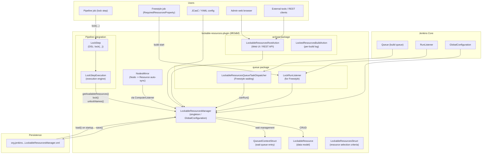
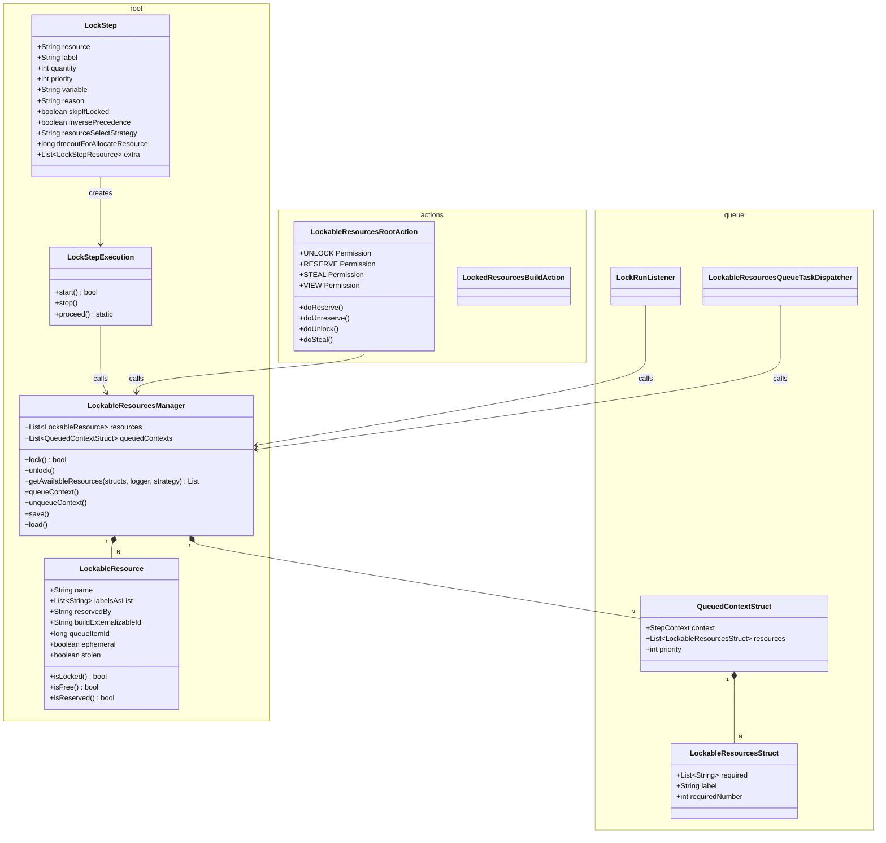
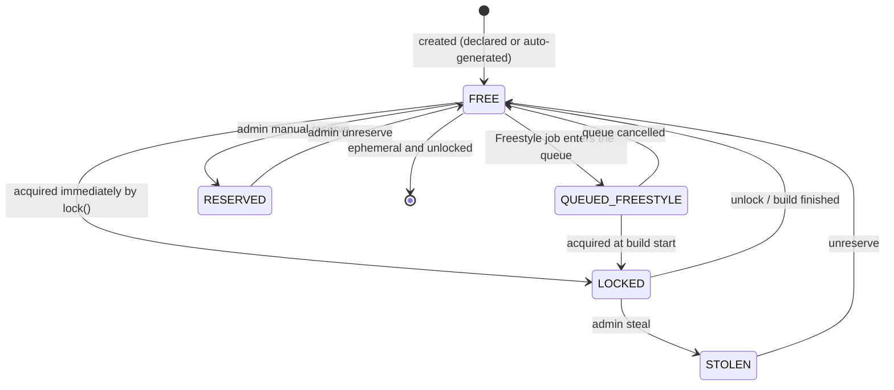
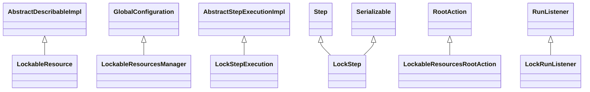
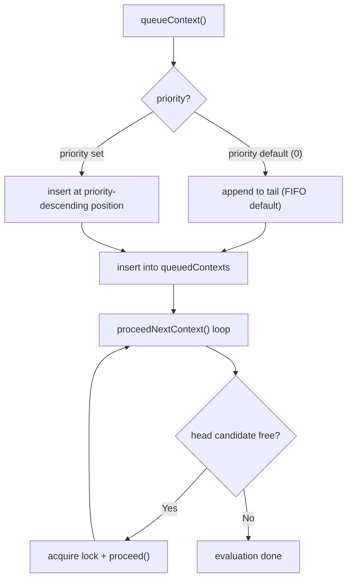
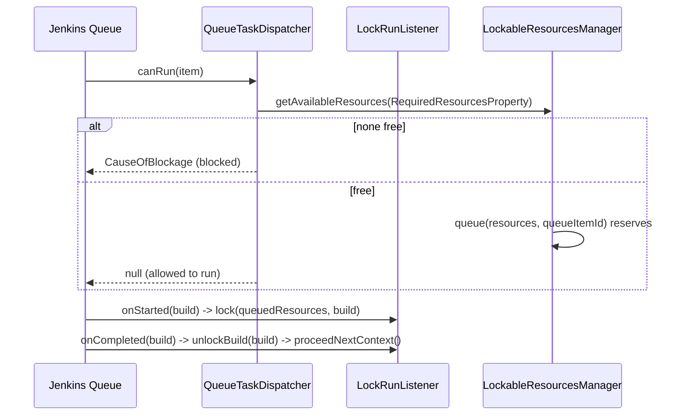
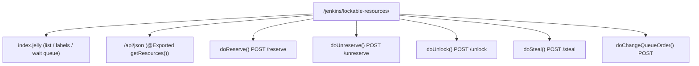
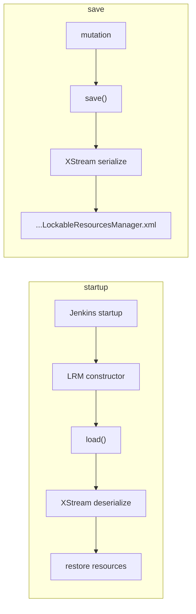
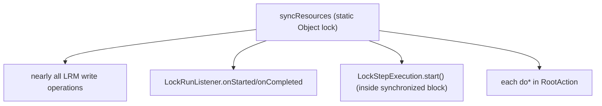

# Lockable Resources Plugin Architectural Analysis (upstream master `8f03dbf`)

Target repository: [jenkinsci/lockable-resources-plugin](https://github.com/jenkinsci/lockable-resources-plugin)
Target commit: **`8f03dbfe1b34f6c6994723ab5dd3df90cf91bf66`** (master, `chore(deps): bump crowdin/github-action ... (#1056)`)
Target path: `lockable-resources-plugin/`
Purpose: pin upstream behaviour as the **baseline** for the diff analysis of the remote extension (`65d8415`)

> This document is the **original map** that the companion
> [lockable-resources-architecture-65d8415-e.md](lockable-resources-architecture-65d8415-e.md)
> (the remote-extension edition) refers back to when describing "what was added on top of what". It is
> the earlier [lockable-resources-architecture-e.md](lockable-resources-architecture-e.md) re-organised and
> pinned to this commit.

---

## Table of Contents

1. [High-Level Architectural Overview](#1-high-level-architectural-overview)
2. [Package Structure and Class Responsibilities](#2-package-structure-and-class-responsibilities)
3. [Data Model Details](#3-data-model-details)
4. [Execution Flow of the Pipeline lock Step](#4-execution-flow-of-the-pipeline-lock-step)
5. [How the Waiting Queue Works](#5-how-the-waiting-queue-works)
6. [Core Resolution Logic (getAvailableResources)](#6-core-resolution-logic-getavailableresources)
7. [Integration with Freestyle Builds](#7-integration-with-freestyle-builds)
8. [UI and HTTP API](#8-ui-and-http-api)
9. [Persistence Mechanism](#9-persistence-mechanism)
10. [Synchronization and Thread-Safety Strategy](#10-synchronization-and-thread-safety-strategy)
11. [Key Extension Points (the scaffolding the remote extension builds on)](#11-key-extension-points-the-scaffolding-the-remote-extension-builds-on)

---

## 1. High-Level Architectural Overview



**In one sentence:** all mutual exclusion is implemented by the **single in-JVM singleton
`LockableResourcesManager` (LRM)**, which directly mutates the `resources` list and `queuedContexts`
under `synchronized (syncResources)`. There is no notion of crossing the network at all (which is exactly
the axis the remote extension adds).

---

## 2. Package Structure and Class Responsibilities



| Class | Responsibility |
|---|---|
| `LockableResourcesManager` (LRM) | **The sole authority.** Resource set, wait queue, lock/unlock, resolution, persistence, and global configuration (`GlobalConfiguration`) |
| `LockableResource` | State of one resource (name, labels, reservation, holding build, ephemeral, etc.) |
| `LockStep` / `LockStepExecution` | Declaration and execution engine of the Pipeline DSL `lock(...)` |
| `QueuedContextStruct` | One Pipeline context waiting to acquire (the unit that gets resumed) |
| `LockableResourcesStruct` | One selection criterion ("resource name / label / quantity"); `extra` is a list of these |
| `LockableResourcesQueueTaskDispatcher` / `LockRunListener` | For Freestyle (hooks into the standard Jenkins queue) |
| `LockableResourcesRootAction` | Web UI / REST / admin actions under `/lockable-resources/` |
| `NodesMirror` | Auto-mirrors Jenkins Nodes as lockable resources (optional feature) |

---

## 3. Data Model Details

### 3.1 State transitions of LockableResource



| Field | Type | Meaning |
|---|---|---|
| `name` | `String` | Unique identifier (immutable) |
| `labelsAsList` | `List<String>` | List representation of whitespace-separated labels |
| `reservedBy` | `String` | Username of the current manual reservation |
| `buildExternalizableId` | `String` | ID of the holding Run (used for persistence) |
| `queueItemId` | `long` | Item ID while waiting in the Freestyle queue |
| `ephemeral` | `boolean` | Auto-created on out-of-scope lock, auto-deleted on unlock |
| `stolen` | `boolean` | Flag set when an admin steals it |

`isLocked()` is decided by **`getBuild() != null`** (i.e. whether a local build holds the lock).
This single point is the core that the remote extension extends (see below).

### 3.2 Inheritance



---

## 4. Execution Flow of the Pipeline lock Step

### 4.1 Successful-acquire path

```mermaid
sequenceDiagram
    participant P as Pipeline DSL
    participant LSE as LockStepExecution
    participant LRM as LockableResourcesManager

    P->>LSE: lock(resource:"foo") -> start()
    LSE->>LRM: synchronized(syncResources)
    LSE->>LRM: step.validate(...)
    LSE->>LRM: getAvailableResources(structs, logger, strategy)
    alt available
        LSE->>LRM: lock(available, run, reason)
        Note over LSE: proceed() calls BodyInvoker.start()\n-> runs the critical section
        Note over LSE: Callback.finished() ends the body
        LSE->>LRM: unlockNames(names, build)
        LRM->>LRM: proceedNextContext() re-evaluates waiters
    else not available
        LSE->>LRM: queueContext(context, structs, ...)
        Note over LSE: start() returns false; Pipeline pauses
    end
```

`LockStepExecution.start()` performs validate -> lock -> proceed/queue inside the
**entire `synchronized (LockableResourcesManager.syncResources)` block** (this synchronization boundary
is moved to before the branch in the remote edition).

### 4.2 Wait-then-reacquire path

Another build's `unlock` -> `unlockResources()` -> `proceedNextContext()` evaluates `queuedContexts` in
priority order and resumes a waiting context that has become satisfiable by **directly calling**
`LockStepExecution.proceed(...)`.

---

## 5. How the Waiting Queue Works



- The queue is the LRM's `queuedContexts` (`List<QueuedContextStruct>`).
- `getNextQueuedContext()` returns the next candidate taking priority into account.
- When the timeout (`timeoutForAllocateResource`) is exceeded the context is failed and removed from the queue.

---

## 6. Core Resolution Logic (getAvailableResources)

Given as a standalone section because it is the most important thing for understanding the remote
extension. The signature at this commit is:

```java
public List<LockableResource> getAvailableResources(
        List<LockableResourcesStruct> requiredResourcesList,
        PrintStream logger,
        ResourceSelectStrategy selectStrategy)
```

- For each struct in `requiredResourcesList`:
  - **label specified**: collect candidates via
    `getFreeResourcesWithLabel(label, amount, strategy, logger, alreadySelected)`; if `amount <= 0` it means
    "all matching", otherwise select the requested count.
  - **resource name specified**: obtain via `fromNames(..., create=true)` (creating an ephemeral resource
    if it does not exist) and accept it if `areAllAvailable()` is true.
- If any struct cannot be satisfied, the whole result is `null` (i.e. not acquirable -> wait).

This canonical semantics -- **"quantity 0 for a label = all", "name-spec creates ephemerals", "null unless
every struct is satisfied"** -- is reused as-is by the remote extension (never re-implemented). That is the
key point.

---

## 7. Integration with Freestyle Builds

Freestyle goes through the **standard Jenkins build queue**.



---

## 8. UI and HTTP API

### 8.1 URL layout



### 8.2 Permission model

Under the `PermissionGroup` (`LockableResourcesManager`), **VIEW / UNLOCK / RESERVE / STEAL / QUEUE** are
defined, all with the parent permission `Jenkins.ADMINISTER`. `LockableResourcesRootAction` is implemented
as a `RootAction` (authenticated).

> The remote extension adds a **`REMOTE` (RemoteUse) permission** and the `/remote/v1/*` route here.

---

## 9. Persistence Mechanism



- The `resources` list is persisted via XStream to
  `org.jenkins.plugins.lockableresources.LockableResourcesManager.xml`.
- Global configuration (`GlobalConfiguration`) lives in the same file.
- Lock ownership is persisted via `buildExternalizableId` (a Run reference) and is restored after restart.

---

## 10. Synchronization and Thread-Safety Strategy



| Target | Strategy |
|---|---|
| Resource-list read/write | `synchronized (syncResources)` (**a single lock within a single process**) |
| Candidate cache | `Guava Cache` (5-minute TTL) |
| Save | `save()` (GlobalConfiguration) |

**Important:** all mutual exclusion is contained within **a single in-JVM memory lock**. There is no
cross-process / cross-controller coordination mechanism at this commit. This is precisely the starting
point of the remote extension (i.e. "crossing the JVM boundary").

---

## 11. Key Extension Points (the scaffolding the remote extension builds on)

So that the remote edition (`65d8415`) reads as a "minimal-diff feature addition", it rides on the following
**seams** of upstream:

| Upstream seam | How the remote extension uses it |
|---|---|
| `getAvailableResources(structs, logger, strategy)` | Extended with an overload that adds one `Predicate` parameter, into which the exposeLabel filter is injected. **The resolution logic itself is unchanged.** |
| `proceedNextContext()` / `queuedContexts` | The remote queue piggybacks on the local wait-drain hook (unified priority queue). |
| `LockableResource.isLocked()` (= build != null) | OR in `\|\| remoteLockedBy != null`. |
| `LockStep` (DSL) | Add one `serverId` parameter. |
| `LockableResourcesManager` (GlobalConfiguration) | Add the remote config fields (enabled / exposeLabel / clientId / forcedServerId / remotes). |
| The synchronization boundary in `LockStepExecution.start()` | Place the remote branch **before** acquiring the lock (remote does not hold `syncResources` since it goes over HTTP). |
| `LockedResourcesBuildAction.addLog` / `PauseAction` | Reused as-is for build logs and the pause indicator on the remote path too. |

> Continued in [lockable-resources-architecture-65d8415-e.md](lockable-resources-architecture-65d8415-e.md).

---

> **Note:** This document targets upstream master `8f03dbf`.
> Main reference files:
> - `LockableResource.java` / `LockableResourcesManager.java`
> - `LockStep.java` / `LockStepExecution.java`
> - `actions/LockableResourcesRootAction.java`
> - `queue/LockRunListener.java` / `queue/LockableResourcesQueueTaskDispatcher.java`
> - `nodes/NodesMirror.java`
</content>
