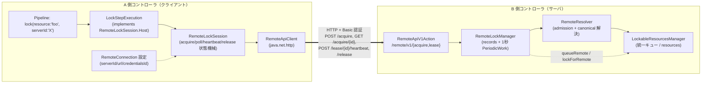
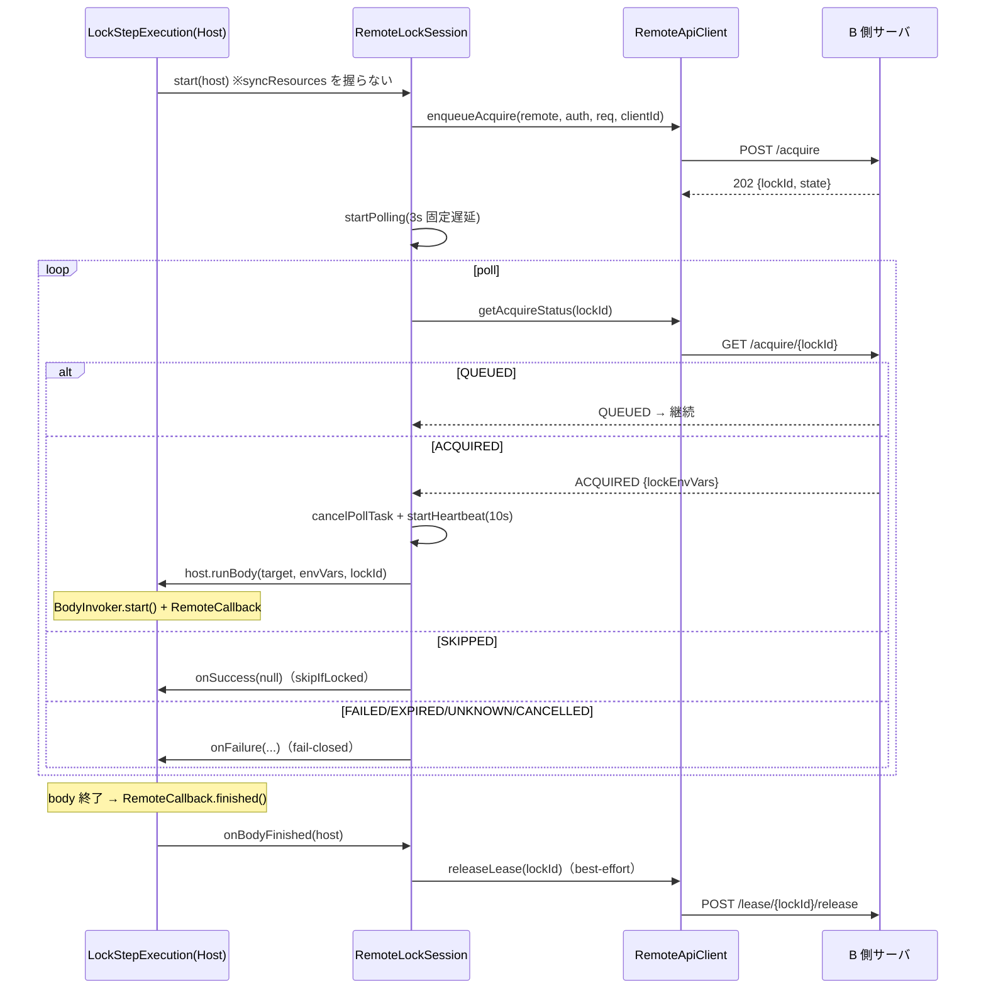
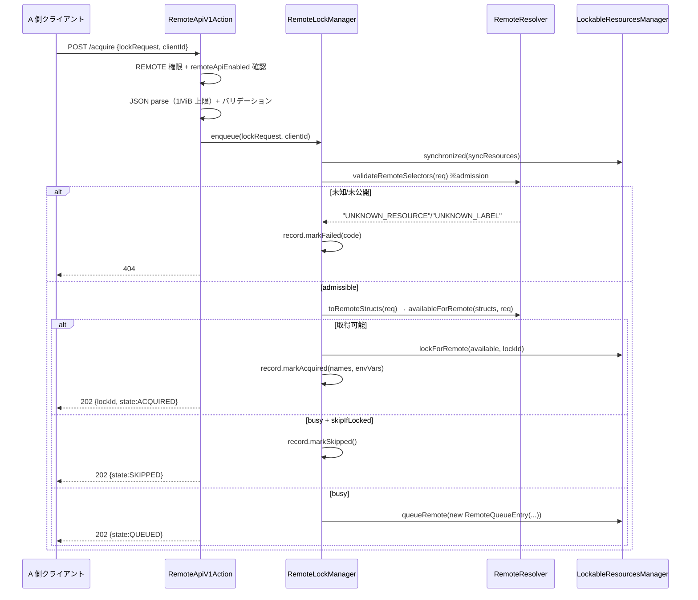
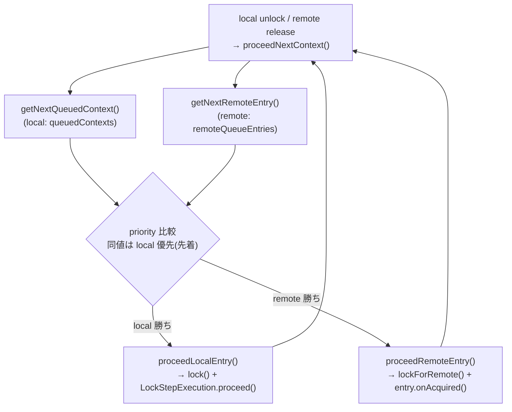
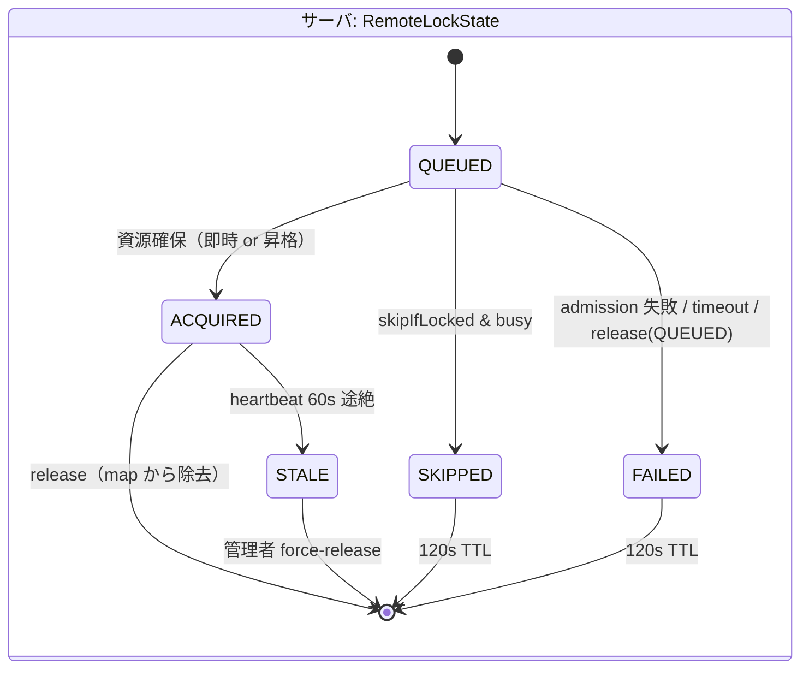

# Remote Lockable Resources アーキテクチャ解析（開発版 `65d8415`）

対象リポジトリ: 開発フォーク（`feature/1025-remote-lr-p1-m1`）
対象コミット: **`65d8415782d06a1c11df9be49b12c3de5c29a47e`**（`Address Jenkins Security Scan findings on the remote API`）
baseline: **本家 master `8f03dbf`**（[lockable-resources-architecture-8f03dbf-j.md](lockable-resources-architecture-8f03dbf-j.md)）
出典 epic: [jenkinsci/lockable-resources-plugin#1025](https://github.com/jenkinsci/lockable-resources-plugin/issues/1025)（Phase 1 / M1H 時点）

> 目的: **本家からの変更点**と、**コードから読み取れる設計思想・判断・トレードオフ**を、深いレビューに耐える粒度で
> 一望できるようにする。設計サイクルの一次資料は `dev/docs-j/LRR_DESIGN_P1_M1*.md`、本書はそれを「最終コードの構造」
> として統合したもの。

---

## 目次

1. [何が追加されたか（差分サマリ）](#1-何が追加されたか差分サマリ)
2. [設計思想（コードから読み取れる原則）](#2-設計思想コードから読み取れる原則)
3. [全体構造：A 側（クライアント）と B 側（サーバ）](#3-全体構造a-側クライアントと-b-側サーバ)
4. [パッケージ構成と新クラスの責務](#4-パッケージ構成と新クラスの責務)
5. [クライアント側フロー（RemoteLockSession 状態機械）](#5-クライアント側フローremotelocksession-状態機械)
6. [サーバ側フロー（REST API → RemoteLockManager → 統一キュー）](#6-サーバ側フローrest-api--remotelockmanager--統一キュー)
7. [統一優先度キュー（コア統合の核心）](#7-統一優先度キューコア統合の核心)
8. [HTTP API 仕様](#8-http-api-仕様)
9. [状態機械（クライアント状態 vs サーバ状態）](#9-状態機械クライアント状態-vs-サーバ状態)
10. [コア改変点の逐条解説（不可避シーム）](#10-コア改変点の逐条解説不可避シーム)
11. [設計判断とトレードオフ（レビュー論点）](#11-設計判断とトレードオフレビュー論点)
12. [既知の意図的残置・注意点](#12-既知の意図的残置注意点)
13. [本家からの変更ファイル一覧](#13-本家からの変更ファイル一覧)

---

## 1. 何が追加されたか（差分サマリ）

```
8f03dbf..65d8415   47 files changed, +5648 / -43
```

| 区分 | 内容 |
|---|---|
| **新規 `remote` パッケージ** | 14 クラス（状態機械・サーバ管理・解決・HTTP クライアント・DTO・enum）|
| **新規 REST エンドポイント** | `actions/RemoteApiV1Action`（`/lockable-resources/remote/v1/*`）|
| **新規グローバル設定 holder** | `RemoteConnection`（serverId / url / credentialsId）|
| **コア改変（5ファイル）** | `LockableResourcesManager` +419 / `LockStepExecution` +184 / `LockableResource` +44 / `LockStep` +14 / `RootAction` +61 |
| **UI（jelly/properties）** | グローバル設定画面・リソーステーブルの remote 列・ヘルプ |
| **テスト** | 8 テストクラス（ユニット）+ E2E シナリオ（別途 `dev/jenkins-env`）|

機能の一行説明: **別々の Jenkins コントローラをまたいで `lock()` を効かせる。** あるコントローラ（A 側=クライアント）の
Pipeline `lock(..., serverId:'X')` が、別コントローラ（B 側=サーバ）が持つ lockable resource を HTTP 越しに取得・保持・解放する。
1つのプラグインが **両方の役割**（クライアント／サーバ）を内包する。

---

## 2. 設計思想（コードから読み取れる原則）

コードと Javadoc から一貫して読み取れる設計原則。レビュー時の「あるべき姿」の物差しになる。

### 原則 1: canonical な `lock()` に乗り、ネットワーク橋渡し由来の判断だけを足す

サーバ側は **`lock()` の意味論を再実装しない**。リソース解決は本家と同じ
`LockableResourcesManager.getAvailableResources(...)` を通す。remote が足すのは
「どのリソースを remote クライアントに見せてよいか（exposeLabel フィルタ）」という *可視性判断* だけ。

- `RemoteResolver.availableForRemote()` は `getAvailableResources(structs, null, strategy, predicate)` を呼ぶだけ。
- `predicate = r -> isExposed(r, exposeLabels)`。canonical 側は exposeLabel を一切知らない（汎用 `Predicate`）。
- その結果、label の「数量0=全部」「extra の atomic 取得」「resourceSelectStrategy」「プロパティ env var」
  といった本家機能が **追加実装ゼロで透過的に効く**（= 透過等価。`dev` の M1B〜M1D の主題）。

### 原則 2: 統一優先度キュー（remote は local と同じ土俵で競合する）

remote の待機を**別キューにしない**。local 待機ドレイン `LRM.proceedNextContext()` に相乗りさせ、
priority で公平に競合させる（[§7](#7-統一優先度キューコア統合の核心)）。「remote だから割り込む／後回し」を作らない。

### 原則 3: fail-closed（通信不全ではロックを解放しない）

通信・状態の失敗時、クライアントは **release を試みず**ジョブを失敗させる。サーバ側に握られたロックは
heartbeat タイムアウト（STALE）で回収させる。「ネットワークが切れたから勝手に解放」＝二重取得の温床、を避ける。

- `RemoteLockSession.finishFailure()`: `// Fail-closed: do not attempt release on communication/state failures.`
- heartbeat 失敗は **ジョブ継続**（サーバはまだ握っている）。

### 原則 4: exposeLabel は opt-in（既定では何も公開しない）

`exposeLabel` 空＝**公開ゼロ**。`getExposeLabels()` は空集合を返し、`isExposed`/`hasExposedCandidate` は false。
明示的にラベルを設定したリソースだけが remote から見える。誤って全リソースを晒す事故を防ぐ。

### 原則 5: remote ロック状態は揮発（transient、再起動で消える）

`LockableResource.remoteLockedBy` は **`transient`**、サーバの `RemoteLockManager.records` は in-memory。
B 側を再起動すると remote ロックは全消失する。これは「再起動前に解放されている前提（運用 runbook）」を
受容したうえで、**復元による幽霊ロックを作らない**という割り切り。

### 原則 6: コア改変を「最小の機能追加」に見せる（M1G のパッケージ化）

remote 固有ロジックは極力 `remote` パッケージに凝集し、コア5ファイルへの差分を **不可避シーム**だけに絞る
（[§10](#10-コア改変点の逐条解説不可避シーム)）。本家 PR レビュアーが「既存コードはほぼ無傷で、機能は独立パッケージに足された」
と読めることを狙った構成（M1G で +1208→+665 に圧縮）。

---

## 3. 全体構造：A 側（クライアント）と B 側（サーバ）



- **同一プラグイン**が両側を実装。あるコントローラを「A としても B としても」使える（peer mode）。
- A 側は `lock()` ステップが remote 判定されると `RemoteLockSession` に丸ごと委譲する。
- B 側は通常の lockable resource をそのまま「remote にも貸し出す」。local lock() と remote lock が
  **同じ `resources` と同じ統一キュー**を奪い合う。

### 2つの運用モード（クライアント側ルーティング）

| モード | トリガ | 挙動 |
|---|---|---|
| **peer mode** | `lock(..., serverId:'X')` | DSL で明示したサーバ X を対象 |
| **delegated mode** | グローバル設定 `forcedServerId` | このコントローラの**全 lock() を**強制的に当該サーバへ委譲（DSL の serverId を上書きし INFO ログ）|

判定は `RemoteLockRouting.isRemoteRequest(step, lrm)`（serverId か forcedServerId のどちらかが非空なら remote）。

---

## 4. パッケージ構成と新クラスの責務

```mermaid
classDiagram
    namespace remote_client["remote（クライアント側）"]
        class RemoteLockSession {
            <<Serializable>>
            +start(Host) bool
            +onResume(Host) / stop(Host)
            +onBodyFinished(Host)
            -pollStatus() / startHeartbeat()
            -finishFailure() / releaseBestEffort()
        }
        class RemoteLockRouting {
            +isRemoteRequest(step, lrm)$ bool
            +effectiveServerId(...)$ String
            +findConnection(...)$ RemoteConnection
            +displayTarget(step)$ String
        }
        class RemoteCredentials {
            +basicAuthHeader(remote, run)$ String
        }
        class RemoteApiClient {
            +enqueueAcquire(...) String
            +getAcquireStatus(...) RemoteAcquireStatus
            +heartbeatLease(...) / releaseLease(...)
        }
        class RemoteClientDefaults {
            +REMOTE_API_BASE_PATH$
            +DEFAULT_POLL/HEARTBEAT/REQUEST_TIMEOUT$
        }
    end
    namespace remote_server["remote（サーバ側）"]
        class RemoteLockManager {
            <<PeriodicWork 1s>>
            +enqueue(req, clientId) RemoteLockRecord
            +find(lockId) / heartbeat(lockId) / release(lockId)
            -maybeScanStale()
        }
        class RemoteResolver {
            +validateRemoteSelectors(req) String
            +toRemoteStructs(req) List
            +availableForRemote(structs, req) List
            +remoteLockEnvVars(...)$ Map
        }
        class RemoteLockRecord {
            +state / errorCode / lockEnvVars
            +acquiredResourceNames / clientId
        }
        class RemoteQueueEntry {
            +isValid() / isTimedOut()
            +onAcquired(res) / onTimeout()
        }
    end
    namespace remote_dto["remote（DTO / enum）"]
        class RemoteLockRequest
        class RemoteAcquireStatus
        class RemoteAcquireState
        class RemoteLockState
        class RemoteApiException
    end

    RemoteLockSession ..> RemoteApiClient
    RemoteLockSession ..> RemoteLockRouting
    RemoteLockSession ..> RemoteCredentials
    RemoteLockManager ..> RemoteResolver
    RemoteLockManager "1" *-- "N" RemoteLockRecord
    RemoteLockManager ..> RemoteQueueEntry
```

| クラス | 側 | 責務 |
|---|---|---|
| `RemoteLockSession` | A | **クライアント状態機械**。acquire→poll→heartbeat→release。`Serializable`（再起動跨ぎ）。`Host` 経由で step に最小コールバック |
| `RemoteLockRouting` | A | remote 判定・実効 serverId 解決・接続検索・表示名（static helpers）|
| `RemoteCredentials` | A | credentialsId → Basic 認証ヘッダ（Run コンテキスト優先、なければ system store）|
| `RemoteApiClient` | A | 薄い HTTP クライアント（`java.net.http.HttpClient`）。4 エンドポイントのみ |
| `RemoteClientDefaults` | A | poll=3s / heartbeat=10s / request timeout=5s / base path |
| `RemoteApiV1Action` | B | **REST エンドポイント**。JSON parse・バリデーション・HTTP ステータスマッピング |
| `RemoteLockManager` | B | **サーバ側権威**。`records` map + 1秒 tick（STALE 検出・terminal TTL 掃除）|
| `RemoteResolver` | B | **admission（存在・公開）チェック + canonical 解決**。LRM の public API のみ使用、ロックは取らない |
| `RemoteLockRecord` | B | 1 lock の lifecycle（volatile フィールド）|
| `RemoteQueueEntry` | B | 統一キューに載る remote 待機（local の `QueuedContextStruct` 相当）|
| `RemoteLockRequest` | 両 | lock 意味論の DTO（serverId は含まない＝routing は別概念）|
| `RemoteConnection` | A | 接続設定（`AbstractDescribableImpl`、LRM に list 永続化）|

---

## 5. クライアント側フロー（RemoteLockSession 状態機械）

### 5.1 取得〜実行〜解放



### 5.2 状態機械のキー実装ポイント

- **2タイマー構成**: poll（`Timer.get().scheduleWithFixedDelay`、3s）と heartbeat（10s）。
  ACQUIRED 観測時に poll を止め heartbeat を開始（取得後はもう状態を引かない）。
- **`completionSignaled`（AtomicBoolean）**: 成功/失敗/解放を**一度だけ**通知する CAS ガード。
  poll と heartbeat とコールバックが競合しても二重 signal しない。
- **poll 失敗の二分**:
  - HTTP **404/410** → サーバにレコードが無い（=再起動など）→ **即失敗**（リトライしても無駄）。
  - それ以外（一時的ネットワーク不全）→ `consecutivePollFailures` を増やし、
    **20回（≒60秒）まで**リトライ。超えたら fail-closed。
- **heartbeat 失敗 = ジョブ継続**: サーバはまだ握っている前提。STALE 化はサーバ側の責務。
- **再起動跨ぎ（`onResume`）**:
  - body 実行中だった → Jenkins が body を中断するので、**best-effort release してジョブ失敗**。
  - QUEUED/ACQUIRED で poll 中だった → poll ループを再構築（retry budget はリセット）。
  - 未 enqueue（lockId null）→ 何もしない。
- **`stop`（ステップ中止）**: タイマー停止 → best-effort release → onFailure。

### 5.3 Host シーム（状態機械をコアから剥がす設計）

`RemoteLockSession` は `StepContext`／body 起動／serialize 跨ぎといった **StepExecution 固有の依存だけ**を
`Host` インタフェース経由でホスト（`LockStepExecution`）に委譲する。

```java
interface Host extends Serializable {
    StepContext context();   // Run/FlowNode/TaskListener, onSuccess/onFailure
    LockStep step();
    void runBody(String displayTarget, Map<String,String> lockEnvVars, String lockId); // body 起動
}
```

これにより `LockStepExecution.start()` の remote 分岐は
`if (RemoteLockRouting.isRemoteRequest(step, lrm)) { remoteSession = new RemoteLockSession(); return remoteSession.start(this); }`
の数行で済み、状態機械本体（+434 行）は `remote` パッケージに収まる。

---

## 6. サーバ側フロー（REST API → RemoteLockManager → 統一キュー）



### 6.1 サーバ側の権威 = `RemoteLockManager`

- `records`: `ConcurrentHashMap<lockId, RemoteLockRecord>`（in-memory のみ）。
- **1秒 `PeriodicWork`（`doRun` → `maybeScanStale`）**:
  - ACQUIRED で heartbeat が **STALE_THRESHOLD_MS（= max(heartbeat×6, 60)=60秒）**途絶 → `markStale()`。
  - terminal（SKIPPED/FAILED）は **120秒 TTL** で map から掃除。
  - **QUEUED の期限管理はここでは行わない**（統一キューの `RemoteQueueEntry` timeout が所有。M1H/B2 の結果）。
- キュー昇格（QUEUED→ACQUIRED）も**ここでは行わない**。LRM の `proceedNextContext()` 経由（[§7](#7-統一優先度キューコア統合の核心)）。

### 6.2 admission（RemoteResolver.validateRemoteSelectors）

canonical 解決の**前**に、main + 各 extra セレクタすべてが「存在し、かつ exposeLabel を持つ」ことを確認:

- resource 名指定: `fromName` で存在 ∧ `isExposed`（exposeLabel と交差）→ OK、さもなくば `UNKNOWN_RESOURCE`。
- label 指定: 「その label を持ち∧exposeLabel も持つ」候補が1つでもあれば OK、さもなくば `UNKNOWN_LABEL`。
- これを通った要求だけが canonical 解決へ進む。**未知/未公開は一律 404**（存在を露呈しない統一応答）。

設計意図（コード上の comment）: admission で弾くことで **(1)** ephemeral リソースの生成を防ぎ、
**(2)** 永遠に取得できないものを QUEUE し続けない。「公開済みだが busy」は local 同様 QUEUE される。

---

## 7. 統一優先度キュー（コア統合の核心）

remote 待機を local 待機と**同じドレインで**捌くのが、本拡張で最もコアに食い込む部分。



`LockableResourcesManager.proceedNextContext()`（本家）が**両キューの先頭を比較**するよう改修される:

```java
boolean pickRemote = nextRemote != null
    && (nextLocal == null || nextRemote.getPriority() > nextLocal.getPriority());
```

- **priority 降順**で公平。同値なら local（先着）を優先。
- `getNextRemoteEntry()` は remote キューを走査し、無効（state≠QUEUED）/timeout を除去しつつ、
  **canonical な `availableForRemote()` で解決できる最初の entry** を返す（resolved をセット）。
- `unlockRemoteResources()` / `unlockResources()`（local）はどちらも
  `while (proceedNextContext())` で**取得可能になった待機を全部ドレイン**する。

### 7.1 remote キューの状態と境界

| 項目 | 値・契約 |
|---|---|
| 保持場所 | `LRM.remoteQueueEntries`（**transient** List）|
| 同期 | 全アクセスは `synchronized (syncResources)` 下 |
| 投入 | `queueRemote(entry)`（priority 降順位置に挿入）|
| 撤去 | `unqueueRemote(lockId)`（client cancel / QUEUED release）|
| timeout | `RemoteQueueEntry.timeoutDeadlineMillis`（= `timeoutForAllocateResource`、0=無限）|
| 昇格 | `proceedRemoteEntry()` → `lockForRemote()` → `onAcquired()`（record を ACQUIRED 化、envVars 構築）|

### 7.2 release と昇格の競合をどう塞いでいるか（レビュー重要）

`RemoteLockManager.release()` は **syncResources 下で**「QUEUED なら先に `markFailed("RELEASED")` してから `unqueueRemote`」を行う。
これにより、ちょうど資源が空いた瞬間に走る昇格（`proceedRemoteEntry` は `entry.isValid()`==QUEUED を見る）が、
**既に解放済みのレコードに対して資源を掴む**＝幽霊ロック（resource pinned・record gone）を防ぐ。
一方で `unlockRemoteResources()` / `scheduleQueueMaintenance()` は Jenkins Queue ロックに触れるため
**syncResources の外**で呼ぶ、という二段構えになっている（コード comment に明記）。

---

## 8. HTTP API 仕様

base path: **`/lockable-resources/remote/v1`**（`RootAction.getDynamic("remote")` → `RemoteRouterAction` → `RemoteApiV1Action`）

| メソッド | パス | 役割 | 成功 | 主な失敗 |
|---|---|---|---|---|
| `POST` | `/acquire` | acquire を enqueue | `202 {lockId, state}` | 400（JSON/target 不正）・404（未知/未公開）・413（1MiB 超）・403（無効/権限）|
| `GET` | `/acquire/{lockId}` | 状態取得（**純 read**）| `200 {state, errorCode?, lockEnvVars?}` | 404（lock 不明）・403 |
| `POST` | `/lease/{lockId}/heartbeat` | lease 更新 | `204` | 410（STALE / not found）・403 |
| `POST` | `/lease/{lockId}/release` | 解放（冪等）| `204` | 403 |

### 8.1 セキュリティ・ハードニング（M1H = `65d8415` の主眼）

本コミットは PR #1055 への Jenkins Security Scan 指摘（#49–52）対応である。

| 指摘 | 対応 |
|---|---|
| #49/#51 `RemoteConnection.doCheckUrl` | `@POST` + `Jenkins.ADMINISTER` チェック、jelly に `checkMethod="post"` |
| #50 `LRM.doCheckForcedServerId` | `@POST` 付与（ADMINISTER は既設）、jelly に `checkMethod="post"` |
| #52 `GET /acquire/{lockId}` の副作用 | **B2 採用**: GET を純 read 化。旧 `touchPoll` keepalive を撤去し、QUEUED の生存を**キュー timeout に一本化** |

その他の防御（コード由来）:

- 全エンドポイント: **`REMOTE`（RemoteUse）権限** + `isRemoteApiEnabled()` を毎回確認（無効なら 403）。
- mutation 系は `@RequirePOST`（CSRF）。
- POST body は **1 MiB 上限**（`MAX_BODY_CHARS`、超過は 413）で認証済みクライアントによる OOM を防ぐ。
- 404 admission により**存在の露呈を避ける**（未知/未公開を区別なく 404）。
- 認証は Basic（`RemoteCredentials`、credentialsId → username:apiToken）。

### 8.2 acquire の JSON 受理ルール（透過等価のための細部）

`RemoteApiV1Action.AcquireRouter.doIndex` のパースは local `lock()` の既定に**厳密に**合わせている:

- `quantity` 既定 = **0（=全部）**。決して 1 をデフォルトにしない（label の「全部取る」を壊さない）。
- `resource`/`label`/`reason`/`variable` は trim → 空なら null。
- **extra-only** 要求も valid（main が無くても extra があれば受理）。
- `resourceSelectStrategy` 未知値は 400。
- `heartbeatIntervalSeconds` は受理するが **Phase 1 では無視**（サーバ固定の STALE 定数を使う）。

> この「既定値・未指定・0・空を必ず突く」姿勢は、過去サイクルで extra が透過等価テストを素通りした反省に基づく
> （`dev` の equivalence-test 方針）。

---

## 9. 状態機械（クライアント状態 vs サーバ状態）

**クライアント観測**（`RemoteAcquireState`）と**サーバ内部**（`RemoteLockState`）は意図的に**別 enum**。



| サーバ `RemoteLockState` | クライアント `RemoteAcquireState`（GET 応答）| クライアント挙動 |
|---|---|---|
| QUEUED | QUEUED | poll 継続 |
| ACQUIRED | ACQUIRED | body 起動 + heartbeat |
| SKIPPED | SKIPPED | onSuccess(null) |
| FAILED | FAILED | onFailure（fail-closed）|
| STALE | （heartbeat に 410 LOCK_STALE）| heartbeat 失敗扱い（ジョブは継続）|
| —（サーバ再起動でレコード消失）| GET が 404/410 | 即 onFailure |

クライアント側 enum には `CANCELLED`/`EXPIRED`/`UNKNOWN` もあり、サーバ/管理者起因のキャンセルや
未知応答（`fromString` で UNKNOWN へ正規化）に備える。

---

## 10. コア改変点の逐条解説（不可避シーム）

remote ロジックの大半は `remote` パッケージに在るが、以下はコアに残さざるを得ない接点。**レビューはここに集中すべき。**

### 10.1 `LockableResourcesManager`（+419）

| 改変 | 内容 | local 挙動への影響 |
|---|---|---|
| `getAvailableResources(..., Predicate candidateFilter)` オーバーロード | 旧シグネチャは `r -> true` で委譲。filter は **count 選択の前**に候補プールへ適用 | **無し**（旧呼び出しは全部 `true`）。label 名指定の両分岐に filter を差すのみ |
| `proceedNextContext()` の local/remote 交錯 | `getNextRemoteEntry()` を比較し `proceedLocalEntry`/`proceedRemoteEntry` に分岐 | local は `proceedLocalEntry` に切り出されただけ。挙動同一 |
| remote キュー操作 | `queueRemote`/`unqueueRemote`/`lockForRemote`/`unlockRemoteResources`/`getNextRemoteEntry`/`proceedRemoteEntry` | local 資源を直接ミューテートするため LRM に属するのが正しい |
| グローバル設定 | `remoteApiEnabled`/`exposeLabel`/`clientId`/`forcedServerId`/`remotes` + getter/setter/`doCheckForcedServerId` + `readResolve` | 既存挙動に非干渉。`readResolve` で旧 XML の欠損フィールドを補完 |

`lockForRemote`: `setBuild()` の代わりに `setRemoteLockedBy(lockId)` を使い、**アクティブな Jenkins build 無しで**資源を握る。
これが local lock との根本差（remote には Run が無い）。

### 10.2 `LockableResource`（+44）

- `transient volatile String remoteLockedBy`: remote 保持者の lockId。**transient**（再起動で消失）。
- `isLocked()` を `getBuild() != null || remoteLockedBy != null` に拡張 → ダッシュボード表示と
  **local lock の候補から remote 保持資源を除外**するのに効く。
- `getRemoteLockClientId()`: `RemoteLockManager.find()` で clientId を引く（UI 表示用）。
- `getLockCauseDetail()` に remote 保持時のメッセージ分岐を追加。

### 10.3 `LockStep`（+14）/ `LockStepExecution`（+184）

- `LockStep.serverId`（DSL 引数）+ `setServerId`（trim・空白警告）。
- `LockStepExecution implements RemoteLockSession.Host`。`start()` 冒頭で remote 判定し委譲。
- **`buildLockEnvVars(variable, lockedResources)` を static 抽出**: local `proceed` の env var 生成を共有化。
  remote サーバも**同じ map**を生成してクライアントへブリッジ（local と drift しない）。
- `RemoteCallback`（body 終了で `onBodyFinished` → release）、`EnvVarsExpander`（事前計算 env を注入）。
- `stop`/`onResume` を remoteSession へ委譲。

### 10.4 `RootAction`（+61）

- **`REMOTE`（RemoteUse）権限**（親=ADMINISTER）。「remote クライアントを認可マトリクスで可視化」する意図。
- `doReleaseRemoteLock`（`@RequirePOST` + UNLOCK 権限）: STALE 等の手動 force-release。
- `getDynamic("remote")` → `RemoteRouterAction` → `v1` → `RemoteApiV1Action` のルーティング。

---

## 11. 設計判断とトレードオフ（レビュー論点）

| # | 判断 | 採用理由 | トレードオフ／レビュー観点 |
|---|---|---|---|
| 1 | **fail-closed**（通信不全で release しない）| 二重取得を避ける | ネットワーク分断時、ジョブ失敗してもサーバはロックを保持し続ける → STALE 回収（最大 ~60秒）までブロック |
| 2 | **STALE は管理者解放まで保持** | heartbeat 途絶≠安全に解放可能、とは限らない | 自動回収しないため運用で `doReleaseRemoteLock` が必要。死活と実在の乖離 |
| 3 | **remote 状態は transient** | 再起動による幽霊ロック生成を防ぐ | B 側再起動で全 remote ロック消失。A 側 poll は 404→即失敗。「再起動前に解放」の運用前提 |
| 4 | **B2: GET 純 read 化**（M1H）| 状態遷移は元々サーバ側ローカルロジック所有・REST 的に正しい | `timeoutForAllocateResource==0`（無限待ち）＋クライアント死亡時の QUEUED 枠の早期回収（~60秒）を喪失。QUEUED は資源非保持なので安全と判断 |
| 5 | **統一キュー（別キューにしない）** | local/remote の公平競合 | `proceedNextContext` がコアの hot path。priority 比較ロジックの正しさが全体の公平性を左右 |
| 6 | **exposeLabel opt-in** | 誤公開事故防止 | 設定漏れだと「全部 404」。運用上の気付きにくさ |
| 7 | **canonical 委譲（再実装しない）** | 透過等価・保守コスト最小 | filter の差し込み位置（count 選択の前）を誤ると「全部」の意味が壊れる。`getAvailableResources` 改変が最大の注意点 |
| 8 | **404 admission（存在を隠す）** | 情報露呈の最小化 | resource/label の区別は errorCode に残す（UNKNOWN_RESOURCE/LABEL）|
| 9 | **Basic 認証 + REMOTE 権限** | API トークンで machine user を認可マトリクス化 | TLS 前提（url は http(s) 限定）。資格情報は Run コンテキスト→system store の順で解決 |

### 並行性の契約（レビュー時に確認すべき不変条件）

- `RemoteResolver` は**ロックを取らない**。呼び出し側（`enqueue` / `getNextRemoteEntry`）が syncResources を握る契約。
- `RemoteLockRecord` のフィールドは volatile。遷移は基本 1秒 tick スレッド、`heartbeat()` だけ HTTP スレッドが書く。
- `release()` の「QUEUED は markFailed→unqueue を syncResources 下」「unlock/maintenance は syncResources 外」の
  二段境界（[§7.2](#72-release-と昇格の競合をどう塞いでいるかレビュー重要)）。

---

## 12. 既知の意図的残置・注意点

`dev/docs-j/LRR_REVIEW_P1_M1*.md` で triage 済みの、**意図的に残した**項目。レビューで「バグでは？」と指摘されがちなので明示。

| ID | 内容 | 扱い |
|---|---|---|
| **M1E-1** | 昇格パス（QUEUED→ACQUIRED）に admission 再チェックが無い。enqueue 後に当該リソースが削除され、再度 canonical 解決が `create=true` 由来で ephemeral 再生成する余地 | **意図的残置**（design §4）。admission は enqueue 時のみ。実害は限定的と判断 |
| M1E-2/M1E-3 | （同レビューの軽微項目）| 残置 |
| F-1 | `isHttpUrl`/`resolve` の空白トリム非対称（nit）| 残置（Low）|
| heartbeatIntervalSeconds | クライアント指定を受理するが無視（サーバ固定）| Phase 1 スコープ（per-request 設定は範囲外）|
| クライアント UI / read-only ミラー | A 側でのリモート資源可視化 | **Phase 2 未着手**（issue #1025）|

---

## 13. 本家からの変更ファイル一覧

```
8f03dbf..65d8415  47 files, +5648 / -43
```

### コア改変（5）
- `LockableResourcesManager.java` (+419) — 統一キュー / Predicate シーム / 設定 / lockForRemote
- `LockStepExecution.java` (+184) — Host 実装 / remote 分岐 / buildLockEnvVars 抽出
- `LockableResource.java` (+44) — remoteLockedBy / isLocked 拡張
- `actions/LockableResourcesRootAction.java` (+61) — REMOTE 権限 / ルーティング / force-release
- `LockStep.java` (+14) — serverId DSL

### 新規 `remote` パッケージ（14）
`RemoteLockSession`(434) / `RemoteApiClient`(332) / `RemoteLockManager`(235) / `RemoteResolver`(194) /
`RemoteLockRequest`(197) / `RemoteLockRecord`(142) / `RemoteQueueEntry`(135) / `RemoteLockRouting`(84) /
`RemoteCredentials`(84) / `RemoteAcquireStatus`(59) / `RemoteApiException`(46) / `RemoteAcquireState`(32) /
`RemoteClientDefaults`(24) / `RemoteLockState`(23)

### 新規 actions / 設定
- `actions/RemoteApiV1Action.java` (395) — REST エンドポイント
- `RemoteConnection.java` (112) — 接続設定 holder

### UI / リソース
- `LockableResourcesManager/config.jelly` ほか（remote 設定画面・ヘルプ）
- `RemoteConnection/config.jelly` ほか
- `tableResources/table.jelly`（remote 列）
- `Messages.properties`（forcedServerId 警告 / REMOTE 権限説明）

### テスト（8 クラス）
`LockStepRemoteTest` / `RemoteApiV1ActionTest` / `RemoteLockManagerTest` / `RemoteApiClientTest` /
`RemoteConnectionTest` / `LockableResourcesManagerRemoteConnectionTest` / `RemoteAcquireStatusTest` /
`LockableResourceTest`・`LockableResourcesRootActionTest`（追補）+ `casc_expected_output.yml`

---

> **メモ:** 本書は開発版 `65d8415`（Phase 1 / M1H 完了時点）を対象に、本家 `8f03dbf` との差分として作成。
> 検証状態（`dev` ノート）: `mvn verify` 383/0/1skip 全ゲート ok、E2E 20/20 PASS。
> 設計の一次資料: `dev/docs-j/LRR_DESIGN_P1_M1G.md`（パッケージ化）/ `LRR_DESIGN_P1_M1H.md`（security + B2）/
> 各 `LRR_REVIEW_P1_M1*.md`（triage）。
</content>
