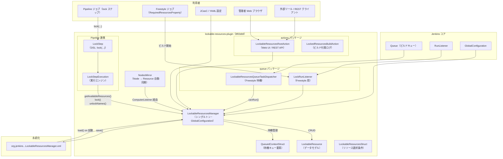
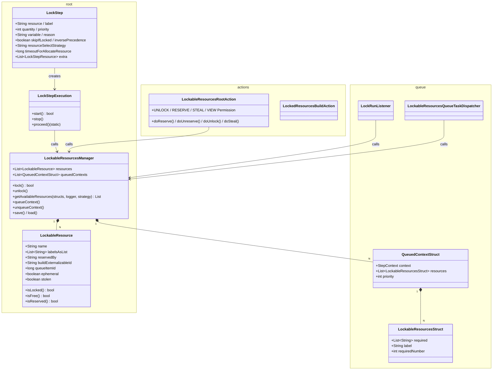
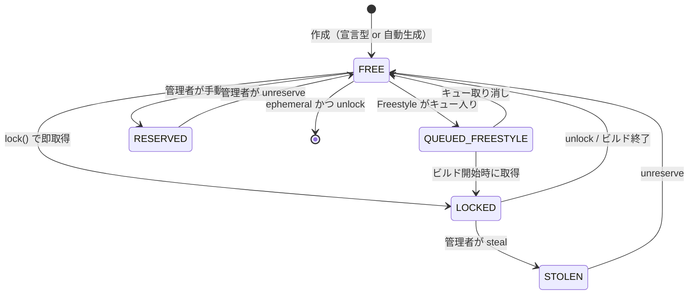
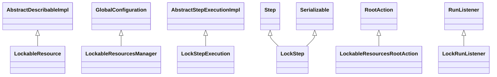
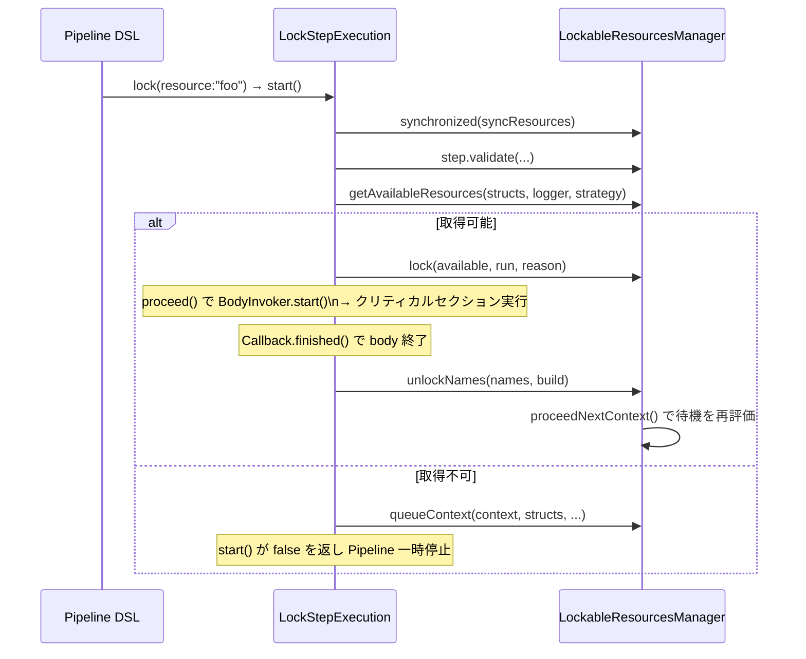
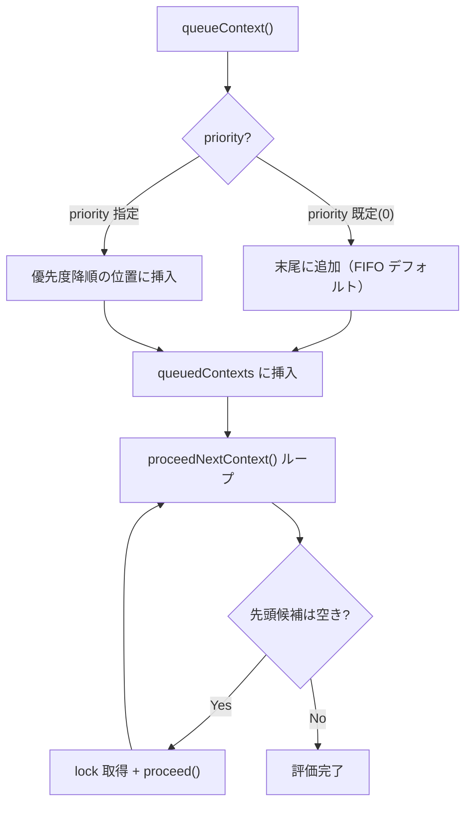
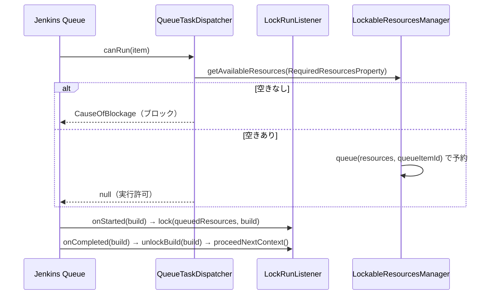
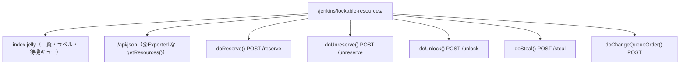
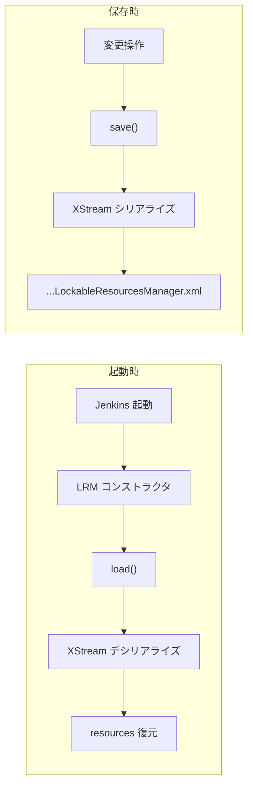
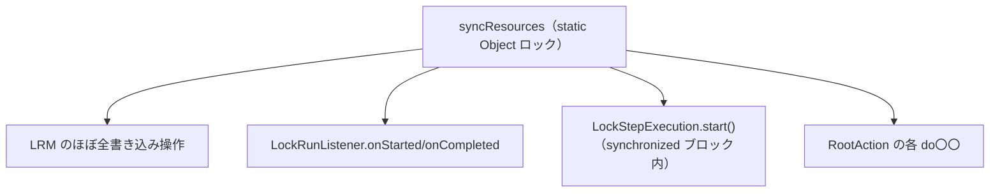

# Lockable Resources Plugin アーキテクチャ解析（本家 master `8f03dbf`）

対象リポジトリ: [jenkinsci/lockable-resources-plugin](https://github.com/jenkinsci/lockable-resources-plugin)
対象コミット: **`8f03dbfe1b34f6c6994723ab5dd3df90cf91bf66`**（master、`chore(deps): bump crowdin/github-action ... (#1056)`）
対象パス: `lockable-resources-plugin/`
目的: remote 拡張（`65d8415`）の差分解析の **baseline** として、本家の実装挙動を固定する

> このドキュメントは、もう一方の [lockable-resources-architecture-65d8415-j.md](lockable-resources-architecture-65d8415-j.md)
> （remote 拡張版）が「何に対して何を足したか」を語るための**地図の原本**です。先行ドキュメント
> [lockable-resources-architecture-j.md](lockable-resources-architecture-j.md) を本コミットに固定して再整理したものに相当します。

---

## 目次

1. [全体構造の鳥瞰図](#1-全体構造の鳥瞰図)
2. [パッケージ構成とクラスの責務](#2-パッケージ構成とクラスの責務)
3. [データモデル詳細](#3-データモデル詳細)
4. [Pipeline での lock ステップ実行フロー](#4-pipeline-での-lock-ステップ実行フロー)
5. [待機キューの仕組み](#5-待機キューの仕組み)
6. [リソース解決（getAvailableResources）の中核ロジック](#6-リソース解決getavailableresourcesの中核ロジック)
7. [Freestyle ビルドとの連携](#7-freestyle-ビルドとの連携)
8. [UI と HTTP API](#8-ui-と-http-api)
9. [永続化の仕組み](#9-永続化の仕組み)
10. [同期・スレッド安全戦略](#10-同期スレッド安全戦略)
11. [拡張観点でのキーポイント（remote 拡張の足場）](#11-拡張観点でのキーポイントremote-拡張の足場)

---

## 1. 全体構造の鳥瞰図



**一言で:** すべての排他制御は **単一 JVM 内のシングルトン `LockableResourcesManager`（LRM）** が
`synchronized (syncResources)` の下で `resources` リストと `queuedContexts` を直接ミューテートして実現する。
ネットワーク越しの概念は一切無い（= remote 拡張が足す主軸）。

---

## 2. パッケージ構成とクラスの責務



| クラス | 責務 |
|---|---|
| `LockableResourcesManager`（LRM） | **唯一の権威**。リソース集合・待機キュー・lock/unlock・解決・永続化・グローバル設定（`GlobalConfiguration`）|
| `LockableResource` | 1リソースの状態（名前・ラベル・予約・ロック保持ビルド・ephemeral など）|
| `LockStep` / `LockStepExecution` | Pipeline DSL `lock(...)` の宣言と実行エンジン |
| `QueuedContextStruct` | 取得待ちの Pipeline コンテキスト1件（再開対象）|
| `LockableResourcesStruct` | 「resource 名 / label / 数量」の選択条件1件（`extra` は複数）|
| `LockableResourcesQueueTaskDispatcher` / `LockRunListener` | Freestyle 用（Jenkins 標準キューに介入）|
| `LockableResourcesRootAction` | `/lockable-resources/` の Web UI・REST・管理操作 |
| `NodesMirror` | Jenkins Node を lockable resource として自動ミラー（任意機能）|

---

## 3. データモデル詳細

### 3.1 LockableResource の状態遷移



| フィールド | 型 | 意味 |
|---|---|---|
| `name` | `String` | 一意識別子（変更不可）|
| `labelsAsList` | `List<String>` | 空白区切りラベルのリスト表現 |
| `reservedBy` | `String` | 手動 reserve 中のユーザー名 |
| `buildExternalizableId` | `String` | ロック中の Run の ID（永続化用）|
| `queueItemId` | `long` | Freestyle キュー待ち中の Item ID |
| `ephemeral` | `boolean` | スコープ外 lock 時に自動生成、unlock 時に自動削除 |
| `stolen` | `boolean` | 管理者が奪取した場合のフラグ |

`isLocked()` は **`getBuild() != null`** で判定する（= ローカルビルドがロック保持しているか）。
この一点が remote 拡張で拡張される中核（後述）。

### 3.2 継承関係



---

## 4. Pipeline での lock ステップ実行フロー

### 4.1 取得成功パス



`LockStepExecution.start()` は **`synchronized (LockableResourcesManager.syncResources)` ブロック全体**で
判定〜lock〜proceed/queue を行う（この同期境界が remote では分岐より前に移される）。

### 4.2 待機→再取得パス

別ビルドの `unlock` → `unlockResources()` → `proceedNextContext()` が `queuedContexts` を優先度順に評価し、
取得可能になった待機コンテキストに対して `LockStepExecution.proceed(...)` を**直接呼び出して**再開する。

---

## 5. 待機キューの仕組み



- キューは LRM の `queuedContexts`（`List<QueuedContextStruct>`）。
- `getNextQueuedContext()` が優先度を考慮して次の候補を返す。
- timeout（`timeoutForAllocateResource`）超過時はコンテキストを失敗させてキューから外す。

---

## 6. リソース解決（getAvailableResources）の中核ロジック

remote 拡張の理解に最重要なので独立節にする。本コミットのシグネチャは:

```java
public List<LockableResource> getAvailableResources(
        List<LockableResourcesStruct> requiredResourcesList,
        PrintStream logger,
        ResourceSelectStrategy selectStrategy)
```

- `requiredResourcesList` の各 struct について:
  - **label 指定**: `getFreeResourcesWithLabel(label, amount, strategy, logger, alreadySelected)` で
    候補を集め、`amount <= 0` なら「マッチする全部」、それ以外は数量分を選ぶ。
  - **resource 名指定**: `fromNames(..., create=true)` で（無ければ ephemeral 生成して）取り、
    `areAllAvailable()` が真なら採用。
- いずれかの struct が満たせなければ全体が `null`（= 取得不可 → 待機）。

この **「label の数量0=全部」「名前指定は ephemeral 生成あり」「全 struct を満たさなければ null」** という
canonical な意味論が、remote 拡張でもそのまま再利用される（再実装しない）のがポイント。

---

## 7. Freestyle ビルドとの連携

Freestyle は **Jenkins 標準ビルドキュー**を経由する。



---

## 8. UI と HTTP API

### 8.1 URL 構成



### 8.2 権限モデル

`PermissionGroup`（`LockableResourcesManager`）配下に **VIEW / UNLOCK / RESERVE / STEAL / QUEUE** が定義され、
いずれも親権限 `Jenkins.ADMINISTER`。`LockableResourcesRootAction` は `RootAction`（認証済み）として実装される。

> remote 拡張では、ここに **`REMOTE`（RemoteUse）権限**と `/remote/v1/*` ルートが追加される。

---

## 9. 永続化の仕組み



- `resources` リストは XStream で `org.jenkins.plugins.lockableresources.LockableResourcesManager.xml` に永続化。
- グローバル設定（`GlobalConfiguration`）も同じファイル。
- ロック保持は `buildExternalizableId`（= Run 参照）で永続化され、再起動後も復元できる。

---

## 10. 同期・スレッド安全戦略



| 対象 | 方針 |
|---|---|
| リソースリスト読み書き | `synchronized (syncResources)`（**単一プロセス内の単一ロック**）|
| 候補キャッシュ | `Guava Cache`（5分 TTL）|
| 保存 | `save()`（GlobalConfiguration）|

**重要:** すべての排他は **1 JVM 内のメモリロック** で完結する。クロスプロセス・クロスコントローラの
協調機構は本コミットには存在しない。これが remote 拡張の出発点（=「JVM の壁を越える」）。

---

## 11. 拡張観点でのキーポイント（remote 拡張の足場）

remote 版（`65d8415`）が「最小差分の機能追加」に見えるよう、本家の以下の**接点（シーム）**に乗る:

| 本家のシーム | remote 拡張がどう使うか |
|---|---|
| `getAvailableResources(structs, logger, strategy)` | `Predicate` 引数を1つ足したオーバーロードに拡張し、exposeLabel フィルタを差すだけ。**解決ロジック本体は不変** |
| `proceedNextContext()` / `queuedContexts` | local 待機ドレインのフックに remote キューを相乗りさせる（統一優先度キュー）|
| `LockableResource.isLocked()`（= build != null） | `|| remoteLockedBy != null` を OR で足す |
| `LockStep`（DSL） | `serverId` 引数を1つ足す |
| `LockableResourcesManager`（GlobalConfiguration） | remote 設定フィールド（enabled / exposeLabel / clientId / forcedServerId / remotes）を足す |
| `LockStepExecution.start()` の同期境界 | remote 分岐を同期取得の**前**に置く（remote は HTTP 越しで syncResources を握らない）|
| `LockedResourcesBuildAction.addLog` / `PauseAction` | remote でもそのままビルドログ・一時停止表示に再利用 |

> 続きは [lockable-resources-architecture-65d8415-j.md](lockable-resources-architecture-65d8415-j.md) を参照。

---

> **メモ:** 本書は本家 master `8f03dbf` を対象に作成。
> 主要参照ファイル:
> - `LockableResource.java` / `LockableResourcesManager.java`
> - `LockStep.java` / `LockStepExecution.java`
> - `actions/LockableResourcesRootAction.java`
> - `queue/LockRunListener.java` / `queue/LockableResourcesQueueTaskDispatcher.java`
> - `nodes/NodesMirror.java`
</content>
</invoke>
